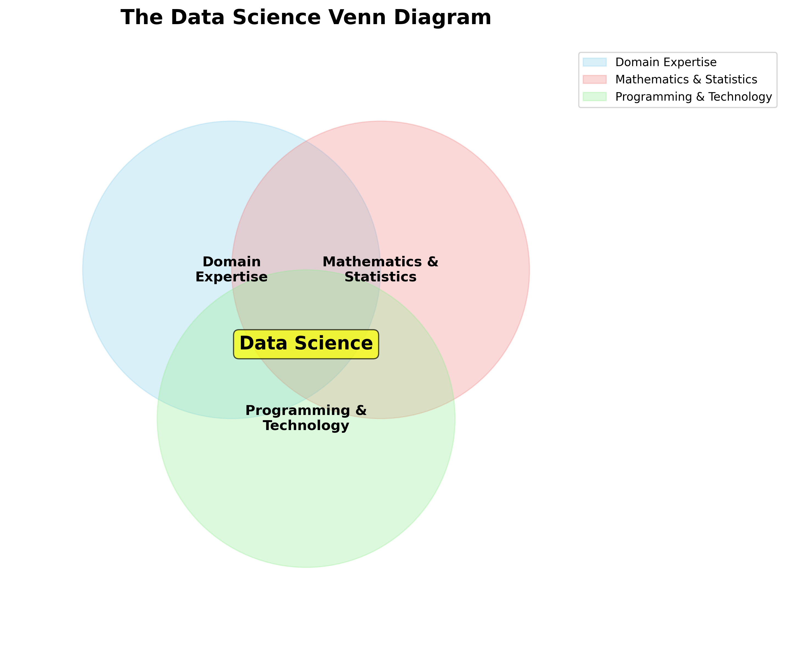
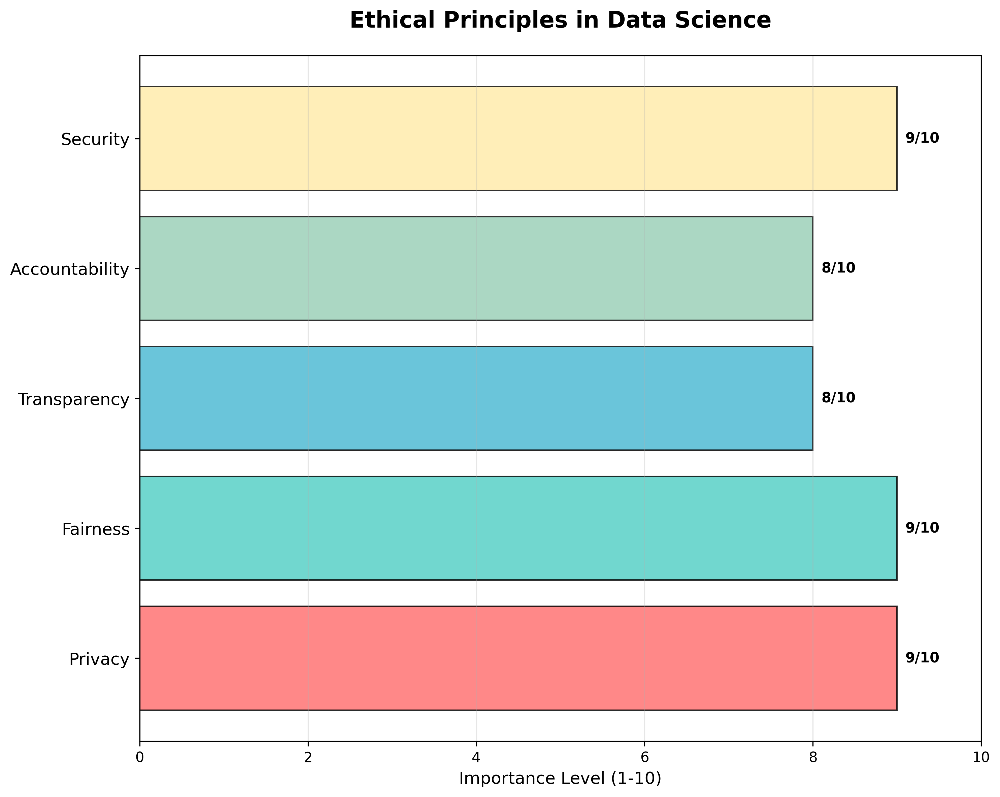
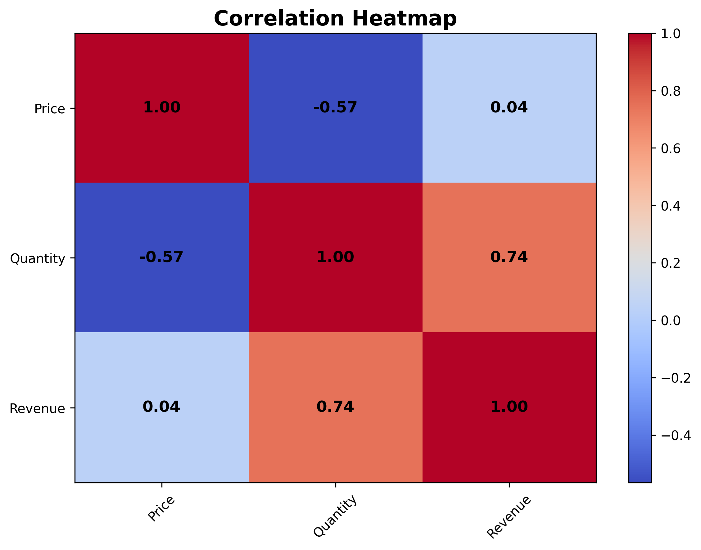
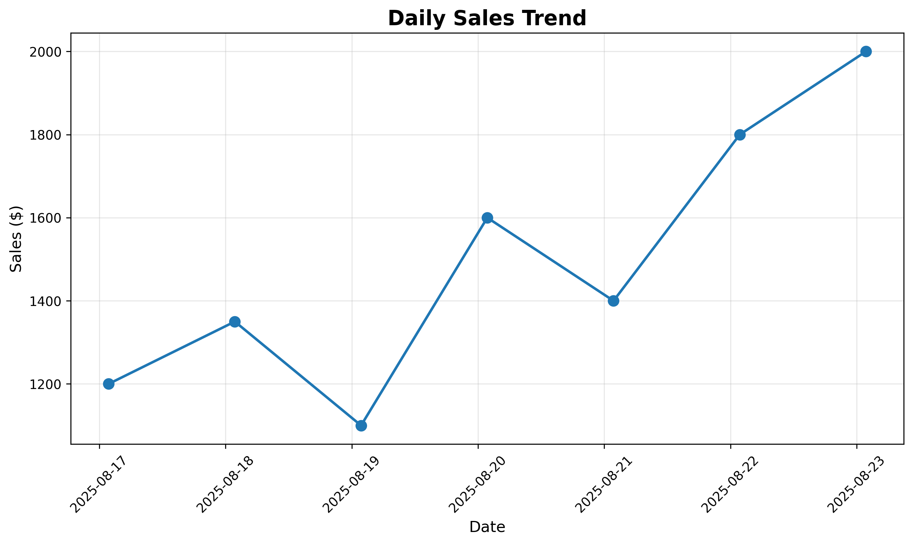
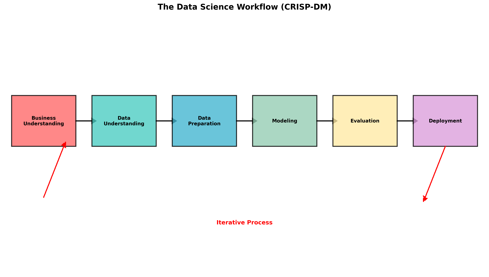
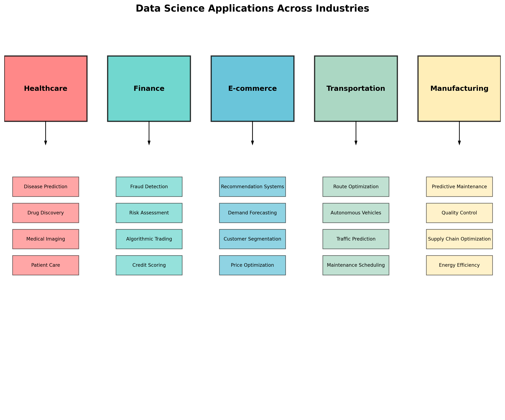
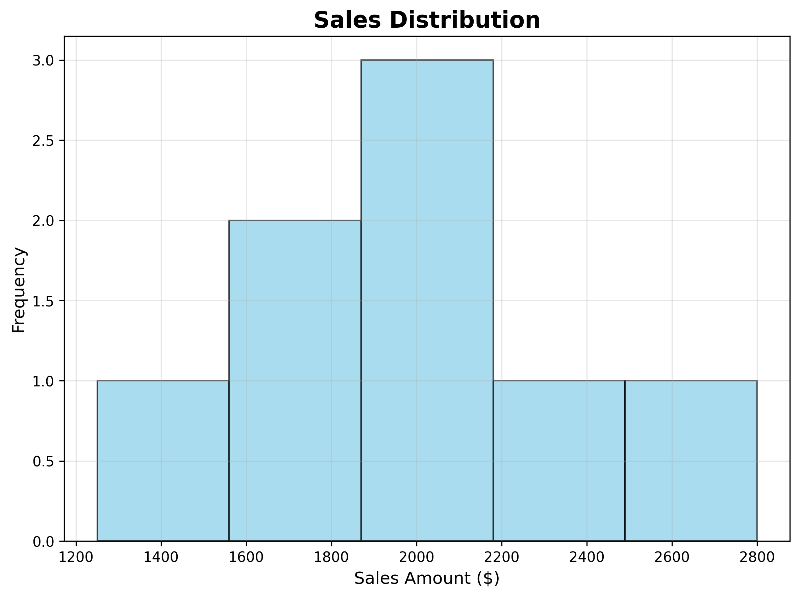
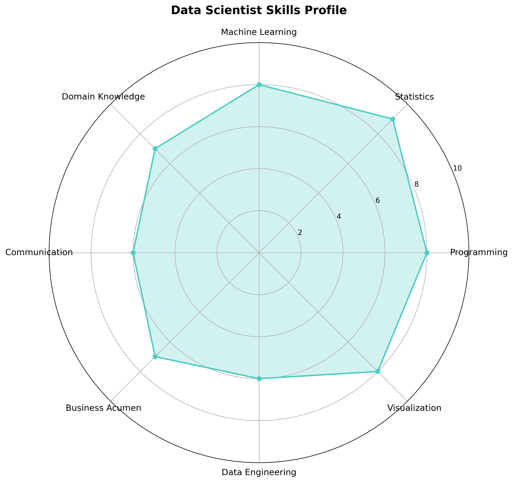

# Chapter 1: The Data Science Landscape

## 🎯 Learning Objectives

By the end of this chapter, you will be able to:

- Understand what data science is and why it matters
- Identify the key components of the data science workflow
- Recognize real-world applications across different industries
- Understand the role of a data scientist and required skills
- Appreciate the ethical considerations in data science

## 📚 Chapter Overview

This chapter serves as your gateway into the fascinating world of data science. We'll explore the fundamental concepts, understand why data science is crucial in today's world, and see how it's transforming industries from healthcare to finance.

## 🔍 Key Topics

1. **What is Data Science?**

   - Definition and scope
   - The data science Venn diagram
   - Relationship with other fields

2. **The Data Science Workflow**

   - Business understanding
   - Data collection and preparation
   - Modeling and evaluation
   - Deployment and monitoring

3. **Real-World Applications**

   - Healthcare: Disease prediction and drug discovery
   - Finance: Fraud detection and risk assessment
   - E-commerce: Recommendation systems
   - Transportation: Route optimization and autonomous vehicles

4. **The Data Scientist Role**

   - Required skills and competencies
   - Day-to-day responsibilities
   - Career progression paths

5. **Ethics and Responsibility**
   - Privacy and data protection
   - Bias and fairness
   - Transparency and accountability

## 🚀 Getting Started

- **Prerequisites**: None (this is your starting point!)
- **Estimated Time**: 2-3 hours
- **Hands-on Activities**: Industry case study analysis
- **Key Takeaway**: Understanding the big picture of data science

## 📖 Next Steps

After completing this chapter, you'll be ready to dive into Python programming fundamentals in Chapter 2, where we'll start building the technical skills needed for data science.

---

_"Data science is not just about algorithms and models—it's about solving real problems and creating value for people and organizations."_

## Generated Outputs

### Main Script
- `ch01_*.py` - Complete chapter implementation

### Generated Visualizations

### Data Science Fundamentals Visualizations

This chapter generates multiple visualizations showing:

#### 1. Data Science Venn Diagram

- Data science components and their relationships

#### 2. Ethics Framework

- Ethical decision-making framework for data science

#### 3. Correlation Heatmap

- Feature correlation analysis and visualization

#### 4. Daily Sales Trend

- Time series analysis of sales data

#### 5. Data Science Workflow

- Complete data science project workflow

#### 6. Industry Applications

- Data science applications across industries

#### 7. Sales Distribution

- Statistical distribution of sales data

#### 8. Skills Radar Chart

- Data science skills assessment and development

