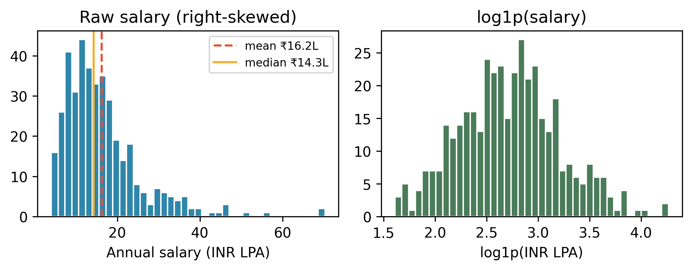
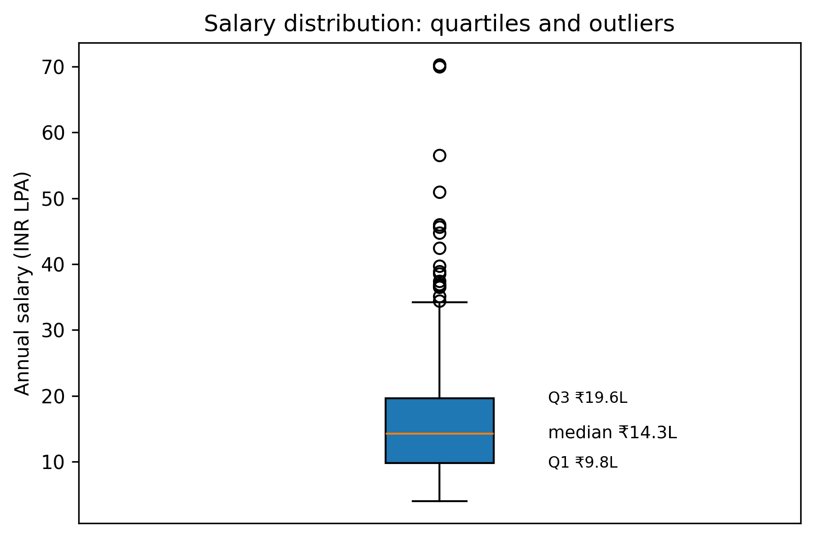
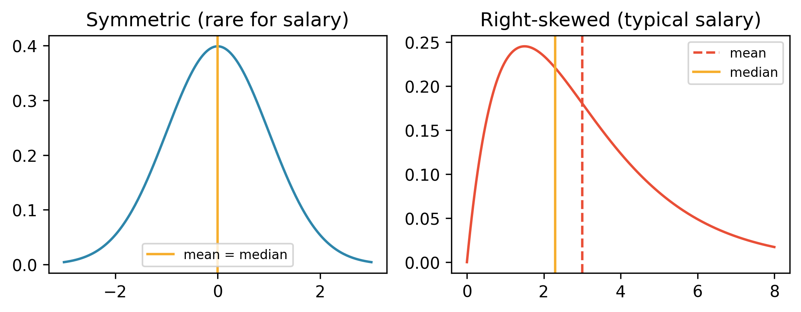

# Chapter 3: The Statistics You Actually Need

> **TalentLens milestone:** Build the statistical vocabulary for salary and job-market data before Chapter 5 delivers real postings. You will interpret synthetic INR salaries the same way you will later interpret `salary_min` / `salary_max` in `jobs_clean.csv`.

---

## The problem we're solving

A recruiter messages you on LinkedIn:

> "Average AI Engineer salary in Bangalore is ₹35L. Our client is offering ₹28L. That's below market. You should negotiate."

You have no dataset yet. Chapter 5 has not run. TalentLens does not exist on disk. Still, you need to answer one question immediately: **is ₹35L a believable "average," and is ₹28L actually low?**

If "average" means the **mean**, a handful of ₹80L+ staff-level offers at product companies can pull the number up while most hires sit near ₹18–22L. If "average" means the **median**, ₹35L might be high but not absurd for senior AI Engineer roles at Indian product companies and MNC India offices, the same bands Chapter 1 sketched when it separated service-company titles from product-company reality.

You cannot verify the recruiter without **distribution language**: centre (mean vs median), spread (standard deviation, IQR), shape (right skew), and the habit of asking *which average* and *which population*. This chapter teaches exactly that, on **synthetic** annual salaries in INR lakhs (LPA) generated in `ch03_statistics.py`, so you are not blocked on API keys or scraping ethics from Chapter 4.

When Chapter 5 lands rows in `DATA_DIR`, Chapter 6 cleans them, and Chapter 7 runs EDA on the resulting postings, you will reuse every concept here. Chapter 8 formalises the hypothesis tests we only preview today; Chapter 10 feeds log-transformed salary to a model, and Chapter 12 fits regression models where skewed targets matter.

---

## Why this practice, and why now

Chapter 1 named the **five roles** (Data Analyst, Data Scientist, Data Engineer, ML Engineer, AI Engineer) and showed why title search fails. Chapter 2 gave you `from talentlens.paths import REPO_ROOT, DATA_DIR, BOOK_DIR` so paths never again depend on `/Users/you/...`.

Chapter 3 sits **between** tooling and ingestion on purpose:

| If we taught stats later | What goes wrong |
|--------------------------|-----------------|
| After Chapter 5 collection | You stare at `describe()` output with no idea whether mean salary is meaningful |
| After Chapter 9 ML | You treat correlation in features as causation in interviews |
| As a calculus chapter | You optimise for proofs, not for reading a box plot before stand-up |

**What we are doing:** descriptive statistics, distribution shape, `np.log1p` for right-skewed pay, one careful paragraph on correlation vs causation, and a short confidence-interval preview.

**What we are deferring (on purpose):**

- **Hypothesis testing** (t-tests, p-values, multiple testing) → **Chapter 8**
- **Regression** (error metrics, R², linear baselines) → **Chapter 12**
- **Calculus and linear algebra proofs** → not part of this book's spine; use a dedicated math text if you need them

**What we are not doing:** fitting models, scraping salaries off LinkedIn, or claiming our synthetic generator matches Naukri's internal tables. Synthetic data is a **teaching stand-in** with controlled skew (median about ₹14L, mean about ₹16L, a tail past ₹70L) until TalentLens ingests postings.

---

## The methods

### Mean vs median: which "average" is the recruiter using?

**Mean**: sum divided by count. One ₹90L principal offer in a sample of twenty ₹15L engineers moves the mean sharply.

**Median**: middle value when sorted. Half the sample earns less, half earns more. For **typical** pay in a right-skewed market, lead with the median in slides and in negotiation.

**Worked example (the chapter script's synthetic sample, not live market data):**

| Statistic | Value | How to say it aloud |
|-----------|-------|---------------------|
| Mean | ₹16.2L | "If we literally average everyone in this sample, we get about sixteen lakhs." |
| Median | ₹14.3L | "Half the sample is at or below fourteen lakhs." |
| Mean / median ratio | ~1.14× | "The mean is pulled above the median: expect right skew." |

When the recruiter says "average ₹35L," ask: **mean or median?** **which companies?** **which seniority?** Chapter 1 already warned that "AI Engineer" at a service firm and at a product company are different populations; mixing them in one average is how numbers become propaganda.

### Standard deviation: spread around the mean

**Standard deviation (σ or `series.std()`)** measures typical distance from the mean in the **same units** as the data (here, lakhs per year).

- Low σ relative to the mean → salaries cluster tightly (e.g. narrow band at one employer level).
- High σ → wide spread; the mean is less representative of any single person.

For salaries, σ is often **larger than intuition** because of the right tail. Pair σ with the median, not only with the mean. Chapter 7 will plot spread visually; here you learn the number behind the plot.

### IQR and quartiles: outlier-resistant spread

Sort salaries. Cut into four equal parts:

> **📑 Reference: Quartile definitions**

| Quartile | Symbol | Meaning |
|----------|--------|---------|
| Q1 | 25th percentile | 25% earn at or below this |
| Q2 | 50th percentile | **Median** |
| Q3 | 75th percentile | 75% earn at or below this |

**IQR = Q3 − Q1**: the middle half's width. Unlike the mean, Q1/Q3 are not dragged by a single ₹1Cr offer.

**Box plot reading (see `ch03_salary_boxplot.png`):**

- Box spans Q1–Q3; line inside is median.
- Whiskers extend to plausible range; points beyond are **candidates for outliers** (investigate before deleting: a real ₹75L offer is not always a data bug).

Rule of thumb for skewed pay: report **median and IQR** in written summaries; keep mean and σ in appendices or when the audience expects parametric stats later (Chapter 8).

### Distribution shape: symmetric vs right-skewed

Salary data in tech is almost never bell-shaped. Offers cluster at accessible bands; a few roles (staff+, equity-heavy US remote, FAANG India) stretch the right tail.

**Skewness** (pandas `series.skew()`):

- Near 0 → roughly symmetric (rare for salary).
- **> 1** → right-skewed: long tail of high values; **mean > median**.

`ch03_skew_demonstration.png` contrasts a symmetric reference curve with a right-skewed gamma-shaped example where the mean sits to the right of the median. That is the picture you should have in mind when someone quotes one number for "the market."

### Log transform: `np.log1p`

Raw salaries are right-skewed. Many downstream steps behave better when the tail is compressed:

```python
import numpy as np

log_salary = np.log1p(salary_lpa)  # log(1 + x); safe at x = 0
```

**Why `log1p` not `log`?** `log(0)` is undefined; `log1p(0) = 0`. For positive pay in lakhs, `log1p` is the standard choice.

**Effect:** absolute skew drops (the chapter script prints skew before and after). Histograms become easier to read; correlations in Chapter 7 are less dominated by a few giants; **Chapter 10** feeds `log1p` salary to a classifier as an engineered feature, with the same function and the same motivation.

Do not interpret `log1p(₹20L)` as "rupees" without inverse-transforming for stakeholders: `np.expm1(log_salary)` returns the original scale.

> **📑 Reference: pandas one-liners used in this chapter**

```python
series.describe(percentiles=[0.25, 0.5, 0.75])  # count, mean, std, quartiles
series.median(), series.quantile([0.25, 0.75])    # explicit median and IQR inputs
series.skew()                                      # sample skewness
```

These run on the synthetic `salary_lpa` column today; in Chapter 7 you will group by `source` or `city` before calling the same functions on real pay.

### Correlation vs causation: one paragraph you will reuse

**Correlation** measures how two variables move together (e.g. years of experience and annual salary in a sample). **Causation** means changing one variable *produces* change in another. Strong correlation does not imply that increasing X will raise Y. Confounders (company tier, city, equity vs cash, role title inflation) explain much of what you see in job data. TalentLens might find that postings mentioning "PyTorch" correlate with higher `salary_max`; that does not prove that adding PyTorch to your résumé causes a pay bump. Treat correlated features as **hypotheses for investigation**, not levers guaranteed to work. Chapter 8 adds formal tests; Chapter 9 adds predictive models. Neither replaces domain judgment.

### Confidence intervals: brief preview (Chapter 8 defers the machinery)

A **95% confidence interval** for a mean is a range of values built from your sample such that, under repeated sampling, the method would capture the true population mean about 95% of the time. It is **not** "there is a 95% probability my true mean lies in this interval" for a single study. That is a common misread.

Example on this chapter's synthetic sample: "mean salary ₹16.2L, 95% bootstrap CI [₹15.3L, ₹17.2L]" tells you the sample mean is uncertain; width depends on sample size and spread. **Chapter 8** runs hypothesis tests on TalentLens postings. Here, remember the phrase **"estimate plus uncertainty"** when a blog post gives a single salary number with no interval.

---

## The code

Runnable entrypoint:

```bash
python book/ch03/ch03_statistics.py
```

**Design decision 1: synthetic before real.** `generate_synthetic_salaries()` draws log-normal annual INR LPA with fixed RNG seed (`42`) so your figures match the book and CI. Same reproducibility pattern as later ML chapters.

**Design decision 2: figures under version control path.** Outputs land in `book/ch03/reports/figures/`:

| File | What it shows |
|------|----------------|
| `ch03_salary_histogram.png` | Raw vs `log1p` histogram; mean and median marked |
| `ch03_salary_boxplot.png` | Quartiles, whiskers, outliers |
| `ch03_skew_demonstration.png` | Symmetric vs right-skew reference |

**Design decision 3: interpretive prints, not just plots.** `interpret_descriptive()` and `interpret_log_transform()` print commentary tied to TalentLens decisions (lead with median, log for skew). Read stdout before opening PNGs.

**Tests:**

```bash
make test-ch03
pytest book/ch03/tests/test_ch03.py -q
```

---

## Interpreting the output

After a successful run you should see `.describe()` with percentiles, then lines similar to:

```
Mean ₹16.2L vs median ₹14.3L (ratio 1.14x)
Skew: 1.98 — right-skewed if > 1.0
--- Log transform (np.log1p) ---
Skew raw: 1.98  |  Skew log1p: 0.23
Interpretation: log1p compresses the right tail so correlations and plots in Chapter 7 behave more honestly.
```

Notice the two numbers disagree in size. The mean sits only 14% above the median, yet skew is almost 2. A handful of offers above ₹40L (nine of 400 here, the largest ₹70L) stretch the tail without moving the bulk. That is why you report both: the ratio tells you how misleading the mean is for a typical person; skew tells you a tail exists.

**Back to the recruiter:** If their "₹35L average" is a **mean** across senior AI roles at product companies only, it might be defensible. If it is a **mean** across all titles labelled "AI Engineer" including service vendors, your synthetic exercise shows how means lie. If your offer is ₹28L for a mid-level role, compare it to the **median for that tier**, not to a headline average. That is the kind of breakdown Chapter 7 produces from the cleaned TalentLens postings.

**Figures (from repo root):**

- **`ch03_salary_histogram.png`**: Raw vs `log1p` salary; mean and median marked so skew is visible before Chapter 7 EDA.



- **`ch03_salary_boxplot.png`**: Q1–Q3 box, median line, whiskers. This is the outlier-resistant view we lead with in negotiations.



- **`ch03_skew_demonstration.png`**: Symmetric reference vs right-skewed curve; the picture behind "which average?"



If PNGs are missing, re-run the script; tests assert each file is non-trivial size.

---

## Common mistakes I've seen (and made)

**Mistake: Quoting the mean for skewed salary data**

What happens: you tell leadership "average salary is ₹20L" while half the team is below ₹15L. Morale and negotiation conversations go sideways.

How to catch it: if mean > median by more than ~10–15%, report median and IQR in the headline; relegate mean to a footnote.

---

**Mistake: Treating standard deviation as "typical error" for one person**

What happens: "σ is ₹8L so most people are within ₹8L of the mean". False for skewed data: σ is centered on the mean, which itself is not central.

How to catch it: use IQR for typical spread; use σ only when you know the distribution is roughly symmetric or you are heading into Chapter 8's inferential formulas.

---

**Mistake: Dropping "outliers" that are real offers**

What happens: you cap salaries at ₹40L before EDA; you just erased the signal Chapter 1 said distinguishes product companies from service shops.

How to catch it: box-plot points above Q3 + 1.5×IQR are **candidates** for review, not automatic bugs. Document winsorising choices in Chapter 6, not silently here.

---

**Mistake: Correlation from a job board becomes a causal claim**

What happens: "RemoteOK posts with 'Rust' pay more, learn Rust." Confounding: senior roles list more languages.

How to catch it: separate **description** (interesting pattern) from **recommendation** (needs experiment or controlled comparison). Chapter 9's models still will not prove causation without design.

---

**Mistake: Applying linear regression to raw salary without checking shape**

What happens: one huge residual drives a misleading slope; R² looks fine on paper.

How to catch it: histogram and skew first; use `log1p(salary)` for modelling (Chapter 10). This chapter exists so that failure mode is familiar before you fit anything.

---

## Interview questions

**Q1: When should you report median instead of mean for salary data?**

Template answer: "When the distribution is right-skewed, as compensation usually is, a few high earners pull the mean up. Median represents the typical employee better. I report median and IQR by default; I add mean and standard deviation when the audience expects parametric stats or when I will attach confidence intervals in a formal analysis. I always state which measure I used."

**Q2: What does IQR tell you that standard deviation does not?**

Template answer: "IQR is the spread of the middle 50% between Q1 and Q3. It is resistant to extreme values. Standard deviation weights outliers because it uses squared distance from the mean. For skewed salaries, IQR describes the bulk of the market without letting a handful of very high packages dominate."

**Q3: Why log-transform salary before correlation or regression?**

Template answer: "Salaries are positive and right-skewed. Log1p compresses the tail so relationships are less driven by a few extreme offers and errors are closer to symmetric. I use np.log1p for zeros safety and inverse-transform with expm1 when explaining results in rupees. I still check residuals after modelling."

**Q4: A study reports r = 0.7 between years of experience and pay. What can and cannot you conclude?**

Template answer: "Experience and pay move together in that sample. I cannot conclude that one more year of experience causes a fixed rupee increase without controlling for company, location, role, and selection effects. I would treat it as predictive association for hiring analytics, not as a causal policy lever, unless we have an experimental or quasi-experimental design."

**Q5: How would you sanity-check a recruiter's 'average ₹35L' claim?**

Template answer: "Ask mean versus median, sample source, role level, and company mix. Compare to internal or public distributions with quartiles, not one number. If I only have a sample, I compute both mean and median, plot a histogram or box plot, and check skew. If mean exceeds median by a large margin, I suspect tail-heavy composition or title inflation. That is exactly the problem TalentLens is built to unpack with real postings in later chapters."

---

## What's next

**Chapter 4** maps **where** TalentLens data may come from (the Adzuna and RemoteOK APIs and licensed archives) and **where it may not** (LinkedIn scraping, Naukri, Indeed). Ethics and canonical schema appear before collectors run.

**Chapter 5** writes `data/raw/jobs_raw.csv` using the canonical schema Chapter 4 defines.

**Chapter 7** applies today's vocabulary to the cleaned TalentLens postings: histograms, missing salary rates, geographic splits.

**Chapter 8**: hypothesis testing, confounders, and multiple comparisons.

**Chapter 12**: regression and neural networks, with scaled inputs.

---

## TalentLens checkpoint

You should have:

- [ ] Run `python book/ch03/ch03_statistics.py` (exit 0)
- [ ] Read mean vs median commentary on synthetic INR LPA
- [ ] Understood why skew > 1 implies mean > median
- [ ] Seen `log1p` reduce skew in printed output
- [ ] Three figures present under `book/ch03/reports/figures/`
- [ ] `pytest book/ch03/tests/test_ch03.py -q` passing

**Concepts you own:**

- Mean vs median on right-skewed pay: lead with median and IQR for "typical" compensation
- `log1p` compresses tails before correlation and modelling (Chapters 7, 10, and 12)
- Correlation in job data is not causation: treat patterns as hypotheses, not levers

```bash
python book/ch03/ch03_statistics.py
pytest book/ch03/tests/test_ch03.py -q
ls book/ch03/reports/figures/ch03_*.png
```

When Chapter 5 completes, re-run your mental checklist on **real** `salary_min` / `salary_max`: median for typical pay, IQR for spread, log transform before modelling. No new vocabulary required, only new rows in `DATA_DIR`.
