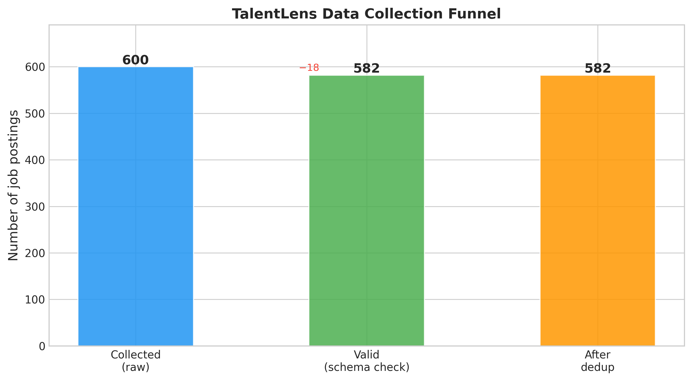
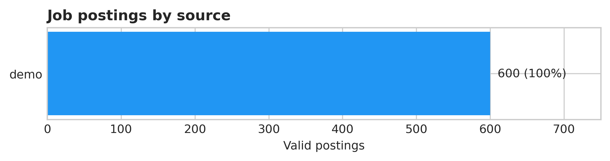
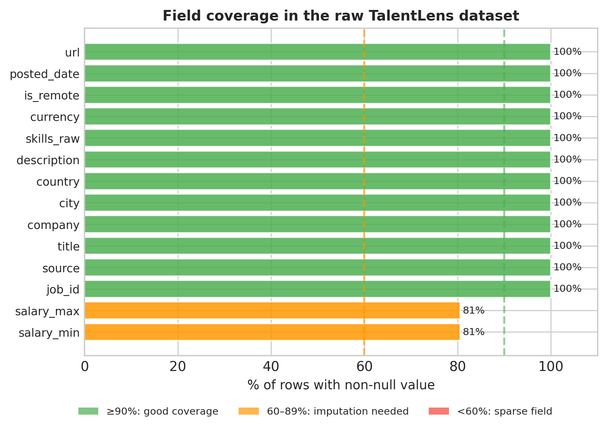

# Chapter 5: Data Collection — Building the TalentLens Dataset

> **TalentLens milestone:** We go from zero data to a raw dataset of job postings. By the end of this chapter you can collect live postings from public APIs, or generate the seeded demo corpus the rest of the book is written against. That dataset feeds every downstream chapter: EDA (Ch7), ML models (Ch9), semantic search (Ch16), and the full generation pipeline (Ch17–18).

> **Note on running this chapter:** The bundled `data/raw/jobs_raw.csv` is the output of this chapter's demo mode: about 580 synthetic postings from fictional employers, generated with a fixed seed so every reader gets identical rows. Every downstream chapter works without network access or API keys. To collect real data, follow the live-mode instructions below. The first time you run live, expect Adzuna API quirks the demo path cannot show you; open an issue on the companion repository if you hit one.

---

## The problem we're solving

Every chapter from 7 onwards assumes you have a dataset of job postings. Where does it come from?

Most tutorials sidestep this question with a `pd.read_csv("iris.csv")`. That's fine for learning a specific algorithm, but it doesn't teach you how production data science actually starts, which is rarely with a clean CSV someone hands you.

In the real world, you build the dataset. You identify sources, assess their quality, write collection code that handles rate limits and partial failures, validate what comes back, and store it in a format the rest of your pipeline can consume. This chapter teaches that process end to end, using TalentLens as the working example.

We build collectors for the two live sources Chapter 4 approved: the **Adzuna API** (free tier, real job postings, India endpoint) and the **RemoteOK API** (no auth, JSON feed of remote tech roles). Together they give us diversity (Indian on-site roles and global remote ones) and redundancy: if one source is slow or rate-limited, the other keeps the pipeline running. A third collector, `DemoCollector`, generates realistic synthetic postings so you can run everything offline.

---

## Why these sources, and why now

**Adzuna:** Free tier gives 250 calls/day with a registered API key. Returns structured data: title, company, salary range, location, description. Covers India job market natively with `/in/` endpoint. The best freely available programmatic source for current Indian tech roles.

**RemoteOK:** No authentication required. Public JSON API. Returns tech-focused remote roles with salary data. Updated multiple times daily. The fastest way to get real, current data without any setup.

**The demo generator:** Not a data source, but a stand-in with the properties the later chapters need: titles that vary within a role, salaries that depend on seniority and are right-skewed, descriptions that blur neighbouring roles the way real ads do, and about one posting in five that hides its salary. The employers are fictional. Chapter 4's third allowed source, a historical archive such as the GitHub Jobs dataset on Kaggle, is left as an exercise.

**Why not scrape LinkedIn or Naukri directly:**

Both have terms of service that prohibit scraping. More importantly, scraping JavaScript-rendered pages without a headless browser is fragile and frequently breaks. We use official APIs and openly-licensed datasets. This is what professional data engineers do. The data is slightly less complete than what you'd get by scraping, but the approach is sustainable and legally defensible.

**What "real world data collection" looks like:**

- APIs return errors. Your code needs to handle 429 (rate limit), 500 (server error), and network timeouts without crashing.
- Data is inconsistent. Adzuna salary fields are sometimes null, sometimes a range, sometimes a string ("competitive"). Your schema needs to handle all of these.
- Collection takes time. 250 Adzuna calls at 1 call/second takes 4 minutes. Your code should show progress, and for long runs it should save incrementally and resume if interrupted.
- You never get everything in one pass. Real pipelines run on a schedule and append new data.

---

## The methods

### HTTP requests with `requests` / `httpx`

**What it does in plain English:** Sends an HTTP request to an API endpoint and returns the response. The two main libraries are `requests` (synchronous, simpler) and `httpx` (async-capable, faster for concurrent collection). We use `requests` for simplicity in this chapter.

**Key parameters:**

```python
response = requests.get(
    url,
    params={"app_id": api_key, "results_per_page": 50},
    timeout=10,
    headers={"User-Agent": "TalentLens/1.0 (educational project)"},
)
```

`params`: query parameters appended to the URL. `{"results_per_page": 50}` becomes `?results_per_page=50`. Always use `params` not string formatting; it handles URL encoding automatically.

`timeout=10`: seconds to wait before giving up. Without a timeout, a slow server can hang your collection forever. 10 seconds is a good default for job APIs.

`User-Agent`: identifies your client to the server. Some APIs block requests without a User-Agent. Being honest about what you are (educational project) is both correct and good practice.

**What the output tells you:** `response.status_code` tells you if the call succeeded. `200` = success. `429` = rate limited (slow down). `401` = authentication failed (check your API key). `500` = server error (retry later). Always check `response.raise_for_status()` before accessing `response.json()`.

---

### Rate limiting and backoff

**What it does in plain English:** Adds delays between API calls to stay within the provider's limits and to be a polite consumer.

```python
import time

def rate_limited_get(url, params, rpm_limit=60):
    """Fetch with rate limiting at rpm_limit requests per minute."""
    response = requests.get(url, params=params, timeout=10)
    if response.status_code == 429:
        retry_after = int(response.headers.get("Retry-After", 60))
        time.sleep(retry_after)
        return rate_limited_get(url, params, rpm_limit)
    time.sleep(60 / rpm_limit)  # space out requests
    return response
```

`60 / rpm_limit`: if the limit is 60 requests/minute, wait 1 second between each call. If it's 10/minute, wait 6 seconds. This simple formula keeps you exactly at the limit.

**Exponential backoff:** When a request fails, wait 2 seconds, then 4, then 8. Most transient errors (network hiccup, brief overload) resolve within 30 seconds. Cap the wait at 60 seconds to avoid blocking indefinitely.

**What the output tells you:** If you're getting frequent 429 responses, your rate is too high, so reduce `rpm_limit`. If you're getting `ReadTimeoutError`, either the server is slow or your `timeout` is too low.

---

### Pagination

**What it does in plain English:** Most APIs return results in pages (e.g., 50 results per page). To collect 1,000 results, you make 20 sequential calls, advancing the page number each time.

```python
def collect_all_pages(base_url, params, max_pages=20):
    all_results = []
    for page in range(1, max_pages + 1):
        response = requests.get(base_url, params={**params, "page": page})
        data = response.json()
        results = data.get("results", [])
        if not results:
            break  # no more pages
        all_results.extend(results)
    return all_results
```

**Key decision (`max_pages`):** Don't collect unlimited pages. Set a reasonable limit (20 pages × 50 results = 1,000 job postings from Adzuna) and stop. More data is not always better: after 1,000 postings, you're likely seeing duplicates and very old listings. Quality over quantity.

**What the output tells you:** If you hit your `max_pages` limit, check how many unique results you got. If it's noticeably less than `max_pages × results_per_page`, the API ran out of results before your limit, which is fine.

---

### Schema validation

**What it does in plain English:** After collecting raw data, validate that each record has the minimum required fields before saving. Catches API changes (a field disappears), data quality issues (all salaries are null), and collection bugs (you're parsing the wrong JSON key).

```python
REQUIRED_FIELDS = {"title", "description", "company"}

def validate_job(job: dict) -> bool:
    """Return True if job has all required fields with non-empty values."""
    return all(
        job.get(field) and str(job[field]).strip()
        for field in REQUIRED_FIELDS
    )
```

**What the output tells you:** A validation pass rate below 80% suggests a structural problem: wrong API endpoint, changed response format, or a source that doesn't provide the fields you need. A pass rate of 95–100% is normal.

---

### Incremental saving

**What it does in plain English:** Save data to disk after each successful API call, not at the end of the full collection. If the process crashes at page 15 of 20, you keep pages 1–14.

```python
import pandas as pd
from pathlib import Path

def append_to_csv(records: list[dict], path: Path) -> None:
    """Append records to CSV, writing header only if file is new."""
    df = pd.DataFrame(records)
    df.to_csv(path, mode="a", header=not path.exists(), index=False)
```

The companion pipeline keeps things simple and writes the CSV once at the end, which is fine for a few hundred postings that take minutes to fetch. When your runs grow to hours, move the write inside the collection loop as shown here.

**What the output tells you:** After the collection run, `path.stat().st_size` tells you how much data you collected. If the file is under 1MB for 1,000 postings, some fields are probably empty. Expected size: 1,000 job postings with descriptions ≈ 3–8MB.

---

## The code

The full implementation is in `ch05_data_collection.py`. It builds three collectors on one `BaseCollector` base class:

1. `AdzunaCollector`: authenticated API, paginated, India-focused, retries with backoff on 429 and 5xx
2. `RemoteOKCollector`: no auth, single JSON endpoint, global remote roles
3. `DemoCollector`: seeded synthetic postings for offline runs

Plus a `DataCollectionPipeline` that runs the live pair (or the demo collector), validates each record, deduplicates by title + company + city, and saves the result. Live mode writes `data/raw/jobs_raw.csv`; demo mode writes `data/raw/jobs_raw.demo.csv` so it never overwrites the bundled file.

Run:
```bash
# Demo mode — generates synthetic data matching real schema (no API keys needed)
python book/ch05/ch05_data_collection.py

# Live mode — uses real APIs (requires ADZUNA_APP_ID and ADZUNA_API_KEY in .env)
export ADZUNA_APP_ID=your_id
export ADZUNA_API_KEY=your_key
python book/ch05/ch05_data_collection.py --live
```

**Three key code decisions:**

*Why we save raw data before cleaning:* Raw data is irreplaceable. Once you clean it, you can't recover information you didn't know you'd need. Chapter 6 (cleaning) operates on `data/raw/`, always producing output to `data/clean/`. The raw files are read-only inputs.

*Why we deduplicate on title+company+location rather than a unique ID:* Most job APIs don't share a common job ID; the same posting on Adzuna and RemoteOK will have different IDs. Content-based deduplication catches cross-source duplicates that ID-based dedup misses. The risk (removing genuinely similar but distinct postings) is lower than the alternative (5x duplicates in your training data).

*Why we collect more than we need:* Live mode targets 500 Adzuna and 300 RemoteOK postings per run. Validation and dedup always remove some, and having surplus means you can be aggressive in Chapter 6's cleaning without running out of data.

---

## Interpreting the output

When you run the pipeline in demo mode, the console ends with this summary:

```
COLLECTION SUMMARY
============================================================
  Source                Collected    Valid     Rate
  ──────────────────────────────────────────────────
  demo                        600      600   100.0%
  ──────────────────────────────────────────────────
  Total raw                   600
  After dedup                 582 (18 duplicates removed)
```

and `book/ch05/reports/collection_summary.md` records field coverage: every field at 100% except `salary_min` and `salary_max`, at 81%.

**Validation rate 100%:** The demo generator always produces valid rows, so this number teaches nothing in demo mode. On live pulls, anything above 90% is healthy; below 80% means something structural is wrong, such as a changed endpoint or a wrong JSON key.

**Dedup removed 18 rows (3%):** The generator occasionally produces the same title at the same company in the same city, which is exactly what a repost looks like. On live data, expect more when you merge Adzuna and RemoteOK, because many remote roles are posted on both. If dedup removes more than 40%, your sources overlap too heavily.

**Salary coverage 81%:** About one posting in five hides its pay. That is the gap Chapter 6 has to handle, and the demo generator reproduces it on purpose. Live Adzuna pulls for Indian tech roles often hide more: a third or more.

**File size:** The demo file is about 0.3 MB for 582 rows (roughly 500 bytes per posting), because generated descriptions are short. Real postings run 3–8 KB each; if a live run produces under 1 KB per posting, descriptions are probably being truncated.

**The three charts this chapter generates:**

`ch05_collection_funnel.png` shows raw → valid → deduped as a waterfall, so you can see where attrition happens.



`ch05_source_breakdown.png` shows how many postings came from each source. In demo mode it is a single bar; on live runs, if one source dominates (>70%), your dataset will be biased toward its posting style.



`ch05_field_coverage.png` shows, for each field (salary_min, salary_max, is_remote, company, city), what percentage of rows have a non-null value. This is your preview of what Chapter 6 will need to handle.



---

## Common mistakes I've seen (and made)

**Mistake: No timeout on API calls**

What happens: One slow API response hangs the entire collection script. After 45 minutes waiting, you kill it and lose whatever was collected in memory.

Fix: Always set `timeout=10`. For bulk collection, also set a per-source time limit using `signal.alarm()` or a threading timeout.

---

**Mistake: Collecting everything into memory before saving**

What happens: an hour-long run holds 2,000 postings in memory and writes nothing until the end. If the process crashes at posting 1,800, you lose everything.

Fix: Write to disk incrementally. After every 50 records, append to CSV. Even if you crash, you keep what you've collected.

---

**Mistake: Not checking `response.raise_for_status()` before `response.json()`**

What happens: A 404 or 500 response returns HTML ("page not found"), which is valid content but not valid JSON. `response.json()` raises a `JSONDecodeError` with a confusing error message.

Fix: Always `response.raise_for_status()` immediately after `requests.get()`. This raises a `requests.HTTPError` with the status code on any 4xx/5xx response, which is much clearer than a JSON parse error.

---

**Mistake: Storing raw API responses without normalisation**

What happens: Adzuna returns `salary_min` and `salary_max` as floats. RemoteOK may return salary as a string like `"50000-70000"`. An archive CSV might store `salary_range` as `"$50K-$70K"`. Three sources, three formats. Your Chapter 6 cleaning code has to handle all of them.

Fix: Normalise to a common schema at collection time. Not full cleaning, but consistent field names and types. Define the schema upfront (see `SCHEMA` in the code) and map each source to it during collection.

---

**Mistake: Ignoring `robots.txt` and rate limits**

What happens: You hit an API at 10 requests/second. You get blocked. Your IP is flagged. The API stops responding for 24 hours.

Fix: Check the API docs for rate limits before you start. If they're not documented, start at 1 request/second and increase only if you see no 429 responses. Always honour `Retry-After` headers.

---

## Interview questions

**Q1: Walk me through how you'd design a data collection pipeline for a new project.**

Template answer: "I start by identifying the sources: what data exists, what's accessible programmatically, what the legal and ToS situation is. Then I define the schema: what fields do I need, what types, what's required vs optional. Then I write the collectors: one class per source, each with its own rate limiting and error handling. The pipeline runs all collectors, merges results, deduplicates, validates against the schema, and saves raw files. Not cleaned, raw. Cleaning is a separate step that reads from the raw files. I always save raw data before cleaning it, because once you've cleaned it you've lost the original. Finally, I add monitoring: how many records collected, validation pass rate, file size. These metrics tell me immediately if something broke on a subsequent run."

**Q2: An API returns a 429 response. What do you do?**

Template answer: "429 means rate limited: I'm sending requests faster than the API allows. First, check the `Retry-After` header: the server often tells you exactly how long to wait. If it's there, sleep for that duration and retry. If it's not there, use exponential backoff: wait 2 seconds, retry; if still 429, wait 4 seconds; then 8; cap at 60. Also reduce my request rate going forward. If I was doing 2 requests/second and got 429, I'll drop to 1 request/second for the rest of the collection run. Log every 429 with a timestamp so I can analyse the pattern later."

**Q3: How do you handle missing values in collected data?**

Template answer: "At collection time, I note which fields are missing but I don't fill them in; that's the cleaning step's job. I track the field coverage rate (what percentage of rows have each field non-null) and include it in the collection summary. If a critical field like job title is missing in more than 5% of records, something is structurally wrong with the source, and I investigate before proceeding. For optional fields like salary, 30–50% null is expected and handled in Chapter 6 with imputation or indicator features."

**Q4: What's the difference between data collection and data cleaning?**

Template answer: "Collection is getting the data from the source to your disk, in its raw form. Cleaning is transforming that raw data into a form suitable for analysis. They're deliberately separate steps for two reasons. First, raw data is irreplaceable. If you clean in-place and your cleaning code has a bug, you can't recover the originals. Second, cleaning decisions often change: you discover a new way to handle salary strings, or you want to try a different normalisation approach. With raw data preserved, you can re-clean as many times as you want without recollecting. The pipeline is: collect → save raw → clean → save clean. These are sequential, not interleaved."

**Q5: Your collection script ran for 3 hours and then crashed. How much data did you lose?**

Template answer: "It depends entirely on whether I wrote incrementally. If I collected everything into memory and saved at the end, I lost 3 hours of work. If I saved to disk every 50 records, I lost at most the last 50. This is why incremental saving matters. In production, I'd also checkpoint the collection state: which pages have been fetched, how many records from each source. On restart, the pipeline reads the checkpoint, skips completed pages, and continues from where it left off. Think of it like a Git repository: you commit frequently, so a crash never loses more than your last uncommitted work."

---

## What's next

Chapter 6 takes `data/raw/jobs_raw.csv` and produces `data/clean/jobs_clean.csv`, handling missing salaries, normalising job titles, extracting skills from description text, deduplicating overlapping records, and validating the final dataset. The EDA in Chapter 7 then runs on `jobs_clean.csv`.

**Bundled dataset contract:** the repo ships `data/clean/jobs_clean.csv` (576 rows) so Chapters 7–24 run without collecting first. It is exactly what demo mode followed by Chapter 6 produces (a test in the companion repository checks that byte for byte), so every number quoted in this book reproduces on your machine. **Demo mode writes to `data/raw/jobs_raw.demo.csv`**, and Chapter 6 cleans that into `data/clean/jobs_clean.demo.csv`; neither touches the bundled files. Use `--live` when you intentionally replace `jobs_raw.csv` with real API data, then `ch06 --overwrite` to rebuild the clean file. After that, your numbers will differ from the book's, which is the point of collecting real data.

---

## TalentLens checkpoint

At the end of this chapter, your project should have:

- [ ] `data/raw/jobs_raw.demo.csv`: 582 demo postings (or `data/raw/jobs_raw.csv` from a live run)
- [ ] `book/ch05/reports/figures/ch05_collection_funnel.png`
- [ ] `book/ch05/reports/figures/ch05_source_breakdown.png`
- [ ] `book/ch05/reports/figures/ch05_field_coverage.png`
- [ ] `book/ch05/reports/collection_summary.md`
- [ ] `pytest tests/test_ch05.py -v`: all passing

**Concepts you own:**

- Collect raw, clean later: irreplaceable originals before validation transforms
- Per-source collectors with rate limits and schema normalisation at ingest
- Field coverage as the honest preview of Chapter 6's missing-data work

Run:
```bash
# Demo mode (no API keys needed)
python book/ch05/ch05_data_collection.py

# Live mode (Adzuna API — free registration at developer.adzuna.com)
export ADZUNA_APP_ID=your_id
export ADZUNA_API_KEY=your_key
python book/ch05/ch05_data_collection.py --live
```
