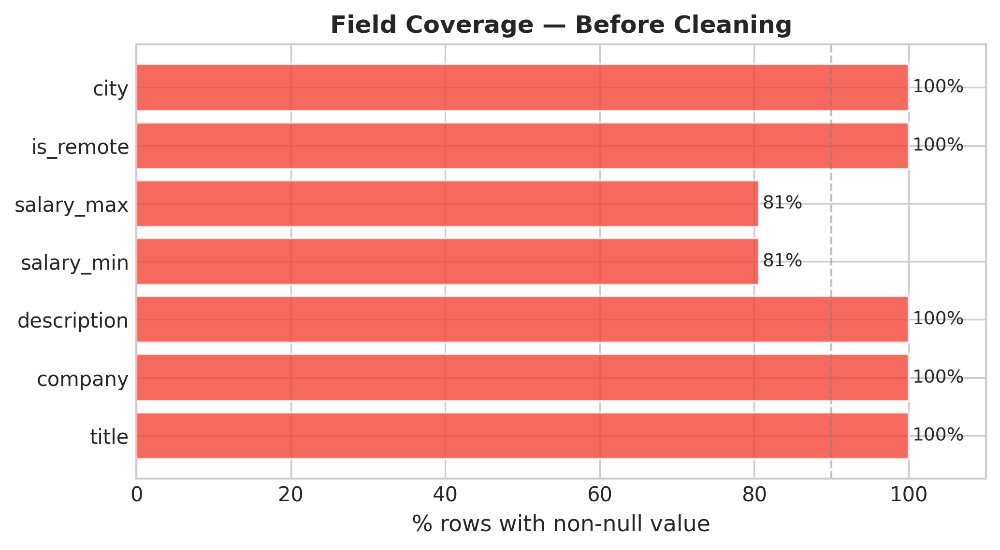
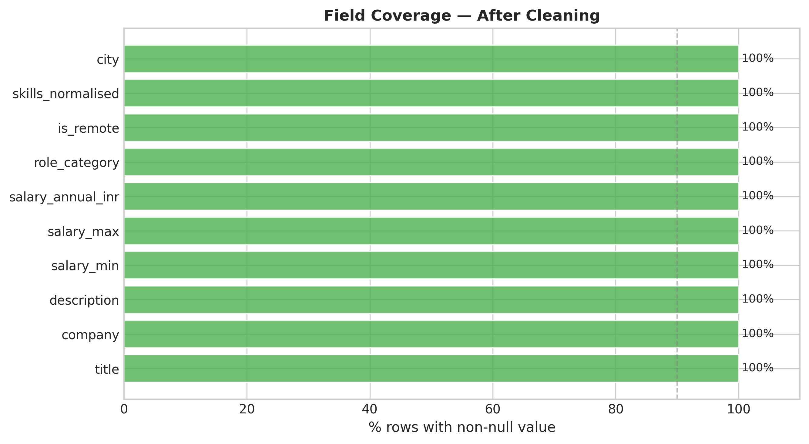
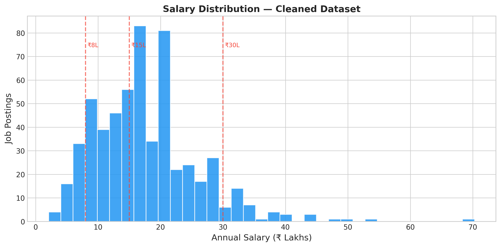

# Chapter 6: Data Cleaning — Turning Raw Into Usable

> **TalentLens milestone:** Turn `data/raw/jobs_raw.csv` into `data/clean/jobs_clean.csv`, the file Chapters 7–9 and 16+ read through `talentlens.paths.DATA_DIR`.

---

## The problem we're solving

Picture `data/raw/jobs_raw.csv` after a week of live collection, open in a spreadsheet viewer. The first screen tells you why downstream chapters can't use it as it is:

- **Salary columns:** `salary_min` is null on roughly **one row in five** in the demo corpus, and on a third or more of live Adzuna pulls. That is not random noise but employers who never disclose pay (Chapter 4 warned about this) plus collection gaps from Chapter 5.
- **Location strings:** the same city appears as `Bangalore`, `Bengaluru`, `Bangalore Urban`, and `bengaluru` in different rows. Your group-by on city will split one labour market into four.
- **Duplicates:** three identical Monsoon Payments postings for "Senior ML Engineer" differ only by `job_id` and scrape timestamp. Left alone, they triple-weight that company in every average.

The bundled demo file shows the first problem and a little of the third; live data shows all three, and worse. Raw data is not wrong data. It is **untrusted** data: valid rows mixed with empty titles, impossible salaries, and labels that humans parse but machines treat as distinct categories.

**This chapter fixes that.** We run a deterministic cleaning pipeline in `ch06_data_cleaning_preprocessing.py`, write `data/clean/jobs_clean.csv`, emit before/after coverage charts, and save `book/ch06/reports/cleaning_report.md`. When you finish, Chapter 7's EDA script opens one canonical file instead of re-implementing fixes in every notebook.

**Default behaviour on a fresh clone:** demo collection writes `data/raw/jobs_raw.demo.csv`; the cleaning script reads that file and writes `data/clean/jobs_clean.demo.csv`. That output is identical to the committed **`data/clean/jobs_clean.csv`** (576 rows), which Chapters 7–24 load through `jobs_clean_path()`, so the default path never touches the bundled file, and you can diff the two to prove your pipeline matches the book's.

**`--overwrite` is for live data.** After a **live** Chapter 5 run (`--live`), pass `--overwrite` to rebuild `jobs_clean.csv` from your new `jobs_raw.csv`. That **replaces the bundled file**, and from then on your numbers in Chapters 7–24 will differ from the ones quoted in this book. That is expected: it means you are analysing real postings.

---

## Why cleaning now, and why this way

Chapter 5 landed rows in `DATA_DIR / "raw" / "jobs_raw.csv"` using collectors that already normalised API JSON to a shared schema (Chapter 4's contract). Chapter 6 is where we **enforce** that contract: drop unusable rows, impute with explicit flags, deduplicate on a business fingerprint, and derive columns (`skills_normalised`, `salary_band`, `salary_imputed`) that later chapters treat as ground truth.

**What we are not doing:**

- **Re-scraping**: if a field was never collected, cleaning cannot invent it; we document coverage and move on.
- **Silent drops**: every shrink step logs row counts; the cleaning report records raw vs clean totals.
- **One-off notebook cells**: the pipeline is a script you can re-run after every collection batch.

**What downstream chapters assume:**

| Chapter | Uses from `jobs_clean.csv` |
|---------|---------------------------|
| 7 (EDA) | Distributions, remote vs on-site charts |
| 8 (inference) | `salary_min`, `salary_disclosed`, `is_remote`, and `title` (for seniority) |
| 9 (modelling) | `role_category` as target; description and `skills_normalised` as features |
| 13 (NLP) | The skill vocabulary, benchmarked against three extraction methods |

Chapter 13 measures when rule-based extraction stops being enough and model-based methods pay off. Today we stay explicit and reproducible.

**Connection to Chapter 5:** collectors write `jobs_raw.csv` with stable dtypes where possible; cleaning never fixes a broken API mapping; it enforces row quality on what arrived. Re-run Chapter 6 after every full collection, not only the first scrape.

---

## The methods

### Schema validation (implicit contract)

Chapter 5's collectors target one row shape: `job_id`, `source`, `title`, `company`, `city`, `description`, `skills_raw`, `salary_min`, `salary_max`, `currency`, `is_remote`, `posted_date`, `url`. The pipeline's first gate is `drop_invalid_rows`: rows missing `title`, `company`, or `description`, or with descriptions shorter than `min_description_len` (default **50** characters), are removed.

**Red flag:** If more than 5% of rows fail here, inspect Chapter 5's parser. You may be mapping the wrong JSON field to `description`.

### Missing salaries: MCAR, MAR, and MNAR

> **📑 Reference: Missingness mechanisms (MCAR, MAR, MNAR)**

| Mechanism | Meaning | TalentLens signal |
|-----------|---------|-------------------|
| **MCAR** | Missingness unrelated to other columns | Rare for salary; would look like random nulls across companies |
| **MAR** | Missing depends on observed fields (e.g. `source == adzuna`) | Common — impute within `source` (+ `role_label` when present) |
| **MNAR** | Missingness carries information (firms that hide pay) | `salary_disclosed=False` rows; keep the flag |

`impute_salary` clips values below `salary_min_floor` (₹2L) and above `salary_max_ceiling` (₹5Cr), then fills nulls with the group median by `source` (and `role_label` if available), then the global median. Rows that had no disclosed salary get **`salary_imputed=True`**; disclosed rows keep **`salary_imputed=False`**. Chapter 8's disclosure chi-squared test reads the same signal.

### Title and location normalisation

**Titles (`clean_titles`):** strips parentheticals and trailing location fragments (`| Bangalore`), collapses whitespace, title-cases, then restores acronyms (`ML`, `NLP`, `AWS`). Two postings that humans read as the same role should share a `title` string before dedup.

**Locations (practice for this chapter):** the pipeline sets `is_remote=True` when `city` equals `"remote"` (case-insensitive). For city canonicalisation (`Bengaluru` → `Bangalore`, `Delhi` → `Delhi NCR`), apply a small `CITY_ALIASES` dict **before** `final_dedup` in your fork, because dedup keys on `title|company|city` lowercase. Inconsistent spellings leave duplicate Monsoon Payments-style clusters in the file. Model-based normalisation can handle high-cardinality mess at scale; Chapter 6 keeps the rules transparent.

### Deduplication

`final_dedup` builds a fingerprint `title|company|city` (all lowercased) and keeps the first row. This targets reposted listings, not legitimately different reqs at the same company (different titles survive).

### `salary_band`

`add_salary_band` bins `salary_min` into **junior** (≤₹8L), **mid** (₹8–15L), **senior** (₹15–30L), **lead_plus** (>₹30L) using the same cut points Chapter 7's charts use. The band names sound like seniority, but they are pay bands: they describe the outcome, so they must never be used as a *control* when the question is about pay. Chapter 8 explains why, and controls for seniority from the job title instead.

### `salary_annual_inr` and `role_category`: analysis-friendly derived columns

Two more columns are derived after imputation. Chapters 7, 17, and 19 want a single numeric salary per row for analysis and ranking. `salary_annual_inr` is the midpoint of `(salary_min, salary_max)`, with one-sided fallback when only a single bound is present. `role_category` is a heuristic assignment from `title` into the five canonical TalentLens roles (AI Engineer, ML Engineer, Data Scientist, Data Engineer, Data Analyst), mirrored to `role_label` for chapter code that uses either name.

Neither column is a target. `salary_annual_inr` is a convenience; `role_category` is a starting point that Chapter 9 then *learns to predict from independent features*. The Chapter 9 narrative is explicit about the leakage risk if you train on features that overlap with what the heuristic used; see that chapter's "Common mistakes" section.

### Leakage checks before you ship `jobs_clean.csv`

> **📑 Reference: Cleaning-time leakage risks**

| Risk | Example | Fix |
|------|---------|-----|
| Target in features | `salary_band` built from the same column you predict | Derive bands only from training split in modelling chapters |
| Future information | `posted_date` after scrape window | Filter by collection date in Chapter 5 |
| Duplicate signal | Same `job_id` twice with different salaries | Dedup first; audit `job_id` uniqueness |
| Imputation blindness | Training on imputed salaries without `salary_imputed` | Pass the flag into models and inference |

### `extract_skills` and the alias map

`skills_raw` from Chapter 5 arrives comma-separated, pipe-separated, or empty. `extract_skills` tokenises on `[,|;\s]+`, maps aliases (`k8s` → `Kubernetes`, `sklearn` → `scikit-learn`), scans `description` for `CANONICAL_SKILLS`, and writes a sorted pipe-separated `skills_normalised` column. Empty raw skills with a rich description still yield features. That matters when Adzuna omits structured skill fields but mentions PyTorch in prose.

**Parameter to tune:** extend `Config.skill_aliases` when EDA (Chapter 7) shows duplicate tokens in the long tail (`tf` vs `tensorflow`). Do not edit canonical names mid-project without re-running cleaning and all downstream chapters.

### Outlier clipping on salary

Values below ₹2L or above ₹5Cr are set to null before imputation. They are usually currency mistakes, hourly wages pasted as annual, or placeholder zeros. Chapter 3's box-plot outliers and Chapter 6's floors serve the same goal at different stages: exploration vs pipeline hard limits.

---

## The code

The implementation lives in `book/ch06/ch06_data_cleaning_preprocessing.py`. Paths come from Chapter 2's `talentlens.paths`:

```python
from talentlens.paths import DATA_DIR
# raw:  DATA_DIR / "raw" / "jobs_raw.csv"
# clean: DATA_DIR / "clean" / "jobs_clean.csv"
```

**Pipeline order** (do not reorder without re-reading dependencies):

```
drop_invalid_rows → clean_titles → impute_salary → extract_skills
→ normalise_remote_flag → add_salary_band → final_dedup → to_csv
```

Run from the repository root:

```bash
python book/ch06/ch06_data_cleaning_preprocessing.py
make test-ch06
```

**Outputs:**

| Path | Purpose |
|------|---------|
| `data/clean/jobs_clean.csv` | Canonical dataset |
| `book/ch06/reports/figures/ch06_missing_values_before.png` | Field coverage pre-clean |
| `book/ch06/reports/figures/ch06_missing_values_after.png` | Field coverage post-clean |
| `book/ch06/reports/figures/ch06_salary_distribution_cleaned.png` | Salary histogram (₹ lakhs) |
| `book/ch06/reports/cleaning_report.md` | Row counts, imputation summary |

If the raw file is missing, the script generates a small synthetic fallback so charts and tests still run, the same pattern as Chapter 7's fallback.

**Three design choices worth keeping:**

1. **Group median imputation** respects source quirks (Adzuna vs RemoteOK) and role differences instead of one global fill.
2. **`skills_normalised`** merges `skills_raw` tokenisation with description keyword scan and `skill_aliases` (e.g. `pytorch` → `PyTorch`). Chapter 9 counts pipe-separated tokens, not raw strings.
3. **Logging at every step**: `drop_invalid_rows: -42 rows` style lines make diffs between collection batches obvious in CI logs.

---

## Interpreting the output

**Console, from the demo corpus:**

```
drop_invalid_rows: -0 rows -> 582 remain
derive_role_category: distribution = {'Data Scientist': 140, 'ML Engineer': 133, 'AI Engineer': 95, 'Data Engineer': 88, 'Data Analyst': 64, 'Other': 62}
impute_salary: 113 rows imputed (19.4%)
extract_skills: 100.0% rows have skills
normalise_remote: 218 remote roles
final_dedup: -6 -> 576
Saved: .../data/clean/jobs_clean.demo.csv (576 rows)
```

- **Imputed share** of 19.4% matches the one-in-five postings the demo generator hides. On Adzuna-heavy live pulls expect a third or more; compare it to the `salary_disclosed` counts in the cleaning report.
- **Role distribution** includes an `Other` bucket of 62: titles such as "NLP Engineer" or "Backend Engineer" that match none of the five canonical patterns. Keeping them as `Other` instead of forcing a label is deliberate; see `derive_role_category`.
- **Dedup removed six rows** on top of the 18 Chapter 5 already dropped: titles that only collide after `clean_titles` normalises case and punctuation. If you see hundreds dropped, check city spelling duplication before blaming scrape noise.
- **Skills coverage below 70%** would mean the alias map or description scan is missing vocabulary; EDA skill charts in Chapter 7 would look sparse.

**`cleaning_report.md` from the same run:**

| Stage | Rows |
|-------|------|
| Raw | 582 |
| Clean | 576 |
| Removed | 6 |

Plus: 113 salaries imputed, 218 remote roles (37.8%), 100% of rows with at least one skill.

Use this file in slide decks as the "data hygiene" slide: stakeholders care how much you threw away and why.

**Coverage charts (before):** `ch06_missing_values_before.png` shows field-level null rates on raw rows. The red bars flag where Chapter 5's schema arrived incomplete before any pipeline step runs.



**Coverage charts (after):** `ch06_missing_values_after.png` compares the same fields post-pipeline; green bars should rise on imputed columns while salary may still sit below 100% disclosed coverage.



**Salary histogram:** `ch06_salary_distribution_cleaned.png` has vertical guides at ₹8L, ₹15L, and ₹30L match `salary_band` cut points. A mass below ₹8L after cleaning suggests junior-heavy sample or imputation pulling toward group medians; cross-check with Chapter 7 role breakdown.



**Auditing Bangalore spellings (manual spot-check):**

```python
import pandas as pd
from talentlens.paths import DATA_DIR
raw = pd.read_csv(DATA_DIR / "raw" / "jobs_raw.csv")
raw["city"].str.lower().value_counts().head(15)
```

If `bengaluru` and `bangalore` both appear in the top 15, add aliases before `final_dedup` on your branch. Chapter 4's source table does not normalise Indian city names. That is Chapter 6's responsibility.

**Monsoon Payments duplicate check:**

```python
raw[raw["company"].str.contains("Monsoon Payments", case=False, na=False)][
    ["title", "company", "city", "job_id"]
].duplicated(subset=["title", "company", "city"]).sum()
```

Non-zero counts confirm why fingerprint dedup matters for company-weighted salary stats in Chapter 7.

---

## Common mistakes I've seen (and made)

**Mistake: Dropping all rows with missing salary**

What happens: You lose a fifth to a third of the market and bias toward employers who always publish pay (often product companies with structured HR).

How to catch it: Compare `company` distribution before and after drop: service-heavy firms vanish.

Fix: Impute with `salary_imputed` flag and keep `salary_disclosed` for modelling and Chapter 8 tests.

---

**Mistake: Imputing salary before deduplication**

What happens: Three duplicate Monsoon Payments rows each get the same imputed value, then dedup removes two. That is harmless, but if duplicates had different corrupted salaries, medians skew.

How to catch it: Run `final_dedup` first in a notebook experiment and compare group medians.

Fix: Follow the script order: dedup last among row-level transforms that depend on unique postings (current pipeline dedups after bands; for heavy duplicate salary noise, consider dedup immediately after title clean).

---

**Mistake: Treating imputed salaries as disclosed in EDA**

What happens: Chapter 7 reports a tight salary IQR that is partly synthetic; your co-founder quotes it as fact.

How to catch it: Filter `df[df['salary_disclosed']]` for "market rate" slides; show full sample with a footnote otherwise.

Fix: Always segment or label imputed rows in charts.

---

**Mistake: Ignoring MNAR on salary**

What happens: A model learns that `salary_imputed=True` predicts lower pay because hidden-salary employers skew that way, and then you interpret the coefficient as noise.

How to catch it: Crosstab `salary_imputed` vs `salary_band` and vs `company` type.

Fix: Keep `salary_imputed` and `salary_disclosed` as features through Chapter 9.

---

**Mistake: Using a column derived from the outcome as a control**

What happens: you want to know whether remote postings pay more "at the same seniority", and you compare salaries within `salary_band`. Every group is squeezed into the same pay range, so the gap shrinks whether or not seniority explains it. You have controlled for the answer.

How to catch it: for every control variable, ask whether it was computed from the thing you are measuring. `salary_band` comes from `salary_min`.

Fix: control with information fixed before the outcome: seniority from the title, company, city. Chapter 8 does exactly this.

---

## Interview questions

**Q1: How do you decide between dropping, imputing, and flagging missing values?**

Template answer: "First classify missingness (MCAR, MAR, or MNAR) by comparing rows with nulls to rows without on other columns. At low missing rates and MCAR, listwise deletion can work. At 10%+ or MAR, impute within relevant groups and document method. At MNAR, imputation plus an indicator column (like `salary_imputed`) so the model or analyst can use the absence as signal. Never drop a third of the dataset without reporting bias."

**Q2: Why deduplicate on title+company+city instead of job_id?**

Template answer: "Scrapes often assign new IDs to the same reposted job. The business fingerprint matches how a recruiter sees duplicates. job_id dedup only catches exact re-ingestion. Trade-off: two different reqs with the same title at one company in one city could collide, but that is rare enough that we accept it for v1; job_id can break ties in a future rule."

**Q3: What is data leakage in cleaning, and how do you prevent it?**

Template answer: "Leakage is letting information from the target or from the future into features. Examples: computing salary_band on the full dataset before a train/test split, or keeping duplicate rows that inflate class counts. Prevention: split before target-derived features in modelling chapters, dedup early, audit correlations between flags and targets, and never use post-hire fields for pre-hire prediction."

**Q4: How would you validate a cleaning pipeline in CI?**

Template answer: "Fixture CSVs with known bad rows (empty title, salary below floor, duplicate fingerprint) and assert row counts and column values after each function. Golden-file test on `jobs_clean.csv` schema. Chapter 6's `make test-ch06` pattern: test `drop_invalid_rows`, imputation flags, and dedup. Re-run pipeline on every PR that touches collectors or cleaning logic."

**Q5: When do rules stop and LLMs help for normalisation?**

Template answer: "Rules win for bounded variants: city aliases, acronym casing, skill synonyms. LLMs help when strings are noisy natural language (free-text titles, location in paragraph form) at scale. Chapter 6 stays rule-based for reproducibility; Chapter 13 benchmarks rules against model-based extraction on a labelled eval set. Production systems often chain rules first, LLM second, human audit on low confidence."

---

## What's next

Chapter 7 opens `jobs_clean.csv` and asks the questions cleaning made possible: salary shape by role, skill frequency, remote vs on-site medians. Bring the cleaning report; EDA will surface patterns you imputed over.

Chapter 8 tests whether the remote pay gap from EDA survives controlling for seniority. Chapter 9 trains a role classifier on description text and `skills_normalised`. If you extend city normalisation, do it before the next collection re-run so dedup and geographic charts stay consistent.

Keep `ch06_data_cleaning_preprocessing.py` as the single source of cleaning truth. Fork logic into notebooks only for experiments, then merge back.

---

## TalentLens checkpoint

You should have:

- [ ] `data/clean/jobs_clean.demo.csv` written, and identical to the bundled `data/clean/jobs_clean.csv`
- [ ] `book/ch06/reports/cleaning_report.md` with row counts and imputation note
- [ ] `book/ch06/reports/figures/ch06_missing_values_before.png` and `_after.png`
- [ ] `book/ch06/reports/figures/ch06_salary_distribution_cleaned.png`
- [ ] Columns: `salary_disclosed`, `salary_imputed`, `skills_normalised`, `salary_band`, `is_remote`
- [ ] `make test-ch06` passing

```bash
python book/ch06/ch06_data_cleaning_preprocessing.py          # demo -> jobs_clean.demo.csv; bundled untouched
python book/ch06/ch06_data_cleaning_preprocessing.py --overwrite   # rebuild jobs_clean.csv from jobs_raw.csv (live)
make test-ch06
diff data/clean/jobs_clean.demo.csv data/clean/jobs_clean.csv && echo "matches the book"
python book/ch07/ch07_exploratory_data_analysis.py   # confirms downstream read works
```

**Concepts you own:**

- MCAR, MAR, and MNAR as a decision lens for impute-vs-flag. Not a taxonomy exercise, but how you justify `salary_imputed` to stakeholders
- Cleaning as contract enforcement: raw rows become a canonical table downstream chapters treat as ground truth
- Leakage at the hygiene layer: dedup, imputation flags, and band logic can poison modelling before Chapter 9 opens a notebook

**Optional:** diff row counts against last week's `cleaning_report.md` after a new Chapter 5 batch. A sudden jump in "Removed" usually means schema drift or a new source in the mix (re-read Chapter 4's comparison table).
