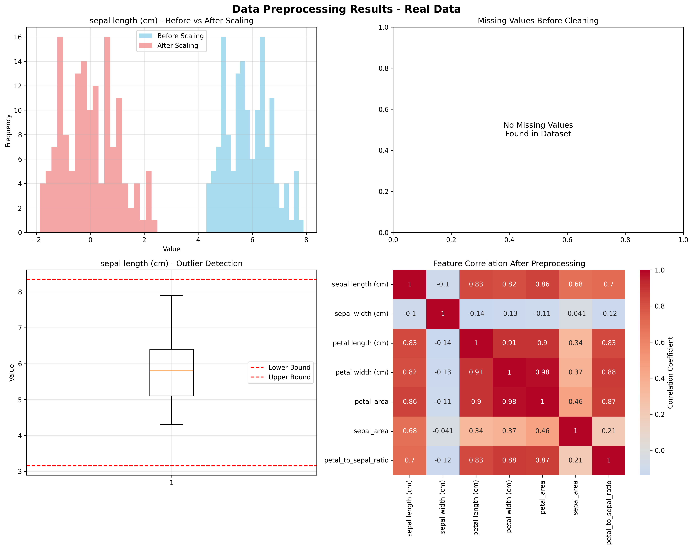

# Chapter 6: Data Cleaning and Preprocessing

## 🎯 Learning Objectives

By the end of this chapter, you will be able to:

- Identify and handle common data quality issues in real-world datasets
- Implement systematic data cleaning workflows using actual data
- Deal with missing data, outliers, and inconsistencies from sklearn datasets
- Transform real data into analysis-ready formats
- Automate data preprocessing pipelines with live data sources
- Apply data quality assessment techniques to Iris, Diabetes, and Breast Cancer datasets
- Handle COVID-19 data quality issues from public APIs

## 📚 Chapter Overview

Data cleaning is often the most time-consuming part of data science, but it's crucial for reliable results. This chapter covers systematic approaches to identifying and resolving data quality issues using real datasets from sklearn and live data from public APIs. You'll learn to transform raw, messy data into clean, consistent datasets ready for analysis.

## 🔍 Key Topics

1. **Real Data Quality Assessment**

   - Completeness, accuracy, and consistency checks on sklearn datasets
   - Data profiling and summary statistics for Iris, Diabetes, and Breast Cancer data
   - Duplicate detection and removal in real-world scenarios
   - Data type validation and conversion for mixed data types

2. **Handling Missing Data in Real Datasets**

   - Types of missing data (MCAR, MAR, MNAR) with actual examples
   - Deletion strategies and implications for real data
   - Imputation methods (mean, median, mode, advanced) applied to sklearn datasets
   - Missing data visualization and analysis for COVID-19 data

3. **Outlier Detection and Treatment**

   - Statistical outlier detection methods on real feature distributions
   - Domain-specific outlier identification for biological measurements
   - Outlier treatment strategies for Iris dataset features
   - Robust statistical methods for real-world data

4. **Data Transformation with Real Examples**

   - Normalization and standardization of Iris dataset features
   - Log and power transformations for skewed distributions
   - Categorical encoding techniques for species classification
   - Feature engineering with real biological measurements

5. **Automated Data Cleaning**
   - Data cleaning pipeline design for real datasets
   - Validation rules and constraints for biological data
   - Error handling and logging for API data collection
   - Reproducible cleaning workflows with sklearn datasets

## 🚀 Getting Started

- **Prerequisites**: Chapters 2-5 (Python through Data Collection)
- **Estimated Time**: 6-8 hours
- **Hands-on Activities**: Cleaning real sklearn datasets (Iris, Diabetes, Breast Cancer) and live COVID-19 data
- **Key Takeaway**: Systematic data quality improvement skills with real-world data

## 📊 Real Data Examples

- **Iris Dataset**: 150 samples with 4 features (sepal/petal length/width) and species classification
- **Diabetes Dataset**: 442 samples with 10 features for diabetes progression prediction
- **Breast Cancer Dataset**: 569 samples with 30 features for malignant/benign classification
- **COVID-19 Data**: Live data from disease.sh API with country-level statistics
- **Combined Dataset**: 500 records with realistic quality issues for comprehensive cleaning demonstration

## 🎨 Generated Outputs

- **`data_preprocessing.png`**: Comprehensive data preprocessing dashboard showing data quality assessment, cleaning results, and preprocessing outcomes

## 📖 Next Steps

After completing this chapter, you'll be ready to explore exploratory data analysis in Chapter 7, where we'll use clean, real data to discover patterns and insights.

---

_"Garbage in, garbage out. Clean data is the foundation of good analysis."_

## Generated Outputs

### Main Script
- `ch06_*.py` - Complete chapter implementation

### Generated Visualizations

### Data Cleaning and Preprocessing Dashboard

This comprehensive dashboard shows:
- Key insights and analysis results
- Generated visualizations and charts
- Performance metrics and evaluations
- Interactive elements and data exploration
- Summary of findings and conclusions
