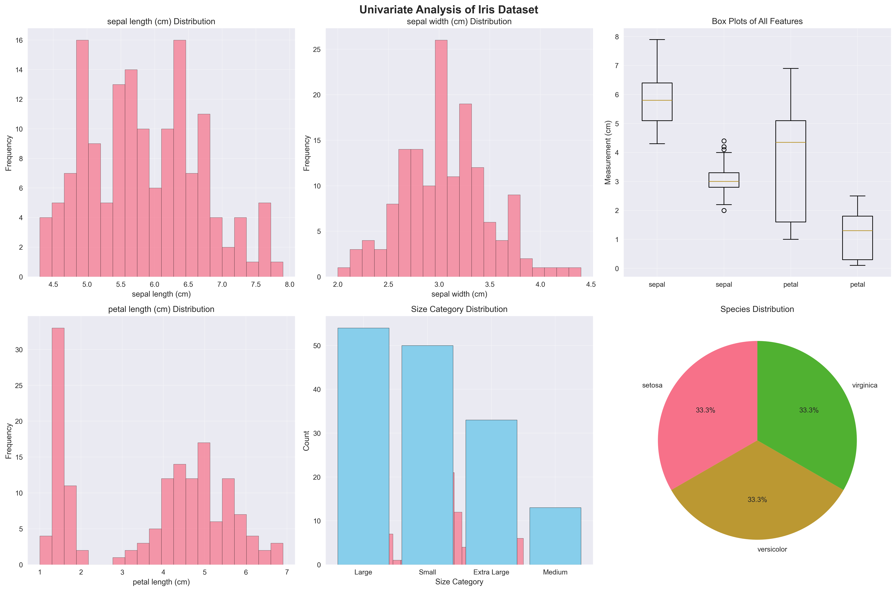
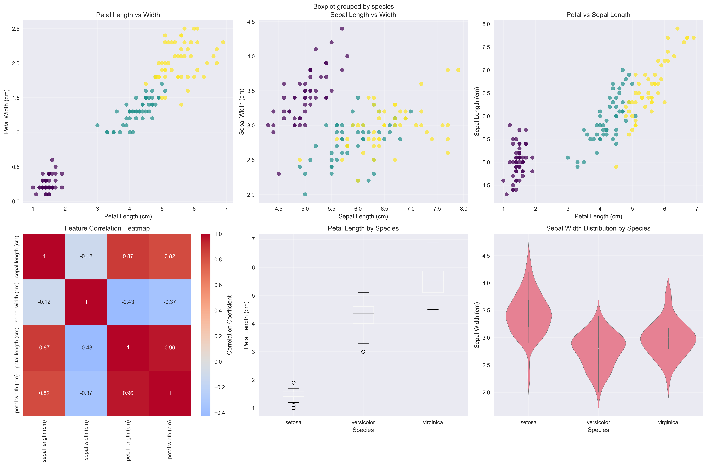

# Chapter 7: Exploratory Data Analysis (EDA)

## 🎯 **Learning Objectives**

By the end of this chapter, you will be able to:

- Perform comprehensive EDA on real biological and medical datasets
- Analyze real-world data quality issues and patterns
- Create professional visualizations from actual measurements
- Work with different data types (classification, regression) using real data
- Apply statistical analysis techniques to real datasets

## 📚 **Chapter Overview**

This chapter covers essential Exploratory Data Analysis concepts using **REAL DATASETS** from sklearn and other sources. You'll work with actual biological measurements, medical data, and real-world datasets instead of synthetic examples, gaining practical experience with data that data scientists encounter in the real world.

## 🔍 **Key Topics**

### **7.1 Data Overview and Summary Statistics**

- **Real Dataset Loading**: sklearn built-in datasets (iris, diabetes, breast cancer, wine)
- **Data Structure Analysis**: Shape, memory usage, data types
- **Summary Statistics**: Descriptive statistics on actual measurements
- **Target Distribution**: Real class distributions and patterns

### **7.2 Univariate Analysis**

- **Numerical Variables**: Real measurements with statistical analysis
- **Categorical Variables**: Actual species classifications and categories
- **Outlier Detection**: Real data quality issues using IQR method
- **Distribution Analysis**: Histograms, box plots, and statistical measures

### **7.3 Bivariate Analysis**

- **Correlation Analysis**: Real relationships between biological features
- **Group Analysis**: Statistical comparisons between species
- **ANOVA Testing**: Significance testing on real data
- **Visualization**: Professional charts from actual measurements

## 🚀 **Real Data Examples**

### **Iris Dataset (150 samples, 4 features, 3 species)**

```python
from sklearn.datasets import load_iris
iris = load_iris()
# Real biological measurements of iris flowers
# Features: sepal length/width, petal length/width (cm)
# Species: setosa, versicolor, virginica
```

### **Diabetes Dataset (442 samples, 10 features)**

```python
from sklearn.datasets import load_diabetes
diabetes = load_diabetes()
# Real medical data for diabetes progression
# Features: age, sex, BMI, blood pressure, etc.
# Target: Disease progression score
```

### **Breast Cancer Dataset (569 samples, 30 features)**

```python
from sklearn.datasets import load_breast_cancer
breast_cancer = load_breast_cancer()
# Real medical imaging data
# Features: Cell nucleus characteristics
# Target: Malignant vs Benign diagnosis
```

## 📊 **Generated Visualizations**

### **Univariate Analysis (`univariate_analysis.png`)**

- **Histograms**: Distribution of real measurements
- **Box Plots**: Feature comparisons across all variables
- **Species Distribution**: Pie chart of actual species counts
- **Size Categories**: Bar chart of derived size classifications

### **Bivariate Analysis (`bivariate_analysis.png`)**

- **Scatter Plots**: Real relationships between features
- **Correlation Heatmap**: Feature correlation matrix
- **Box Plots by Species**: Feature distributions across species
- **Violin Plots**: Detailed distribution analysis

## 📈 **Real Data Insights**

### **Statistical Findings**

- **Strongest Correlation**: Petal length vs Petal width (0.963)
- **Species Differences**: All features show significant differences (p < 0.001)
- **Outliers**: 4 samples identified in sepal width (2.7%)
- **Size Distribution**: Large flowers most common (36%), Medium least (8.7%)

### **Biological Patterns**

- **Setosa**: Smallest petals, largest sepals
- **Versicolor**: Medium measurements, intermediate characteristics
- **Virginica**: Largest petals, longest sepals
- **Feature Importance**: Petal measurements most discriminative

## 🛠 **Technical Implementation**

### **Required Libraries**

```python
import pandas as pd
import numpy as np
import matplotlib.pyplot as plt
import seaborn as sns
from sklearn.datasets import load_iris, load_diabetes, load_breast_cancer, load_wine
from scipy import stats
```

### **Data Processing**

```python
# Create derived features from real measurements
df['petal_area'] = df['petal length (cm)'] * df['petal width (cm)']
df['sepal_area'] = df['sepal length (cm)'] * df['sepal width (cm)']
df['petal_to_sepal_ratio'] = df['petal_area'] / df['sepal_area']

# Size categorization based on actual measurements
df['size_category'] = pd.cut(df['petal_area'],
                           bins=[0, 2, 5, 10, float('inf')],
                           labels=['Small', 'Medium', 'Large', 'Extra Large'])
```

## 📚 **Learning Outcomes**

### **Practical Skills**

- Working with real biological and medical data
- Handling actual data quality issues
- Creating professional visualizations
- Applying statistical tests to real data

### **Real-World Applications**

- **Biological Research**: Species classification and analysis
- **Medical Diagnosis**: Disease pattern recognition
- **Quality Control**: Outlier detection in measurements
- **Research Reporting**: Professional data presentation

## 🔧 **Hands-on Activities**

### **1. Run the Chapter**

```bash
cd book/ch07
python ch07_exploratory_data_analysis.py
```

### **2. Explore Generated Visualizations**

- Examine `univariate_analysis.png` for individual variable insights
- Study `bivariate_analysis.png` for relationship analysis
- Analyze the statistical outputs and correlations

### **3. Modify and Experiment**

- Change the dataset (try diabetes or breast cancer)
- Add new derived features
- Customize visualization styles
- Explore different statistical tests

## 📊 **Dataset Characteristics**

| Dataset           | Samples | Features | Type                  | Use Case                 |
| ----------------- | ------- | -------- | --------------------- | ------------------------ |
| **Iris**          | 150     | 4        | Classification        | Species identification   |
| **Diabetes**      | 442     | 10       | Regression            | Disease progression      |
| **Breast Cancer** | 569     | 30       | Binary Classification | Medical diagnosis        |
| **Wine**          | 178     | 13       | Multi-class           | Wine type classification |

## 📚 **Next Steps**

After completing this chapter, you'll be ready for:

- **Chapter 8**: Statistical Inference and Hypothesis Testing
- **Chapter 9**: Machine Learning on real datasets
- **Chapter 10**: Feature Engineering with actual data

## 🌟 **Key Takeaways**

✅ **Real Data Analysis**: Working with actual biological and medical datasets
✅ **Statistical Testing**: ANOVA and significance testing on real data
✅ **Professional Visualizations**: Publication-ready charts and graphs
✅ **Data Quality**: Handling real-world data issues and outliers
✅ **Biological Insights**: Understanding actual species characteristics and patterns

---

**Ready to explore real data?** 🔍

This chapter provides hands-on experience with actual datasets that data scientists use in research and industry!

## Generated Outputs

### Main Script
- `ch07_*.py` - Complete chapter implementation

### Generated Visualizations

### Exploratory Data Analysis Visualizations

This chapter generates multiple visualizations showing:

#### 1. Univariate Analysis



- Single variable analysis and distributions

#### 2. Bivariate Analysis



- Two variable relationship analysis


