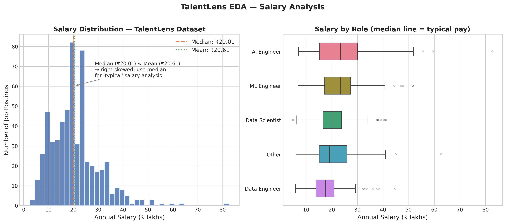
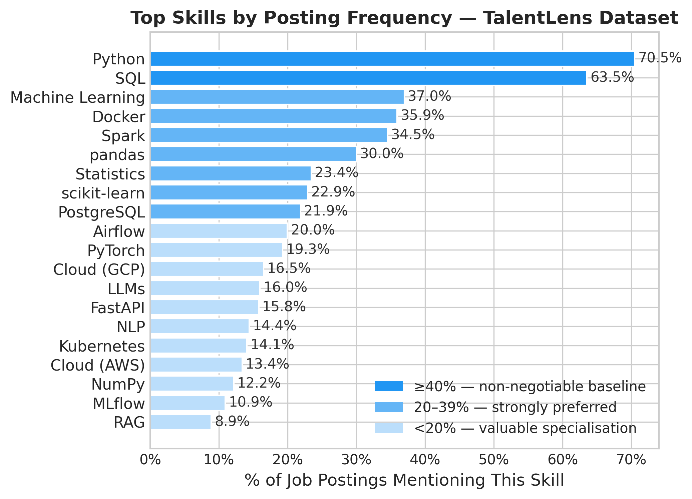
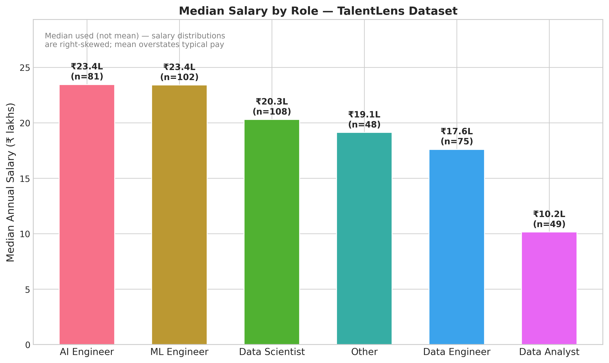

# Chapter 7: Exploratory Data Analysis

> **TalentLens milestone:** We have a clean dataset of job postings: the bundled 576-row corpus, or your own collected data. In this chapter we interrogate it: salary distributions, skill frequency, remote vs on-site trends, seniority signals. By the end we have a full EDA report and three publication-quality charts that become the centrepiece of our project README.

---

## The problem we're solving

Your engineering manager drops a Slack message on Monday morning: *"We pitched TalentLens to three companies last week. They all asked the same thing: what skills are actually growing? Is remote pay higher or lower than on-site? What's a realistic senior ML engineer salary in Bangalore versus globally? Can you have answers by Thursday?"*

You have the data: cleaned job postings from Chapters 5 and 6 (the bundled sample in the repo, or more rows if you've fetched or collected a larger corpus). But having data is not the same as having answers. The answers need to be in a slide deck, in plain English, defensible under questioning.

The bundled corpus is synthetic (Chapter 5 explains how it is generated), so treat its patterns as a rehearsal: the questions and methods are exactly the ones you will use on live data, and the answers show you what each pattern looks like when it appears.

Exploratory Data Analysis is how you get from one to the other.

EDA is not a formal technique. It's a mindset and a toolbox. You ask questions of the data and let the data answer back. Some answers are obvious. Some are surprising. Some tell you the data has a problem you didn't notice in cleaning. All of it informs what you build next, because you can't design a good ML model for a dataset you don't understand.

This chapter builds TalentLens's first insight layer: the analytics foundation that every future feature depends on.

---

## Why EDA, and why now

EDA sits between data cleaning (Chapter 6) and the chapters that consume its outputs (Chapter 8 for inference, Chapter 9 for the role classifier) for a reason.

In Chapter 6, we made the data correct. In Chapter 7, we make it understandable. In Chapter 8, we test what we noticed. In Chapter 9, we make it predictive. You can't skip the middle step. A model trained on data you don't understand will produce outputs you can't interpret, and you'll have no idea if it's working or failing.

**What EDA actually is:** Systematic questioning of your data through statistics and visualisation. You ask: what does the distribution of this variable look like? Are there outliers? Do these two variables move together? Is there anything in the data that would break a model or mislead an analysis?

**What EDA is not:** Fishing for whatever looks interesting. Good EDA is hypothesis-driven. You come in with questions (from the business problem, from domain knowledge, from what you saw in data cleaning) and you answer them methodically.

**Alternatives and why we're not using them here:**

- *Just running the model*: Some teams skip EDA and go straight to modelling. This is how you end up with a model that has a data leak, or a model that "works" because it memorised a quirk in the training set. EDA is risk management.
- *Automated EDA tools (pandas-profiling, sweetviz)*: these are excellent for a quick overview. We'll mention them. But they can't replace the process of asking and answering specific business questions. They give you reports; EDA gives you insight.

**What EDA unlocks downstream:** The "is remote pay really higher?" question we surface here becomes a hypothesis test in Chapter 8. Chapter 8 then controls for seniority using the job title, not the salary bands, which are built from the very pay it is testing. The skill frequency analysis tells Chapter 9 which features carry signal. The outlier handling we decide on here becomes the preprocessing pipeline. EDA is not a detour; it's the foundation.

---

## The methods

### Descriptive statistics

**What it does in plain English:** Summarises a column with a few numbers: the typical value, how spread out the values are, the extremes.

**When to use it:** Always. First thing you do on any numeric column.

**Key outputs:**
- `mean`: the average. Sensitive to outliers: one ₹2 crore CXO salary shifts this meaningfully.
- `median (50%)`: the middle value. Not sensitive to outliers. For salary data, this is usually the more honest number.
- `std` (standard deviation): how spread out the values are. A std of ₹12L on a median of ₹14L means salary varies enormously. A std of ₹2L on the same median means roles are tightly clustered.
- `25%` and `75%` (IQR): the range covering the middle 50% of values. This is your typical range, stripped of the extremes.

**What the output tells you:** The gap between mean and median tells you about skew. If mean > median by more than 15–20%, the distribution is right-skewed: a few high values are pulling the average up. For salary: this always happens. Report medians.

**Red flags:** If std > mean, your data might have negative values or extreme outliers worth investigating. If mean and median are identical, the distribution is suspiciously symmetric, sometimes a sign of fake or generated data.

---

### Histogram

**What it does in plain English:** Shows you the shape of a numeric variable: where most values cluster, how spread out they are, whether there are multiple peaks.

**When to use it:** When you want to understand a single numeric column in detail.

**Key parameters:**
- `bins=30`: the number of bars. Too few (5) and you miss structure. Too many (200) and noise looks like signal. 30 is a good default; adjust after you see it.
- `kde=True`: adds a smooth curve over the bars, showing the overall shape without the bar-by-bar noise. Useful for spotting bimodal distributions (two humps often mean two distinct populations in your data).
- `edgecolor='white'`: thin white borders on bars make them easier to read.

**What the output tells you:** Shape. Is this a bell curve (symmetric, typical values cluster in the middle)? A right skew (long tail to the right: most values are low, a few are very high)? Bimodal (two peaks, two distinct groups)? Salary distributions are almost always right-skewed. If yours isn't, something is wrong with your data.

**Red flags:** Hard cutoffs at round numbers (every salary ending in 0 or 00,000) suggest data was entered manually with rounding. Multiple peaks at exactly ₹10L, ₹15L, ₹20L suggest bucket-based data, not continuous measurement.

---

### Box plot

**What it does in plain English:** Shows the same distribution as a histogram but in a more compact form, and makes comparison across groups easy.

**When to use it:** When comparing a numeric variable across categories. "What's the salary distribution for Data Engineers vs ML Engineers vs AI Engineers?"

**Reading the box:**
- The box covers the middle 50% of values (IQR: 25th to 75th percentile)
- The line inside the box is the median
- The whiskers extend to the last value within 1.5× IQR from the box edge
- Dots beyond the whiskers are outliers: data points that are unusually far from the rest

**What the output tells you:** The median (centre line) shows the typical value per group. The box height shows variability: a tall box means salaries vary a lot within that role. Overlapping boxes mean the groups aren't clearly different. Non-overlapping boxes mean the difference is likely meaningful.

**Red flags:** If almost all your data is outlier dots (most points fall outside the whiskers), your distribution is extremely skewed and the box plot isn't the right tool; switch to a log-scale histogram.

---

### Correlation matrix / heatmap

**What it does in plain English:** Shows how strongly each pair of numeric columns relates to each other. Values range from -1 (perfectly inverse) to +1 (perfectly aligned) to 0 (no relationship).

**When to use it:** When you have multiple numeric columns and want to understand which ones move together and, importantly, which are so correlated that including both in a model adds no information.

**Key parameters:**
- `annot=True`: prints the correlation coefficient inside each cell. Essential for reading the chart.
- `fmt='.2f'`: rounds to 2 decimal places: 0.87, not 0.8726534.
- `cmap='coolwarm'`: blue for negative, red for positive. Diverging colourmap makes pattern recognition easy.
- `vmin=-1, vmax=1`: fixes the colour scale so 0 is always white. Without this, the scale adjusts to your data range and makes weak correlations look strong.

**What the output tells you:** Strong positive correlation (>0.7) between two features means they carry similar information: keep one, drop the other, or create a ratio. Strong negative correlation can be equally informative. Low correlation with the target variable means a feature probably won't help your model much.

**Red flags:** Perfect correlation (1.0) between two features is almost always a data leak: one column is derived from the other.

---

### Bar chart (categorical frequency)

**What it does in plain English:** Shows how often each category appears. For TalentLens: which skills appear most in job postings, which companies are hiring most, which cities.

**When to use it:** Single categorical variable: counts or proportions.

**Key decision (sorted vs unsorted):** Always sort bars by frequency (descending) unless there's a natural order (months, seniority levels). An unsorted bar chart requires the reader to scan and rank in their head; a sorted one shows the ranking immediately.

**What the output tells you:** Frequency distribution of categories. For skills: Python at 70% and SQL at 64% of postings are baseline requirements; PyTorch at 19% is a specialisation. Anything below 10% is a nice-to-have, not a must-have. This directly drives our feature importance assumptions going into Chapter 9.

**Red flags:** One category that appears in 90%+ of rows is probably not a useful feature, because it doesn't discriminate between outcomes. A "long tail" with hundreds of categories each appearing once is a sign your data needs binning before modelling.

---

## The code

The full implementation is in `ch07_exploratory_data_analysis.py`. Run it from the project root:

```bash
make eda
# or directly:
python book/ch07/ch07_exploratory_data_analysis.py
```

It produces:
1. A printed interpretation report (stdout)
2. `reports/figures/ch07_salary_distribution.png`
3. `reports/figures/ch07_skill_frequency.png`
4. `reports/figures/ch07_role_comparison.png`
5. `reports/eda_summary.md`: written findings ready to paste into a slide deck

**Three key code decisions worth explaining:**

*Why `pd.cut()` over `pd.qcut()` for salary bands:* `pd.qcut()` creates equal-sized bins: each band has the same number of data points. `pd.cut()` creates fixed-range bins. We use fixed ranges (₹0–8L, ₹8–15L, ₹15–30L, ₹30L+) because these are meaningful to a hiring manager or job seeker. Equal-size bins would shift with the dataset and mean nothing to a business stakeholder.

*Why we compute salary statistics on disclosed salaries only:* Chapter 6 filled hidden salaries with group medians. Those values are guesses, and they pile up on a few numbers, which shrinks the spread and flatters the median. The script sets them aside for the distribution and role comparisons and says how many it set aside.

*Why we log-transform salary before correlation analysis:* Salary is right-skewed. Pearson correlation is dominated by extreme values. We log-transform before computing correlations, then present results on the original scale with a footnote.

*Why we use `.value_counts(normalize=True)` over `.value_counts()`:* Percentages are almost always more useful than raw counts when presenting to stakeholders. "Python appears in 68% of job postings" is more meaningful than "Python appears in 34,000 job postings" unless the reader also knows how many total postings there are.

---

## Interpreting the output

Here's what the script prints on the bundled corpus, and what it means.

**Salary distribution output:**
```
SALARY DISTRIBUTION
============================================================
  Count:     463 postings with a disclosed salary (19.6% hid pay; Chapter 6 imputed those, excluded here)
  Mean:      ₹20.8L
  Median:    ₹19.3L
  Std:       ₹10.6L
  P25–P75:   ₹13.1L – ₹26.8L
  Skew:      1.17

  INTERPRETATION:
    Mean/Median ratio: 1.08x
    → Long right tail (skew > 1) but the bulk is compact, so mean and median are close.
      Report the median and name the tail separately.
```

The first line matters most: 113 of 576 postings hid their salary, so every number below describes the 463 that disclosed. If hiding pay is not random (Chapter 8 will check), these numbers describe the employers who publish salaries, not the whole market.

The mean (₹20.8L) sits only 8% above the median (₹19.3L), yet skew is 1.17. Both are true at once: most offers cluster between ₹13L and ₹27L, and a thin tail of lead-level roles reaches past ₹70L. A thin tail raises the skew statistic without moving the mean much. **If you're answering "what does a typical posting in this corpus pay," the answer is ₹19.3L, and the honest sentence adds "with a long tail of senior roles above ₹40L."**

The standard deviation (₹10.6L) is more than half the median, a wide distribution. Salary here is not one market but several: junior to lead, analyst to AI engineer.

The 25th–75th percentile range (₹13.1L–₹26.8L) covers the middle half of disclosed postings. That is the band to quote for "most roles".

**Salary distribution chart:** `ch07_salary_distribution.png` shows the histogram with a long right tail, and box plots by role; the Data Analyst box sits well below the rest.



**Skill frequency output (top ten of twenty):**
```
TOP 20 SKILLS BY POSTING FREQUENCY
============================================================
  Python                          70.5%  ███████████████████████████████████
  SQL                             63.5%  ███████████████████████████████
  Machine Learning                37.0%  ██████████████████
  Docker                          35.9%  █████████████████
  Spark                           34.5%  █████████████████
  pandas                          30.0%  ███████████████
  Statistics                      23.4%  ███████████
  scikit-learn                    22.9%  ███████████
  PostgreSQL                      21.9%  ██████████
  Airflow                         20.0%  █████████
  ...
  LLMs                            16.0%  ███████
  RAG                              8.9%  ████
```

Three things stand out. (1) Python and SQL are baseline: they appear in most postings; without them no other skill matters yet. (2) Spark at 35% looks surprisingly high until you remember that Chapter 6 also scans descriptions, and many descriptions say "use Spark for large datasets" in passing. Frequency counts mentions, not requirements, a distinction to carry into every skill chart. (3) LLMs at 16% and RAG at 9% are specialisations here: valuable, but not what most postings ask for.

**Skill frequency chart:** `ch07_skill_frequency.png` uses sorted horizontal bars; the gap between the top two skills and the long tail tells you which tokens are common background and which discriminate between roles in Chapter 9.



**Role comparison output:**
```
MEDIAN SALARY BY ROLE
============================================================
  AI Engineer               ₹ 23.4L  (n=81)
  ML Engineer               ₹ 23.4L  (n=102)
  Data Scientist            ₹ 20.3L  (n=108)
  Other                     ₹ 19.1L  (n=48)
  Data Engineer             ₹ 17.6L  (n=75)
  Data Analyst              ₹ 10.2L  (n=49)
```

AI Engineer and ML Engineer tie at the median. The titles differ; the pay, in this corpus, does not. That is Chapter 1's point that the roles are converging. Data Analyst is the outlier at ₹10.2L, less than half the engineering roles: a different profile (less coding, more BI tools) and effectively a separate market. Note the sample sizes: 49 disclosed Data Analyst salaries is enough for a median, not for fine-grained claims.

**Role comparison chart:** `ch07_role_comparison.png` shows median salary by role with sample sizes annotated; thin bars on a role mean Chapter 8 inference may lack power for that slice.



**Remote vs on-site (from `eda_summary.md`):** remote median ₹22.0L (n=184) vs on-site ₹16.9L (n=279). A ₹5L gap looks like a headline. Hold it. That is exactly the kind of pattern Chapter 8 exists to test.

---

## Common mistakes I've seen (and made)

**Mistake: Reporting the mean salary without checking skew first**

What happens: You tell your manager the average data salary is ₹22L. A team member asks where that came from. You show the histogram and it's clearly right-skewed with a long tail of ₹80L+ roles. The number is technically correct but misleading: it's been pulled up by a small number of outliers.

How to catch it: Always check skew alongside mean. If `df['salary'].skew() > 1.0`, report median instead of or alongside mean.

Fix: "Median salary is ₹19.3L; the mean is higher because a small number of senior roles pay far above the rest."

---

**Mistake: Treating missing salary data as random**

What happens: a fifth of postings have no salary listed. You drop these rows and continue. But when you look at which companies don't list salaries, it's disproportionately service companies (TCS, Infosys, Wipro) and older enterprises. You've inadvertently excluded a segment of the market.

How to catch it: `df[df['salary'].isna()]['company_type'].value_counts(normalize=True)`, then compare the distribution of company types in the null rows vs the full dataset.

Fix: Either impute by company type and role (safer), or add a `salary_disclosed` boolean feature and let the model learn from it. The fact that a company hides its salary is itself a signal.

---

**Mistake: Treating skill extraction as a single category**

What happens: You count "Python" appearances and "python" appearances separately. You find "ML" and "Machine Learning" and "machine-learning" as three different skills. Your skill frequency table is a mess.

How to catch it: Check `df['skills_raw'].value_counts().tail(50)` and look for obvious duplicates.

Fix: Build a skill normalisation map before doing frequency analysis. Chapter 6 did this with the `SKILL_ALIASES` dictionary, so `skills_normalised` already uses canonical names, but check the tail of the value counts anyway.

---

**Mistake: Using pie charts for skill frequency**

What happens: You make a pie chart of top 10 skills. It has 10 slices, most of which are hard to distinguish visually, and 3 of them have nearly identical percentages that look the same on the pie.

How to catch it: If you find yourself making a pie chart with more than 3 categories, stop.

Fix: Horizontal bar chart, sorted by frequency, with percentage labels. Every time. Pie charts are only appropriate for "this vs everything else" (2 categories) or "composition of a whole" (3–4 categories with very different sizes).

---

**Mistake: Running correlation on raw salary without log-transforming**

What happens: The correlation between years of experience and salary comes back weak, and you conclude experience isn't a strong predictor. But salary is right-skewed, and a few extreme values dominate a Pearson correlation. On log(salary), the same relationship often shows up much more clearly.

How to catch it: After computing correlations, check if any of your variables have skew > 1. If yes, log-transform them before computing.

Fix: `df['log_salary'] = np.log1p(df['salary'])` then compute correlations on the transformed column. Report the correlation on log scale with a footnote explaining the transformation.

---

## Interview questions

**Q1: Walk me through how you'd do EDA on a dataset you've never seen before.**

Template answer: "My EDA has three phases. First, structural understanding: `.info()`, `.describe()`, null check by column, cardinality of categoricals. This takes 10 minutes and surfaces 80% of the data quality issues. Second, univariate analysis: histogram or box plot for every numeric, bar chart for every categorical with under 20 unique values, frequency table for high-cardinality ones. I'm looking for: unexpected distributions, outliers, class imbalance, values that shouldn't be possible (negative age, salary of 0). Third, multivariate: correlation matrix, scatter plots for any feature pair I expect to be related, cross-tabs for categoricals against the target. By the end I can write 5 bullet points: what the data looks like, what's missing, what's suspicious, what's promising, what I'd engineer next."

**Q2: What's the difference between correlation and causation, and why does it matter during EDA?**

Template answer: "Correlation is when two variables move together. Causation is when one causes the other. EDA can only find correlation. The problem is that spurious correlations are common in real data. Two things can move together because they're both driven by a third factor (confounding). Classic example: in job data, Python skill and higher salary are correlated. But that doesn't mean learning Python causes salary to go up; it might be that more complex roles require Python and also pay more. If I built a model that recommended Python to everyone trying to increase salary, I'd be giving bad advice. During EDA I flag these patterns and try to understand the mechanism before drawing conclusions. I also specifically look for data leakage: a feature that's essentially derived from the target will show perfect or near-perfect correlation and will wreck the model in production."

**Q3: Your EDA shows 35% of a key column has missing values. What's your process?**

Template answer: "First, I test whether the missing values are MCAR, MAR, or MNAR (missing completely at random, missing at random conditional on other variables, or missing not at random). I do this by looking at whether missingness correlates with other columns: `df[df['salary'].isna()].describe()` vs `df[df['salary'].notna()].describe()`. If the two groups look identical, it's MCAR and simple imputation is defensible. If one group has systematically different values on other columns, it's MAR and I need to account for that in my imputation strategy. If the missingness itself is informative (companies that hide salary pay below market), I create a `feature_is_null` indicator before imputing, so the model can learn from the absence. At 35%, I'd never just drop the rows; that's too much data loss. I'd impute and add the indicator column."

**Q4: How do you decide which visualisation to use?**

Template answer: "I run through three questions. What type of data: numeric, categorical, or time? What question am I answering: distribution of one variable, comparison across groups, relationship between two variables, or change over time? Who's the audience: technical or non-technical? Then it's mostly mechanical. One numeric variable: histogram. One categorical: horizontal bar chart sorted by frequency. One numeric across categories: box plot grouped by category. Two numerics: scatter plot. Change over time: line chart. Composition: stacked bar (not pie, unless 2–3 categories). For non-technical audiences, I annotate directly on the chart rather than using legends. Legends require the reader to look back and forth, which slows understanding and introduces errors."

**Q5: What's the most important thing EDA tells you before you build a model?**

Template answer: "Whether the problem is actually solvable with the data you have. Before I touch a model, EDA tells me: is there signal between my features and the target? Is the data quality good enough, or are there so many nulls or inconsistencies that the model will learn noise? Is there class imbalance that makes accuracy a meaningless metric? Are there any data leaks, features that wouldn't be available at prediction time? Are any features so correlated that they're redundant? I've seen teams spend three months building a model that EDA would have shown in an afternoon was fundamentally flawed: either the signal wasn't there, or the data had a leak that made training accuracy look great but production results terrible. EDA is the single highest-ROI hour in any ML project."

---

## What's next

In Chapter 8, we take the patterns we noticed here and test them formally. Is remote pay really higher than on-site, or are remote roles simply more senior? Is there any AI Engineer premium over ML Engineer at all? Then in Chapter 9 we move from understanding to prediction: a classifier that reads a posting's description and skills and predicts its role. The skill frequency analysis tells us which tokens are background and which discriminate. EDA wasn't a detour. It was the specification for everything that follows.

---

## TalentLens checkpoint

At the end of this chapter, your project should have (paths relative to `book/ch07/`):

- [ ] `reports/figures/ch07_salary_distribution.png`: salary histogram + box plots by role
- [ ] `reports/figures/ch07_skill_frequency.png`: top 20 skills bar chart
- [ ] `reports/figures/ch07_role_comparison.png`: median salary by role, with sample sizes
- [ ] `reports/eda_summary.md`: written summary of key findings

Reproduce everything from the repository root:

```bash
python book/ch07/ch07_exploratory_data_analysis.py
```

The chapter code reads from `data/clean/jobs_clean.csv` at the repository root, the canonical output of Chapter 6. If that file is not present, the script falls back to a chapter-local path (`book/ch07/data/clean/jobs_clean.csv`) and then to generated demo data, so charts and tests run regardless of which chapters you have completed.

**Concepts you own:**

- Skew-aware reporting: when mean and median diverge, the median is the stakeholder number
- Hypothesis-driven EDA: business questions first, charts second, not the reverse
- What EDA cannot prove: patterns here motivate Chapter 8 tests; correlation in plots is not causation
