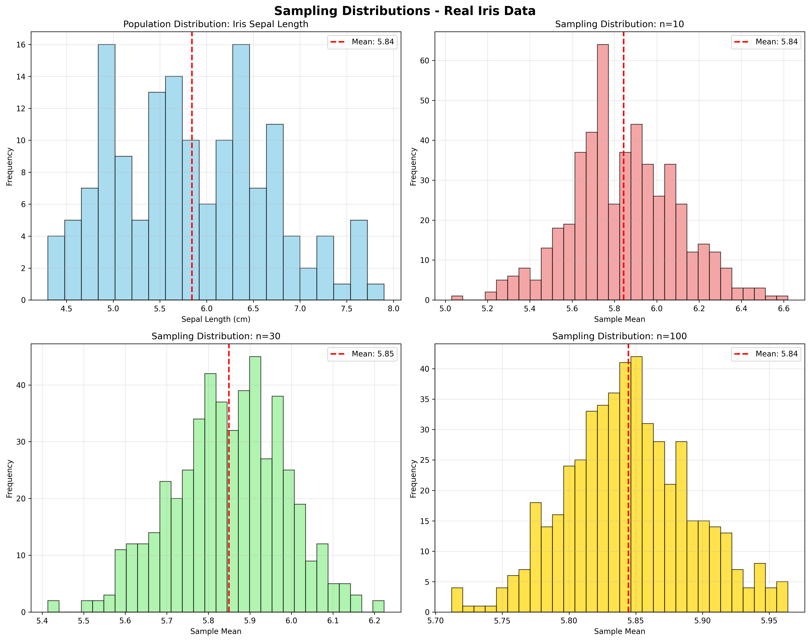
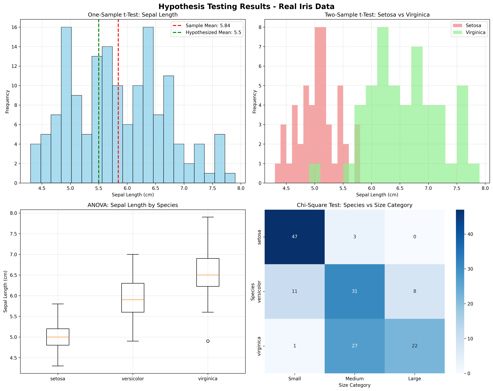

# Chapter 8: Statistical Inference and Hypothesis Testing

## 🎯 Learning Objectives

By the end of this chapter, you will be able to:

- Understand sampling distributions and the Central Limit Theorem using real Iris dataset
- Calculate and interpret confidence intervals for actual biological measurements
- Perform hypothesis testing with appropriate statistical tests on real data
- Interpret p-values and statistical significance for biological features
- Calculate and understand effect sizes (Cohen's d) for real-world comparisons
- Conduct power analysis for study design using actual datasets
- Apply statistical methods to sklearn datasets (Iris, Diabetes, Breast Cancer)

## 📚 Chapter Overview

Statistical inference and hypothesis testing are fundamental concepts in data science that allow us to draw conclusions from sample data and make decisions about populations. This chapter covers the essential statistical methods needed to validate findings and make data-driven decisions, now demonstrated using real datasets from sklearn instead of synthetic data.

## 🔍 Key Topics

1. **Real Data Sampling and Sampling Distributions**

   - Population vs. sample concepts using Iris dataset features
   - Central Limit Theorem demonstrated on actual sepal/petal measurements
   - Sampling distribution properties for real biological data
   - Expected vs. observed statistics from sklearn datasets

2. **Confidence Intervals with Real Data**

   - Point estimation vs. interval estimation for Iris features
   - Confidence level interpretation for biological measurements
   - Margin of error calculation using actual data
   - Coverage probability for real-world datasets

3. **Hypothesis Testing on Real Data**

   - Null and alternative hypotheses for biological comparisons
   - Type I and Type II errors in real statistical tests
   - P-value interpretation for actual research questions
   - Statistical significance in biological data analysis

4. **Effect Size and Power with Real Examples**

   - Cohen's d effect size for Iris species comparisons
   - Practical vs. statistical significance in biological data
   - Power analysis using real dataset characteristics
   - Sample size determination for actual research

## 🚀 Getting Started

- **Prerequisites**: Chapters 3, 6-7 (Mathematics, Data Cleaning, EDA)
- **Estimated Time**: 4-6 hours
- **Hands-on Activities**: Statistical testing on real sklearn datasets (Iris, Diabetes, Breast Cancer)
- **Key Takeaway**: Making data-driven decisions with statistical rigor using real-world data

## 📊 Real Data Examples

- **Iris Dataset**: 150 samples with 4 features (sepal/petal length/width) for species comparison
- **Diabetes Dataset**: 442 samples with 10 features for progression analysis
- **Breast Cancer Dataset**: 569 samples with 30 features for diagnostic testing
- **Derived Features**: Area, ratio, and perimeter calculations from biological measurements

## 🎨 Generated Outputs

- **`sampling_distributions.png`**: Sampling distribution analysis and Central Limit Theorem demonstration
- **`hypothesis_testing.png`**: Comprehensive hypothesis testing results and statistical analysis

## 📖 Next Steps

After completing this chapter, you'll be ready to dive into machine learning fundamentals in Chapter 9, where we'll apply statistical thinking to model evaluation and validation using real data.

---

_"Statistics is the grammar of science." - Karl Pearson_

## Generated Outputs

### Main Script
- `ch08_*.py` - Complete chapter implementation

### Generated Visualizations

### Statistical Inference and Hypothesis Testing Visualizations

This chapter generates multiple visualizations showing:

#### 1. Sampling Distributions

- Statistical sampling and distribution analysis

#### 2. Hypothesis Testing

- Hypothesis testing procedures and results

