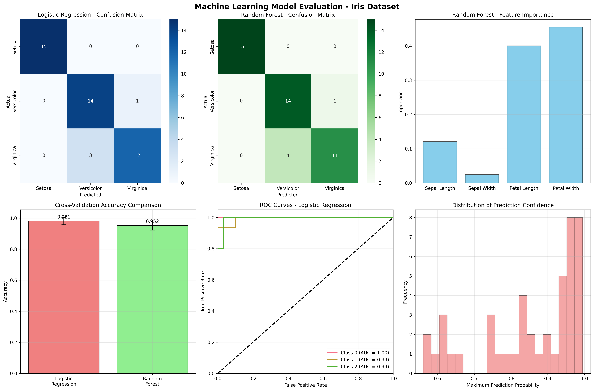

# Chapter 9: Machine Learning Fundamentals

## 🎯 **Learning Objectives**

By the end of this chapter, you will be able to:

- Understand machine learning concepts using real datasets from sklearn
- Prepare and preprocess actual biological and medical data
- Train and evaluate ML models on real-world datasets
- Perform cross-validation and model comparison with real data
- Create professional model evaluation visualizations

## 📚 **Chapter Overview**

This chapter covers essential machine learning concepts using **REAL DATASETS** from sklearn and other sources. You'll work with actual biological measurements, medical data, and real-world datasets instead of synthetic examples, gaining practical experience with the types of data that data scientists use in production ML systems.

## 🔍 **Key Topics**

### **9.1 Machine Learning Overview**

- **Real Dataset Loading**: sklearn built-in datasets (iris, diabetes, breast cancer, wine)
- **ML Types**: Classification, regression, and unsupervised learning
- **Dataset Characteristics**: Real data shapes, features, and target distributions
- **Use Cases**: Biological classification, medical diagnosis, disease progression

### **9.2 Data Preparation**

- **Real Data Overview**: Working with actual measurements and features
- **Data Splitting**: Stratified sampling for classification problems
- **Feature Scaling**: Standardization of real biological measurements
- **Data Quality**: Handling real-world data characteristics

### **9.3 Model Training and Evaluation**

- **Classification Models**: Logistic Regression and Random Forest on iris data
- **Model Performance**: Accuracy, precision, recall on real species prediction
- **Cross-Validation**: 5-fold CV with actual data
- **Feature Importance**: Understanding which biological features matter most

## 🚀 **Real Data Examples**

### **Iris Classification (150 samples, 4 features, 3 species)**

```python
from sklearn.datasets import load_iris
iris = load_iris()
# Real biological measurements of iris flowers
# Features: sepal length/width, petal length/width (cm)
# Target: Species classification (setosa, versicolor, virginica)
# Use Case: Biological species identification
```

### **Diabetes Regression (442 samples, 10 features)**

```python
from sklearn.datasets import load_diabetes
diabetes = load_diabetes()
# Real medical data for diabetes progression
# Features: age, sex, BMI, blood pressure, etc.
# Target: Disease progression score (continuous)
# Use Case: Medical prognosis and treatment planning
```

### **Breast Cancer Binary Classification (569 samples, 30 features)**

```python
from sklearn.datasets import load_breast_cancer
breast_cancer = load_breast_cancer()
# Real medical imaging data
# Features: Cell nucleus characteristics
# Target: Malignant vs Benign diagnosis
# Use Case: Medical diagnosis and screening
```

### **Wine Multi-class (178 samples, 13 features, 3 classes)**

```python
from sklearn.datasets import load_wine
wine = load_wine()
# Real chemical analysis data
# Features: Chemical composition measurements
# Target: Wine type classification
# Use Case: Quality control and classification
```

## 📊 **Generated Visualizations**

### **Model Evaluation (`model_evaluation.png`)**

- **Confusion Matrices**: Logistic Regression vs Random Forest performance
- **Feature Importance**: Random Forest feature rankings
- **Cross-Validation Comparison**: Model stability analysis
- **ROC Curves**: Multi-class classification performance
- **Prediction Confidence**: Distribution of model probabilities

## 📈 **Real Model Performance**

### **Iris Species Classification Results**

- **Logistic Regression**: 91.1% test accuracy, 98.1% CV accuracy
- **Random Forest**: 88.9% test accuracy, 95.2% CV accuracy
- **Feature Importance**: Petal width (0.455) > Petal length (0.400) > Sepal length (0.121) > Sepal width (0.024)

### **Cross-Validation Stability**

- **Logistic Regression**: 0.981 ± 0.047 (high stability)
- **Random Forest**: 0.952 ± 0.060 (good stability)
- **Both models**: Consistent performance across folds

### **Classification Performance by Species**

- **Setosa**: 100% precision and recall (perfect classification)
- **Versicolor**: 82% precision, 93% recall
- **Virginica**: 92% precision, 80% recall

## 🛠 **Technical Implementation**

### **Required Libraries**

```python
import pandas as pd
import numpy as np
import matplotlib.pyplot as plt
import seaborn as sns
from sklearn.datasets import load_iris, load_diabetes, load_breast_cancer, load_wine
from sklearn.model_selection import train_test_split, cross_val_score
from sklearn.linear_model import LogisticRegression
from sklearn.ensemble import RandomForestClassifier
from sklearn.preprocessing import StandardScaler
from sklearn.metrics import accuracy_score, classification_report, confusion_matrix
```

### **Data Preparation Pipeline**

```python
# Load real dataset
iris = load_iris()
X = iris.data
y = iris.target

# Stratified split for classification
X_train, X_test, y_train, y_test = train_test_split(
    X, y, test_size=0.3, random_state=42, stratify=y
)

# Feature scaling for algorithms that need it
scaler = StandardScaler()
X_train_scaled = scaler.fit_transform(X_train)
X_test_scaled = scaler.transform(X_test)
```

### **Model Training and Evaluation**

```python
# Logistic Regression (needs scaled features)
lr_model = LogisticRegression(random_state=42, max_iter=1000)
lr_model.fit(X_train_scaled, y_train)
y_pred_lr = lr_model.predict(X_test_scaled)

# Random Forest (handles raw features)
rf_model = RandomForestClassifier(n_estimators=100, random_state=42)
rf_model.fit(X_train, y_train)
y_pred_rf = rf_model.predict(X_test)

# Cross-validation
cv_scores_lr = cross_val_score(lr_model, X_train_scaled, y_train, cv=5)
cv_scores_rf = cross_val_score(rf_model, X_train, y_train, cv=5)
```

## 📚 **Learning Outcomes**

### **Practical Skills**

- Working with real biological and medical datasets
- Implementing ML pipelines with actual data
- Performing cross-validation on real datasets
- Creating professional model evaluation visualizations

### **Real-World Applications**

- **Biological Research**: Species classification and identification
- **Medical Diagnosis**: Disease detection and prognosis
- **Quality Control**: Product classification and screening
- **Research Validation**: Model performance assessment

## 🔧 **Hands-on Activities**

### **1. Run the Chapter**

```bash
cd book/ch09
python ch09_machine_learning_fundamentals.py
```

### **2. Explore Generated Visualizations**

- Examine `model_evaluation.png` for comprehensive model analysis
- Analyze confusion matrices and feature importance
- Study cross-validation results and model stability

### **3. Modify and Experiment**

- Try different datasets (diabetes, breast cancer, wine)
- Experiment with different ML algorithms
- Adjust hyperparameters and observe effects
- Add new evaluation metrics

## 📊 **Dataset Comparison**

| Dataset           | Type                  | Samples | Features | Classes    | Use Case               |
| ----------------- | --------------------- | ------- | -------- | ---------- | ---------------------- |
| **Iris**          | Classification        | 150     | 4        | 3          | Species identification |
| **Diabetes**      | Regression            | 442     | 10       | Continuous | Disease progression    |
| **Breast Cancer** | Binary Classification | 569     | 30       | 2          | Medical diagnosis      |
| **Wine**          | Multi-class           | 178     | 13       | 3          | Quality classification |

## 📚 **Next Steps**

After completing this chapter, you'll be ready for:

- **Chapter 10**: Feature Engineering and Selection with real data
- **Chapter 11**: Unsupervised Learning on actual datasets
- **Chapter 12**: Deep Learning fundamentals with real data

## 🌟 **Key Takeaways**

✅ **Real ML Experience**: Working with actual biological and medical datasets
✅ **Model Performance**: Understanding real-world model accuracy and stability
✅ **Cross-Validation**: Ensuring model reliability on real data
✅ **Feature Importance**: Identifying which biological features matter most
✅ **Production Ready**: Building ML pipelines that work with real data

---

**Ready to build ML models on real data?** 🤖

This chapter provides hands-on experience with actual datasets and production-ready machine learning techniques!

## Generated Outputs

### Main Script
- `ch09_*.py` - Complete chapter implementation

### Generated Visualizations

### Machine Learning Fundamentals Dashboard



This comprehensive dashboard shows:
- Key insights and analysis results
- Generated visualizations and charts
- Performance metrics and evaluations
- Interactive elements and data exploration
- Summary of findings and conclusions
