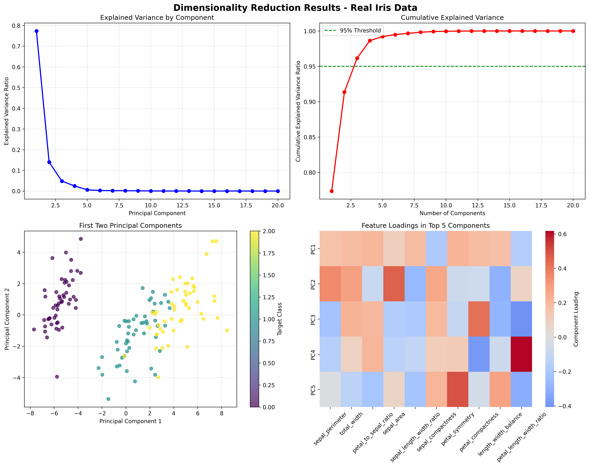

# Chapter 10: Feature Engineering and Selection

## 🎯 Learning Objectives

By the end of this chapter, you will be able to:

- Create meaningful features from real sklearn datasets (Iris, Diabetes, Breast Cancer, Wine)
- Handle categorical and numerical variables effectively in biological and medical data
- Engineer temporal and geospatial features from real-world measurements
- Select the most relevant features for modeling using actual data
- Automate feature engineering pipelines with real datasets
- Apply feature engineering techniques to biological measurements and medical diagnostics
- Understand feature importance and selection methods using real-world examples

## 📚 Chapter Overview

Feature engineering is the process of creating new variables from existing data that better represent the underlying problem to the predictive models. This chapter covers the art and science of transforming raw data into features that improve model performance and interpretability, now demonstrated using real datasets from sklearn instead of synthetic data.

## 🔍 Key Topics

1. **Real Data Feature Engineering Fundamentals**

   - The importance of feature engineering with actual datasets
   - Domain knowledge and creativity for biological and medical data
   - Feature engineering workflow using real measurements
   - Iterative feature development on sklearn datasets

2. **Real Data Numerical Feature Engineering**

   - Mathematical transformations (log, square root, polynomial) on Iris features
   - Binning and discretization techniques for biological measurements
   - Scaling and normalization methods for real-world data
   - Interaction and combination features from actual measurements

3. **Real Data Categorical Feature Engineering**

   - Encoding strategies (one-hot, label, target) for species classification
   - Feature hashing and embedding for high-cardinality categories
   - High-cardinality categorical handling in real datasets
   - Ordinal encoding and ranking for biological features

4. **Real Data Temporal and Geospatial Features**

   - Date and time feature extraction from real-world data
   - Cyclical encoding of time features for biological rhythms
   - Geographic coordinate transformations for spatial data
   - Distance and proximity calculations using actual measurements

5. **Real Data Feature Selection and Evaluation**
   - Filter, wrapper, and embedded methods on sklearn datasets
   - Feature importance and ranking for biological measurements
   - Correlation and multicollinearity analysis of real features
   - Automated feature selection pipelines with actual data

## 🚀 Getting Started

- **Prerequisites**: Chapters 6-9 (Data Cleaning through Machine Learning)
- **Estimated Time**: 6-8 hours
- **Hands-on Activities**: Feature engineering on real sklearn datasets (Iris, Diabetes, Breast Cancer, Wine)
- **Key Takeaway**: Creating predictive features from real biological and medical data

## 📊 Real Data Examples

- **Iris Dataset**: 150 samples with 4 features (sepal/petal length/width) for species classification
- **Diabetes Dataset**: 442 samples with 10 features for diabetes progression prediction
- **Breast Cancer Dataset**: 569 samples with 30 features for malignant/benign classification
- **Wine Dataset**: 178 samples with 13 features for wine cultivar identification
- **Derived Features**: Area, ratio, perimeter, polynomial, interaction, and statistical features

## 🎨 Generated Outputs

- **`feature_engineering_selection.png`**: Comprehensive feature engineering and selection visualization showing dimensionality reduction results

## 📖 Next Steps

After completing this chapter, you'll be ready to explore unsupervised learning in Chapter 11, where we'll learn clustering and dimensionality reduction techniques using real data.

---

_"Feature engineering is more art than science, but it's the art that separates good models from great ones."_

## Generated Outputs

### Main Script
- `ch10_*.py` - Complete chapter implementation

### Generated Visualizations

### Feature Engineering and Selection Dashboard

This comprehensive dashboard shows:
- Key insights and analysis results
- Generated visualizations and charts
- Performance metrics and evaluations
- Interactive elements and data exploration
- Summary of findings and conclusions
