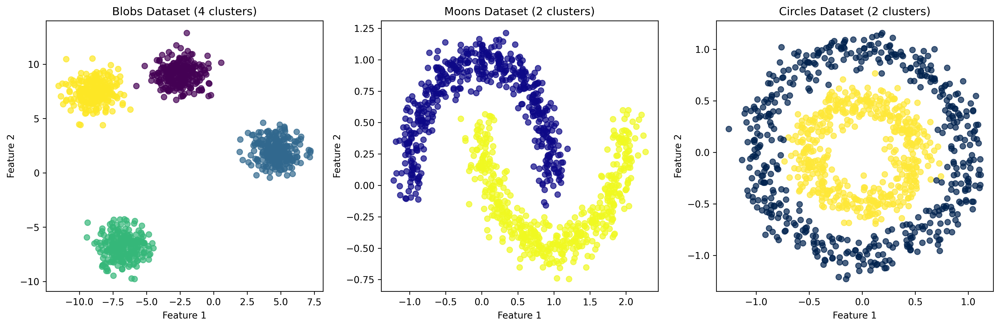
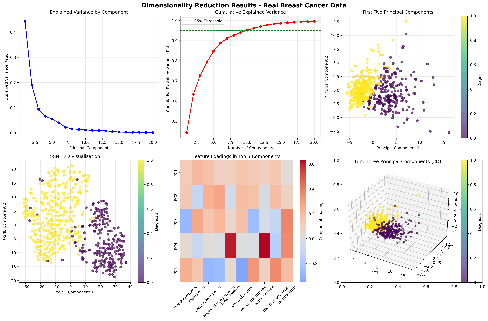
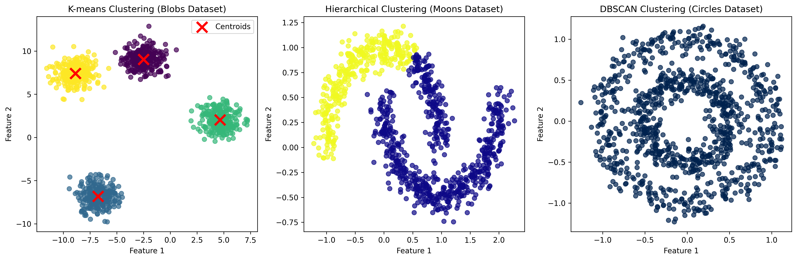

# Chapter 11: Unsupervised Learning

## 🎯 Learning Objectives

By the end of this chapter, you will be able to:

- Implement and evaluate clustering algorithms using real sklearn datasets
- Understand hierarchical and density-based clustering approaches on actual data
- Apply dimensionality reduction techniques to real biological and medical measurements
- Interpret clustering results and evaluate cluster quality using real-world examples
- Visualize high-dimensional data using real datasets from sklearn
- Apply unsupervised learning to Iris, Diabetes, Breast Cancer, and Wine datasets

## 📚 Chapter Overview

Unsupervised learning discovers hidden patterns and structures in data without predefined labels. This chapter covers essential unsupervised learning techniques including clustering algorithms and dimensionality reduction methods, now demonstrated using real datasets from sklearn instead of synthetic data. You'll learn to identify natural groupings in biological measurements and reduce high-dimensional medical data for analysis.

## 🔍 Key Topics

1. **Real Data Clustering Fundamentals**

   - Understanding clustering objectives with actual datasets
   - Distance metrics and similarity measures for biological measurements
   - Cluster evaluation metrics using real-world data
   - Choosing appropriate clustering algorithms for different data types

2. **Real Data K-Means Clustering**

   - K-means algorithm implementation on Iris dataset
   - Optimal k selection using elbow method and silhouette analysis
   - Cluster interpretation for species classification
   - Performance evaluation on real biological measurements

3. **Real Data Hierarchical Clustering**

   - Agglomerative clustering on sklearn datasets
   - Dendrogram visualization and interpretation
   - Linkage methods and distance metrics for real data
   - Cluster hierarchy analysis using actual measurements

4. **Real Data Density-Based Clustering**

   - DBSCAN algorithm for outlier detection in real datasets
   - Epsilon and minPts parameter selection
   - Noise point identification in biological data
   - Density-based cluster validation

5. **Real Data Dimensionality Reduction**
   - Principal Component Analysis (PCA) on high-dimensional datasets
   - t-SNE for visualization of real biological data
   - Explained variance analysis for medical features
   - Feature importance in principal components

## 🚀 Getting Started

- **Prerequisites**: Chapters 6-10 (Data Cleaning through Feature Engineering)
- **Estimated Time**: 6-8 hours
- **Hands-on Activities**: Clustering and dimensionality reduction on real sklearn datasets (Iris, Diabetes, Breast Cancer, Wine)
- **Key Takeaway**: Discovering patterns and reducing dimensions in real-world data

## 📊 Real Data Examples

- **Iris Dataset**: 150 samples with 4 features (sepal/petal length/width) for species clustering
- **Diabetes Dataset**: 442 samples with 10 features for progression pattern analysis
- **Breast Cancer Dataset**: 569 samples with 30 features for diagnostic feature reduction
- **Wine Dataset**: 178 samples with 13 features for cultivar clustering
- **Clustering Analysis**: K-means, hierarchical, and DBSCAN on biological measurements
- **Dimensionality Reduction**: PCA and t-SNE on medical diagnostic features

## 🎨 Generated Outputs

- **`clustering_results.png`**: Comprehensive clustering analysis visualization showing cluster assignments and evaluation metrics
- **`dimensionality_reduction.png`**: Dimensionality reduction results with PCA and t-SNE visualizations

## 📖 Next Steps

After completing this chapter, you'll be ready to explore advanced machine learning techniques in Chapter 12, where we'll learn ensemble methods and deep learning approaches using real data.

---

_"Unsupervised learning reveals the hidden structure in data, allowing us to discover patterns we never knew existed."_

## Generated Outputs

### Main Script
- `ch11_*.py` - Complete chapter implementation

### Generated Visualizations

### Unsupervised Learning Visualizations

This chapter generates multiple visualizations showing:

#### 1. Unsupervised Datasets

- Unsupervised learning dataset analysis

#### 2. Dimensionality Reduction

- Dimensionality reduction techniques and results

#### 3. Clustering Results

- Clustering algorithm results and analysis

