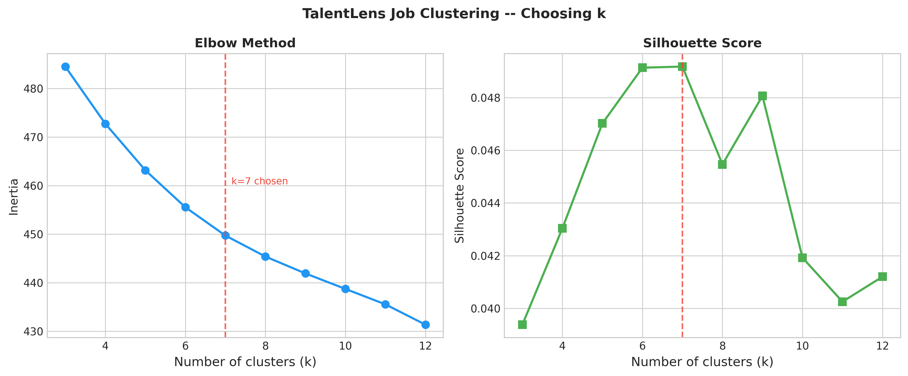
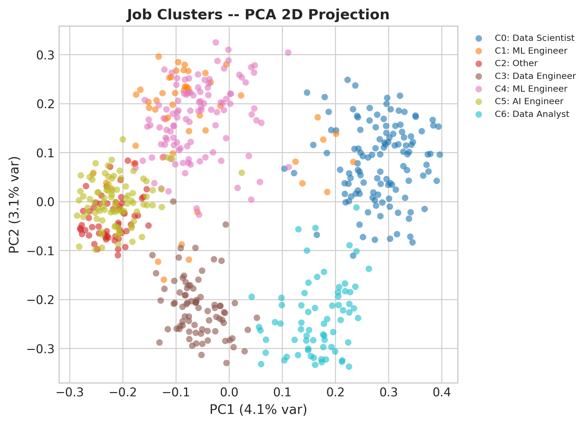
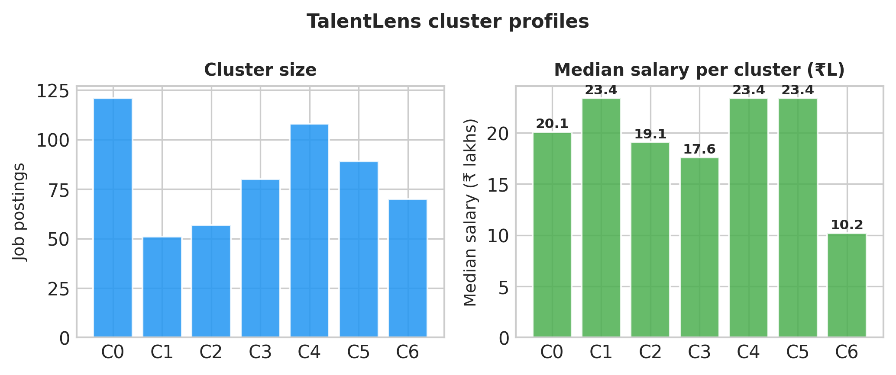

# Chapter 11: Unsupervised Learning — Clustering the TalentLens Corpus

> **TalentLens milestone:** Chapter 9 built a classifier that needed labels; Chapter 10 found that hand-built features did not improve it. This chapter asks a different question (what structure is in the corpus if nobody hands you labels at all?) and teaches you to read clustering results sceptically.

---

## The problem we're solving

Every model so far has needed a `role_category` column. Someone (a regex in Chapter 6) decided that a posting titled "ETL Developer" is a Data Engineer role. Most real data arrives without such a column, and even when it exists, you should ask whether it matches what the text says.

Your product lead puts it bluntly: *"We keep saying there are five kinds of data jobs. Is that true, or is it just the five titles we happened to pick? What does the market look like if we let the postings group themselves?"*

That is a clustering question. Given only the text of each posting, which postings resemble each other, and do those natural groups line up with our five labels?

---

## Why clustering, and why now

Clustering is the natural next step after supervised learning because it reuses the same text representation, TF-IDF over title, skills, and description, without the labels. That makes the comparison direct: if the clusters recover the roles, the labels describe real structure in the text; if they cut across the roles, the labels are partly a naming convention.

**What clustering is good for:** market segmentation, taxonomy discovery, and sanity-checking an existing label column.

**What it is not:** a way to prove structure exists. KMeans will return exactly as many clusters as you ask for, whether or not the data contains them. The work in this chapter is mostly in reading the output carefully.

**Alternatives and why we're not leading with them:**

- *Hierarchical clustering*: gives a tree instead of a flat partition; useful when you want to see how groups merge, but slow beyond a few thousand rows.
- *DBSCAN / HDBSCAN*: find clusters of arbitrary shape and label outliers as noise; they struggle in high-dimensional sparse text spaces without a dimensionality-reduction step first.
- *Topic models and BERTopic*: BERTopic (sentence embeddings, UMAP, then HDBSCAN) is often better on large, varied text corpora. It adds a heavy dependency stack; TF-IDF + KMeans is the transparent baseline you should beat first.

---

## The methods

### TF-IDF on title, skills, and description

The same vectoriser shape as Chapter 9, with one difference: the title is included. In Chapter 9 the title was forbidden because the labels came from it. Here there are no labels to leak into, so the title is simply more text.

**Key parameters:** `max_features=5000`, `ngram_range=(1, 2)`, `min_df=2`, `max_df=0.90`, `sublinear_tf=True`. On the bundled corpus this yields a 576 × 1,464 sparse matrix.

### KMeans

**What it does in plain English:** Places k centre points, assigns every posting to its nearest centre, moves each centre to the mean of its postings, and repeats until nothing changes. The result minimises *inertia*, the total squared distance from each posting to its centre.

**Key parameters:**

- `n_clusters`: k. You choose it; KMeans never tells you the right number.
- `n_init=10` (20 for the final fit): KMeans starts from random centres and can land in a poor solution. Running it several times and keeping the best is cheap insurance.
- `random_state=42`: fixes those random starts so the report is identical on every run.

### Inertia and the elbow

Inertia always falls as k rises; with one cluster per posting it reaches zero. The **elbow** is the point where adding another cluster stops buying much reduction. It is a judgement call, not a formula.

### Silhouette score

**What it measures:** for each posting, how close it is to its own cluster compared with the nearest other cluster, scaled from −1 to 1. Near 1 means tight, well-separated clusters; near 0 means postings sit on the boundaries between clusters; negative means many are closer to another cluster than their own.

> **📑 Reference: Reading silhouette scores**

| Silhouette | What it usually means |
|---|---|
| 0.7 – 1.0 | Strong, well-separated structure (rare on text) |
| 0.5 – 0.7 | Reasonable structure |
| 0.25 – 0.5 | Weak structure; clusters overlap |
| below 0.25 | Little separation — typical of high-dimensional text, where distances concentrate |
| exactly 1.0 | A warning sign: duplicate points, or far fewer distinct points than clusters |

> **📑 Reference: Choosing an approach**

| If your data has... | Reach for |
|---|---|
| Labels and 1k+ rows | Logistic regression (Ch9), then measured feature additions (Ch10) |
| Labels and 100k+ rows with rich text | A neural network on TF-IDF or embeddings (Ch12) |
| No labels, structured features | KMeans on scaled features |
| No labels, text only | TF-IDF + KMeans (this chapter), then BERTopic if you need more |
| Sequential or time-dependent data | Time series methods (Ch14) |
| A generation task | RAG (Ch16) or an LLM application (Ch17) |

---

## The code

Run from the repository root:

```bash
python book/ch11/ch11_unsupervised_learning.py
```

The script builds the TF-IDF matrix, fits KMeans for every k from 3 to 12, records inertia and silhouette for each, fits the final model at k = 7, and profiles every cluster: size, median salary, remote share, and the two most common `role_category` values inside it.

Outputs in `book/ch11/reports/`:

- `figures/ch11_elbow_silhouette.png`: inertia and silhouette vs k
- `figures/ch11_cluster_pca.png`: the first two principal components, coloured by cluster
- `figures/ch11_cluster_profiles.png`: per-cluster size, salary, and remote share
- `cluster_report.md`: the silhouette sweep and cluster table

**Three code decisions worth explaining:**

*Why k is fixed at 7 rather than chosen automatically:* the elbow is a judgement, and automating it hides the judgement. The script prints the whole sweep so you can see why 7 was chosen and disagree if the sweep tells you something different on your data.

*Why the role labels appear in the profile at all:* they are not used to fit anything. They are there so you can check what each cluster contains against a reference you already understand.

*Why the seed is fixed:* KMeans with random starts can relabel clusters between runs, so cluster 3 today is cluster 5 tomorrow. A fixed seed keeps the report byte-stable, which keeps diffs meaningful.

---

## Interpreting the output

**The silhouette sweep:**

```
TF-IDF: 576 docs x 1,464 features
  k=3: inertia=485, silhouette=0.039
  k=4: inertia=473, silhouette=0.043
  k=5: inertia=463, silhouette=0.047
  k=6: inertia=456, silhouette=0.049
  k=7: inertia=450, silhouette=0.049
  k=8: inertia=445, silhouette=0.045
  k=9: inertia=442, silhouette=0.048
  k=10: inertia=439, silhouette=0.042
  k=11: inertia=436, silhouette=0.040
  k=12: inertia=431, silhouette=0.041
Final clustering: k=7, silhouette=0.049
```

**Start with the silhouette, and do not panic.** 0.049 is low: postings sit close to the boundaries between clusters. That is normal for TF-IDF text: in a space with 1,464 dimensions, distances between documents all look similar, and job ads for neighbouring roles share most of their vocabulary. What matters is the *shape* of the curve. It rises from 0.039 at k = 3 to a plateau at 6–7 and then falls. Inertia drops steeply until about k = 6 and then flattens. Both point to the same region, so k = 7 is a defensible choice, not a discovered truth.

If you ever see a silhouette of exactly 1.000 on text, stop. It almost always means duplicate rows: when many postings have identical vectors, KMeans can place each group of copies in its own cluster with zero spread. An earlier version of this book's demo corpus did exactly that, because its descriptions were copies of eight templates. The score was real and reproducible, and it meant nothing.

**The cluster profiles:**

| Cluster | Size | Median salary | Remote | Top roles inside |
|---|---|---|---|---|
| C0 | 121 | ₹20.1L | 42% | Data Scientist, ML Engineer |
| C1 | 51 | ₹23.4L | 37% | ML Engineer, Data Scientist |
| C2 | 57 | ₹19.1L | 37% | Other, AI Engineer |
| C3 | 80 | ₹17.6L | 35% | Data Engineer, ML Engineer |
| C4 | 108 | ₹23.4L | 35% | ML Engineer, AI Engineer |
| C5 | 89 | ₹23.4L | 42% | AI Engineer, ML Engineer |
| C6 | 70 | ₹10.2L | 34% | Data Analyst, Data Scientist |

Read it as a set of stories, then check each one:

- **C6 is the analyst market**: the only cluster with a median near ₹10L, dominated by Data Analyst postings. The text alone separated it, and its pay matches Chapter 7's role comparison. Strong evidence that "Data Analyst" is a distinct segment.
- **C3 is data engineering**, the other clean grouping.
- **C0, C1, C4, and C5 are the ML/AI continuum.** Four clusters, each mixing ML Engineer with either Data Scientist or AI Engineer. The text does not draw a sharp line where our labels do, which is what Chapter 9's confusion between ML and AI Engineer already suggested.
- **C2 collects the `Other` titles** (NLP, computer vision, backend) along with AI Engineer postings that share their deep-learning vocabulary.

So the answer to the product lead is: *two of the five roles are clearly separate segments; the other three form a continuum the titles slice somewhat arbitrarily.* That is a real, useful finding, and it came from reading the profiles, not the silhouette.

One caution about the salary column: several clusters show exactly ₹23.4L. That repetition comes from Chapter 6's imputation: missing salaries were filled with role medians, and clusters dominated by the same role inherit the same median. Use cluster salaries for rough ordering, not precise comparison.

**`ch11_elbow_silhouette.png`**: the two curves side by side, with the chosen k marked. Look for the bend in inertia and the plateau in silhouette.



**`ch11_cluster_pca.png`**: every posting projected onto its first two principal components. Expect heavy overlap: two dimensions cannot show structure that lives in 1,464. Clusters that separate even here (the analyst cluster usually does) are the strongest ones.



**`ch11_cluster_profiles.png`**: size, salary, and remote share per cluster, the step that turns "k blobs" into "k stories".



---

## Common mistakes I've seen (and made)

**Mistake: Choosing k by maximum silhouette**

What happens: you sweep k, take the highest score, and report "the data has 7 segments". On this corpus k = 6 and k = 7 tie at 0.049 and k = 9 is almost as good; the maximum is barely distinguishable from its neighbours.

How to catch it: plot the whole sweep. If the top of the silhouette curve is flat, there is no single right k.

Fix: choose k from the elbow, the silhouette plateau, *and* whether the resulting clusters are interpretable and useful. Say that it was a choice.

---

**Mistake: Treating a perfect silhouette as a triumph**

What happens: the score comes back 1.000 and you present it. The clusters are groups of duplicate rows.

How to catch it: count distinct rows (`df.drop_duplicates(subset=text_cols)`) and distinct vectors; look for scikit-learn's `ConvergenceWarning: Number of distinct clusters found smaller than n_clusters`.

Fix: deduplicate before clustering, and treat any score near 1.0 on real text as a bug report.

---

**Mistake: Naming clusters before inspecting them**

What happens: you label C4 "senior ML engineers" because it has a high median salary, and a stakeholder builds a campaign on it. Its salary is an artefact of imputation.

How to catch it: for every cluster, read ten postings, the top TF-IDF terms, and the label mix before you name it.

Fix: KMeans gives you partitions, not meanings. The names are your job, and they need evidence.

---

**Mistake: Forgetting that scale changes the clusters**

What happens: you cluster on raw numeric columns, salary in rupees next to a 0/1 remote flag. Salary dominates every distance and the clusters are just salary bands.

How to catch it: check each feature's variance before clustering.

Fix: scale numeric features (`StandardScaler`) before KMeans. TF-IDF rows are already L2-normalised, which is why this chapter doesn't need it.

---

## Interview questions

**Q1: You cluster customers into 5 groups with KMeans. The CEO asks what the clusters mean. What do you say?**

Template answer: "KMeans gives partitions, not meanings; naming them is our job. I'd profile each cluster: size, averages of the key business metrics, the most distinctive features, and a sample of real records. Then I'd propose names with the evidence behind each, flag any clusters that look like artefacts, and say how stable they are. If a different random seed reshuffles them, they're not something to build strategy on."

**Q2: How do you choose k?**

Template answer: "I sweep a range and look at inertia for an elbow and silhouette for a plateau, then check whether the clusters at candidate values are interpretable and useful for the decision at hand. When the curves are flat, I say so and pick the k that serves the use case. The number of clusters is a modelling choice, not a fact about the data."

**Q3: Your silhouette score on text data is 0.05. Is the clustering useless?**

Template answer: "Not necessarily. Silhouette on high-dimensional sparse text is almost always low, because distances between documents concentrate. I'd look at the shape of the sweep and at the cluster profiles. If a cluster matches a known segment (say its salaries and titles line up with a real role), it's useful even at 0.05. If I need better separation, I'd try sentence embeddings with UMAP before clustering."

**Q4: When would you use clustering on data that already has labels?**

Template answer: "To audit the labels. If the natural groupings in the features cut across the labels, the labels may be a naming convention rather than a real distinction, which matters for how well any classifier can do. It's also a way to discover sub-segments inside a label that deserve their own treatment."

**Q5: What's the difference between KMeans and DBSCAN, and when would you pick DBSCAN?**

Template answer: "KMeans needs k up front, assumes roughly spherical clusters of similar size, and assigns every point to a cluster. DBSCAN finds clusters as dense regions, discovers the number itself, handles odd shapes, and labels sparse points as noise. I'd pick DBSCAN (or HDBSCAN) for spatial data or embeddings after dimensionality reduction, when outliers are expected and shouldn't be forced into a cluster."

---

## What's next

Chapter 12 returns to supervised learning with a question Chapters 9 and 10 left open: if hand-built features don't beat bag-of-words, does a neural network? It answers on four datasets, including this corpus.

Chapter 13 then turns the skill vocabulary these clusters were built from into a measured extraction problem.

---

## TalentLens checkpoint

At the end of this chapter, your project should have:

- [ ] `book/ch11/reports/cluster_report.md`: silhouette sweep and the k = 7 cluster table
- [ ] `book/ch11/reports/figures/ch11_elbow_silhouette.png`, `ch11_cluster_pca.png`, `ch11_cluster_profiles.png`
- [ ] A one-sentence name for each cluster, with the evidence for it
- [ ] `pytest tests/test_ch11.py -v` passing

```bash
python book/ch11/ch11_unsupervised_learning.py
pytest tests/test_ch11.py -v
```

**Concepts you own:**

- Clustering as discovery: partitions come from the algorithm; names and meaning come from you
- Silhouette as an instrument, not an oracle; low is normal on text; exactly 1.0 is a bug
- Using clusters to audit labels: two of TalentLens's five roles are clear segments; three form a continuum
