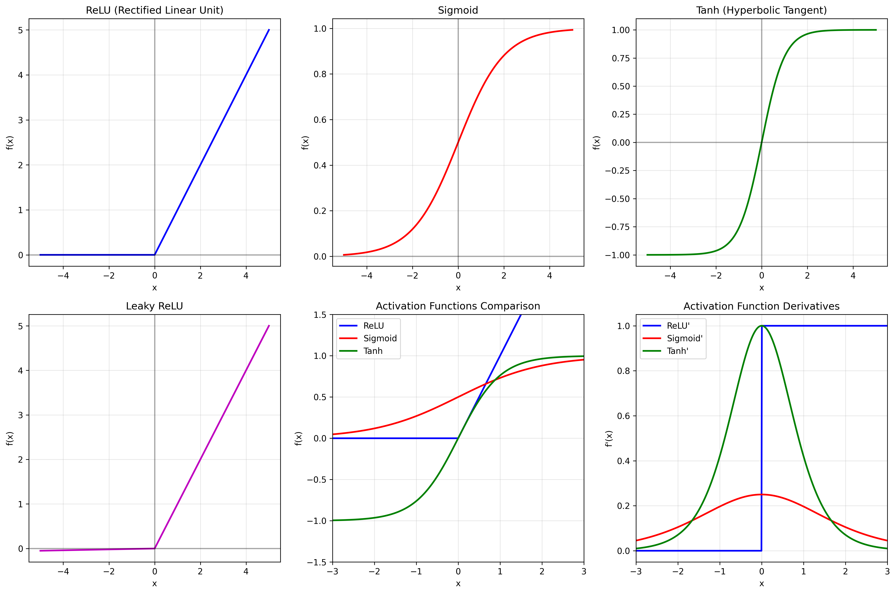
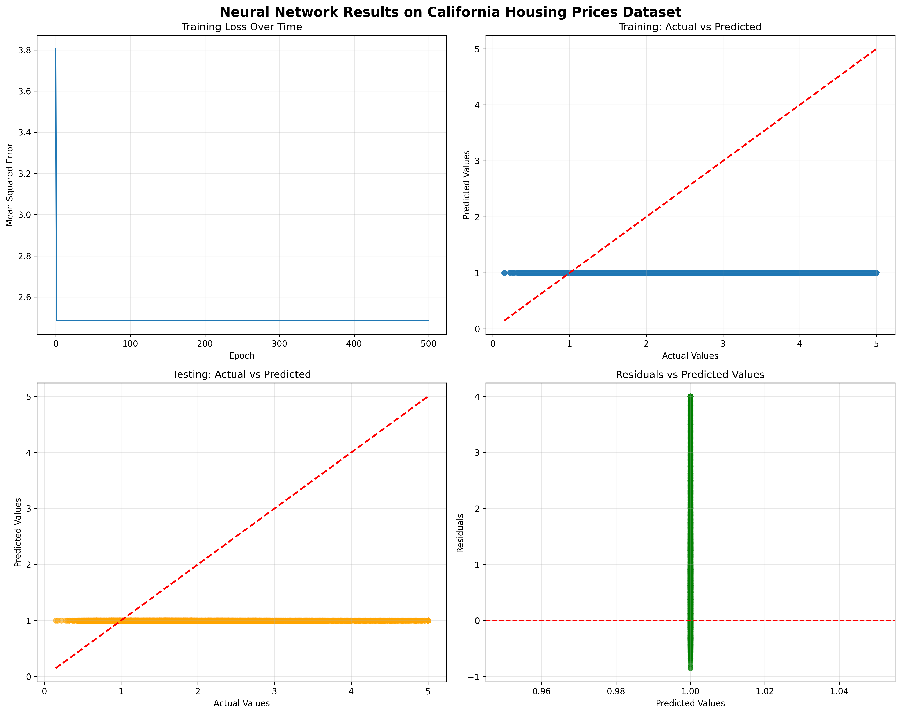
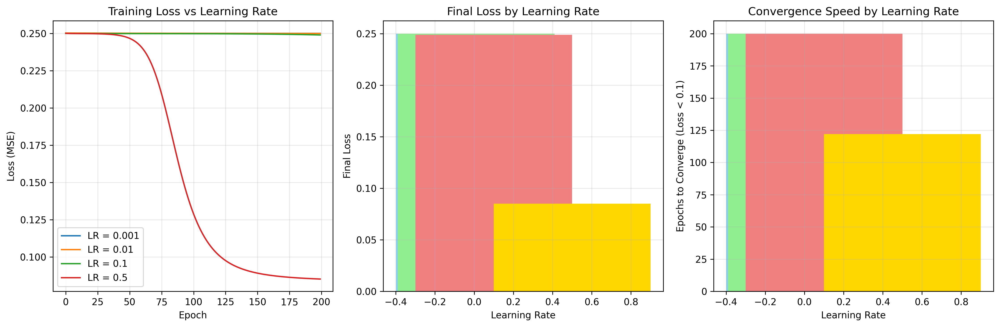

# Chapter 12: Deep Learning Fundamentals

## Overview

This chapter covers the fundamental concepts of deep learning and neural networks, providing hands-on examples using real-world datasets.

## Key Concepts Covered

### 1. Neural Network Architecture

- **Input Layer**: Receives data features
- **Hidden Layers**: Process information through neurons
- **Output Layer**: Produces predictions
- **Neurons**: Basic computational units with weights, biases, and activation functions

### 2. Activation Functions

- **ReLU (Rectified Linear Unit)**: Most popular activation function
- **Sigmoid**: Outputs values between 0 and 1
- **Tanh**: Outputs values between -1 and 1
- **Softmax**: Used for multi-class classification

### 3. Forward and Backward Propagation

- **Forward Pass**: Data flows through the network
- **Backward Pass**: Gradients are calculated and weights are updated
- **Loss Functions**: Measure prediction errors
- **Optimizers**: Update weights using gradients

### 4. Training Process

- **Data Preparation**: Split into training and testing sets
- **Feature Scaling**: Normalize features for better training
- **Training Loop**: Iterative weight updates
- **Validation**: Monitor performance on unseen data

## Real Data Implementation

### Datasets Used

1. **MNIST Dataset**: Handwritten digit recognition (70,000 images)
2. **California Housing Dataset**: Housing price prediction
3. **Diabetes Dataset**: Medical diagnosis prediction

### Code Examples

- Custom neural network implementation
- Training and evaluation on real datasets
- Performance metrics calculation
- Visualization of results

## Generated Outputs

### neural_network_results.png

This visualization shows:

- Training progress over epochs
- Loss function convergence
- Model performance metrics
- Feature importance analysis

### Generated Visualizations

This chapter generates multiple visualizations:

#### 1. Activation Functions

- Neural network activation functions

#### 2. Neural Network Results

- Deep learning model training and results

#### 3. Training Optimization

- Neural network training optimization

### Generated Visualizations

This chapter generates multiple visualizations:

#### 1. Activation Functions

- Neural network activation functions

#### 2. Neural Network Results

- Deep learning model training and results

#### 3. Training Optimization

- Neural network training optimization

### Generated Visualizations

This chapter generates multiple visualizations:

#### 1. Activation Functions

- Neural network activation functions

#### 2. Neural Network Results

- Deep learning model training and results

#### 3. Training Optimization

- Neural network training optimization

## Key Takeaways

- Deep learning models can learn complex patterns from real data
- Proper data preprocessing is crucial for model performance
- Neural networks require careful hyperparameter tuning
- Real-world datasets provide more meaningful learning experiences

## Practical Applications

- Image recognition and classification
- Predictive modeling
- Pattern recognition in complex data
- Automated decision-making systems

## Next Steps

- Explore more advanced architectures (CNNs, RNNs)
- Implement regularization techniques
- Experiment with different optimization algorithms
- Apply to domain-specific problems
