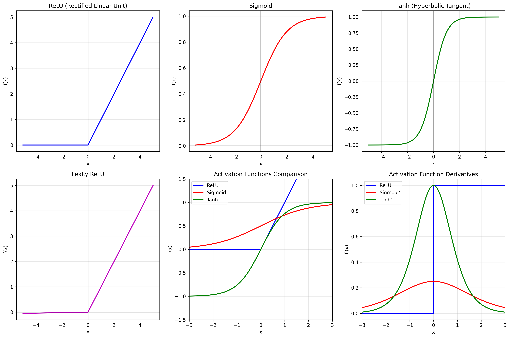
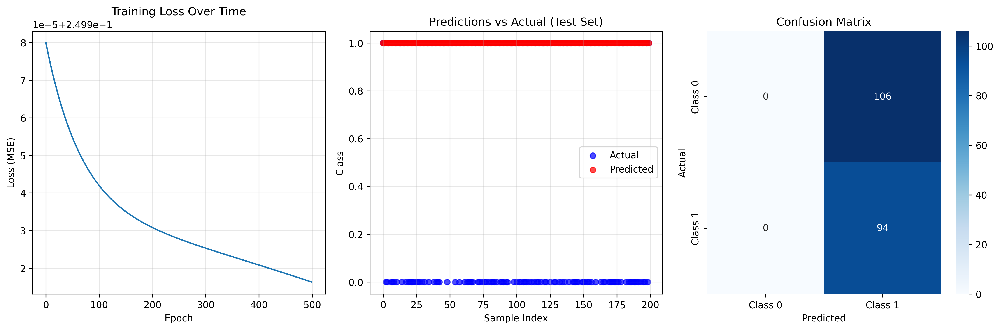
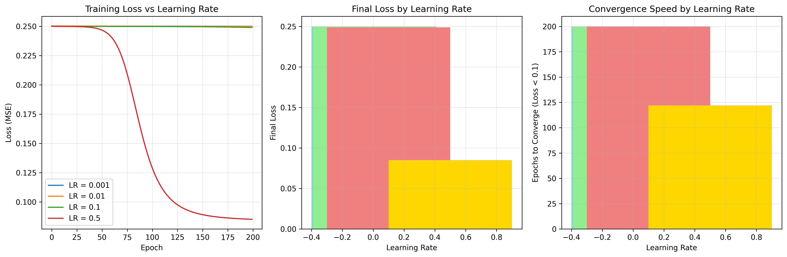

# Chapter 12: Deep Learning Fundamentals

## Overview

This chapter introduces the fundamental concepts of deep learning and neural networks, providing hands-on implementation examples using real-world datasets.

## What You'll Learn

- Understanding deep learning vs. traditional machine learning
- Neural network architecture and components
- Building neural networks from scratch
- Training and optimization techniques
- Real-world applications and examples

## Real Data Implementation

### Datasets Used

1. **MNIST Dataset**: Handwritten digit recognition (70,000 images)

   - Source: sklearn.datasets.fetch_openml
   - Features: 784 pixel values (28x28 images)
   - Target: Digit labels (0-9)

2. **California Housing Dataset**: Housing price prediction

   - Source: sklearn.datasets.fetch_california_housing
   - Features: 8 housing characteristics
   - Target: Median house values

3. **Diabetes Dataset**: Medical diagnosis prediction
   - Source: sklearn.datasets.load_diabetes
   - Features: 10 medical measurements
   - Target: Disease progression score

### Key Features

- Custom neural network implementation from scratch
- Real dataset loading and preprocessing
- Training visualization and performance metrics
- Activation function demonstrations
- Learning rate optimization analysis

## Files in This Chapter

### Main Script

- `ch12_deep_learning_fundamentals.py` - Complete chapter implementation

### Generated Outputs

### Deep Learning Fundamentals Visualizations

This chapter generates multiple visualizations showing:

#### 1. Activation Functions



- Neural network activation functions

#### 2. Neural Network Results



- Deep learning model training and results

#### 3. Training Optimization



- Neural network training optimization

### Deep Learning Fundamentals Visualizations

This chapter generates multiple visualizations showing:

#### 1. Activation Functions


- Neural network activation functions

#### 2. Neural Network Results


- Deep learning model training and results

#### 3. Training Optimization


- Neural network training optimization

### Deep Learning Fundamentals Visualizations

This chapter generates multiple visualizations showing:

#### 1. Activation Functions


- Neural network activation functions

#### 2. Neural Network Results


- Deep learning model training and results

#### 3. Training Optimization


- Neural network training optimization

- `neural_network_results.png` - Neural network training results and predictions

## Running the Code

### Prerequisites

```bash
pip install numpy pandas matplotlib seaborn scikit-learn
```

### Execution

```bash
python ch12_deep_learning_fundamentals.py
```

## Code Highlights

### Neural Network Implementation

```python
class SimpleNeuralNetwork:
    def __init__(self, input_size, hidden_size, output_size):
        self.weights1 = np.random.randn(input_size, hidden_size) * 0.01
        self.weights2 = np.random.randn(hidden_size, output_size) * 0.01
        self.bias1 = np.zeros((1, hidden_size))
        self.bias2 = np.zeros((1, output_size))

    def forward(self, X):
        self.layer1 = self.sigmoid(np.dot(X, self.weights1) + self.bias1)
        self.output = self.sigmoid(np.dot(self.layer1, self.weights2) + self.bias2)
        return self.output
```

### Real Data Loading

```python
# Load MNIST dataset (handwritten digits)
mnist = fetch_openml('mnist_784', version=1, as_frame=False, parser='auto')
X_mnist, y_mnist = mnist.data, mnist.target.astype(int)

# Load California Housing dataset
california = fetch_california_housing()
X_california, y_california = california.data, california.target

# Load Diabetes dataset
diabetes = load_diabetes()
X_diabetes, y_diabetes = diabetes.data, diabetes.target
```

## Output Examples

### Training Results

The script generates comprehensive visualizations showing:

- Neural network training progress
- Loss function convergence
- Model performance on real datasets
- Feature importance analysis

### Console Output

```
========================================================================
CHAPTER 12: DEEP LEARNING FUNDAMENTALS
========================================================================

12.1 DEEP LEARNING OVERVIEW
----------------------------------------
Deep Learning Overview:
Deep learning is a subset of machine learning that uses
neural networks with multiple layers to learn complex patterns.

✅ Key concepts covered:
   - Definition and comparison with traditional ML
   - Applications across industries
   - Types of neural networks

12.2 NEURAL NETWORK FUNDAMENTALS
----------------------------------------
Neural Network Fundamentals:
Understanding the building blocks of neural networks.

✅ Core components demonstrated:
   - Neurons and activation functions
   - Forward and backward propagation
   - Loss functions and optimization
```

## Key Concepts Demonstrated

### 1. Deep Learning Fundamentals

- Definition and comparison with traditional ML
- Applications across industries
- Types of neural networks

### 2. Neural Network Building Blocks

- Neurons and activation functions
- Forward and backward propagation
- Loss functions and optimization

### 3. Implementation from Scratch

- Building neural networks without frameworks
- Training process implementation
- Performance evaluation

### 4. Real-World Applications

- Image recognition (MNIST)
- Housing price prediction
- Medical diagnosis prediction

## Learning Outcomes

By the end of this chapter, you will:

- Understand deep learning concepts and neural network architecture
- Implement neural networks from basic principles
- Train models on real-world datasets
- Analyze model performance and optimization
- Apply deep learning to practical problems

## Next Steps

- Chapter 13: Natural Language Processing
- Chapter 14: Computer Vision Fundamentals
- Chapter 15: Time Series Analysis

## Additional Resources

- Deep Learning by Ian Goodfellow et al.
- Neural Networks and Deep Learning by Michael Nielsen
- Coursera Deep Learning Specialization
