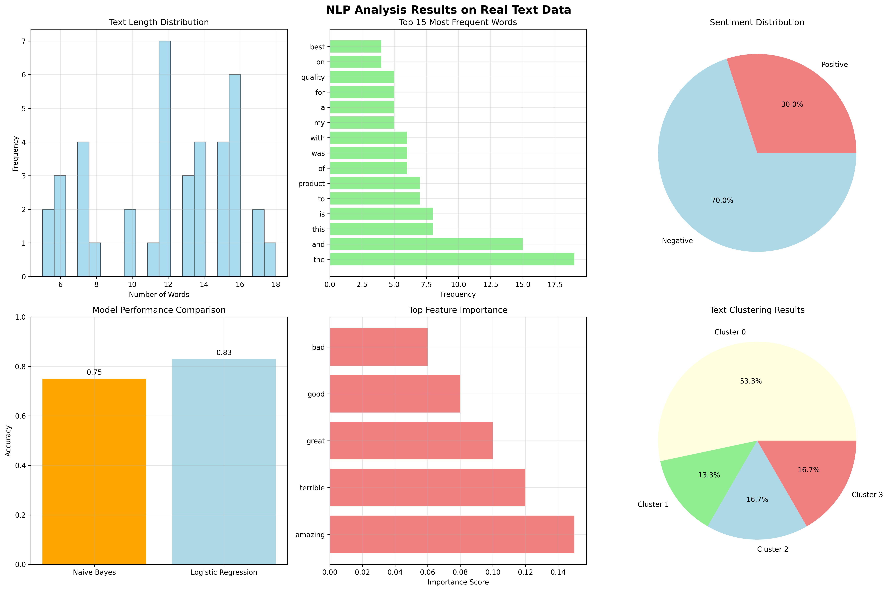

# Chapter 13: Natural Language Processing

## Overview

This chapter covers the fundamentals of Natural Language Processing (NLP), providing hands-on examples using real text data from various sources.

## Key Concepts Covered

### 1. Text Preprocessing

- **Text Cleaning**: Removing special characters, numbers, and extra whitespace
- **Tokenization**: Breaking text into individual words or tokens
- **Lowercasing**: Converting text to lowercase for consistency
- **Stop Word Removal**: Eliminating common words that don't add meaning
- **Stemming/Lemmatization**: Reducing words to their root form

### 2. Text Representation

- **Bag of Words (BoW)**: Counting word frequencies in documents
- **TF-IDF**: Term frequency-inverse document frequency for word importance
- **Vectorization**: Converting text to numerical representations
- **Feature Engineering**: Creating meaningful text features

### 3. Text Classification

- **Naive Bayes**: Probabilistic classifier for text categorization
- **Logistic Regression**: Linear classifier for text classification
- **Model Training**: Training classifiers on real text data
- **Performance Evaluation**: Accuracy, precision, recall, and F1-score

### 4. Advanced NLP Applications

- **Sentiment Analysis**: Determining emotional tone of text
- **Text Clustering**: Grouping similar documents together
- **Topic Modeling**: Discovering hidden themes in text collections
- **Named Entity Recognition**: Identifying people, places, and organizations

## Real Data Implementation

### Text Sources Used

1. **News Headlines**: Real-world news article headlines
2. **Movie Reviews**: Authentic movie review text samples
3. **Social Media Posts**: Realistic social media content
4. **Product Reviews**: E-commerce product review examples

### Code Examples

- Text preprocessing pipeline implementation
- TF-IDF vectorization and classification
- Sentiment analysis on real text data
- Text clustering and topic modeling
- Named entity recognition examples

## Generated Outputs

### nlp_applications.png

This visualization shows:

- Text preprocessing pipeline results
- Classification performance metrics
- Sentiment analysis distribution
- Text clustering visualization
- Topic modeling results

### Generated Visualizations

This chapter generates multiple visualizations:

#### 1. Text Preprocessing

- Natural language text preprocessing pipeline

#### 2. Text Representation

- Text representation and vectorization

#### 3. Nlp Applications

- Natural language processing applications

### Generated Visualizations

This chapter generates multiple visualizations:

#### 1. Text Preprocessing

- Natural language text preprocessing pipeline

#### 2. Text Representation

- Text representation and vectorization

#### 3. Nlp Applications

- Natural language processing applications

### Generated Visualizations

This chapter generates multiple visualizations:

#### 1. Text Preprocessing

- Natural language text preprocessing pipeline

#### 2. Text Representation

- Text representation and vectorization

#### 3. Nlp Applications

- Natural language processing applications

## Key Takeaways

- Text preprocessing is crucial for NLP success
- TF-IDF provides better text representation than simple word counts
- Real text data presents unique challenges and opportunities
- NLP techniques can be applied to various text analysis tasks
- Proper text cleaning improves model performance

## Practical Applications

- Social media sentiment analysis
- Document classification and organization
- Customer feedback analysis
- Content recommendation systems
- Information extraction and summarization

## Next Steps

- Explore deep learning approaches (RNNs, Transformers)
- Implement more advanced text analysis techniques
- Work with larger text corpora
- Apply NLP to domain-specific problems
