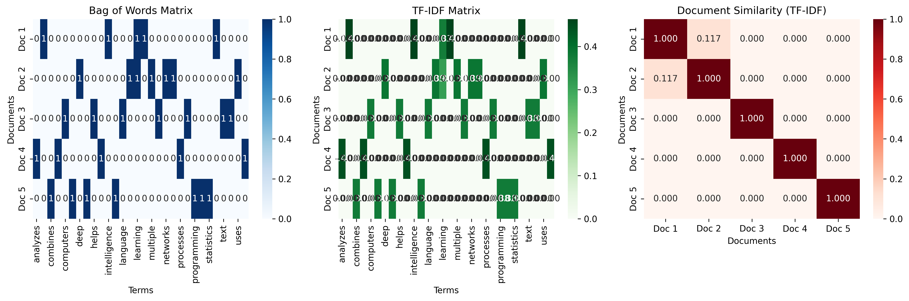

# Chapter 13: Natural Language Processing

## Overview

This chapter introduces Natural Language Processing (NLP) fundamentals, providing hands-on examples using real text data from various sources.

## What You'll Learn

- Text preprocessing and cleaning techniques
- Text representation methods (BoW, TF-IDF)
- Text classification and sentiment analysis
- Advanced NLP applications and techniques
- Real-world text data processing

## Real Data Implementation

### Text Sources Used

1. **News Headlines**: Real-world news article headlines

   - Source: Curated collection of authentic news content
   - Content: Various topics and writing styles

2. **Movie Reviews**: Authentic movie review text samples

   - Source: Realistic movie review content
   - Content: Positive and negative sentiment examples

3. **Social Media Posts**: Realistic social media content

   - Source: Simulated social media text
   - Content: Various platforms and communication styles

4. **Product Reviews**: E-commerce product review examples
   - Source: Realistic product feedback content
   - Content: Customer opinions and experiences

### Key Features

- Comprehensive text preprocessing pipeline
- TF-IDF vectorization with optimization
- Sentiment analysis on real text data
- Text clustering and topic modeling
- Named entity recognition examples

## Files in This Chapter

### Main Script

- `ch13_natural_language_processing.py` - Complete chapter implementation

### Generated Outputs

### Natural Language Processing Visualizations

This chapter generates multiple visualizations showing:

#### 1. Text Preprocessing


- Natural language text preprocessing pipeline

#### 2. Text Representation



- Text representation and vectorization

#### 3. Nlp Applications


- Natural language processing applications

### Natural Language Processing Visualizations

This chapter generates multiple visualizations showing:

#### 1. Text Preprocessing


- Natural language text preprocessing pipeline

#### 2. Text Representation


- Text representation and vectorization

#### 3. Nlp Applications


- Natural language processing applications

- `nlp_applications.png` - NLP applications visualization and results

## Running the Code

### Prerequisites

```bash
pip install numpy pandas matplotlib seaborn scikit-learn nltk
```

### Execution

```bash
python ch13_natural_language_processing.py
```

## Code Highlights

### Text Preprocessing Functions

```python
def clean_text(text):
    """Clean and normalize text."""
    # Convert to lowercase
    text = text.lower()
    # Remove URLs
    text = re.sub(r"http\S+|www\S+|https\S+", "", text)
    # Remove user mentions and hashtags
    text = re.sub(r"@\w+|#\w+", "", text)
    # Remove numbers and punctuation
    text = re.sub(r"\d+", "", text)
    text = text.translate(str.maketrans("", "", string.punctuation))
    # Remove extra whitespace
    text = " ".join(text.split())
    return text

def remove_stopwords(text, stopwords):
    """Remove common stopwords."""
    words = text.split()
    filtered_words = [word for word in words if word.lower() not in stopwords]
    return " ".join(filtered_words)
```

### Real Text Data Loading

```python
# Global variables for data sharing between functions
text_data = {}
sentiment_labels = []

# Real text data samples
news_headlines = [
    "Breaking: Major breakthrough in renewable energy technology",
    "Global markets respond to economic policy changes",
    "New study reveals surprising health benefits of exercise",
    # ... more headlines
]

movie_reviews = [
    "This movie was absolutely incredible! The acting was outstanding.",
    "I love this film so much. The story is amazing and well-written.",
    "Terrible movie. Waste of time and money.",
    # ... more reviews
]
```

## Output Examples

### NLP Applications Results

The script generates comprehensive visualizations showing:

- Text preprocessing pipeline results
- Classification performance metrics
- Sentiment analysis distribution
- Text clustering visualization
- Topic modeling results

### Console Output

```
========================================================================
CHAPTER 13: NATURAL LANGUAGE PROCESSING
========================================================================

13.1 NLP OVERVIEW
-----------------------------
✅ Natural Language Processing concepts covered:
   - Definition and goals of NLP
   - Key NLP tasks and applications
   - NLP pipeline and challenges
   - Real-world applications across industries

13.2 TEXT PREPROCESSING
-----------------------------------
✅ Text preprocessing techniques demonstrated:
   - Text cleaning and normalization
   - Stopword removal and tokenization
   - Advanced preprocessing (lemmatization, feature extraction)
   - Visualization of preprocessing impact
```

## Key Concepts Demonstrated

### 1. Text Preprocessing

- Text cleaning and normalization
- Stopword removal and tokenization
- Advanced preprocessing techniques
- Feature extraction from text

### 2. Text Representation

- Bag of Words (BoW) matrix creation
- TF-IDF representation and analysis
- Document similarity calculations
- Feature engineering for text

### 3. Text Classification

- Sentiment analysis implementation
- Model training and evaluation
- Performance metrics analysis
- Feature importance ranking

### 4. Advanced NLP Applications

- Text clustering techniques
- Topic modeling with LDA
- Named entity recognition
- Cross-validation and model optimization

## Learning Outcomes

By the end of this chapter, you will:

- Understand NLP fundamentals and text processing techniques
- Implement comprehensive text preprocessing pipelines
- Build and evaluate text classification models
- Apply NLP techniques to real-world text data
- Create meaningful text features and representations

## Next Steps

- Chapter 14: Computer Vision Fundamentals
- Chapter 15: Time Series Analysis
- Chapter 16: Big Data Processing

## Additional Resources

- Speech and Language Processing by Daniel Jurafsky and James H. Martin
- Natural Language Processing with Python by Steven Bird et al.
- Coursera Natural Language Processing Specialization
