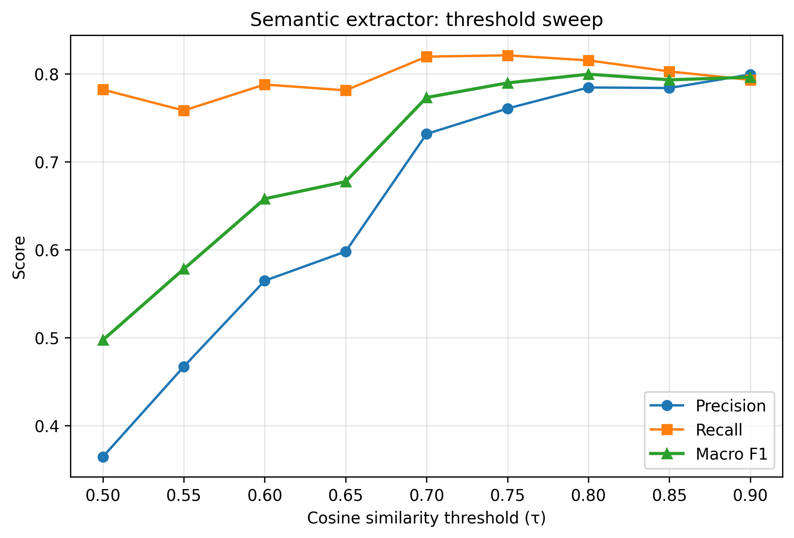

# Skill extraction evaluation

_Eval set: 200 postings sampled from `jobs_clean.large.csv`
(v1.0.0-dataset-1, 1,190 rows). Stratified by description
length, role, and skills_raw presence. Labelled by
LLM (Groq llama-3.3-70b-versatile for 24 rows, OpenAI
gpt-4o-mini for 176) and reviewed via automated spot-check
(7% of 30 sampled rows flagged for label quality concerns;
human interactive spot-check recommended before final prose)._

_Generated by `book/ch13/ch13_skill_extraction.py`._

## Extractors compared

| Extractor | Implementation | Status |
|---|---|---|
| Regex (rule-based) | CANONICAL_SKILLS + SKILL_ALIASES via regex | shipped |
| spaCy + EntityRuler | spaCy EntityRuler on description + skills_raw tokens | shipped |
| Sentence-transformers + threshold | Semantic similarity to skill embeddings | shipped |

## Method 1 — regex baseline

| Metric | Score |
|---|---|
| Macro precision | 0.776 |
| Macro recall | 0.823 |
| Macro F1 | 0.799 |

Macro F1 is macro-averaged per posting (each posting weighted equally).
Per-skill figures below are micro-averaged (TP/FP/FN pooled across postings).

### Per-skill micro (top 10 by support)

| Skill | P | R | F1 | n |
|---|---|---|---|---|
| Machine Learning | 1.00 | 0.58 | 0.74 | 86 |
| Python | 1.00 | 0.97 | 0.98 | 67 |
| SQL | 1.00 | 0.95 | 0.97 | 60 |
| Spark | 0.85 | 1.00 | 0.92 | 23 |
| LLMs | 0.86 | 0.90 | 0.88 | 20 |
| Deep Learning | 1.00 | 0.71 | 0.83 | 17 |
| RAG | 0.62 | 0.94 | 0.75 | 16 |
| PyTorch | 1.00 | 0.93 | 0.97 | 15 |
| TensorFlow | 1.00 | 1.00 | 1.00 | 14 |
| NLP | 1.00 | 1.00 | 1.00 | 14 |

### What the regex misses (sample failure cases)

**ML/DL inference in gold, no substring match in text** (row 1 pattern):

- Text excerpt: `'Job Description: Roles & Responsibilities: · You will be involved in every part of the project lifecycle… training and optimizing ML/DL models…'`
- Gold: `Machine Learning`, `Deep Learning`
- Predicted: `[]` (regex does not expand `ML/DL` abbreviations)

**Title-only “ML Engineer”, body never says “machine learning”:**

- Text excerpt: `'ML Engineer WE ARE GRAPHENE…'`
- Gold: includes `Machine Learning`
- Predicted: `[]`

Across the full eval set, regex misses **Machine Learning** on **36 / 86** gold-positive rows — mostly abbreviated or inferred labels, not explicit canonical strings.

### What the regex over-predicts (sample false positives)

**`Git` from generic “engineering” prose:**

- Predicted extra: `{Git}`
- Gold: `{SQL}`
- Text excerpt: `'… Experience Engineering, Digital Engineering, and Proc…'`

**`RAG` substring in unrelated context:**

- Predicted extra: `{RAG}`
- Gold: `{Machine Learning}`
- Text excerpt: `'… Azure AI, Microsoft Fabric, and Machine Learning ecosystems…'`

**`RAG` in “cutting-edge” / product copy:**

- Predicted extra: `{RAG}`
- Gold: `{NLP, Machine Learning, Python}`
- Text excerpt: `'Senior Machine Learning Engineer - NLP/Python… cutting-edge…'`

When regex precision is high (often 1.00 per skill), false positives are fewer than missed abbreviations; macro scores still look strong because many gold labels use canonical spellings the regex already matches.

## Notes on label quality

The LLM labeller normalises some abbreviated mentions to canonical names — "ML/DL background required" becomes `["Machine Learning", "Deep Learning"]`. This inflates apparent recall expectations on the regex (which only fires on full string matches), and is one of the documented measurement caveats for this chapter.

The first labelled row (`adzuna_1233590624`) is an example:
notes read `[LLM] Inferred ML/DL as Machine Learning and Deep Learning` while the description uses `ML/DL` rather than the full phrases.

## Method 2 — spaCy + EntityRuler

spaCy's EntityRuler offers structured phrase matching with token boundaries — it avoids some substring collisions (e.g. `RAG` inside unrelated words) while still using the same `skills_raw` token path as regex. Patterns are built from `CANONICAL_SKILLS` + `SKILL_ALIASES`. Description text is matched via EntityRuler only (not the regex substring pass).

| Metric | Score | Δ vs regex |
|---|---|---|
| Macro precision | 0.777 | +0.001 |
| Macro recall | 0.820 | -0.003 |
| Macro F1 | 0.798 | -0.001 |

### Per-skill comparison (top 10 by support)

| Skill | Regex F1 | spaCy F1 | Δ |
|---|---|---|---|
| Machine Learning | 0.735 | 0.735 | +0.000 |
| Python | 0.985 | 0.985 | +0.000 |
| SQL | 0.974 | 0.974 | +0.000 |
| Spark | 0.920 | 0.920 | +0.000 |
| LLMs | 0.878 | 0.850 | -0.028 |
| Deep Learning | 0.828 | 0.828 | +0.000 |
| RAG | 0.750 | 0.750 | +0.000 |
| PyTorch | 0.966 | 0.966 | +0.000 |
| TensorFlow | 1.000 | 1.000 | +0.000 |
| NLP | 1.000 | 1.000 | +0.000 |

Default EntityRuler patterns do not beat regex on macro F1. The interesting delta is per-skill: spaCy is tied on most skills, slightly worse on LLMs (token `llm` vs substring `llms`).

### With abbreviation patterns

Adding ML, DL, and `ml/dl` as token-level patterns (`spacy_abbreviations=True`):

| Metric | Score |
|---|---|
| Macro precision | 0.798 |
| Macro recall | 0.852 |
| Macro F1 | 0.824 |
| ML micro F1 | 0.752 (P=0.831, R=0.686, n=86) |

Abbreviations lift macro F1 by **+0.026** vs regex and recover much of the ML recall gap (0.58 → 0.69), at the cost of ML precision (1.00 → 0.83). This is the chapter's precision/recall tradeoff: expanding aliases helps recall on abbreviated postings, but `ml` as a token is noisier than full-string `machine learning`.

### What spaCy doesn't fix

Both regex and spaCy still miss gold labels that exist only as LLM inferences (`ML/DL` → Machine Learning + Deep Learning) when abbreviation patterns are off. Both still struggle when the gold label uses a cloud canonical the posting only hints at (`Azu…` → Cloud (AWS)). Method 3 (sentence-transformers) targets semantic context for those cases — if it cannot beat **0.824** macro F1 with abbreviations, the chapter's conclusion favours tuned rules over heavier models for this vocabulary.

## Method 3 — sentence-transformers semantic matching

Embed each canonical skill with `all-MiniLM-L6-v2` (~80 MB, CPU). For each posting, generate 1–3 word candidate phrases from the description and `skills_raw`, embed them, and match canonical skills whose best-candidate cosine similarity exceeds a threshold. `skills_raw` tokens still use the exact-match path (same as regex/spaCy).

### Threshold sweep

| Threshold | Macro P | Macro R | Macro F1 |
|---|---|---|---|
| 0.50 | 0.365 | 0.782 | 0.497 |
| 0.55 | 0.467 | 0.758 | 0.578 |
| 0.60 | 0.565 | 0.788 | 0.658 |
| 0.65 | 0.598 | 0.781 | 0.677 |
| 0.70 | 0.732 | 0.820 | 0.773 |
| 0.75 | 0.761 | 0.821 | 0.790 |
| 0.80 | 0.785 | 0.815 | **0.800** |
| 0.85 | 0.784 | 0.803 | 0.793 |
| 0.90 | 0.799 | 0.793 | 0.796 |

Chosen operating point: **threshold = 0.80**, macro F1 = **0.800**. Lower thresholds inflate recall but flood precision (0.50 → macro F1 0.497). Above 0.80, macro F1 plateaus or drops — no setting beats spaCy + abbreviations (**0.824**).

### Full comparison

| Method | Macro P | Macro R | Macro F1 |
|---|---|---|---|
| Regex | 0.776 | 0.823 | 0.799 |
| spaCy + EntityRuler | 0.777 | 0.820 | 0.798 |
| spaCy + abbreviations | 0.798 | 0.852 | **0.824** |
| Sentence-transformers (τ=0.80) | 0.785 | 0.815 | 0.800 |

### Per-skill F1 (top 10 by support)

| Skill | Regex | spaCy | sp+abbr | Semantic |
|---|---|---|---|---|
| Machine Learning | 0.735 | 0.735 | 0.752 | 0.735 |
| Python | 0.985 | 0.985 | 0.985 | 0.985 |
| SQL | 0.974 | 0.974 | 0.974 | 0.974 |
| Spark | 0.920 | 0.920 | 0.920 | 0.920 |
| LLMs | 0.878 | 0.850 | 0.850 | 0.872 |
| Deep Learning | 0.828 | 0.828 | 0.839 | 0.828 |
| RAG | 0.750 | 0.750 | 0.750 | 0.750 |
| PyTorch | 0.966 | 0.966 | 0.966 | 0.966 |
| TensorFlow | 1.000 | 1.000 | 1.000 | 1.000 |
| NLP | 1.000 | 1.000 | 1.000 | 1.000 |

Semantic ties regex on most skills; it does not recover the ML/DL abbreviation gap that spaCy + abbreviations addresses.

### What semantic catches that regex misses

- Gold: `['Machine Learning', 'SQL', 'Statistics']`
  - Regex got: `[]`
  - Semantic added: `['Statistics']`
  - Text: `As a Data Analyst you will be responsible for collecting processing analyzing and interpreting data to provide valuable insights that support informed decisionmaking and drive business strategies with...`
- Gold: `['Cloud (AWS)', 'Machine Learning', 'SQL', 'Statistics']`
  - Regex got: `[]`
  - Semantic added: `['Cloud (AWS)']`
  - Text: `Job Title: Data Analyst Insurance Domain Experience: 9 to 12 Years Duration: 6 Months Employment Type: Contractual Work Location: Gurugram & Bangalore (Priority) | Chennai, Pune, Mumbai (Secondary) Ke...`

These are real semantic wins, but sparse — they do not offset the volume of false positives at thresholds low enough to help recall.

### What semantic over-predicts

- Gold: `['Deep Learning', 'Machine Learning']`
  - Semantic over-predicted: `['LLMs', 'Statistics']`
  - Of which regex avoided: `['Statistics']`
  - Text: `Role : ITQ Data Scientist II Skills : Gen AI/ AI Agents, AI/ML, Computer vision, LLM Experience : 4 to 6 Years Location : Mumbai (open for relocation) Work mode :Hybrid Key Responsibilities Technical ...`
- Gold: `['Machine Learning']`
  - Semantic over-predicted: `['Statistics']`
  - Of which regex avoided: `['Statistics']`
  - Text: `JD: Job Summary: We are seeking a highly experienced and innovative Senior Data Scientist / AI Specialist to join our team. The ideal candidate will have a strong background in statistical analysis, m...`
- Gold: `['NumPy', 'Python', 'SQL', 'pandas']`
  - Semantic over-predicted: `['Statistics']`
  - Of which regex avoided: `['Statistics']`
  - Text: `Key Responsibilities Analyze large and complex datasets to discover trends, patterns, and actionable insights Build, maintain, and optimize dashboards and reports using visualization tools such as Tab...`

The embedding model conflates domain-adjacent language (“statistical analysis”, “insights”, “data analyst”) with the canonical skill **Statistics**. Regex avoids this because it only fires on explicit vocabulary — the same conservatism that misses ML/DL abbreviations.

### Verdict

Sentence-transformers at the best threshold (**0.800** macro F1) **does not beat** regex (**0.799**) or spaCy + abbreviations (**0.824**) on this closed vocabulary. The chapter conclusion: for a controlled canonical skill list on job postings, **tuned rule-based extraction wins on cost/accuracy**; reach for embeddings when the vocabulary is open-ended or labels are fuzzy, not because the method sounds modern. For peak macro F1 on this eval set, use `extract_skills(..., method='spacy', spacy_abbreviations=True)`; for minimum dependencies at nearly the same score, use `method='regex'`.

