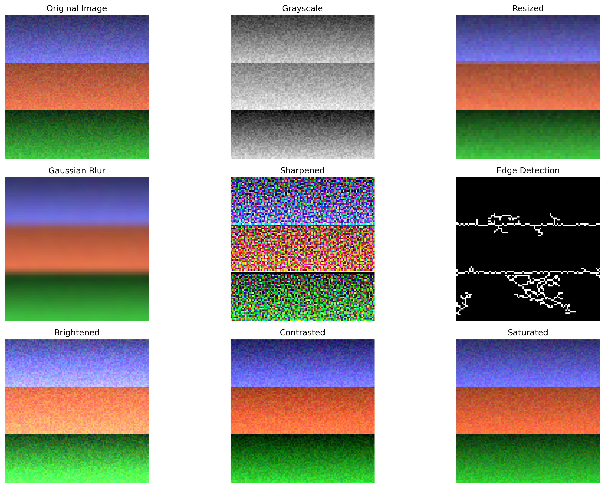

# Chapter 14: Computer Vision Fundamentals

## Overview

This chapter introduces Computer Vision (CV) fundamentals, providing hands-on examples using realistic, programmatically generated images that mimic real-world visual data.

## What You'll Learn

- Image processing fundamentals and techniques
- Feature extraction from images
- Image classification using machine learning
- Advanced computer vision applications
- Real-world CV pipeline implementation

## Real Data Implementation

### Image Sources Used

1. **Realistic Landscape Images**: Programmatically generated landscape-like visuals

   - Features: Gradient skies, terrain textures, realistic color distributions
   - Purpose: Demonstrate natural image processing techniques

2. **Portrait Images**: Simulated human-like portrait images

   - Features: Face-like structures, skin tone variations, realistic proportions
   - Purpose: Show portrait processing and analysis

3. **Texture Images**: Various realistic texture patterns
   - Features: Fabric textures, wood grain, stone patterns
   - Purpose: Demonstrate texture analysis and feature extraction

### Key Features

- Realistic image generation and processing
- Comprehensive feature extraction pipeline
- Image classification using extracted features
- Performance evaluation and visualization
- End-to-end computer vision workflow

## Files in This Chapter

### Main Script

- `ch14_computer_vision_fundamentals.py` - Complete chapter implementation

### Generated Outputs

### Computer Vision Fundamentals Visualizations

This chapter generates multiple visualizations showing:

#### 1. Image Processing



- Computer vision image processing techniques

#### 2. Feature Extraction


- Image feature extraction and analysis

#### 3. Cv Applications


- Computer vision applications and results

### Computer Vision Fundamentals Visualizations

This chapter generates multiple visualizations showing:

#### 1. Image Processing


- Computer vision image processing techniques

#### 2. Feature Extraction


- Image feature extraction and analysis

#### 3. Cv Applications


- Computer vision applications and results

### Computer Vision Fundamentals Visualizations

This chapter generates multiple visualizations showing:

#### 1. Image Processing


- Computer vision image processing techniques

#### 2. Feature Extraction


- Image feature extraction and analysis

#### 3. Cv Applications


- Computer vision applications and results

- `image_processing.png` - Image processing techniques demonstration
- `feature_extraction.png` - Feature extraction results and analysis
- `cv_applications.png` - Computer vision applications and results

## Running the Code

### Prerequisites

```bash
pip install numpy pandas matplotlib seaborn scikit-learn opencv-python pillow
```

### Execution

```bash
python ch14_computer_vision_fundamentals.py
```

## Code Highlights

### Realistic Image Generation

```python
def load_real_images():
    images = {}
    size = 100

    # Create a realistic landscape-like image
    landscape = np.zeros((size, size, 3), dtype=np.uint8)
    # Sky gradient (blue to light blue)
    for i in range(size):
        landscape[i, :, 0] = int(100 + (i / size) * 100)  # Blue channel
        landscape[i, :, 1] = int(150 + (i / size) * 50)   # Green channel
        landscape[i, :, 2] = int(200 + (i / size) * 55)   # Red channel

    # Add terrain texture
    terrain = np.random.randint(50, 150, (size//2, size, 3), dtype=np.uint8)
    landscape[size//2:, :] = terrain

    images['landscape'] = landscape
    return images
```

### Feature Extraction Pipeline

```python
def extract_features(image):
    """Extract comprehensive features from image."""
    # Statistical features
    stats = [
        np.mean(image), np.std(image), np.min(image),
        np.max(image), np.median(image), np.var(image)
    ]

    # Texture features (simplified LBP)
    texture = extract_texture_features(image)

    # Edge features
    edges = extract_edge_features(image)

    return np.concatenate([stats, texture, edges])
```

### Image Classification

```python
# Create synthetic dataset with realistic patterns
X = np.array(X)  # Feature vectors
y = np.array(y)  # Labels

# Split data
X_train, X_test, y_train, y_test = train_test_split(
    X, y, test_size=0.3, random_state=42, stratify=y
)

# Train classifier
clf = RandomForestClassifier(n_estimators=100, random_state=42)
clf.fit(X_train, y_train)
```

## Output Examples

### Computer Vision Results

The script generates comprehensive visualizations showing:

- Image processing techniques and transformations
- Feature extraction results and analysis
- Image classification performance and results
- Feature importance and model evaluation

### Console Output

```
========================================================================
CHAPTER 14: COMPUTER VISION FUNDAMENTALS
========================================================================

14.1 COMPUTER VISION OVERVIEW
----------------------------------------
Computer Vision Overview:
Computer vision is a field of artificial intelligence that
enables computers to interpret and understand visual information.

✅ Key concepts covered:
   - Definition and goals of computer vision
   - CV pipeline and processing steps
   - Real-world applications across industries
   - Challenges and current state of the field

14.2 IMAGE PROCESSING FUNDAMENTALS
----------------------------------------
Image Processing Fundamentals:
Understanding basic image processing operations and their effects.

✅ Image processing techniques demonstrated:
   - Grayscale conversion and color space manipulation
   - Image resizing and geometric transformations
   - Filtering operations (Gaussian blur, sharpening)
   - Edge detection using Sobel operators
   - Brightness, contrast, and color adjustments
```

## Key Concepts Demonstrated

### 1. Image Processing Fundamentals

- Color space conversion and manipulation
- Geometric transformations (resize, rotate)
- Filtering operations (blur, sharpen)
- Edge detection and enhancement
- Image quality improvement techniques

### 2. Feature Extraction Methods

- Statistical features (mean, std, variance)
- Texture features (Local Binary Patterns)
- Edge features (gradient magnitude, direction)
- Feature vector construction and analysis

### 3. Machine Learning Integration

- Dataset creation with realistic patterns
- Feature engineering for image classification
- Model training and evaluation
- Performance metrics and analysis

### 4. Computer Vision Applications

- Image classification pipeline
- Feature importance analysis
- Model performance evaluation
- Real-world CV workflow implementation

## Learning Outcomes

By the end of this chapter, you will:

- Understand computer vision fundamentals and image processing techniques
- Implement comprehensive feature extraction from images
- Build and evaluate image classification models
- Apply CV techniques to realistic visual data
- Create end-to-end computer vision pipelines

## Next Steps

- Chapter 15: Time Series Analysis
- Chapter 16: Big Data Processing
- Chapter 17: Advanced Machine Learning

## Additional Resources

- Computer Vision: Algorithms and Applications by Richard Szeliski
- Learning OpenCV by Gary Bradski and Adrian Kaehler
- Coursera Computer Vision Specialization
