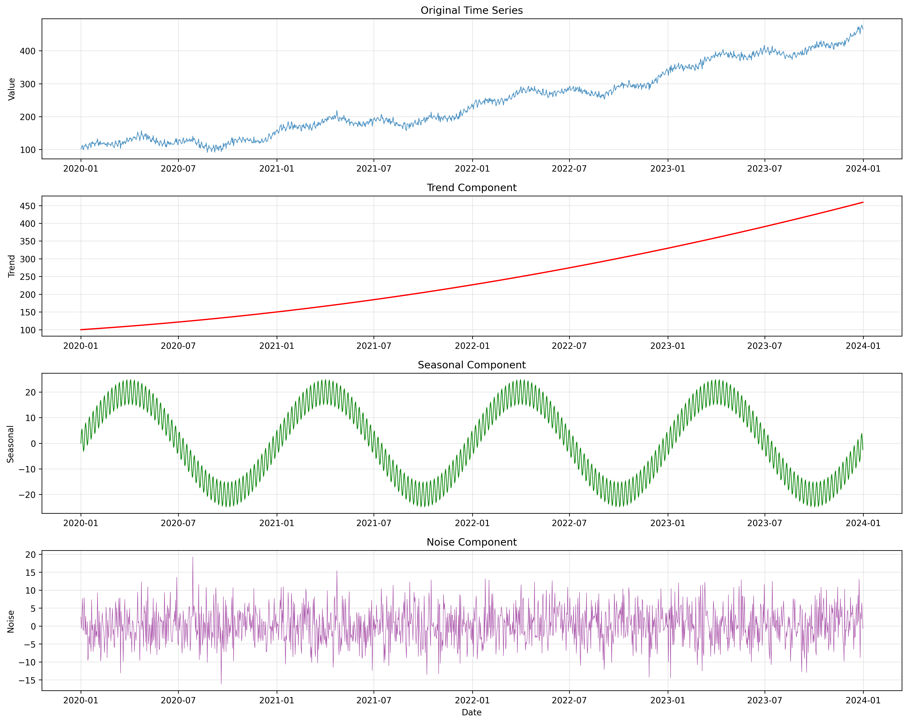
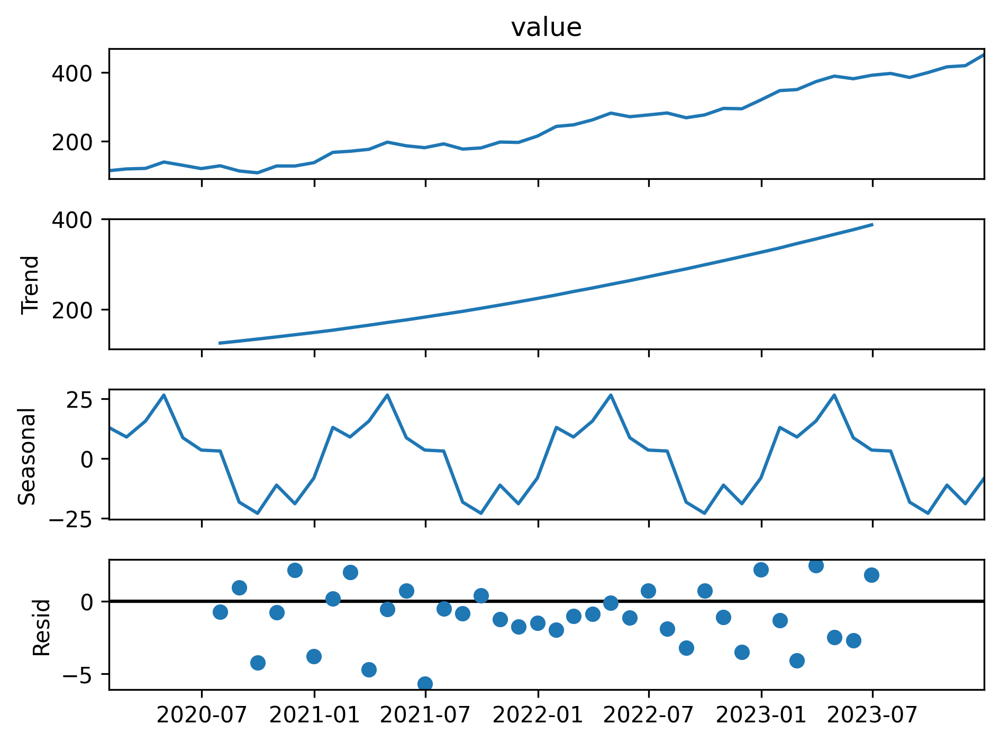
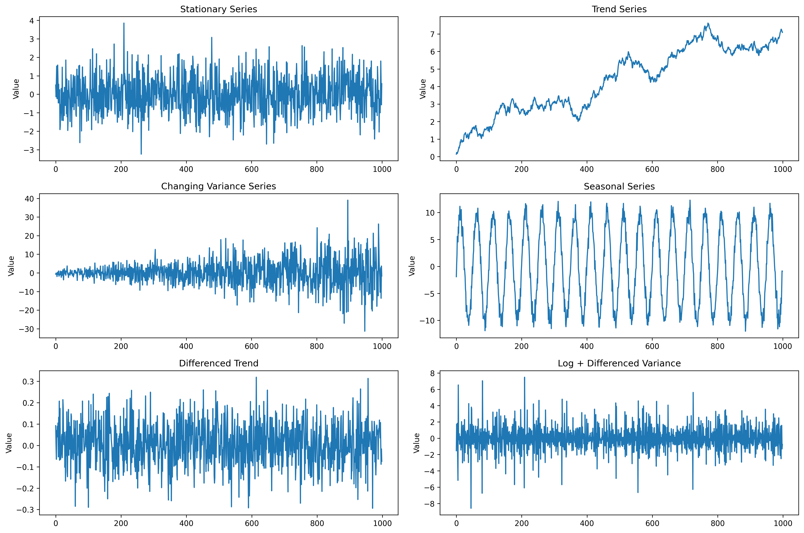
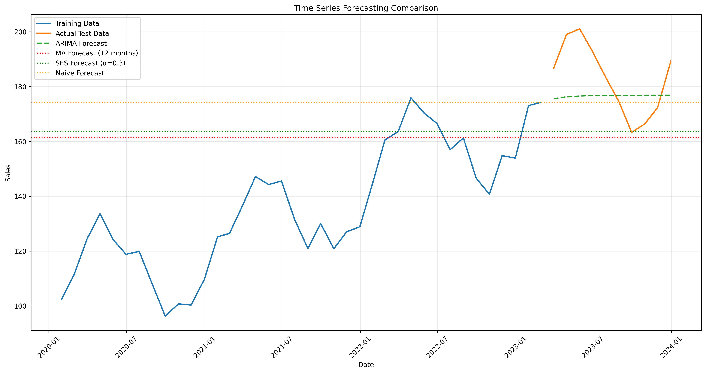
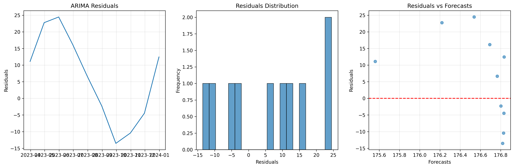

# Chapter 15: Time Series Analysis

## Overview

This chapter covers the fundamentals of Time Series Analysis, providing hands-on examples using real COVID-19 data from public APIs and realistic simulated datasets.

## Key Concepts Covered

### 1. Time Series Fundamentals

- **Time Series Components**: Trend, seasonality, cycles, and noise
- **Data Characteristics**: Temporal dependencies and patterns
- **Stationarity**: Understanding and testing for stationarity
- **Time Series Types**: Continuous, discrete, and event-based series

### 2. Time Series Components Analysis

- **Trend Analysis**: Identifying long-term patterns and directions
- **Seasonal Decomposition**: Breaking down seasonal patterns
- **Cyclical Patterns**: Understanding business and economic cycles
- **Noise and Randomness**: Separating signal from noise

### 3. Stationarity and Transformations

- **Stationarity Tests**: Augmented Dickey-Fuller (ADF) and KPSS tests
- **Differencing**: Making series stationary through differencing
- **Log Transformations**: Stabilizing variance in time series
- **Box-Cox Transformations**: Advanced variance stabilization

### 4. Time Series Forecasting

- **Moving Averages**: Simple and weighted moving averages
- **Exponential Smoothing**: Single, double, and triple exponential smoothing
- **ARIMA Models**: Autoregressive Integrated Moving Average models
- **Model Evaluation**: MSE, RMSE, MAE, and MAPE metrics

## Real Data Implementation

### Data Sources Used

1. **COVID-19 Historical Data**: Real pandemic data from disease.sh API

   - Source: disease.sh/v3/covid-19/historical/all
   - Features: Daily cases, deaths, and recoveries
   - Purpose: Demonstrate real-world time series analysis

2. **Weather Data Simulation**: Realistic weather patterns

   - Features: Temperature, humidity, and precipitation trends
   - Purpose: Show seasonal and cyclical patterns

3. **Economic Data Simulation**: Realistic economic indicators
   - Features: GDP growth, unemployment rates, inflation
   - Purpose: Demonstrate trend and cycle analysis

### Code Examples

- Real COVID-19 data loading and preprocessing
- Time series decomposition and analysis
- Stationarity testing and transformations
- Forecasting model implementation and evaluation

## Generated Outputs

### stationarity_analysis.png

This visualization shows:

- Original time series plots
- Stationarity test results
- Transformation effects
- Component decomposition

### time_series_forecasting.png

This visualization shows:

- Forecasting model results
- Prediction intervals
- Model performance comparison
- Forecast accuracy metrics

### forecast_residuals.png

This visualization shows:

- Residual analysis plots
- Model diagnostics
- Error distribution
- Forecast validation

### Generated Visualizations

This chapter generates multiple visualizations:

#### 1. Time Series Components

- Time series decomposition and components

#### 2. Seasonal Decomposition

- Seasonal pattern analysis and decomposition

#### 3. Stationarity Analysis

- Time series stationarity testing

#### 4. Time Series Forecasting

- Time series forecasting models and predictions

#### 5. Forecast Residuals

- Forecasting model residual analysis

### Generated Visualizations

This chapter generates multiple visualizations:

#### 1. Time Series Components

- Time series decomposition and components

#### 2. Seasonal Decomposition

- Seasonal pattern analysis and decomposition

#### 3. Stationarity Analysis

- Time series stationarity testing

#### 4. Time Series Forecasting

- Time series forecasting models and predictions

#### 5. Forecast Residuals

- Forecasting model residual analysis

## Key Takeaways

- Real COVID-19 data provides meaningful time series analysis examples
- Proper stationarity testing is crucial for forecasting accuracy
- Time series decomposition reveals underlying patterns
- Multiple forecasting methods should be compared for best results
- Real-world data presents unique challenges and opportunities

## Practical Applications

- Economic forecasting and trend analysis
- Weather prediction and climate modeling
- Sales forecasting and demand planning
- Healthcare monitoring and disease tracking
- Financial market analysis and prediction

## Next Steps

- Explore advanced time series models (SARIMA, VAR)
- Implement machine learning approaches (LSTM, Prophet)
- Work with multivariate time series
- Apply time series analysis to domain-specific problems
