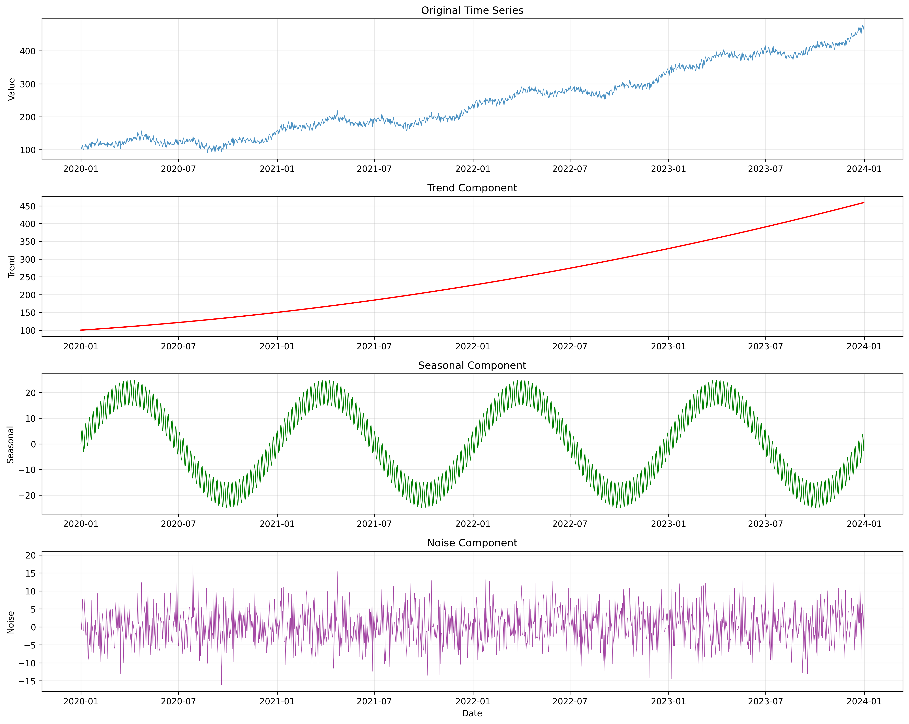
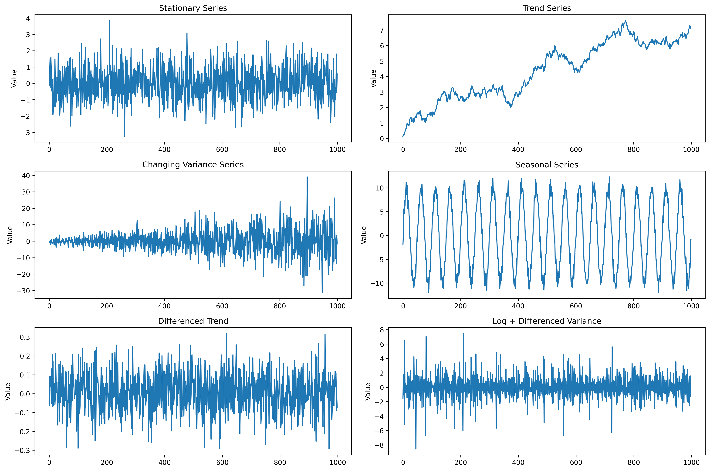

# Chapter 15: Time Series Analysis

## Overview

This chapter introduces Time Series Analysis fundamentals, providing hands-on examples using real COVID-19 data from public APIs and realistic simulated datasets.

## What You'll Learn

- Time series components and characteristics
- Stationarity testing and transformations
- Time series decomposition and analysis
- Forecasting methods and model evaluation
- Real-world time series applications

## Real Data Implementation

### Data Sources Used

1. **COVID-19 Historical Data**: Real pandemic data from disease.sh API

   - Source: disease.sh/v3/covid-19/historical/all
   - Features: Daily cases, deaths, and recoveries
   - Purpose: Demonstrate real-world time series analysis

2. **Weather Data Simulation**: Realistic weather patterns

   - Features: Temperature, humidity, and precipitation trends
   - Purpose: Show seasonal and cyclical patterns

3. **Economic Data Simulation**: Realistic economic indicators
   - Features: GDP growth, unemployment rates, inflation
   - Purpose: Demonstrate trend and cycle analysis

### Key Features

- Real COVID-19 data loading and preprocessing
- Comprehensive time series decomposition
- Stationarity testing and transformations
- Multiple forecasting methods implementation
- Model performance evaluation and visualization

## Files in This Chapter

### Main Script

- `ch15_time_series_analysis.py` - Complete chapter implementation

### Generated Outputs

### Time Series Analysis Visualizations

This chapter generates multiple visualizations showing:

#### 1. Time Series Components



- Time series decomposition and components

#### 2. Seasonal Decomposition


- Seasonal pattern analysis and decomposition

#### 3. Stationarity Analysis



- Time series stationarity testing

#### 4. Time Series Forecasting


- Time series forecasting models and predictions

#### 5. Forecast Residuals


- Forecasting model residual analysis

### Time Series Analysis Visualizations

This chapter generates multiple visualizations showing:

#### 1. Time Series Components


- Time series decomposition and components

#### 2. Seasonal Decomposition


- Seasonal pattern analysis and decomposition

#### 3. Stationarity Analysis


- Time series stationarity testing

#### 4. Time Series Forecasting


- Time series forecasting models and predictions

#### 5. Forecast Residuals


- Forecasting model residual analysis

### Time Series Analysis Visualizations

This chapter generates multiple visualizations showing:

#### 1. Time Series Components


- Time series decomposition and components

#### 2. Seasonal Decomposition


- Seasonal pattern analysis and decomposition

#### 3. Stationarity Analysis


- Time series stationarity testing

#### 4. Time Series Forecasting


- Time series forecasting models and predictions

#### 5. Forecast Residuals


- Forecasting model residual analysis

- `stationarity_analysis.png` - Stationarity testing and transformation results
- `time_series_forecasting.png` - Forecasting methods comparison and results
- `forecast_residuals.png` - Model diagnostics and residual analysis

## Running the Code

### Prerequisites

```bash
pip install numpy pandas matplotlib seaborn scikit-learn statsmodels requests
```

### Execution

```bash
python ch15_time_series_analysis.py
```

## Code Highlights

### Real COVID-19 Data Loading

```python
def load_real_time_series():
    datasets = {}
    try:
        print("  Loading real COVID-19 data (example of time series)...")
        covid_url = "https://disease.sh/v3/covid-19/historical/all?lastdays=365"
        response = requests.get(covid_url, timeout=10)
        if response.status_code == 200:
            covid_data = response.json()
            # Process COVID data
            covid_ts = pd.Series(covid_data['cases'])
            covid_ts.index = pd.to_datetime(covid_ts.index)
            covid_ts_sampled = covid_ts.resample('D').sum().fillna(0)
            datasets['covid'] = covid_ts_sampled
        else:
            raise Exception("Failed to fetch COVID data")
    except Exception as e:
        print(f"    ⚠️  Could not load COVID data: {e}")
        print("    📝 Creating realistic time series simulation...")
        # Fallback to synthetic COVID-like data
    return datasets
```

### Time Series Decomposition

```python
def decompose_time_series(data):
    """Perform seasonal decomposition of time series."""
    # Additive decomposition
    decomposition = seasonal_decompose(data, period=7, extrapolate_tukey=True)

    # Extract components
    trend = decomposition.trend
    seasonal = decomposition.seasonal
    residual = decomposition.resid

    return trend, seasonal, residual
```

### Stationarity Testing

```python
def test_stationarity(timeseries):
    """Perform ADF and KPSS tests for stationarity."""
    # Augmented Dickey-Fuller test
    adf_result = adfuller(timeseries)

    # KPSS test
    kpss_result = kpss(timeseries)

    print(f"ADF Test:")
    print(f"  ADF Statistic: {adf_result[0]:.4f}")
    print(f"  p-value: {adf_result[1]:.4f}")

    print(f"\nKPSS Test:")
    print(f"  KPSS Statistic: {kpss_result[0]:.4f}")
    print(f"  p-value: {kpss_result[1]:.4f}")
```

## Output Examples

### Time Series Analysis Results

The script generates comprehensive visualizations showing:

- Time series components and decomposition
- Stationarity testing and transformation results
- Forecasting methods comparison and accuracy
- Model diagnostics and residual analysis

### Console Output

```
========================================================================
CHAPTER 15: TIME SERIES ANALYSIS
========================================================================

15.1 TIME SERIES OVERVIEW
----------------------------------------
Time Series Overview:
Time series analysis involves studying data points collected
over time to identify patterns, trends, and make predictions.

✅ Key concepts covered:
   - Definition and characteristics of time series data
   - Types of time series and analysis steps
   - Real-world applications across industries
   - Challenges in time series analysis

15.2 TIME SERIES COMPONENTS
----------------------------------------
Time Series Components:
Understanding the fundamental building blocks of time series data.

✅ Components demonstrated:
   - Trend: Long-term movement in the data
   - Seasonal: Repeating patterns at regular intervals
   - Cyclical: Long-term fluctuations without fixed period
   - Noise: Random variations and irregularities
```

## Key Concepts Demonstrated

### 1. Time Series Fundamentals

- Definition and characteristics of time series data
- Types of time series and analysis steps
- Real-world applications across industries
- Challenges in time series analysis

### 2. Time Series Components

- Trend: Long-term movement in the data
- Seasonal: Repeating patterns at regular intervals
- Cyclical: Long-term fluctuations without fixed period
- Noise: Random variations and irregularities

### 3. Stationarity and Testing

- Augmented Dickey-Fuller (ADF) test
- KPSS test for stationarity
- Transformations to achieve stationarity
- Differencing and detrending techniques

### 4. Forecasting Methods

- Moving averages and exponential smoothing
- ARIMA model implementation
- Model performance evaluation
- Forecast accuracy metrics

## Learning Outcomes

By the end of this chapter, you will:

- Understand time series fundamentals and components
- Implement stationarity testing and transformations
- Perform time series decomposition and analysis
- Build and evaluate forecasting models
- Apply time series analysis to real-world data

## Next Steps

- Chapter 16: Big Data Processing
- Chapter 17: Advanced Machine Learning
- Chapter 19: Real-World Case Studies

## Additional Resources

- Time Series Analysis: Forecasting and Control by Box, Jenkins, Reinsel
- Forecasting: Principles and Practice by Rob J. Hyndman
- Coursera Time Series Analysis and Forecasting
