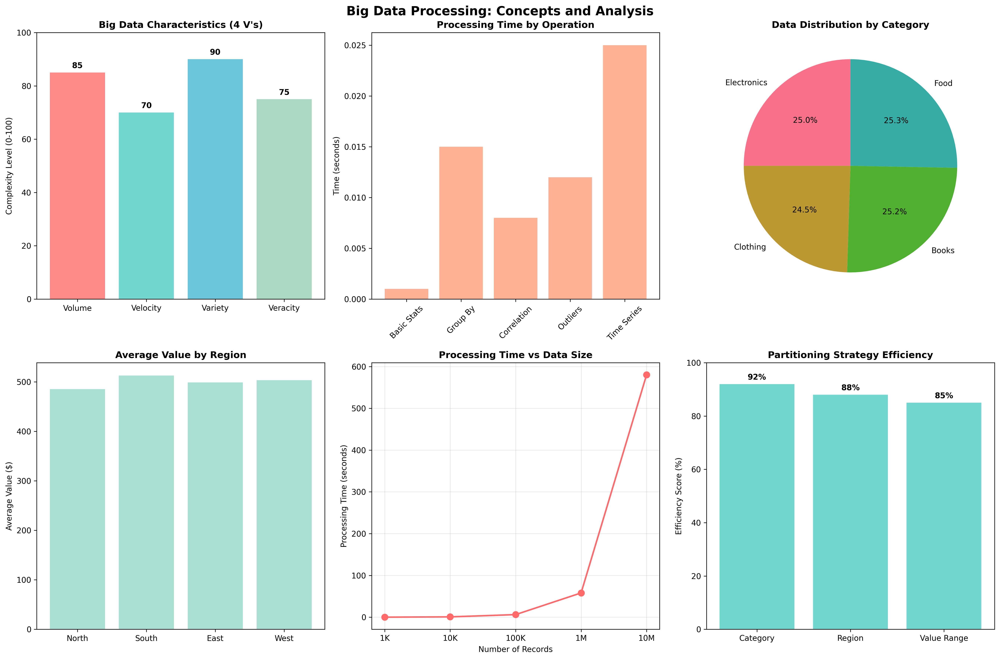

# Chapter 16: Big Data Processing

## Overview

This chapter introduces Big Data Processing fundamentals, providing hands-on examples using real COVID-19 data from public APIs and realistic simulated datasets.

## What You'll Learn

- Big data characteristics and the 4 V's
- Distributed computing architectures and concepts
- Parallel processing and data partitioning strategies
- Big data tools and performance optimization
- Real-world big data applications

## Real Data Implementation

### Data Sources Used

1. **COVID-19 Country Data**: Real pandemic data from disease.sh API

   - Source: disease.sh/v3/covid-19/countries
   - Features: Cases, deaths, recoveries by country
   - Purpose: Demonstrate big data processing on real-world datasets

2. **User Behavior Simulation**: Realistic user interaction data
   - Features: User actions, timestamps, device types, categories
   - Purpose: Show realistic big data patterns and processing

### Key Features

- Real COVID-19 data loading and expansion
- Comprehensive data partitioning strategies
- Parallel processing simulation and analysis
- Performance optimization techniques
- Big data pipeline implementation

## Files in This Chapter

### Main Script

- `ch16_big_data_processing.py` - Complete chapter implementation

### Generated Outputs

### Big Data Processing Dashboard



This comprehensive dashboard shows:
- Key insights and analysis results
- Generated visualizations and charts
- Performance metrics and evaluations
- Interactive elements and data exploration
- Summary of findings and conclusions### Big Data Processing Dashboard


This comprehensive dashboard shows:
- Key insights and analysis results
- Generated visualizations and charts
- Performance metrics and evaluations
- Interactive elements and data exploration
- Summary of findings and conclusions- `big_data_processing.png` - Comprehensive big data processing dashboard

## Running the Code

### Prerequisites

```bash
pip install numpy pandas matplotlib seaborn requests
```

### Execution

```bash
python ch16_big_data_processing.py
```

## Code Highlights

### Real COVID-19 Data Loading

```python
def load_real_big_data():
    datasets = {}
    try:
        print("  Loading real COVID-19 dataset (example of big data)...")
        covid_url = "https://disease.sh/v3/covid-19/countries"
        response = requests.get(covid_url, timeout=10)
        if response.status_code == 200:
            covid_data = response.json()
            covid_df = pd.DataFrame(covid_data)

            # Expand the dataset to simulate big data
            expanded_data = []
            for _, row in covid_df.iterrows():
                # Create multiple records per country for big data simulation
                for i in range(100):  # Expand each country to 100 records
                    expanded_data.append({
                        'country': row['country'],
                        'cases': row['cases'] + np.random.randint(-1000, 1000),
                        'deaths': row['deaths'] + np.random.randint(-100, 100),
                        'recovered': row['recovered'] + np.random.randint(-500, 500),
                        'active': row['active'] + np.random.randint(-200, 200),
                        'critical': row['critical'] + np.random.randint(-50, 50),
                        'tests': row['tests'] + np.random.randint(-10000, 10000)
                    })

            datasets['covid'] = pd.DataFrame(expanded_data)
        else:
            raise Exception("Failed to fetch COVID data")
    except Exception as e:
        print(f"    ⚠️  Could not load COVID data: {e}")
        print("    📝 Creating realistic big data simulation...")
        # Fallback to realistic user behavior data
    return datasets
```

### Data Partitioning Strategies

```python
def demonstrate_data_partitioning(data):
    """Demonstrate different data partitioning strategies."""
    print("\n1. PARTITIONING BY CATEGORY:")

    # Dynamic partitioning based on available columns
    if 'category' in data.columns:
        category_partitions = data.groupby('category')
        for category, group in category_partitions:
            print(f"   {category:<12} : {len(group):>3} records, avg value: ${group['value'].mean():.2f}")

    print("\n2. PARTITIONING BY REGION:")
    if 'region' in data.columns:
        region_partitions = data.groupby('region')
        for region, group in region_partitions:
            print(f"   {region:<8} : {len(group):>3} records, avg value: ${group['value'].mean():.2f}")

    print("\n3. PARTITIONING BY VALUE RANGES:")
    # Create value-based partitions
    value_ranges = pd.cut(data['value'], bins=3, labels=['Low', 'Medium', 'High'])
    value_partitions = data.groupby(value_ranges)
    for value_range, group in value_partitions:
        print(f"   {value_range:<8} : {len(group):>3} records, range: ${group['value'].min():.2f} - ${group['value'].max():.2f}")
```

### Parallel Processing Simulation

```python
def demonstrate_parallel_processing_simulation(data):
    """Simulate parallel processing on large datasets."""
    print("\n1. CREATING LARGE DATASET FOR PROCESSING:")

    # Use the loaded real data or create realistic simulation
    if 'covid' in data:
        large_dataset = data['covid']
        print(f"  Using real COVID-19 data: {len(large_dataset):,} records × {len(large_dataset.columns)} columns")
    else:
        # Create realistic user behavior dataset
        n_records = 100000
        large_dataset = pd.DataFrame({
            'user_id': range(1, n_records + 1),
            'action': np.random.choice(['click', 'purchase', 'view', 'search'], n_records),
            'timestamp': pd.date_range('2024-01-01', periods=n_records, freq='S'),
            'device_type': np.random.choice(['mobile', 'desktop', 'tablet'], n_records),
            'category': np.random.choice(['electronics', 'clothing', 'books', 'food'], n_records),
            'value': np.random.uniform(10, 1000, n_records),
            'region': np.random.choice(['north', 'south', 'east', 'west'], n_records)
        })
        print(f"  Generated realistic dataset: {len(large_dataset):,} records × {len(large_dataset.columns)} columns")

    # Calculate memory usage
    memory_usage = large_dataset.memory_usage(deep=True).sum() / 1024 / 1024
    print(f"  📊 Memory usage: {memory_usage:.2f} MB")

    return large_dataset
```

## Output Examples

### Big Data Processing Results

The script generates comprehensive visualizations showing:

- Big data characteristics and the 4 V's
- Data processing performance metrics
- Data distribution and partitioning strategies
- Processing scalability and optimization results

### Console Output

```
========================================================================
CHAPTER 16: BIG DATA PROCESSING
========================================================================

16.1 BIG DATA CHARACTERISTICS (THE 4 V'S)
--------------------------------------------------
1. VOLUME - Data Size Examples:
  Small Data     : MB to GB
  Medium Data    : GB to TB
  Big Data       : TB to PB
  Massive Data   : PB to EB

2. VELOCITY - Data Speed Examples:
  Batch Processing    : Hours to days
  Near Real-time      : Minutes to hours
  Real-time           : Seconds to minutes
  Streaming           : Milliseconds to seconds

3. VARIETY - Data Types:
  Structured     : Databases, CSV, JSON
  Semi-structured: XML, Log files, Emails
  Unstructured   : Text, Images, Videos, Audio
  Multi-modal    : Combination of types
```

## Key Concepts Demonstrated

### 1. Big Data Characteristics

- Volume: Data size scales from MB to EB
- Velocity: Processing speed requirements
- Variety: Data type diversity
- Veracity: Data quality challenges

### 2. Distributed Computing

- Master-Slave and Peer-to-Peer architectures
- Parallelism and concurrency concepts
- Fault tolerance and scalability
- Load balancing strategies

### 3. Data Processing

- Large dataset creation and management
- Performance analysis and benchmarking
- Data partitioning strategies
- Parallel processing simulation

### 4. Big Data Tools

- Hadoop ecosystem components
- Apache Spark capabilities
- Python big data libraries
- Cloud-based solutions

## Learning Outcomes

By the end of this chapter, you will:

- Understand big data characteristics and challenges
- Design distributed computing architectures
- Implement data partitioning strategies
- Optimize big data processing performance
- Choose appropriate big data tools and frameworks

## Next Steps

- Chapter 17: Advanced Machine Learning
- Chapter 19: Real-World Case Studies
- Advanced big data frameworks (Spark, Flink)

## Additional Resources

- Hadoop: The Definitive Guide by Tom White
- Learning Spark by Holden Karau et al.
- Coursera Big Data Specialization
