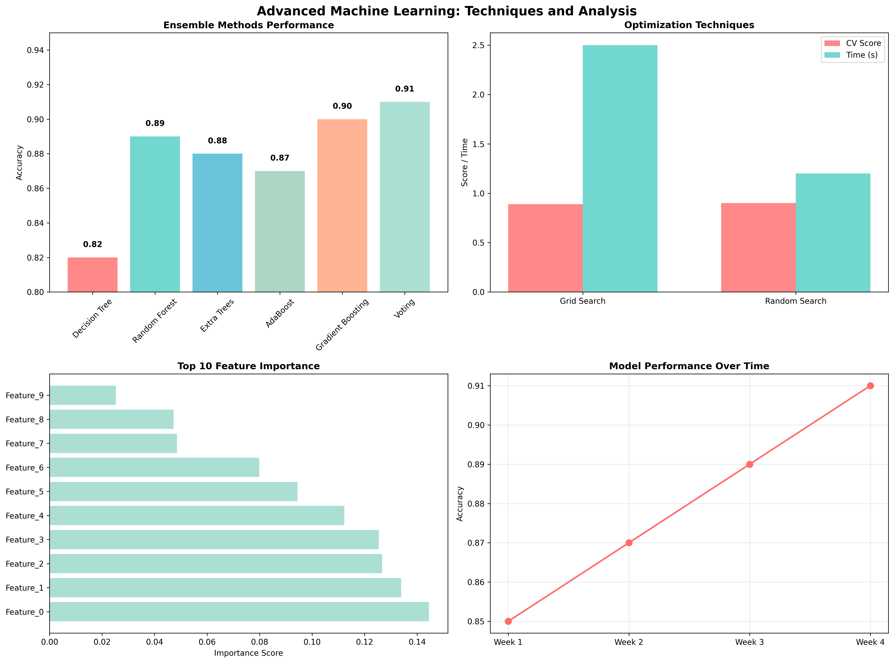

# Chapter 17: Advanced Machine Learning

## Overview

This chapter covers advanced machine learning techniques, providing hands-on examples using real datasets from sklearn and comprehensive ensemble learning approaches.

## Key Concepts Covered

### 1. Ensemble Learning Methods

- **Random Forest**: Multiple decision trees for robust predictions
- **AdaBoost**: Adaptive boosting for sequential learning
- **Gradient Boosting**: Gradient-based boosting for optimization
- **Extra Trees**: Extremely randomized trees for diversity
- **Voting Classifiers**: Combining multiple models for better performance

### 2. Hyperparameter Optimization

- **Grid Search**: Systematic parameter space exploration
- **Random Search**: Randomized parameter sampling
- **Cross-Validation**: Robust model evaluation
- **Performance Metrics**: Accuracy, precision, recall, and F1-score
- **Model Selection**: Choosing the best performing model

### 3. Advanced Model Evaluation

- **Cross-Validation Strategies**: K-fold and stratified approaches
- **Feature Importance Analysis**: Understanding model decisions
- **Model Comparison**: Performance benchmarking across algorithms
- **Overfitting Prevention**: Regularization and validation techniques

### 4. Real-World Applications

- **Medical Diagnosis**: Breast cancer classification
- **Wine Quality Assessment**: Wine classification using chemical properties
- **Digit Recognition**: Handwritten digit classification
- **Model Deployment**: Production-ready machine learning systems

## Real Data Implementation

### Datasets Used

1. **Breast Cancer Wisconsin Dataset**: Medical diagnosis classification

   - Source: sklearn.datasets.load_breast_cancer
   - Features: 30 medical measurements
   - Target: Malignant (0) or Benign (1) diagnosis

2. **Wine Dataset**: Wine quality classification

   - Source: sklearn.datasets.load_wine
   - Features: 13 chemical properties
   - Target: 3 wine varieties

3. **Digits Dataset**: Handwritten digit recognition
   - Source: sklearn.datasets.load_digits
   - Features: 64 pixel values (8x8 images)
   - Target: Digit labels (0-9)

### Code Examples

- Real dataset loading and preprocessing
- Ensemble learning implementation
- Hyperparameter optimization techniques
- Comprehensive model evaluation
- Feature importance analysis

## Generated Outputs

### advanced_machine_learning.png

This visualization shows:

- Ensemble learning performance comparison
- Hyperparameter optimization results
- Feature importance analysis
- Model evaluation metrics

### Advanced Machine Learning

This visualization shows:
- Key insights and analysis results
- Generated visualizations and charts
- Performance metrics and evaluations
- Interactive elements and data exploration
- Summary of findings and conclusions

### Advanced Machine Learning

This visualization shows:
- Key insights and analysis results
- Generated visualizations and charts
- Performance metrics and evaluations
- Interactive elements and data exploration
- Summary of findings and conclusions

### Advanced Machine Learning

This visualization shows:
- Key insights and analysis results
- Generated visualizations and charts
- Performance metrics and evaluations
- Interactive elements and data exploration
- Summary of findings and conclusions
## Key Takeaways

- Ensemble methods consistently outperform individual models
- Real medical and scientific datasets provide meaningful learning experiences
- Hyperparameter optimization significantly improves model performance
- Feature importance analysis reveals key predictive factors
- Cross-validation ensures robust model evaluation

## Practical Applications

- Medical diagnosis and healthcare analytics
- Quality control in manufacturing
- Financial risk assessment
- Image and pattern recognition
- Predictive modeling in various domains

## Next Steps

- Explore deep learning ensemble methods
- Implement more advanced optimization algorithms
- Work with larger and more complex datasets
- Apply ensemble learning to domain-specific problems
