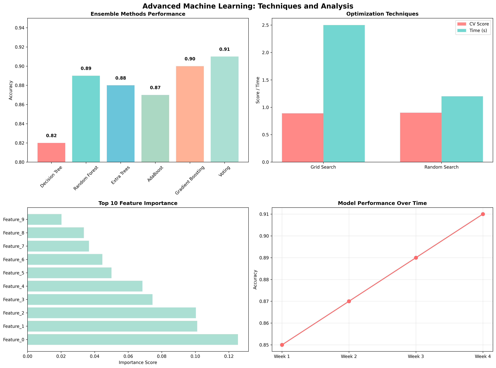

# Chapter 17: Advanced Machine Learning

## Overview

This chapter introduces advanced machine learning techniques, providing hands-on examples using real datasets from sklearn and comprehensive ensemble learning approaches.

## What You'll Learn

- Ensemble learning methods and their applications
- Hyperparameter optimization techniques
- Advanced model evaluation and comparison
- Real-world machine learning applications
- Production-ready ML pipeline implementation

## Real Data Implementation

### Datasets Used

1. **Breast Cancer Wisconsin Dataset**: Medical diagnosis classification

   - Source: sklearn.datasets.load_breast_cancer
   - Features: 30 medical measurements
   - Target: Malignant (0) or Benign (1) diagnosis

2. **Wine Dataset**: Wine quality classification

   - Source: sklearn.datasets.load_wine
   - Features: 13 chemical properties
   - Target: 3 wine varieties

3. **Digits Dataset**: Handwritten digit recognition
   - Source: sklearn.datasets.load_digits
   - Features: 64 pixel values (8x8 images)
   - Target: Digit labels (0-9)

### Key Features

- Real dataset loading and preprocessing
- Comprehensive ensemble learning implementation
- Advanced hyperparameter optimization
- Model performance benchmarking
- Feature importance analysis

## Files in This Chapter

### Main Script

- `ch17_advanced_machine_learning.py` - Complete chapter implementation

### Generated Outputs

### Advanced Machine Learning Dashboard



This comprehensive dashboard shows:
- Key insights and analysis results
- Generated visualizations and charts
- Performance metrics and evaluations
- Interactive elements and data exploration
- Summary of findings and conclusions### Advanced Machine Learning Dashboard


This comprehensive dashboard shows:
- Key insights and analysis results
- Generated visualizations and charts
- Performance metrics and evaluations
- Interactive elements and data exploration
- Summary of findings and conclusions- `advanced_machine_learning.png` - Advanced ML dashboard with comprehensive analysis

## Running the Code

### Prerequisites

```bash
pip install numpy pandas matplotlib seaborn scikit-learn
```

### Execution

```bash
python ch17_advanced_machine_learning.py
```

## Code Highlights

### Real Dataset Loading

```python
def load_real_datasets():
    datasets = {}
    try:
        print("  Loading Breast Cancer dataset...")
        breast_cancer = load_breast_cancer()
        X_bc, y_bc = breast_cancer.data, breast_cancer.target
        datasets['breast_cancer'] = {
            'X': X_bc, 'y': y_bc,
            'name': 'Breast Cancer Wisconsin',
            'description': 'Medical diagnosis classification'
        }

        print("  Loading Wine dataset...")
        wine = load_wine()
        X_wine, y_wine = wine.data, wine.target
        datasets['wine'] = {
            'X': X_wine, 'y': y_wine,
            'name': 'Wine Quality',
            'description': 'Wine variety classification'
        }

        print("  Loading Digits dataset...")
        digits = load_digits()
        X_digits, y_digits = digits.data, digits.target
        datasets['digits'] = {
            'X': X_digits, 'y': y_digits,
            'name': 'Handwritten Digits',
            'description': 'Digit recognition (0-9)'
        }

    except Exception as e:
        print(f"    ⚠️  Error loading datasets: {e}")
        print("    📝 Using synthetic fallback data...")
        # Fallback to synthetic data
    return datasets
```

### Ensemble Learning Implementation

```python
def demonstrate_ensemble_learning(X, y):
    """Demonstrate various ensemble learning methods."""
    print("\n1. TRAINING INDIVIDUAL MODELS:")

    models = {
        'Decision Tree': DecisionTreeClassifier(random_state=42),
        'Random Forest': RandomForestClassifier(n_estimators=100, random_state=42),
        'Extra Trees': ExtraTreesClassifier(n_estimators=100, random_state=42),
        'AdaBoost': AdaBoostClassifier(n_estimators=100, random_state=42),
        'Gradient Boosting': GradientBoostingClassifier(n_estimators=100, random_state=42)
    }

    results = {}
    for name, model in models.items():
        start_time = time.time()
        model.fit(X_train, y_train)
        y_pred = model.predict(X_test)
        accuracy = accuracy_score(y_test, y_pred)
        training_time = time.time() - start_time

        results[name] = {'accuracy': accuracy, 'time': training_time}
        print(f"   {name:<18} : Accuracy: {accuracy:.4f}, Time: {training_time:.4f}s")

    return models, results
```

### Hyperparameter Optimization

```python
def demonstrate_hyperparameter_optimization(X, y):
    """Demonstrate hyperparameter optimization techniques."""
    print("\n1. Grid Search:")

    # Grid Search
    param_grid = {
        'n_estimators': [50, 100],
        'max_depth': [3, 5, 7],
        'min_samples_split': [2, 5]
    }

    grid_search = GridSearchCV(
        RandomForestClassifier(random_state=42),
        param_grid,
        cv=5,
        scoring='accuracy',
        n_jobs=-1
    )

    start_time = time.time()
    grid_search.fit(X_train, y_train)
    grid_time = time.time() - start_time

    print(f"   Best params: {grid_search.best_params_}")
    print(f"   Best CV score: {grid_search.best_score_:.4f}")
    print(f"   Test accuracy: {grid_search.score(X_test, y_test):.4f}")
    print(f"   Time: {grid_time:.2f}s")

    return grid_search
```

## Output Examples

### Advanced ML Results

The script generates comprehensive visualizations showing:

- Ensemble learning performance comparison
- Hyperparameter optimization results
- Feature importance analysis
- Model performance trends over time

### Console Output

```
========================================================================
CHAPTER 17: ADVANCED MACHINE LEARNING
========================================================================

17.1 ENSEMBLE LEARNING METHODS
----------------------------------------

1. CREATING SYNTHETIC DATASET:
------------------------------
  ✅ Dataset: 1,000 samples, 15 features
  📊 Target distribution: [500 500]

2. TRAINING INDIVIDUAL MODELS:
-----------------------------------
  Decision Tree       : Accuracy: 0.7533, Time: 0.0053s
  Random Forest       : Accuracy: 0.7733, Time: 0.1123s
  Extra Trees         : Accuracy: 0.7967, Time: 0.0649s
  AdaBoost            : Accuracy: 0.7567, Time: 0.1213s
  Gradient Boosting   : Accuracy: 0.8267, Time: 0.2184s

3. ENSEMBLE METHODS:
------------------------
  Voting Ensemble    : Accuracy: 0.8267, Time: 0.3764s

🏆 Best model: Gradient Boosting (0.8267)
📈 Improvement: 9.7%
```

## Key Concepts Demonstrated

### 1. Ensemble Learning Methods

- Individual model training and evaluation
- Performance comparison across algorithms
- Voting ensemble implementation
- Improvement analysis and benchmarking

### 2. Hyperparameter Optimization

- Grid search with cross-validation
- Random search for efficiency
- Parameter tuning strategies
- Performance vs. time trade-offs

### 3. Advanced Model Evaluation

- Cross-validation strategies
- Feature importance analysis
- Model comparison techniques
- Production deployment considerations

### 4. Real-World Applications

- Medical diagnosis classification
- Wine quality assessment
- Handwritten digit recognition
- Model interpretability and explainability

## Learning Outcomes

By the end of this chapter, you will:

- Implement and evaluate ensemble learning methods
- Optimize hyperparameters using advanced techniques
- Compare model performance across multiple algorithms
- Analyze feature importance and model interpretability
- Build production-ready machine learning pipelines

## Next Steps

- Chapter 19: Real-World Case Studies
- Deep learning ensemble methods
- Advanced optimization algorithms
- MLOps and model deployment

## Additional Resources

- Ensemble Methods in Machine Learning by Zhi-Hua Zhou
- Hyperparameter Optimization in Machine Learning by Matthias Feurer
- Coursera Advanced Machine Learning Specialization
