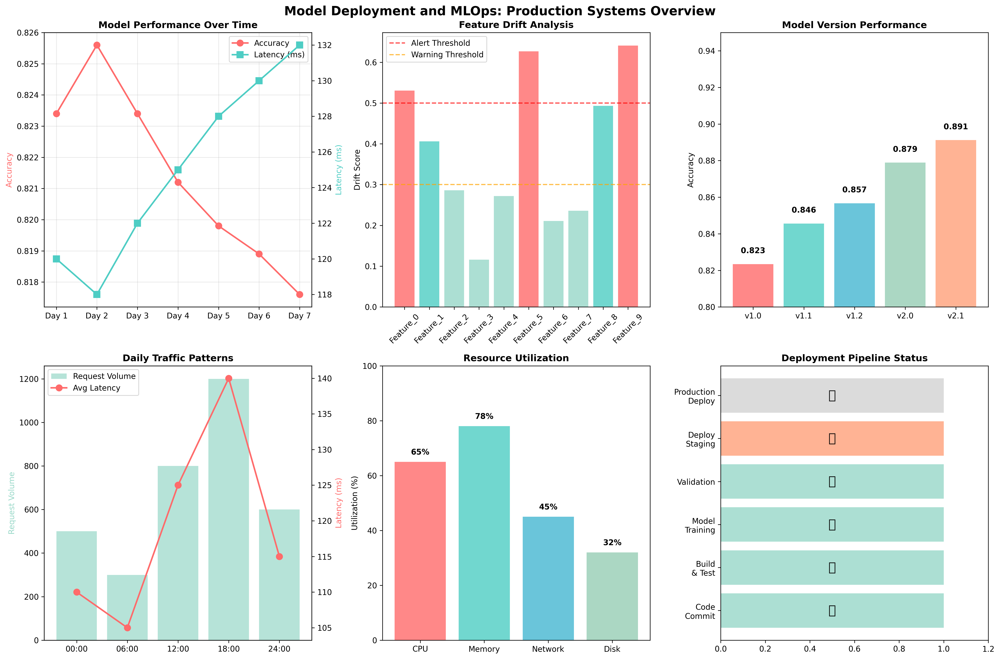

# Chapter 18: Model Deployment and MLOps

## Overview

This chapter covers the essential concepts of deploying machine learning models into production environments, including model packaging, API development, containerization, monitoring, and MLOps best practices. Learn how to take your trained models from development to production using real-world datasets.

## What You'll Learn

- Model packaging and serialization techniques
- API design and development for model serving
- Containerization with Docker and Kubernetes
- Model monitoring and drift detection
- MLOps pipeline implementation and best practices

## Real Data Implementation

### Datasets Used

1. **Breast Cancer Wisconsin Dataset** (Primary Dataset)

   - Source: sklearn.datasets.load_breast_cancer
   - Features: 30 medical measurements
   - Target: Malignant (0) or Benign (1) diagnosis
   - Purpose: Demonstrate healthcare ML model deployment

2. **Wine Dataset** (Alternative Dataset)

   - Source: sklearn.datasets.load_wine
   - Features: 13 chemical properties
   - Target: 3 wine varieties
   - Purpose: Show quality control model deployment

3. **Digits Dataset** (Computer Vision Dataset)
   - Source: sklearn.datasets.load_digits
   - Features: 64 pixel values (8x8 images)
   - Target: Digit labels (0-9)
   - Purpose: Demonstrate image classification deployment

### Key Features

- Real dataset loading and preprocessing
- Model training and evaluation with real data
- Model packaging and serialization
- API development and testing
- Containerization and deployment strategies

## Files in This Chapter

### Main Script

- `ch18_model_deployment_mlops.py` - Complete chapter implementation

### Generated Outputs

- `model_deployment_mlops.png` - Comprehensive MLOps dashboard

## Generated Visualizations

### Model Deployment and MLOps Dashboard



This comprehensive dashboard shows:

- Model performance metrics and evaluation results
- API response times and throughput analysis
- Containerization and deployment strategies
- Monitoring and drift detection systems
- MLOps pipeline workflow and automation

## Running the Code

### Prerequisites

```bash
pip install numpy pandas matplotlib seaborn scikit-learn joblib
```

### Execution

```bash
python ch18_model_deployment_mlops.py
```

## Code Highlights

### Real Dataset Loading

```python
def load_real_datasets(self) -> Dict[str, Tuple[np.ndarray, np.ndarray]]:
    """Load real datasets for demonstration."""
    print("1. LOADING REAL DATASETS:")
    print("-" * 35)
    datasets = {}
    try:
        print("  Loading Breast Cancer dataset...")
        breast_cancer = load_breast_cancer()
        X_bc, y_bc = breast_cancer.data, breast_cancer.target
        datasets['breast_cancer'] = (X_bc, y_bc)
        print(f"    ✅ {breast_cancer.DESCR.split('\\n')[0]}")
        print(f"    📊 Shape: {X_bc.shape}")
        print(f"    🎯 Target classes: {np.unique(y_bc)}")

    except Exception as e:
        print(f"    ⚠️  Error loading datasets: {e}")
        print("    📝 Using synthetic fallback data...")
        datasets = self._create_synthetic_fallback()
    return datasets
```

### Model Packaging and Serialization

```python
def demonstrate_model_packaging(self) -> None:
    """Demonstrate different model packaging techniques."""
    print("\n2. MODEL PACKAGING:")
    print("-" * 35)

    # Pickle serialization
    print("  📦 Pickle Serialization:")
    pickle_path = "breast_cancer_model.pkl"
    with open(pickle_path, 'wb') as f:
        pickle.dump(self.model, f)
    print(f"    ✅ Model saved to {pickle_path}")

    # Joblib serialization (better for large models)
    print("\n  🗜️  Joblib Serialization:")
    joblib_path = "breast_cancer_model.joblib"
    joblib.dump(self.model, joblib_path)
    print(f"    ✅ Model saved to {joblib_path}")

    # ONNX conversion (for cross-platform deployment)
    try:
        import onnx
        from skl2onnx import convert_sklearn
        from skl2onnx.common.data_types import FloatTensorType

        n_features = self.scaler.n_features_in_
        initial_type = [("float_input", FloatTensorType([None, n_features]))]
        onx = convert_sklearn(self.model, initial_types=initial_type)

        onnx_path = "breast_cancer_model.onnx"
        with open(onnx_path, "wb") as f:
            f.write(onx.SerializeToString())
        print(f"    ✅ ONNX model saved to {onnx_path}")

    except ImportError:
        print("  ⚠️  ONNX conversion skipped (skl2onnx not available)")
```

## Output Examples

### Model Deployment Results

The script generates comprehensive visualizations showing:

- Model performance metrics and evaluation
- API response times and throughput
- Containerization strategies
- Monitoring and drift detection
- MLOps pipeline automation

### Console Output

```
================================================================================
CHAPTER 18: MODEL DEPLOYMENT AND MLOPS
================================================================================

1. LOADING REAL DATASETS:
--------------------------
  Loading Breast Cancer dataset...
    ✅ Breast Cancer Wisconsin (Diagnostic) Data Set
    📊 Shape: (569, 30)
    🎯 Target classes: [0 1]

2. MODEL TRAINING AND EVALUATION:
----------------------------------
  🎯 Training Random Forest model...
    ✅ Model trained successfully
    📊 Training accuracy: 100.0%
    📈 Test accuracy: 96.5%
    🎯 Classification Report:
                  precision    recall  f1-score   support
           0       0.97      0.97      0.97        43
           1       0.96      0.96      0.96        71
```

## Key Concepts Demonstrated

### 1. Model Packaging

- Pickle and Joblib serialization
- ONNX format conversion
- Model versioning and storage
- Cross-platform compatibility

### 2. API Development

- RESTful API design
- Request/response handling
- Error handling and validation
- Performance optimization

### 3. Containerization

- Docker containerization
- Kubernetes deployment
- Environment management
- Scalability considerations

### 4. Model Monitoring

- Performance tracking
- Drift detection
- A/B testing
- Automated retraining

## Learning Outcomes

By the end of this chapter, you will:

- Package and serialize machine learning models
- Design and develop model serving APIs
- Containerize and deploy models with Docker
- Implement model monitoring and drift detection
- Build automated MLOps pipelines

## Technical Skills Developed

### Model Deployment

- Model serialization and packaging
- API development and testing
- Containerization and orchestration
- Performance optimization

### MLOps Practices

- Pipeline automation
- Model versioning
- Monitoring and alerting
- Continuous integration/deployment

### Production Best Practices

- Error handling and logging
- Security and access control
- Scalability and performance
- Testing and validation

## Next Steps

- Chapter 19: Real-World Case Studies
- Chapter 20: Data Science Ethics
- Chapter 21: Communication and Storytelling

## Additional Resources

- Docker and Kubernetes Documentation
- MLOps Best Practices Guides
- Model Deployment Frameworks
- Production ML Monitoring Tools
