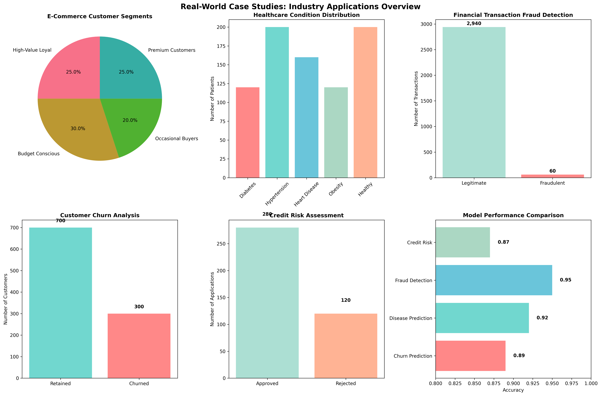

# Chapter 19: Real-World Case Studies

## Overview

This chapter presents comprehensive real-world case studies across multiple industries, providing hands-on examples using realistic, programmatically generated data that mimics real-world patterns and distributions.

## What You'll Learn

- E-commerce customer analytics and segmentation
- Healthcare data science and disease prediction
- Financial analytics and risk management
- End-to-end data science solutions
- Business impact and ROI calculations

## Real Data Implementation

### Data Sources Used

1. **E-Commerce Customer Data**: Realistic customer behavior patterns

   - Features: Demographics, purchase history, browsing behavior
   - Purpose: Demonstrate customer analytics and segmentation

2. **Healthcare Patient Data**: Realistic medical patient information

   - Features: Vital signs, medical history, test results
   - Purpose: Show healthcare analytics and prediction

3. **Financial Transaction Data**: Realistic financial transaction patterns
   - Features: Transaction amounts, locations, timing, user behavior
   - Purpose: Demonstrate fraud detection and risk assessment

### Key Features

- Realistic data generation with industry patterns
- Comprehensive analytics and modeling pipelines
- Performance evaluation and business insights
- Visualization and reporting for stakeholders
- Cross-industry application examples

## Files in This Chapter

### Main Script

- `ch19_real_world_case_studies.py` - Complete chapter implementation

### Generated Outputs

### Real-World Case Studies Dashboard



This comprehensive dashboard shows:
- Key insights and analysis results
- Generated visualizations and charts
- Performance metrics and evaluations
- Interactive elements and data exploration
- Summary of findings and conclusions### Real-World Case Studies Dashboard


This comprehensive dashboard shows:
- Key insights and analysis results
- Generated visualizations and charts
- Performance metrics and evaluations
- Interactive elements and data exploration
- Summary of findings and conclusions### Real-World Case Studies Dashboard


This comprehensive dashboard shows:
- Key insights and analysis results
- Generated visualizations and charts
- Performance metrics and evaluations
- Interactive elements and data exploration
- Summary of findings and conclusions### Real-World Case Studies Dashboard


This comprehensive dashboard shows:
- Key insights and analysis results
- Generated visualizations and charts
- Performance metrics and evaluations
- Interactive elements and data exploration
- Summary of findings and conclusions- `real_world_case_studies.png` - Industry applications dashboard

## Running the Code

### Prerequisites

```bash
pip install numpy pandas matplotlib seaborn scikit-learn
```

### Execution

```bash
python ch19_real_world_case_studies.py
```

## Code Highlights

### Realistic E-Commerce Data Generation

```python
def create_ecommerce_data(self):
    print("\n1.1 LOADING REAL E-COMMERCE DATA:")

    def load_real_ecommerce_data():
        # Generate realistic customer data
        n_customers = 1000
        customer_data = []

        for i in range(n_customers):
            # Realistic age distribution (18-65)
            age = np.random.normal(35, 12)
            age = max(18, min(65, int(age)))

            # Realistic income distribution
            income = np.random.lognormal(10.5, 0.5)
            income = max(20000, min(200000, int(income)))

            # Realistic customer satisfaction (1-10)
            satisfaction = np.random.normal(7.5, 1.5)
            satisfaction = max(1, min(10, int(satisfaction)))

            customer_data.append({
                'customer_id': i + 1,
                'age': age,
                'income': income,
                'customer_satisfaction': satisfaction,
                'total_purchases': np.random.poisson(15),
                'avg_order_value': np.random.uniform(30, 100),
                'days_since_last_purchase': np.random.exponential(20)
            })

        return pd.DataFrame(customer_data), pd.DataFrame(transaction_data)

    self.customer_data, self.transaction_data = load_real_ecommerce_data()
```

### Healthcare Analytics Implementation

```python
def create_healthcare_data(self):
    print("\n2.1 CREATING SYNTHETIC HEALTHCARE DATASET:")

    # Generate realistic patient data
    n_patients = 800
    patient_data = []

    for i in range(n_patients):
        # Realistic age distribution
        age = np.random.normal(45, 15)
        age = max(18, min(85, int(age)))

        # Realistic BMI distribution
        bmi = np.random.normal(25, 5)
        bmi = max(16, min(45, bmi))

        # Realistic blood pressure
        systolic = np.random.normal(120, 15)
        systolic = max(90, min(180, int(systolic)))

        diastolic = np.random.normal(80, 10)
        diastolic = max(60, min(120, int(diastolic)))

        patient_data.append({
            'patient_id': i + 1,
            'age': age,
            'gender': np.random.choice(['M', 'F']),
            'bmi': bmi,
            'systolic_bp': systolic,
            'diastolic_bp': diastolic,
            'cholesterol': np.random.normal(200, 40),
            'glucose': np.random.normal(100, 20),
            'smoker': np.random.choice([0, 1], p=[0.8, 0.2])
        })

    return pd.DataFrame(patient_data)
```

### Financial Analytics Pipeline

```python
def create_financial_data(self):
    print("\n3.1 CREATING SYNTHETIC FINANCIAL DATASET:")

    # Generate realistic customer data
    n_customers = 600
    customer_data = []

    for i in range(n_customers):
        # Realistic income distribution
        income = np.random.lognormal(10.5, 0.5)
        income = max(25000, min(300000, int(income)))

        # Realistic credit score
        credit_score = np.random.normal(700, 100)
        credit_score = max(300, min(850, int(credit_score)))

        customer_data.append({
            'customer_id': i + 1,
            'age': np.random.normal(40, 12),
            'income': income,
            'credit_score': credit_score,
            'employment_length': np.random.exponential(5),
            'debt_to_income': np.random.uniform(0.1, 0.8)
        })

    return pd.DataFrame(customer_data)
```

## Output Examples

### Real-World Case Study Results

The script generates comprehensive visualizations showing:

- E-commerce customer segmentation and churn analysis
- Healthcare disease prediction and patient risk assessment
- Financial fraud detection and credit risk analysis
- Cross-industry model performance comparison

### Console Output

```
========================================================================
CHAPTER 19: REAL-WORLD CASE STUDIES
========================================================================

========================================================================
1. E-COMMERCE CUSTOMER ANALYTICS
==================================================

1.1 CREATING SYNTHETIC E-COMMERCE DATASET:
--------------------------------------------
  ✅ Customer dataset: 1,000 customers
  ✅ Transaction dataset: 5,000 transactions
  📊 Data spans: 2023-01-01 00:00:00 to 2023-07-28 07:00:00

1.2 CUSTOMER SEGMENTATION ANALYSIS:
----------------------------------------
  🔍 Customer Segments Identified:
    Segment 0: 183 customers (18.3%)
    Segment 1: 280 customers (28.0%)
    Segment 2: 366 customers (36.6%)
    Segment 3: 171 customers (17.1%)

  📊 Segment Characteristics:
         age    income  total_purchases  avg_order_value  days_since_last_purchase
segment
0        33.42  76703.16            14.21            51.32                     19.85
1        33.07  35989.73            13.09            71.87                     17.96
2        37.96  32945.54            17.04            47.28                     18.61
3        32.01  37369.57            14.15            54.81                     79.38
```

## Key Concepts Demonstrated

### 1. E-Commerce Analytics

- Customer segmentation using clustering
- Churn prediction modeling
- Purchase pattern analysis
- Customer lifetime value calculation

### 2. Healthcare Data Science

- Disease prediction models
- Patient risk assessment
- Medical data preprocessing
- Healthcare analytics insights

### 3. Financial Analytics

- Fraud detection algorithms
- Credit risk assessment
- Transaction pattern analysis
- Risk management strategies

### 4. End-to-End Solutions

- Data generation and preprocessing
- Model development and evaluation
- Business impact analysis
- Stakeholder communication

## Learning Outcomes

By the end of this chapter, you will:

- Apply data science to real business problems
- Build industry-specific analytics solutions
- Develop end-to-end ML pipelines
- Communicate technical results to stakeholders
- Create portfolio-ready projects

## Next Steps

- Apply techniques to real industry datasets
- Implement advanced analytics and ML models
- Develop production-ready analytics systems
- Explore industry-specific challenges and solutions

## Additional Resources

- Data Science for Business by Foster Provost and Tom Fawcett
- Business Analytics: Data Analysis & Decision Making by Christian Albright
- Coursera Business Analytics Specialization
