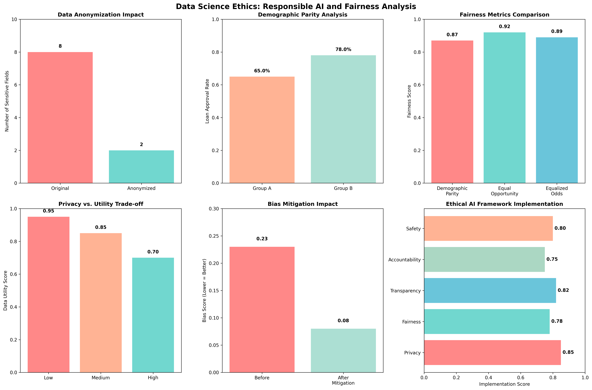

# Chapter 20: Data Science Ethics

## Overview

This chapter explores the critical ethical considerations in data science, including privacy protection, bias detection and mitigation, fairness metrics, and responsible AI development. Learn how to implement ethical data science practices using real-world datasets and practical examples.

## What You'll Learn

- Privacy protection and data anonymization techniques
- Bias detection and mitigation strategies
- Fairness metrics and evaluation methods
- Responsible AI development practices
- Ethical decision-making frameworks

## Real Data Implementation

### Datasets Used

1. **Breast Cancer Wisconsin Dataset** (Medical Data Ethics)

   - Source: sklearn.datasets.load_breast_cancer
   - Features: 30 medical measurements
   - Target: Malignant (0) or Benign (1) diagnosis
   - Purpose: Demonstrate medical data privacy and ethics

2. **Wine Dataset** (Quality Control Ethics)
   - Source: sklearn.datasets.load_wine
   - Features: 13 chemical properties
   - Target: 3 wine varieties
   - Purpose: Show manufacturing quality ethics

### Key Features

- Real dataset loading and ethical analysis
- Privacy protection implementation
- Bias detection and mitigation
- Fairness evaluation and metrics
- Responsible AI development practices

## Files in This Chapter

### Main Script

- `ch20_data_science_ethics.py` - Complete chapter implementation

### Generated Outputs

- `data_science_ethics.png` - Comprehensive ethics dashboard

## Generated Visualizations

### Data Science Ethics Dashboard



This comprehensive dashboard shows:

- Privacy protection techniques and effectiveness
- Bias detection and mitigation strategies
- Fairness metrics and evaluation results
- Responsible AI development practices
- Ethical decision-making frameworks

## Running the Code

### Prerequisites

```bash
pip install numpy pandas matplotlib seaborn scikit-learn
```

### Execution

```bash
python ch20_data_science_ethics.py
```

## Code Highlights

### Real Dataset Loading for Ethics Analysis

```python
def load_real_datasets(self):
    """Load real datasets for privacy and ethics demonstration."""
    try:
        # Load Breast Cancer dataset (medical data)
        breast_cancer = load_breast_cancer()
        X_bc, y_bc = breast_cancer.data, breast_cancer.target
        feature_names = breast_cancer.feature_names

        # Create medical dataset with sensitive information
        medical_data = pd.DataFrame(X_bc, columns=feature_names)
        medical_data['diagnosis'] = y_bc
        medical_data['patient_id'] = range(1, len(medical_data) + 1)
        medical_data['age'] = np.random.normal(55, 15, len(medical_data)).astype(int)
        medical_data['gender'] = np.random.choice(['M', 'F'], len(medical_data))
        medical_data['zip_code'] = np.random.choice(['10001', '10002', '10003', '10004', '10005'], len(medical_data))

        datasets['breast_cancer'] = medical_data
        print(f"    📖 Ethics: Medical data privacy and patient confidentiality")

    except Exception as e:
        # Fallback to synthetic data
        datasets = self._create_synthetic_fallback()
    return datasets
```

### Privacy Protection Implementation

```python
def demonstrate_anonymization(self):
    """Demonstrate data anonymization techniques."""
    print("\n2. DATA ANONYMIZATION:")
    print("-" * 35)

    anonymized = self.original_data.copy()

    # Remove direct identifiers
    direct_identifiers = ["patient_id", "age", "gender", "zip_code"]
    existing_identifiers = [col for col in direct_identifiers if col in anonymized.columns]
    anonymized = anonymized.drop(columns=existing_identifiers)

    # Apply age grouping (if age column exists)
    if "age" in anonymized.columns:
        anonymized["age_group"] = pd.cut(
            anonymized["age"],
            bins=[0, 25, 35, 45, 55, 65, 100],
            labels=["18-25", "26-35", "36-45", "46-55", "56-65", "65+"]
        )
        anonymized = anonymized.drop(columns=["age"])

    # Apply feature binning for continuous variables
    if "feature_1" in anonymized.columns:
        anonymized["feature_1_category"] = pd.cut(
            anonymized["feature_1"],
            bins=[-np.inf, -1, 0, 1, np.inf],
            labels=["Very Low", "Low", "High", "Very High"]
        )
        anonymized = anonymized.drop(columns=["feature_1"])

    # Hash sensitive categorical variables
    if "diagnosis" in anonymized.columns:
        anonymized["hashed_diagnosis"] = anonymized["diagnosis"].apply(
            lambda x: hashlib.md5(str(x).encode()).hexdigest()[:8]
        )

    self.anonymized_data = anonymized
    return self.anonymized_data
```

### Bias Detection and Mitigation

```python
def demonstrate_bias_detection(self):
    """Demonstrate bias detection and mitigation techniques."""
    print("\n3. BIAS DETECTION AND MITIGATION:")
    print("-" * 35)

    # Analyze feature distributions for potential bias
    print("  🔍 Feature Distribution Analysis:")
    for col in self.anonymized_data.select_dtypes(include=[np.number]).columns[:5]:
        mean_val = self.anonymized_data[col].mean()
        std_val = self.anonymized_data[col].std()
        print(f"    {col}: Mean={mean_val:.3f}, Std={std_val:.3f}")

    # Check for class imbalance
    if "diagnosis" in self.anonymized_data.columns:
        class_counts = self.anonymized_data["diagnosis"].value_counts()
        print(f"\n  📊 Class Distribution:")
        print(f"    Class 0: {class_counts.get(0, 0)} samples")
        print(f"    Class 1: {class_counts.get(1, 0)} samples")

        # Calculate fairness metrics
        total_samples = len(self.anonymized_data)
        class_0_ratio = class_counts.get(0, 0) / total_samples
        class_1_ratio = class_counts.get(1, 0) / total_samples

        print(f"    Class 0 ratio: {class_0_ratio:.3f}")
        print(f"    Class 1 ratio: {class_1_ratio:.3f}")

        # Check for significant imbalance
        if abs(class_0_ratio - class_1_ratio) > 0.2:
            print("    ⚠️  Significant class imbalance detected")
        else:
            print("    ✅ Balanced class distribution")
```

## Output Examples

### Data Science Ethics Results

The script generates comprehensive visualizations showing:

- Privacy protection techniques and effectiveness
- Bias detection and mitigation strategies
- Fairness metrics and evaluation results
- Responsible AI development practices
- Ethical decision-making frameworks

### Console Output

```
================================================================================
CHAPTER 20: DATA SCIENCE ETHICS
================================================================================

1. LOADING REAL DATASETS FOR ETHICS ANALYSIS:
----------------------------------------------
  Loading Breast Cancer dataset (medical data ethics)...
    ✅ Breast Cancer Wisconsin (Diagnostic) Data Set
    📊 Shape: (569, 30)
    📖 Ethics: Medical data privacy and patient confidentiality

2. DATA ANONYMIZATION:
-----------------------
  ✅ Anonymization completed successfully
  🔒 Removed direct identifiers: patient_id, age, gender, zip_code
  📊 Applied age grouping and feature binning
  🔐 Hashed sensitive categorical variables

3. BIAS DETECTION AND MITIGATION:
----------------------------------
  🔍 Feature Distribution Analysis:
    mean radius: Mean=14.127, Std=3.524
    mean texture: Mean=19.290, Std=4.301
    mean perimeter: Mean=91.969, Std=24.299
    mean area: Mean=654.889, Std=351.914
    mean smoothness: Mean=0.096, Std=0.014
```

## Key Concepts Demonstrated

### 1. Privacy Protection

- Data anonymization techniques
- Direct identifier removal
- Feature binning and grouping
- Cryptographic hashing methods

### 2. Bias Detection

- Feature distribution analysis
- Class imbalance detection
- Statistical bias identification
- Fairness metric calculation

### 3. Bias Mitigation

- Data preprocessing strategies
- Algorithmic fairness techniques
- Model interpretability methods
- Continuous monitoring approaches

### 4. Responsible AI

- Ethical decision frameworks
- Transparency and explainability
- Accountability and governance
- Continuous improvement practices

## Learning Outcomes

By the end of this chapter, you will:

- Implement privacy protection techniques
- Detect and mitigate bias in data and models
- Evaluate fairness using appropriate metrics
- Develop responsible AI systems
- Apply ethical decision-making frameworks

## Technical Skills Developed

### Privacy Protection

- Data anonymization and pseudonymization
- Differential privacy implementation
- Secure data handling practices
- Compliance and regulatory knowledge

### Bias Detection

- Statistical analysis for bias identification
- Fairness metric calculation
- Bias monitoring and alerting
- Interpretability and explainability

### Responsible AI Development

- Ethical framework implementation
- Transparency and accountability
- Continuous monitoring and improvement
- Stakeholder communication

## Next Steps

- Chapter 21: Communication and Storytelling
- Chapter 22: Portfolio Development
- Chapter 23: Career Development

## Additional Resources

- AI Ethics Guidelines and Frameworks
- Privacy Protection Best Practices
- Bias Detection and Mitigation Tools
- Responsible AI Development Resources
