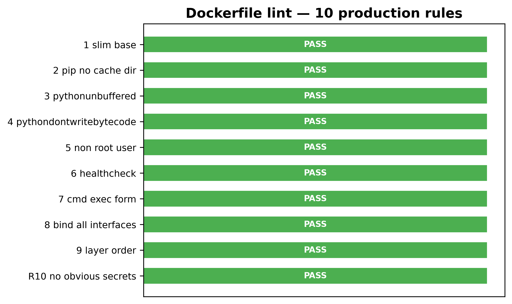
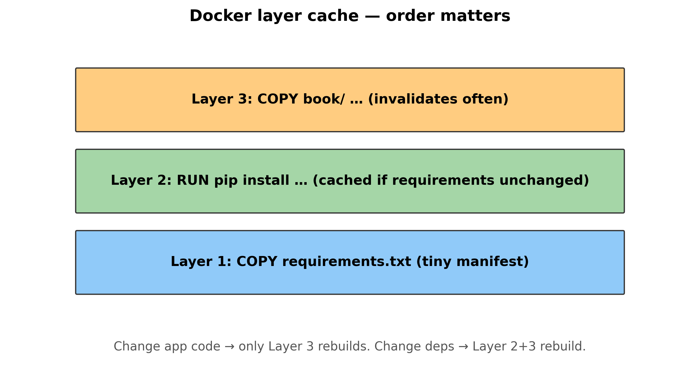
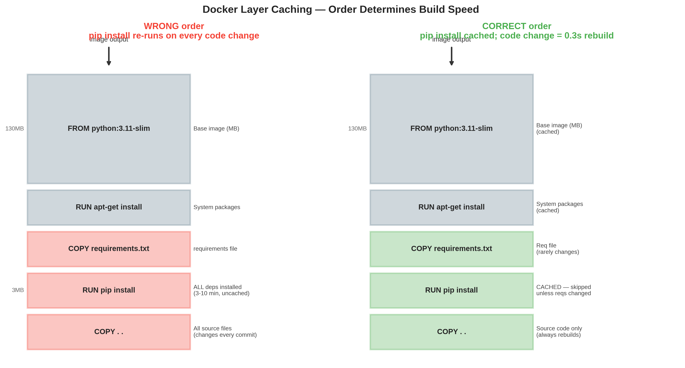
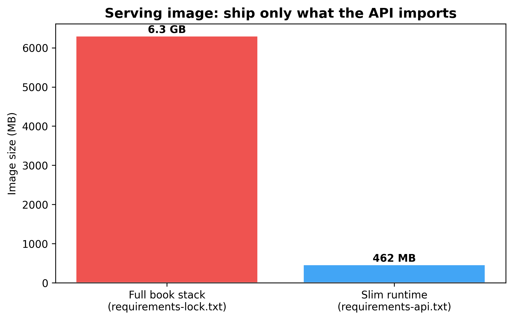
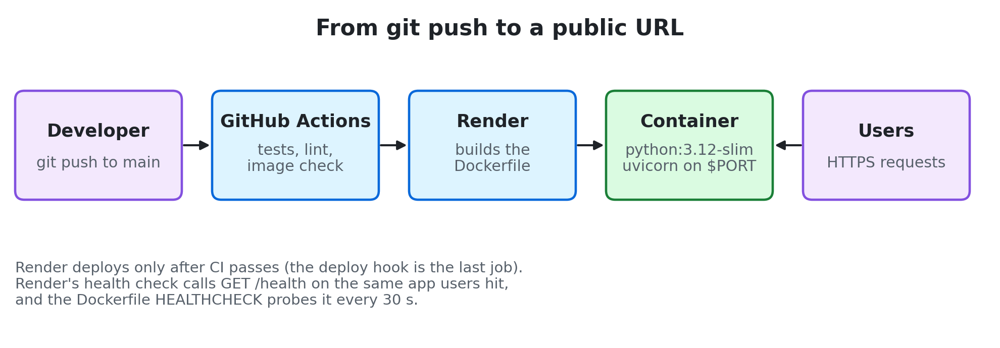

# Chapter 20: Docker + Render — Ship the API in a Container

> **TalentLens milestone:** The FastAPI app from Chapter 19 runs on your laptop. This chapter makes it **shippable**: one `docker build` produces the same artefact everywhere, `.dockerignore` keeps secrets and bloat out, and **Render** (or any Docker host) can pull a `render.yaml` blueprint and run the service with a `/health` probe that matches production.

---

## The problem we're solving

“It works on my machine” is not a deployment strategy. Your laptop has a different `PATH`, a different Python minor version, and fifteen packages you forgot you installed last month. **Docker** fixes three things at once: **reproducibility** (image = filesystem snapshot), **isolation** (your app does not fight the host’s system Python), and **portability** (the same image runs on your Mac, a CI runner, and a cloud VM).

Render (and similar platforms) do not want a tarball and a prayer. They want a **Dockerfile** or a pre-built image, a **port** to route to, and a **health check** so they can restart bad instances. This chapter wires those pieces together for TalentLens so the book’s capstone is something you can actually put on a URL.

---

## Why Docker (and why now), and why `python:3.11-slim` (or 3.12-slim)

**What Docker does:** Packages your app plus its runtime dependencies into an **image**: immutable layers stacked on a base OS slice. A **container** is a running instance of that image with its own filesystem and network namespace.

**Why not “just use venv on the server”:** A venv does not capture system libraries, native extensions, or OS packages. Two servers with the same `requirements.txt` can still diverge. Images freeze the whole stack.

**Why `python:3.X-slim` instead of `python:3.X`:** The full image carries compilers, man pages, and extra Debian packages you will not need at runtime. **Slim** keeps glibc-based Debian with enough to run CPython wheels, which shrinks pull time, attack surface, and cold-start latency. If you need `gcc` to build a wheel, add it in a **builder stage** and copy artefacts into a slim runtime; do not permanently bloat the final layer.

**Why layer order determines build speed:** Docker caches each layer. If you `COPY . .` before `pip install`, **any** file change invalidates the cache and forces a full dependency reinstall. The pattern in our `Dockerfile` is: copy the **requirements manifest first**, `RUN pip install --no-cache-dir`, **then** application code, with the layers that change least often first:

```dockerfile
COPY requirements-api.txt pyproject.toml /app/
RUN pip install --no-cache-dir -r requirements-api.txt
COPY talentlens/ /app/talentlens/                       # shared package (ch19 imports talentlens.paths)
RUN pip install --no-cache-dir --no-deps -e .           # install the package, not its declared ML deps
COPY data/clean/jobs_clean.csv /app/data/clean/jobs_clean.csv  # bundled dataset
COPY book/ /app/book/                                   # chapter code — changes most often
```

`PYTHONPATH=/app` is already set, so `import talentlens` resolves. We bundle the canonical `jobs_clean.csv` so the container serves the same dataset you have used since Chapter 6, not the versioned `.large.csv` release artifact; in production you would mount a volume or connect a database instead of baking data into the image.

**Why a serving image should not contain your training stack:** This is the lesson worth pausing on. The development environment for this book installs the full ML stack (torch, transformers, sentence-transformers, spaCy, scikit-learn) because chapters 9–18 train models, embed text, and extract skills. But the **deployed API** (Chapter 19) does none of that at runtime: it serves keyword search over a pandas dataframe and a rule-based salary-band classifier. It imports `fastapi`, `uvicorn`, `pydantic`, `pandas`, `numpy`, and nothing from the ML stack.

Installing `requirements-lock.txt` (the full dev stack) into the serving image produced a **6.3GB image** that could not even build on a standard CI runner; it ran out of disk. Installing the runtime-only set from **`requirements-api.txt`** produces a **462MB image** that builds in seconds and starts instantly. Same API, same endpoints, **~93% smaller**.

The discipline: your serving image contains only what serving needs. Training-time and development-time dependencies belong in your dev environment and your test pipeline, not baked into the artifact you ship to production. The `--no-deps` flag on the editable install matters here: `pyproject.toml` declares scikit-learn, matplotlib, and requests as the package's core dependencies (PyTorch and the rest sit in optional groups), so a plain `pip install -e .` would pull in libraries the API never imports; `--no-deps` installs only the `talentlens` package itself, and `requirements-api.txt` supplies the slim runtime set explicitly.

> **Keeping the slim set honest:** `requirements-api.txt` is verified by `make verify-api-deps`, which installs only the slim set in a throwaway venv and confirms `book.ch19.ch19_fastapi_deployment` imports cleanly. Re-run it whenever the API's runtime imports change. A new top-level import in the serving path that isn't in the slim set will fail there instead of at container startup.

**Why `render.yaml`:** It is **infrastructure as code**: the service name, region, `dockerfilePath`, and non-secret env defaults live in git next to the app. Reviewers see the deploy contract in the PR the same way they see Python changes.

**When Docker is the wrong abstraction:** If you are shipping a single static site, use a static host. If you need sub-50ms autoscaling across dozens of dependencies, you may graduate to a platform-specific buildpack or a service mesh later, but Docker is still the common packaging layer underneath.

---

## The methods

> **📑 Reference: Dockerfile directives**

The subsections below are a lookup catalog. Consult them when auditing a Dockerfile, not when deciding whether to containerise.

### Multi-stage vs single-stage builds

**Plain English:** Multi-stage = one image compiles/builds, a **smaller** final image copies only binaries. Single-stage = simpler, but easier to accidentally ship compilers.

**This chapter:** We use a **single slim runtime** for readability. Chapter Makefile/CI can add a builder stage when you introduce native compile-heavy deps.

### `pip install --no-cache-dir`

**Why:** Pip’s HTTP cache lives under `~/.cache/pip`. In Docker that cache dies with the build container, but **without** `--no-cache-dir` the layer still stores downloaded wheels twice: wasted space for zero benefit.

### `PYTHONUNBUFFERED=1` and `PYTHONDONTWRITEBYTECODE=1`

**Unbuffered:** Python stdout/stderr flush immediately so `docker logs` shows output during crashes instead of after buffer fills.

**No bytecode:** Avoids writing `.pyc` into image layers you did not intend to mutate; slightly cleaner for read-only root filesystem patterns.

### `USER` (non-root)

**Why:** A compromised process running as root inside a container is one misconfiguration away from host risk. Create a numeric UID (`appuser`) and drop privileges before `CMD`.

### `HEALTHCHECK`

**What it does:** Docker (and orchestrators) run the probe command periodically. If it fails repeatedly, the container is marked unhealthy.

**Our probe:** A tiny Python one-liner hits `http://127.0.0.1:8000/health`, the same code path users hit. `--start-period=25s` gives uvicorn time to import pandas and load the dataset before failed probes count against the container.

### JSON-array `CMD` vs shell form

**JSON exec form (`CMD ["exec", "arg"]`):** PID 1 is your process, so **SIGTERM** reaches uvicorn so shutdown is graceful.

**Shell form (`CMD uvicorn …`):** PID 1 is `/bin/sh -c`, which can swallow signals unless you `exec`. Easy to get wrong.

### `CMD` vs `ENTRYPOINT`

**ENTRYPOINT:** fixed executable wrapper; good for injecting `dumb-init` or forcing `uvicorn` with constant flags.

**CMD:** default arguments to ENTRYPOINT, or the full command if ENTRYPOINT is unset. We keep **CMD only** here for simplicity; add ENTRYPOINT when you need init wrappers.

### Pinning the base image (digest, not tag alone)

**Plain English:** `FROM python:3.12-slim` follows a **moving tag**. Docker Hub can repoint that tag to a new image without you noticing: same label, different bytes. Pinning `@sha256:…` locks the exact filesystem you audited in CI.

**Our Dockerfile:**

```dockerfile
FROM python:3.12-slim@sha256:090ba77e2958f6af52a5341f788b50b032dd4ca28377d2893dcf1ecbdfdfe203 AS runtime
```

**When to refresh:** After a security advisory on the base image, or a deliberate Python patch upgrade. Run `docker pull python:3.12-slim`, then `docker inspect --format='{{index .RepoDigests 0}}' python:3.12-slim`, update the digest in the Dockerfile, rebuild, and re-run `make deploy-check`.

**Why not pin only in CI:** Production deploys and local `docker build` must use the same base. The Dockerfile is the contract.

### `.dockerignore`

**What it does:** Same idea as `.gitignore`, but for the **build context** sent to `docker build`. Excluding `.git`, `venv/`, `*.npy`, and `.env` shrinks context size and prevents accidental secret bake-in.

### Secrets

**Rule:** Never `ENV OPENAI_API_KEY=sk-...` in a committed Dockerfile. Put placeholders in `.env.example`, real values in Render’s **Environment** tab or a secret manager, referenced by name in `render.yaml` with `sync: false`.

---

## The code

- **Linter + figures + checklist:** `ch20_docker_deployment.py`: run it from repo root; it reads `./Dockerfile`, runs **10 rules**, writes `book/ch20/reports/deploy_checklist.md`, and saves three PNGs under `book/ch20/reports/figures/`.
- **Image definition:** repo-root `Dockerfile`: slim Python, ordered layers, non-root user, healthcheck, uvicorn on `0.0.0.0` with `${PORT:-8000}` for Render.
- **Deploy contract:** `render.yaml`: comments explain fields; switch `plan` when you outgrow the free tier sleep behaviour.

**Validate locally:**

```bash
docker build -t talentlens-api:dev .
docker run --rm -p 8000:8000 -e PORT=8000 talentlens-api:dev
```

---

## Interpreting the output: what do these numbers and charts mean?

Run `python book/ch20/ch20_docker_deployment.py` from the repo root, then read the figures alongside `book/ch20/reports/deploy_checklist.md`.

### The slim-image story

Early drafts installed `requirements-lock.txt`, the full ML stack (torch, transformers, sentence-transformers, spaCy, scikit-learn), into the Chapter 19 serving image. That produced a **6.3GB image** that could not build on a standard CI runner (disk exhausted) and taught the wrong lesson: a keyword-search API does not need a training stack at runtime.

We split runtime deps into **`requirements-api.txt`** (fastapi, uvicorn, pydantic, pydantic-settings, pandas, numpy, python-dotenv) and install the `talentlens` package with `pip install --no-deps -e .` so `pyproject.toml` does not drag torch back in. The result: **462MB (~93% smaller)**, builds in seconds, and `GET /health`, `POST /api/v1/search`, and `POST /api/v1/classify` all pass on the slim image in local and CI runs. `make verify-api-deps` guards that set whenever the API's imports change.



**`ch20_lint_results.png`**: PASS/FAIL per lint rule. Each failure is a sharp edge we have seen break real deploys (slim base, non-root user, healthcheck, digest pin), not an academic checklist.



**`ch20_layer_cache_diagram.png`**: Which Dockerfile layers rebuild when code vs dependencies change. If a one-line Python edit invalidates `pip install`, our COPY order is wrong.



**`ch20_docker_layer_cache.png`**: The repository's own Dockerfile, step by step, next to the copy-everything-first order. Green layers come from cache; red ones rebuild when you edit code.



**`ch20_image_size_comparison.png`**: Side-by-side image sizes: full dev stack vs slim runtime set. The gap is dependencies we do not import at serving time.



**`ch20_deployment_architecture.png`**: How the container, Render service, and `/health` probe connect. The probe must hit the same code path users rely on, not a database query dressed up as health.

---

## Common mistakes I've seen (and made)

**Pinning by tag instead of digest.** Tags get rewritten silently on Docker Hub; digests do not. `python:3.12-slim` today is not guaranteed to be the same image tomorrow. Use `FROM python:3.12-slim@sha256:…` in anything you ship to production or teach as production hygiene.

**Copying the whole repo before `pip install`.** Any code change invalidates the dependency layer and turns every build into a 10-minute reinstall. Copy the requirements manifest (`requirements-api.txt` here) first, install, then copy application code (`talentlens/`, `data/clean/`, then `book/`: stable layers before churny ones).

**Baking secrets into the image.** `ENV API_KEY=sk-…` in a committed Dockerfile ends up in layer history. Inject secrets at runtime from Render, Kubernetes, or your secret manager.

---

## Interview questions

**Q1: What problem does Docker solve that virtualenv does not?**  
Virtualenv isolates Python packages; Docker isolates **OS + filesystem + process tree**. Reproducible across machines and CI.

**Q2: Why does Dockerfile layer order affect CI speed?**  
Each instruction is a layer cache key. Put the **slowest, least frequently changing** steps (dependency install) above frequently changing files (application code).

**Q3: CMD vs ENTRYPOINT: when do you use which?**  
ENTRYPOINT when you need a fixed wrapper (init, tini, forced binary); CMD for default args or the full command when ENTRYPOINT is absent.

**Q4: How do you keep images small?**  
Slim base, multi-stage builds, `--no-cache-dir`, delete build-only deps in the same `RUN` layer, `.dockerignore` bloat, avoid copying notebooks and `.git`.

**Q5: Where do secrets go if not in the Dockerfile?**  
Environment injection at runtime (Render dashboard, Kubernetes Secret → env, Vault sidecar). `.env` local only; `.env.example` documents names.

---

## What's next

**Chapter 21** wires this image into CI/CD: one `make test` locally, one GitHub Actions workflow on every push that runs the tests, builds this image, probes its endpoints, and triggers the Render deploy hook only when everything passes.

---

## TalentLens checkpoint

- [ ] Repo-root `Dockerfile`, `.dockerignore`, `.env.example`, `render.yaml`
- [ ] `python book/ch20/ch20_docker_deployment.py` → 10/10 lint + figures + `reports/deploy_checklist.md`
- [ ] `pytest tests/test_ch20.py`: 20 tests green
- [ ] `docker build` + container `GET /health` succeeds locally
- [ ] `reports/figures/ch20_lint_results.png`, `ch20_layer_cache_diagram.png`, `ch20_docker_layer_cache.png`, `ch20_image_size_comparison.png`, `ch20_deployment_architecture.png`

**Concepts you own:**

- Serving image vs training image: runtime imports define the dependency set, not everything in `pyproject.toml`
- Layer cache discipline: COPY requirements before code so dependency layers survive application edits
- Health as a deploy contract: the probe must be fast, side-effect-free, and the same path orchestrators use to keep instances alive
