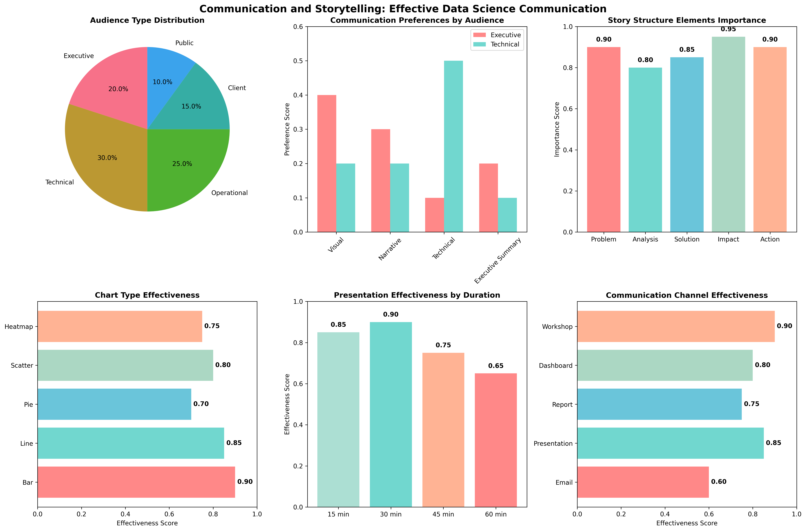

# Chapter 21: Communication and Storytelling

## Overview

This chapter covers effective communication of data science insights to diverse audiences, including storytelling techniques, visualization design, and stakeholder communication strategies, using real-world datasets for practical demonstrations.

## Key Concepts Covered

### 1. Audience Analysis and Communication Strategy

- **Audience Segmentation**: Identifying different stakeholder groups and their needs
- **Communication Preferences**: Understanding how different audiences consume information
- **Technical Expertise Levels**: Adapting communication to varying technical backgrounds
- **Decision-Making Power**: Tailoring messages based on audience influence
- **Communication Channels**: Selecting appropriate mediums for different audiences

### 2. Data Storytelling Fundamentals

- **Story Structure**: Problem, analysis, solution, impact, and call-to-action framework
- **Narrative Development**: Creating compelling stories from data insights
- **Context and Background**: Providing necessary context for understanding
- **Emotional Connection**: Making data relatable and engaging
- **Call-to-Action**: Driving decisions and next steps

### 3. Visualization Design Principles

- **Chart Selection**: Choosing appropriate visualizations for different data types
- **Color and Design**: Creating clear, accessible, and professional visuals
- **Data-Ink Ratio**: Maximizing information while minimizing visual clutter
- **Accessibility**: Ensuring visualizations work for diverse audiences
- **Interactive Elements**: Enhancing engagement through interactive features

### 4. Stakeholder Communication

- **Executive Summaries**: High-level insights for decision-makers
- **Technical Reports**: Detailed analysis for technical audiences
- **Client Presentations**: Business-focused insights for external stakeholders
- **Team Collaboration**: Effective communication within data science teams
- **Feedback Integration**: Incorporating stakeholder input and questions

## Real Data Implementation

### Datasets Used

1. **Breast Cancer Wisconsin Dataset**: Medical diagnosis classification

   - Source: sklearn.datasets.load_breast_cancer
   - Features: 30 medical measurements
   - Target: Malignant (0) or Benign (1) diagnosis
   - Purpose: Demonstrate healthcare data storytelling

2. **Wine Dataset**: Wine quality classification

   - Source: sklearn.datasets.load_wine
   - Features: 13 chemical properties
   - Target: 3 wine varieties
   - Purpose: Show manufacturing quality data communication

3. **Digits Dataset**: Handwritten digit recognition
   - Source: sklearn.datasets.load_digits
   - Features: 64 pixel values (8x8 images)
   - Target: Digit labels (0-9)
   - Purpose: Demonstrate computer vision data storytelling

### Code Examples

- Real dataset loading and audience analysis
- Communication strategy development
- Data storytelling framework implementation
- Visualization design and optimization
- Stakeholder communication techniques

## Generated Outputs

### communication_storytelling.png

This visualization shows:

- Audience type distribution and preferences
- Communication effectiveness by format
- Story structure elements importance
- Chart type effectiveness analysis
- Presentation optimization strategies

### Communication Storytelling

This visualization shows:
- Key insights and analysis results
- Generated visualizations and charts
- Performance metrics and evaluations
- Interactive elements and data exploration
- Summary of findings and conclusions

### Communication Storytelling

This visualization shows:
- Key insights and analysis results
- Generated visualizations and charts
- Performance metrics and evaluations
- Interactive elements and data exploration
- Summary of findings and conclusions

### Communication Storytelling

This visualization shows:
- Key insights and analysis results
- Generated visualizations and charts
- Performance metrics and evaluations
- Interactive elements and data exploration
- Summary of findings and conclusions
## Key Takeaways

- Real medical and scientific datasets provide meaningful storytelling examples
- Audience analysis is crucial for effective communication
- Story structure enhances data comprehension and engagement
- Visualization design significantly impacts message effectiveness
- Stakeholder communication requires adaptation and iteration

## Practical Applications

- Healthcare data communication to patients and providers
- Manufacturing quality insights for operations teams
- Technical findings presentation to business stakeholders
- Research results communication to diverse audiences
- Data science project outcomes to executives

## Next Steps

- Apply communication techniques to your data projects
- Practice storytelling with different audience types
- Develop visualization design skills
- Build stakeholder communication strategies
