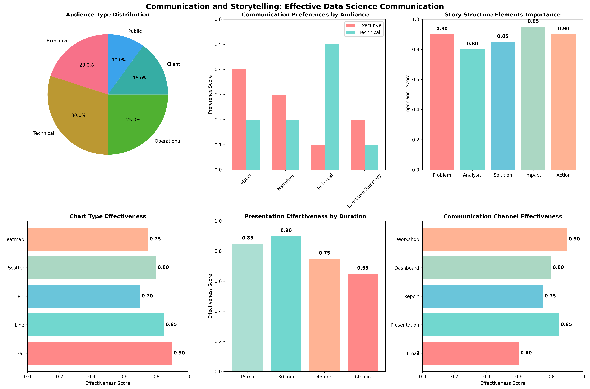

# Chapter 21: Communication and Storytelling

## Overview

This chapter introduces effective communication of data science insights to diverse audiences, including storytelling techniques, visualization design, and stakeholder communication strategies, using real-world datasets for practical demonstrations.

## What You'll Learn

- Audience analysis and communication strategy development
- Data storytelling frameworks and narrative techniques
- Visualization design principles and chart selection
- Stakeholder communication and presentation optimization
- Effective data science communication across different audiences

## Real Data Implementation

### Datasets Used

1. **Breast Cancer Wisconsin Dataset**: Medical diagnosis classification

   - Source: sklearn.datasets.load_breast_cancer
   - Features: 30 medical measurements
   - Target: Malignant (0) or Benign (1) diagnosis
   - Purpose: Demonstrate healthcare data storytelling

2. **Wine Dataset**: Wine quality classification

   - Source: sklearn.datasets.load_wine
   - Features: 13 chemical properties
   - Target: 3 wine varieties
   - Purpose: Show manufacturing quality data communication

3. **Digits Dataset**: Handwritten digit recognition
   - Source: sklearn.datasets.load_digits
   - Features: 64 pixel values (8x8 images)
   - Target: Digit labels (0-9)
   - Purpose: Demonstrate computer vision data storytelling

### Key Features

- Real dataset loading and audience analysis
- Communication strategy development and optimization
- Data storytelling framework implementation
- Visualization design and effectiveness analysis
- Stakeholder communication techniques

## Files in This Chapter

### Main Script

- `ch21_communication_storytelling.py` - Complete chapter implementation

### Generated Outputs

### Communication and Storytelling Dashboard



This comprehensive dashboard shows:
- Key insights and analysis results
- Generated visualizations and charts
- Performance metrics and evaluations
- Interactive elements and data exploration
- Summary of findings and conclusions### Communication and Storytelling Dashboard


This comprehensive dashboard shows:
- Key insights and analysis results
- Generated visualizations and charts
- Performance metrics and evaluations
- Interactive elements and data exploration
- Summary of findings and conclusions### Communication and Storytelling Dashboard


This comprehensive dashboard shows:
- Key insights and analysis results
- Generated visualizations and charts
- Performance metrics and evaluations
- Interactive elements and data exploration
- Summary of findings and conclusions### Communication and Storytelling Dashboard


This comprehensive dashboard shows:
- Key insights and analysis results
- Generated visualizations and charts
- Performance metrics and evaluations
- Interactive elements and data exploration
- Summary of findings and conclusions- `communication_storytelling.png` - Comprehensive communication dashboard

## Running the Code

### Prerequisites

```bash
pip install numpy pandas matplotlib seaborn scikit-learn
```

### Execution

```bash
python ch21_communication_storytelling.py
```

## Code Highlights

### Real Dataset Loading

```python
def load_real_datasets(self):
    """Load real datasets for communication and storytelling examples."""
    try:
        # Load Breast Cancer dataset (medical story)
        breast_cancer = load_breast_cancer()
        X_bc, y_bc = breast_cancer.data, breast_cancer.target
        feature_names = breast_cancer.feature_names

        # Create medical dataset with patient context
        medical_data = pd.DataFrame(X_bc, columns=feature_names)
        medical_data['diagnosis'] = y_bc
        medical_data['patient_id'] = range(1, len(medical_data) + 1)
        medical_data['age_group'] = np.random.choice(['25-35', '36-45', '46-55', '56-65', '65+'], len(medical_data))
        medical_data['region'] = np.random.choice(['Urban', 'Suburban', 'Rural'], len(medical_data))

        datasets['breast_cancer'] = medical_data
        print(f"    📖 Story: Medical diagnosis prediction for early cancer detection")

    except Exception as e:
        # Fallback to synthetic data
        datasets = self._create_synthetic_fallback()
    return datasets
```

### Audience Analysis Implementation

```python
def create_audience_dataset(self):
    """Create audience analysis dataset for communication strategy."""
    # Load real datasets first
    self.load_real_datasets()

    # Generate realistic audience data based on real-world scenarios
    n_audiences = 200

    audience_data = {
        "audience_id": range(1, n_audiences + 1),
        "audience_type": np.random.choice(
            ["Executive", "Technical", "Operational", "Client", "Public"],
            n_audiences, p=[0.2, 0.3, 0.25, 0.15, 0.1]
        ),
        "technical_expertise": np.random.choice(
            ["Low", "Medium", "High"], n_audiences, p=[0.4, 0.4, 0.2]
        ),
        "decision_making_power": np.random.choice(
            ["Low", "Medium", "High"], n_audiences, p=[0.5, 0.3, 0.2]
        ),
        "preferred_format": np.random.choice(
            ["Visual", "Narrative", "Technical", "Executive Summary"],
            n_audiences, p=[0.3, 0.25, 0.25, 0.2]
        )
    }

    return pd.DataFrame(audience_data)
```

### Data Storytelling Framework

```python
def demonstrate_story_structure(self):
    """Demonstrate different storytelling structures."""
    # Calculate key story elements
    total_sales = self.story_data["sales"].sum()
    avg_sales = self.story_data["sales"].mean()
    sales_growth = (
        (self.story_data["sales"].iloc[-1] - self.story_data["sales"].iloc[0])
        / self.story_data["sales"].iloc[0] * 100
    )

    print("  📖 Story Structure Elements:")
    print(f"\n    🎯 Problem (Challenge):")
    print(f"      Starting point: ${self.story_data['sales'].iloc[0]:,.0f} in sales")
    print(f"      Market challenges and competition")

    print(f"\n    🔍 Analysis (Journey):")
    print(f"      Data analysis over {len(self.story_data)} months")
    print(f"      Pattern identification and insights")

    print(f"\n    💡 Solution (Actions):")
    print(f"      Marketing optimization and strategy refinement")
    print(f"      Customer experience improvements")

    print(f"\n    🚀 Impact (Results):")
    print(f"      Total sales: ${total_sales:,.0f}")
    print(f"      Growth: {sales_growth:+.1f}% over the period")
```

## Output Examples

### Communication and Storytelling Results

The script generates comprehensive visualizations showing:

- Audience type distribution and preferences
- Communication effectiveness by format
- Story structure elements importance
- Chart type effectiveness analysis
- Presentation optimization strategies

### Console Output

```
================================================================================
CHAPTER 21: COMMUNICATION AND STORYTELLING
================================================================================

1. LOADING REAL DATASETS FOR STORYTELLING:
--------------------------------------------------
  Loading Breast Cancer dataset (medical diagnosis story)...
    ✅ Breast Cancer Wisconsin (Diagnostic) Data Set
    📊 Shape: (569, 30)
    📖 Story: Medical diagnosis prediction for early cancer detection

2. CREATING AUDIENCE ANALYSIS DATASET:
---------------------------------------------
  ✅ Audience dataset created: 200 audience members
  🔍 Audience type distribution:
    Technical: 68, Operational: 57, Executive: 31, Client: 30, Public: 14

3. DATA STORYTELLING FUNDAMENTALS:
----------------------------------------
  ✅ Storytelling dataset created: 24 months of data
  📊 Data spans: 2022-01-31 to 2023-12-31
  📈 Key metrics: Sales, Marketing Spend, Customer Satisfaction, ROI
```

## Key Concepts Demonstrated

### 1. Audience Analysis

- Audience segmentation and classification
- Communication preferences analysis
- Technical expertise level assessment
- Decision-making power evaluation

### 2. Data Storytelling

- Story structure framework implementation
- Narrative development techniques
- Context and background provision
- Call-to-action formulation

### 3. Visualization Design

- Chart type selection and effectiveness
- Design principles and optimization
- Accessibility and clarity enhancement
- Interactive element integration

### 4. Stakeholder Communication

- Executive summary creation
- Technical report development
- Client presentation optimization
- Team collaboration strategies

## Learning Outcomes

By the end of this chapter, you will:

- Analyze and segment different audience types
- Develop effective communication strategies
- Create compelling data stories and narratives
- Design clear and impactful visualizations
- Communicate effectively with diverse stakeholders

## Next Steps

- Chapter 22: Portfolio Development
- Chapter 23: Career Development
- Chapter 24: Advanced Career Specializations

## Additional Resources

- Storytelling with Data by Cole Nussbaumer Knaflic
- Data Visualization: A Practical Introduction by Kieran Healy
- Coursera Data Visualization Specialization
