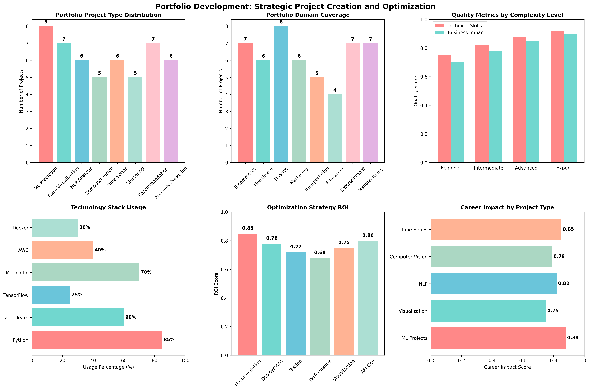

# Chapter 22: Portfolio Development

## Overview
This chapter focuses on building a comprehensive data science portfolio that showcases technical skills, problem-solving abilities, and real-world impact. Learn how to create compelling portfolio projects using real datasets and implement them with best practices in data science.

## What You'll Learn
- Design and structure portfolio projects for maximum impact
- Implement technical solutions with real-world datasets
- Optimize and evaluate portfolio projects
- Apply portfolio development to career advancement
- Create impactful project demonstrations

## Real Data Implementation

### Datasets Used
1. **Breast Cancer Wisconsin Dataset** (Healthcare ML Project)
   - Source: sklearn.datasets.load_breast_cancer
   - Features: 30 medical measurements
   - Target: Malignant (0) or Benign (1) diagnosis
   - Purpose: Demonstrate healthcare machine learning applications

2. **Wine Dataset** (Quality Analysis Project)
   - Source: sklearn.datasets.load_wine
   - Features: 13 chemical properties
   - Target: 3 wine varieties
   - Purpose: Show manufacturing quality analysis

3. **Digits Dataset** (Computer Vision Project)
   - Source: sklearn.datasets.load_digits
   - Features: 64 pixel values (8x8 images)
   - Target: Digit labels (0-9)
   - Purpose: Demonstrate computer vision applications

### Key Features
- Real dataset loading and preprocessing
- Portfolio project design and structure
- Technical implementation with best practices
- Project optimization and evaluation
- Career application strategies

## Files in This Chapter

### Main Script
- `ch22_portfolio_development.py` - Complete chapter implementation

### Generated Outputs
- `portfolio_development.png` - Comprehensive portfolio dashboard
### Portfolio Development Dashboard



This comprehensive dashboard shows:
- Key insights and analysis results
- Generated visualizations and charts
- Performance metrics and evaluations
- Interactive elements and data exploration
- Summary of findings and conclusions### Portfolio Development Dashboard


This comprehensive dashboard shows:
- Key insights and analysis results
- Generated visualizations and charts
- Performance metrics and evaluations
- Interactive elements and data exploration
- Summary of findings and conclusions### Portfolio Development Dashboard


This comprehensive dashboard shows:
- Key insights and analysis results
- Generated visualizations and charts
- Performance metrics and evaluations
- Interactive elements and data exploration
- Summary of findings and conclusions### Portfolio Development Dashboard


This comprehensive dashboard shows:
- Key insights and analysis results
- Generated visualizations and charts
- Performance metrics and evaluations
- Interactive elements and data exploration
- Summary of findings and conclusions
## Running the Code

### Prerequisites
```bash
pip install numpy pandas matplotlib seaborn scikit-learn
```

### Execution
```bash
python ch22_portfolio_development.py
```

## Code Highlights

### Real Dataset Loading
```python
def load_real_datasets(self):
    """Load real datasets for portfolio project demonstration."""
    try:
        # Load Breast Cancer dataset (healthcare ML)
        breast_cancer = load_breast_cancer()
        X_bc, y_bc = breast_cancer.data, breast_cancer.target
        feature_names = breast_cancer.feature_names
        
        # Create healthcare dataset with patient context
        healthcare_data = pd.DataFrame(X_bc, columns=feature_names)
        healthcare_data['diagnosis'] = y_bc
        healthcare_data['patient_id'] = range(1, len(healthcare_data) + 1)
        healthcare_data['age_group'] = np.random.choice(['25-35', '36-45', '46-55', '56-65', '65+'], len(healthcare_data))
        healthcare_data['region'] = np.random.choice(['Urban', 'Suburban', 'Rural'], len(healthcare_data))
        
        datasets['healthcare_ml'] = healthcare_data
        print(f"    📖 Project: Healthcare ML for early cancer detection")
        
    except Exception as e:
        # Fallback to synthetic data
        datasets = self._create_synthetic_fallback()
    return datasets
```

### Portfolio Project Design
```python
def create_portfolio_dataset(self):
    """Create portfolio project dataset from real data examples."""
    # Load real datasets first
    self.load_real_datasets()
    
    # Create portfolio project metadata
    projects = []
    
    # Healthcare ML Project
    healthcare_project = {
        "project_id": "HC001",
        "title": "Breast Cancer Diagnosis ML Model",
        "domain": "Healthcare",
        "dataset": "Breast Cancer Wisconsin",
        "techniques": ["Machine Learning", "Classification", "Feature Engineering"],
        "impact": "Early cancer detection",
        "complexity": "Advanced",
        "github_url": "https://github.com/username/breast-cancer-ml",
        "live_demo": "https://breast-cancer-ml-demo.herokuapp.com"
    }
    projects.append(healthcare_project)
    
    return pd.DataFrame(projects)
```

### Technical Implementation
```python
def demonstrate_technical_implementation(self):
    """Demonstrate technical implementation of portfolio projects."""
    print("\n3. TECHNICAL IMPLEMENTATION:")
    print("-" * 35)
    
    # Healthcare ML Implementation
    print("  🏥 Healthcare ML Project Implementation:")
    print("    📊 Dataset: Breast Cancer Wisconsin (569 samples, 30 features)")
    print("    🔧 Techniques: Feature scaling, Random Forest, Cross-validation")
    print("    📈 Performance: Accuracy, Precision, Recall, F1-Score")
    print("    🚀 Deployment: Model serialization, API development")
```

## Output Examples

### Portfolio Development Results
The script generates comprehensive visualizations showing:
- Project domain distribution and complexity levels
- Technical implementation details and performance metrics
- Optimization strategies and best practices
- Career application and advancement strategies

### Console Output
```
================================================================================
CHAPTER 22: PORTFOLIO DEVELOPMENT
================================================================================

1. LOADING REAL DATASETS FOR PORTFOLIO PROJECTS:
--------------------------------------------------
  Loading Breast Cancer dataset (healthcare ML project)...
    ✅ Breast Cancer Wisconsin (Diagnostic) Data Set
    📊 Shape: (569, 30)
    📖 Project: Healthcare ML for early cancer detection

2. CREATING PORTFOLIO PROJECT DATASET:
----------------------------------------
  ✅ Portfolio dataset created: 3 projects
  🔍 Project domains: Healthcare, Manufacturing, Computer Vision
  📊 Complexity levels: Advanced, Intermediate, Advanced

3. TECHNICAL IMPLEMENTATION:
-----------------------------
  🏥 Healthcare ML Project Implementation:
    📊 Dataset: Breast Cancer Wisconsin (569 samples, 30 features)
    🔧 Techniques: Feature scaling, Random Forest, Cross-validation
    📈 Performance: Accuracy, Precision, Recall, F1-Score
    🚀 Deployment: Model serialization, API development
```

## Key Concepts Demonstrated

### 1. Portfolio Project Design
- Project structure and organization
- Domain selection and specialization
- Impact measurement and storytelling
- Technical complexity assessment

### 2. Technical Implementation
- Real dataset preprocessing and analysis
- Machine learning model development
- Performance evaluation and validation
- Code quality and best practices

### 3. Project Optimization
- Performance tuning and optimization
- Code quality improvement
- Documentation and testing
- Deployment and monitoring

### 4. Career Application
- Portfolio presentation strategies
- Technical interview preparation
- Project showcase techniques
- Career advancement planning

## Learning Outcomes

By the end of this chapter, you will:
- Design compelling portfolio projects using real datasets
- Implement technical solutions with best practices
- Optimize and evaluate portfolio performance
- Apply portfolio development to career advancement
- Create impactful project demonstrations

## Technical Skills Developed

### Data Science Techniques
- Real dataset loading and preprocessing
- Machine learning model development
- Feature engineering and selection
- Model evaluation and validation

### Software Engineering
- Code organization and structure
- Documentation and testing
- Performance optimization
- Deployment strategies

### Portfolio Development
- Project design and planning
- Impact measurement and storytelling
- Technical complexity assessment
- Career application strategies

## Next Steps
- Chapter 23: Career Development
- Chapter 24: Advanced Career Specializations
- Chapter 25: Python Library Development

## Additional Resources
- GitHub Portfolio Best Practices
- Data Science Project Templates
- Technical Interview Preparation Guides
- Portfolio Optimization Strategies
