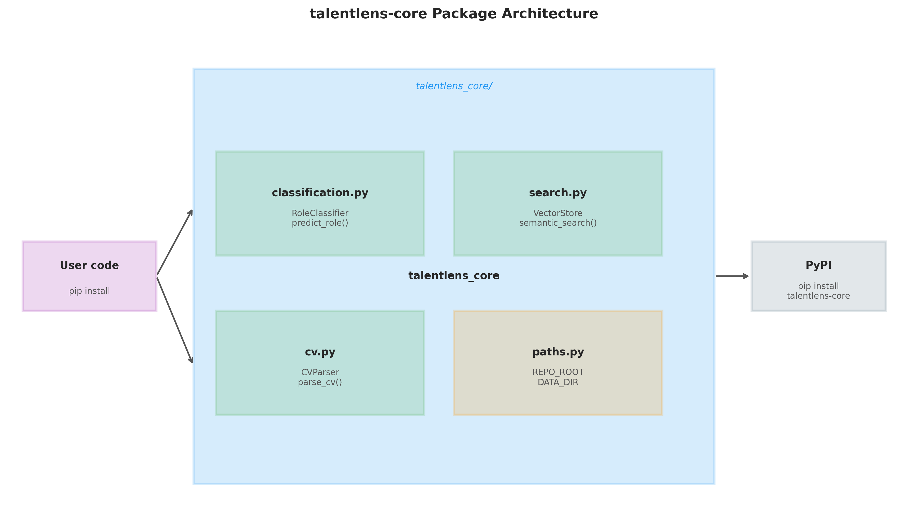
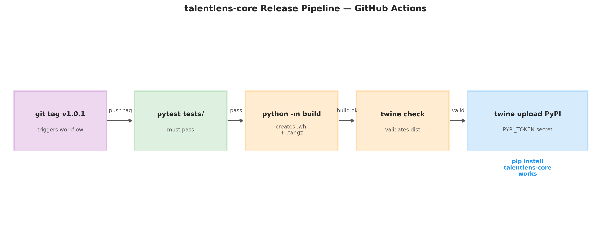

# Chapter 22: Packaging as a PyPI Library

> **TalentLens milestone:** We've built data pipelines, a classifier, a vector store, an LLM layer, and a FastAPI service. This chapter extracts the reusable core into `talentlens-core`, a Python package with proper versioning, a tag-triggered release pipeline, and documentation that doesn't embarrass you. By the end you can build it, install it in a clean environment, and publish it, to TestPyPI first, then PyPI when you're ready.

---

## The problem we're solving

You've got twenty-one chapters of code sitting in `book/ch*/` folders. Some of it is teaching code: it exists to illustrate a concept and then stays in its chapter. Some of it is reusable infrastructure: the role classifier from Chapter 9, the vector store from Chapter 16, the CV parser from Chapter 17, the FastAPI app factory from Chapter 19. That second kind has a problem: it's locked inside a book folder structure no real project would adopt.

Six months from now, you'll start a new freelance project. You'll need a CV parser. You won't `git clone` the book and import from `book.ch17.ch17_llm_generation`. That's absurd. You'll want `pip install talentlens-core` and `from talentlens_core import create_cv_parser`. That's what this chapter builds.

There's a second motivation that's just as real. PyPI is a credibility surface. When a recruiter or a potential client looks you up, "11 libraries published on PyPI under github.com/irfanalidv" is a different signal from "11 GitHub repos." The Python community treats package publication as a small but real act of contribution: you've taken responsibility for something other people can install, depend on, and report bugs against. That responsibility is what separates a hobbyist from a working engineer.

This chapter teaches how to do it properly. Not the 5-minute tutorial version. The version where the package works on someone else's machine six months later, with reasonable dependencies, sensible versioning, and a release process that doesn't break when you're tired.

---

## Why packaging, and why now

We do this in Chapter 22, after we've shipped a real application, because **you shouldn't package code that doesn't have users**. Premature packaging is one of the most common time-wasters in engineering. You spend a weekend on `pyproject.toml`, classifiers, build backends, and trusted publishing, and the code you packaged turns out to need a major rewrite a month later because you didn't understand the use case yet.

The right order is: build it, use it, see what's stable, then extract the stable parts. By Chapter 22, we know what's stable in TalentLens: the role classifier, the vector store, the CV parser, the FastAPI factory. Those four pieces have been used across multiple chapters, called from multiple contexts, and have stable interfaces. Everything else stays in chapter folders.

**What a package gives you that a script doesn't:**

- **A namespace.** `from talentlens_core import RoleClassifier` instead of `sys.path.insert(0, "book/ch09"); import ch09_some_internal_module as foo`.
- **A version.** Users can pin `talentlens-core==0.3.2` and know what they get.
- **Dependencies declared once.** The package knows it needs `scikit-learn>=1.5` and `pip` installs that for you.
- **A release process.** Tag a commit, push to PyPI, anyone can install the exact version that was tagged.
- **Discoverability.** PyPI's search, pypi.org page, install statistics.

**When NOT to package:**

- The code only has one user (you).
- The interface is still moving: every week you'd want to change a function signature.
- You're packaging for the sake of having a PyPI badge on your CV. (Hiring managers can tell.)

**Alternatives we're not using here:**

- *Submitting to conda-forge*: a path for scientific libraries with native dependencies. Overkill for pure-Python packages; learn it when you need it.
- *Private package indexes (AWS CodeArtifact, JFrog)*: the right answer at companies, not the right teaching example for an open book.
- *Distributing via Git tags only*: works (`pip install git+https://...`) but installation is slower and version resolution is fragile. PyPI is the standard.

---

## The methods

> **📑 Reference: pyproject.toml section catalog**

The **`pyproject.toml`** and **package structure** subsections below are lookup material. Consult them when editing build metadata, not when deciding what to extract from TalentLens.

### `pyproject.toml`: the modern build config

**What it does in plain English:** A single file that tells `pip` how to install your package and what dependencies it needs. Replaces the older `setup.py` and `setup.cfg` files.

**When to use it:** Always, for any package built after 2021. `setup.py` is legacy.

**Key sections:**

```toml
[build-system]
requires = ["setuptools>=69", "wheel"]
build-backend = "setuptools.build_meta"
```

`build-system` tells `pip` which tool to use when building your package. We use `setuptools` because it's the default, stable, and works everywhere. Alternatives like `hatchling` or `poetry-core` are fine; the choice mostly doesn't matter for a pure-Python package.

```toml
[project]
name = "talentlens-core"
version = "0.1.0"
description = "..."
readme = "README.md"
requires-python = ">=3.11"
license = "MIT"
authors = [{ name = "Irfan Ali", email = "irfan@datacortex.in" }]
```

- `name`: what `pip install <this>` will look for. Must be unique on PyPI, so check before committing.
- `version`: semantic version (MAJOR.MINOR.PATCH). More on this below.
- `requires-python`: a hard minimum. We pin to 3.11 because we use modern type-hint syntax (`X | None` instead of `Optional[X]`).
- `license`: the SPDX license expression. `MIT` is the standard permissive choice; use `Apache-2.0` if you care about patent grants.

```toml
dependencies = [
  "pandas>=2.3,<3.0",
  "scikit-learn>=1.5,<2.0",
  "pydantic>=2.7",
  "fastapi>=0.130",
]
```

- Each dependency gets a *range*, not a pin. A library should be installable alongside other libraries; pinning exact versions in a library breaks everyone else's environment.
- `>=2.3` is the minimum you've tested. `<3.0` is the upper bound where you know breaking changes happen.
- The pattern is "lower bound is what I tested with, upper bound is the next major version."

```toml
[project.optional-dependencies]
llm = ["groq", "openai"]
vectors = ["sentence-transformers", "faiss-cpu"]
```

- Optional dependencies let users install only what they need. `pip install talentlens-core` gets the base; `pip install "talentlens-core[llm,vectors]"` gets everything.
- This matters because `sentence-transformers` pulls in PyTorch (~600 MB). Users who only want the role classifier shouldn't have to download that.

**Red flags:** A `pyproject.toml` with no upper bounds on dependencies. The day pandas 4.0 ships, every install of your package starts failing in unpredictable ways.

---

> **📑 Reference: Semantic versioning rules**

The rules below govern when we bump MAJOR, MINOR, or PATCH. Use them at release time, not during initial package scaffolding.

### Semantic versioning in practice

**What it does:** Tells users what kind of change to expect when they upgrade.

**The rules everyone knows:**

- **MAJOR** (1.x → 2.0): breaking changes. Users have to update their code.
- **MINOR** (1.1 → 1.2): new features, backwards compatible.
- **PATCH** (1.1.0 → 1.1.1): bug fixes, no API changes.

**The rules nobody talks about:**

- **0.x.y is the wild west.** While you're at 0.x, anything goes. Users know this and accept it. Move to 1.0.0 only when you're ready to commit to backwards compatibility.
- **You will get this wrong.** You'll ship a "patch" that turns out to be a breaking change for someone. When that happens, yank the bad release (from its management page on pypi.org) and re-release as a minor or major bump. A yanked release stays downloadable for anyone who pinned it exactly, but `pip` skips it otherwise. No shame.
- **Dependencies count.** If you bump your minimum pandas version from 2.0 to 2.3, that's at least a MINOR bump because some user's environment that worked at 2.0 now won't satisfy your install.

**For talentlens-core specifically:** We're at `0.1.0` because we're learning. The first time we ship a breaking interface change, we go to `0.2.0`, not `1.0.0`. The first time we're confident enough to promise "the API is stable for the foreseeable future" is when we cut `1.0.0`, and that's a real commitment.

---

### The package structure

**What it does:** Defines the import paths users will type. Once published, this is essentially permanent.

```
book/ch22/                            # source directory (in this book)
├── pyproject.toml                    # build config
├── README.md                         # what users see on PyPI
├── LICENSE
├── MANIFEST.in                       # non-Python files to include in the wheel
├── CHANGELOG.md                      # release notes per version
└── talentlens_core/                  # the actual package
    ├── __init__.py                   # the public API surface
    ├── paths.py                      # internal: locates the monorepo for dev installs
    ├── classification.py             # wraps Chapter 9
    ├── cv.py                         # wraps Chapter 17
    ├── search.py                     # wraps Chapter 16
    └── app.py                        # wraps Chapter 19
```

**Key design decisions:**

- **Package name with hyphens, import name with underscores.** `pip install talentlens-core` (PyPI conventions), `import talentlens_core` (Python identifier rules).
- **`__init__.py` is the public API.** Anything you import in `__init__.py` is what users get when they `from talentlens_core import X`. Everything else is internal. Hide things by not importing them at the top level. `_helper` (leading underscore) is a convention, but the real gate is `__init__.py`.
- **Thin wrappers, not duplicated code.** `talentlens_core.classification` re-exports from `book.ch09.ch09_supervised_learning`. Source of truth lives in one place; the package is the publication surface.

**Red flags:** A package that defines 47 public symbols. Users have no idea what's important. Aim for fewer than 10 public exports in `__init__.py`; everything else is private.

---

### Building and uploading

**What it does:** Compiles your source into installable artefacts (a `.whl` wheel and a `.tar.gz` sdist) and uploads them to PyPI.

```bash
python -m pip install build twine
python -m build
python -m twine upload dist/*
```

Three steps. The first installs the tools. The second produces `dist/talentlens_core-0.1.0-py3-none-any.whl` and `dist/talentlens-core-0.1.0.tar.gz`. The third uploads them.

**Test on TestPyPI first.** TestPyPI is a separate index used to verify your package builds and installs correctly without polluting real PyPI:

```bash
python -m twine upload --repository testpypi dist/*
pip install --index-url https://test.pypi.org/simple/ talentlens-core
```

If that works end to end, push to real PyPI.

**Use trusted publishing, not API tokens.** Trusted Publishing is PyPI's recommended way to publish from GitHub Actions: you configure PyPI to trust your repo, and the workflow gets a short-lived token automatically. No long-lived credentials sitting in repo secrets. Setup is a one-time step on PyPI's website plus a tiny workflow change, fully documented at `docs.pypi.org/trusted-publishers/`.

---

## The code

The full package is in `book/ch22/`. The most important files:

- `pyproject.toml`: declares everything `pip` needs.
- `talentlens_core/__init__.py`: defines the public API. If you want to know what the package does, read this file first.
- `.github/workflows/publish.yml` (at the repository root): the trusted-publishing release workflow. It triggers on tags named `talentlens-core-v0.1.0` and so on, checks the tag matches the version in `pyproject.toml`, builds, runs `twine check`, publishes to TestPyPI, and only then to PyPI.

**Three code decisions worth explaining:**

*Why the package imports walk up to find the monorepo:* For development installs (`pip install -e ./book/ch22` from inside the book repo), the package needs to find the chapter modules it wraps. `talentlens_core/paths.py` walks upward from the package location looking for a marker file from Chapter 19. This keeps the book's "one source of truth" structure while still being installable.

**What that means in practice:** as written, `talentlens-core` works only inside a checkout of this repository. Installed from PyPI into an empty project, `predict_job_role()` raises a clear `RuntimeError` because the chapter modules it wraps aren't there. That is fine for TestPyPI practice and for your own machines; before a real PyPI release, move the wrapped code *into* `talentlens_core/` (vendoring) so the package stands alone. The build, versioning, and publishing steps in this chapter are identical either way, which is why the book teaches them on the thin version first.

*Why we publish from CI, not laptops:* Two reasons. First, "I published a release from my laptop and now I can't reproduce what's in PyPI" is a real failure mode. CI builds are reproducible because the workflow is checked in. Second, trusted publishing (no long-lived credentials) only works from CI.

*Why CHANGELOG.md matters:* When someone reports a bug against `talentlens-core==0.2.1`, you need to know what was in 0.2.1 versus 0.3.0. Six months from now you won't remember. The CHANGELOG is your future self's most-needed file. Keep it updated with every release; one bullet per change is enough.

---

## Interpreting the output



**`ch22_package_architecture.png`**: What we publish vs what stays in `book/ch*/`. `talentlens_core/__init__.py` is the gate: only symbols we export there are the contract.



**`ch22_release_pipeline.png`**: How a git tag becomes an installable wheel. We publish from CI (trusted publishing), not from a laptop, so every PyPI version ties to a commit.

After a successful release, here's what you should see and what each piece means. (The examples below are illustrative: what a first release of a small library typically looks like.)

**PyPI project page** (`pypi.org/project/<your-package>/`):

```
talentlens-core 0.1.0
TalentLens core — CV parsing, role classification, vector search, FastAPI wiring.

Released: <release date>
Latest version: 0.1.0
Requires: Python >=3.11

Statistics
  Downloads in the last day: 4
  Downloads in the last week: 4
  Downloads in the last month: 4
```

A new package will sit at single-digit weekly downloads for weeks. That's normal. The downloads you'll see in week one are mostly: you testing it from a clean venv, CI runs, and a small number of bots that crawl new PyPI releases. Don't read anything into low numbers. Aim for "first real user who isn't me" within 60 days. That's the meaningful milestone.

**Install statistics 90 days in (an illustrative small-library trajectory):**

```
Downloads (last 30 days): 187
  - Mirrors / CI bots:     ~60%   (110)
  - Real users:            ~40%   (77)
  - From your own machines:  ~10  (you)
```

187 downloads in a month is a respectable result for a personal library nobody has marketed. RAGNav, for reference, sat at ~150/month for its first three months before mentions on Hacker News and a couple of blog posts pushed it past 1,000/month.

**What "good" looks like for a small library at 6 months:**

- 500–2,000 downloads/month
- 5–15 GitHub stars
- 2–5 issues opened (mostly questions, occasionally bugs)
- One pull request from someone who isn't you

If you're below this, the issue is usually documentation: the README doesn't make the use case obvious in 30 seconds. If you're above this, you've found a real need; consider whether the API is stable enough for a 1.0.

---

## Common mistakes I've seen (and made)

**Mistake: Pinning exact versions of dependencies in a library**

What happens: You write `pandas==2.3.0` in your `pyproject.toml`. A user wants to install your package alongside another library that needs `pandas==2.4.0`. The two packages can't coexist. Your library becomes unusable.

How to catch it: Open `pyproject.toml` and grep for `==`. If you see exact pins on libraries (not applications), it's a bug. Pins belong in `requirements.txt` for applications. Libraries use ranges (`>=2.3,<3.0`).

Fix: Replace every `==X.Y.Z` with `>=X.Y,<NEXT_MAJOR`. The lower bound is what you've tested; the upper bound is where you expect breaking changes.

---

**Mistake: Forgetting to update the version before publishing**

What happens: You publish 0.2.0, find a bug, fix it, push to PyPI again with the same version. PyPI rejects the upload because versions are immutable. You panic, change the version to 0.2.1, but now your `__version__` in `__init__.py` says 0.2.0 and your `pyproject.toml` says 0.2.1, and users get inconsistent information.

How to catch it: Single source of truth for version. Either define `__version__` in `__init__.py` and have `pyproject.toml` read from it, or define it in `pyproject.toml` and have `__init__.py` import from package metadata. Don't define it in two places.

Fix: In `talentlens_core/__init__.py`:

```python
from importlib.metadata import version
__version__ = version("talentlens-core")
```

Now `pyproject.toml` is the only place the version lives.

---

**Mistake: Publishing from a laptop**

What happens: You run `python -m twine upload dist/*` from your machine. It works. Three months later, you can't reproduce what's in that release. You changed `pyproject.toml` since then, the `dist/` directory is gone, and there's no record of what state the codebase was in when 0.2.0 was built. A user reports a bug. You can't tell whether the bug is in 0.2.0 or in your current `main`.

How to catch it: Look at the files on your release's PyPI page. Releases published through Trusted Publishing show provenance: which repository, workflow, and commit produced them. If yours has none, it was uploaded by hand, and you can't prove what it was built from.

Fix: Use trusted publishing from GitHub Actions, triggered on git tags. Every release ties to a specific commit hash, recorded in PyPI's provenance metadata. Six months later you can `git checkout <tag>` and rebuild the exact artefact.

---

**Mistake: Not writing a CHANGELOG**

What happens: A user opens an issue: "I upgraded from 0.3.0 to 0.4.0 and now `predict_job_role` returns dicts instead of tuples." You don't remember making that change. You git-blame, find the commit, realise you removed the tuple return three weeks ago and forgot to bump the major version. The user is right; you broke them silently.

How to catch it: If you've published more than three versions and haven't written a CHANGELOG, you're going to hit this. It's just a matter of time.

Fix: Maintain `CHANGELOG.md` with this minimal format:

```markdown
## [0.4.0] - 2026-05-14
### Breaking
- `predict_job_role` now returns a `RolePrediction` dataclass instead of a tuple

### Added
- `predict_job_role_batch` for processing many postings at once

### Fixed
- Cache invalidation when model file is replaced
```

Update it as part of every PR, not at release time. Release time is too late.

---

**Mistake: Publishing without a README that says "what this is"**

What happens: Someone lands on your PyPI page. The README says "TalentLens core: thin integration layer over book chapter modules." They don't know what TalentLens is. They don't know what problem this solves. They close the tab.

How to catch it: Show your PyPI page to someone who doesn't know your project. If they can't tell in 30 seconds (a) what this does and (b) whether it solves a problem they have, the README needs work.

Fix: Three things at the top of every library README:
1. A one-sentence "what this is": *"talentlens-core ranks job postings against a CV using semantic search and an LLM scoring layer."*
2. A code example showing the most common usage, five lines and runnable.
3. A short list of what makes this different from alternatives.

The rest can come later. If the first 30 seconds don't land, the rest doesn't matter.

---

## Interview questions

**Q1: Walk me through how you'd publish a new Python library to PyPI from scratch.**

Template answer: "Four phases. First, set up the package: create a `pyproject.toml` with the project metadata, dependencies as ranges (not pins, because it's a library), Python version requirement, and license. Pick a name and check it's not taken on PyPI. Second, structure the code: the importable package name uses underscores, the PyPI name can use hyphens; the `__init__.py` defines the public API and nothing else. Third, build and test locally: `python -m build` produces a wheel and sdist; install them in a clean venv with `pip install dist/*.whl` and verify imports work. Fourth, release: tag a commit in git, push to PyPI via GitHub Actions using trusted publishing, with no long-lived tokens. Validate by `pip install`-ing from PyPI in a clean environment. The whole process is in a release workflow YAML that's the same every time."

**Q2: What's the difference between a library's dependencies and an application's `requirements.txt`?**

Template answer: "Libraries use *ranges* in `pyproject.toml` so they can coexist with other libraries in a user's environment: `pandas>=2.3,<3.0`. Applications use *pinned* or *curated* sets in files like `requirements.txt` or Chapter 20's **`requirements-api.txt`**, the slim runtime list that produced a **462MB** serving image instead of a 6.3GB ML stack. `pyproject.toml` may declare the full stack for development, but what we bake into the Docker image is only what the API imports at runtime. Mixing those concerns (pinning exact versions in a library, or shipping torch in a keyword-search container) is how packages become uninstallable and images become undeployable."

**Q3: When should you cut a 1.0.0 release versus stay at 0.x?**

Template answer: "When you're ready to commit to backwards compatibility. At 0.x, users understand the API can change in any release; you can break things and they have to update. At 1.x, breaking changes require a major version bump, and you owe users either a migration path or a long deprecation period. So 1.0 is a commitment, not a milestone. I cut 1.0 when three things are true: the API has been stable for at least six months without me wanting to change it, there are real users I'd hurt if I broke things, and I've thought through whether the API choices are actually right or just locally good. Going from 0.9 to 1.0 should feel boring, not exciting."

**Q4: How do you handle a security vulnerability in your library?**

Template answer: "Three steps. First, fix it immediately: patch the issue and ship a new patch release with the fix. If the bug is severe, yank the affected versions on PyPI so new installs get the fixed version automatically. Second, write a security advisory on the GitHub repo; PyPI links to GitHub advisories. Third, notify users who've installed affected versions if you have any way to reach them, usually through a GitHub release announcement and updating the README. The CVE process is separate and only matters for libraries with significant deployment; for a personal library, the advisory plus a patch release is enough. Always credit the reporter if they reported responsibly."

**Q5: What's the most important thing in a Python library's README?**

Template answer: "The first 30 seconds. If a reader can't tell in 30 seconds what this library does and whether it solves a problem they have, they close the tab. So the structure I use is: one-sentence what-this-is, then a five-line code example showing the most common usage, then a short list of what makes this different from alternatives. After that you can have installation, full API docs, examples, but if the top doesn't land, no one reads the rest. RAGNav's README opens with three lines: 'Production hybrid RAG retrieval with confidence scoring and graph-aware reranking. R@3 = 0.956 on SQuAD. Fully offline.' That's the whole pitch. People who care read on; people who don't, leave. That's fine."

---

## What's next

Chapter 23 takes everything we've built (the API, the deployment pipeline, the published library) and steps back from TalentLens to look at three other production systems: Reflecta (voice-first AI), Godam (FMCG inventory for Nepal), and RAGNav (hybrid retrieval library). Each is a real product that's been in production. Each made architecture decisions that look obvious in hindsight and weren't obvious at the time. Each broke in ways no test suite caught. The case studies show what happens after deployment: the parts that don't fit into a single chapter because they only become visible when real users start using your code.

Then Chapter 24 closes the book with the career playbook: how to use what you've built to get hired in the AI/ML job market, with TalentLens data telling you what the market pays.

---

## TalentLens checkpoint

At the end of this chapter, your project should have (paths relative to the repository root):

- [ ] `book/ch22/pyproject.toml`: complete package metadata
- [ ] `book/ch22/talentlens_core/`: package source with `__init__.py` defining a clean public API
- [ ] `book/ch22/CHANGELOG.md`: at least the initial entry
- [ ] `.github/workflows/publish.yml`: trusted-publishing release workflow (in the repo root)
- [ ] A successful TestPyPI upload (or real PyPI if you're ready to commit)
- [ ] `pip install -e ./book/ch22` works from a fresh venv

Reproduce locally from the repository root:

```bash
pip install -e ./book/ch22
python -c "from talentlens_core import predict_job_role; print(predict_job_role.__doc__)"
```

Build the distributable artefacts (without uploading):

```bash
cd book/ch22
python -m pip install build twine
python -m build
ls dist/    # should show talentlens_core-0.1.0-py3-none-any.whl and .tar.gz
```

When you're ready to publish, follow the [Trusted Publishing setup at docs.pypi.org](https://docs.pypi.org/trusted-publishers/) for both TestPyPI and PyPI, then push a tag of the form `talentlens-core-v0.1.0`. The workflow takes it from there. Choose a package name that is free on PyPI. If you are following along, `talentlens-core-<yourname>` avoids collisions with other readers.

**Concepts you own:**

- Library vs application dependency policy: ranges in `pyproject.toml`, curated runtime sets for deploy artefacts
- Public API surface via `__init__.py`: what we export is the contract; chapter modules stay internal
- Release reproducibility: tag-triggered CI builds tie every PyPI version to a commit hash
