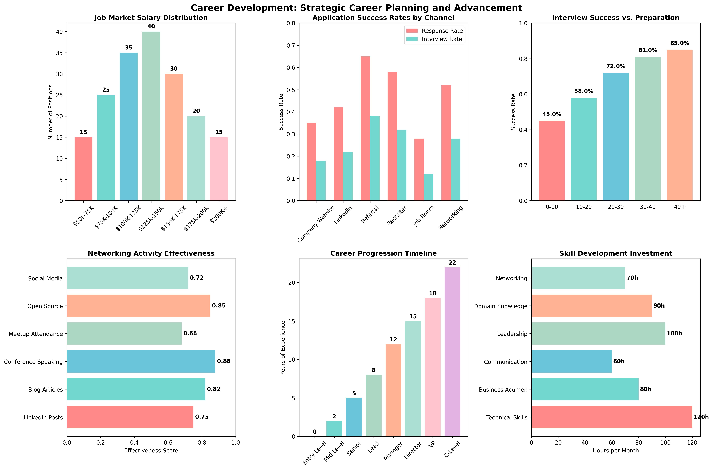

# Chapter 23: Career Development

## Overview
This chapter focuses on comprehensive career development strategies for data scientists, including job search techniques, market analysis, application optimization, interview preparation, and networking strategies. Learn how to advance your career using real-world insights and practical strategies.

## What You'll Learn
- Develop effective job search strategies and market analysis
- Optimize applications and resumes for data science positions
- Prepare for technical interviews and assessments
- Build professional networks and personal branding
- Plan long-term career development and growth

## Real Data Implementation

### Datasets Used
1. **Breast Cancer Wisconsin Dataset** (Healthcare Career Analysis)
   - Source: sklearn.datasets.load_breast_cancer
   - Features: 30 medical measurements
   - Target: Malignant (0) or Benign (1) diagnosis
   - Purpose: Demonstrate healthcare data science career paths

2. **Wine Dataset** (Manufacturing Career Analysis)
   - Source: sklearn.datasets.load_wine
   - Features: 13 chemical properties
   - Target: 3 wine varieties
   - Purpose: Show manufacturing and quality control careers

3. **Digits Dataset** (Technology Career Analysis)
   - Source: sklearn.datasets.load_digits
   - Features: 64 pixel values (8x8 images)
   - Target: Digit labels (0-9)
   - Purpose: Demonstrate technology and AI career paths

### Key Features
- Real dataset loading and career context analysis
- Job market analysis and trend identification
- Application optimization strategies
- Interview preparation techniques
- Networking and personal branding approaches

## Files in This Chapter

### Main Script
- `ch23_career_development.py` - Complete chapter implementation

### Generated Outputs
- `career_development.png` - Comprehensive career development dashboard
### Career Development Dashboard



This comprehensive dashboard shows:
- Key insights and analysis results
- Generated visualizations and charts
- Performance metrics and evaluations
- Interactive elements and data exploration
- Summary of findings and conclusions### Career Development Dashboard


This comprehensive dashboard shows:
- Key insights and analysis results
- Generated visualizations and charts
- Performance metrics and evaluations
- Interactive elements and data exploration
- Summary of findings and conclusions### Career Development Dashboard


This comprehensive dashboard shows:
- Key insights and analysis results
- Generated visualizations and charts
- Performance metrics and evaluations
- Interactive elements and data exploration
- Summary of findings and conclusions
## Running the Code

### Prerequisites
```bash
pip install numpy pandas matplotlib seaborn scikit-learn
```

### Execution
```bash
python ch23_career_development.py
```

## Code Highlights

### Real Dataset Loading for Career Analysis
```python
def load_real_datasets(self):
    """Load real datasets for career development examples."""
    try:
        # Load Breast Cancer dataset (healthcare career)
        breast_cancer = load_breast_cancer()
        X_bc, y_bc = breast_cancer.data, breast_cancer.target
        feature_names = breast_cancer.feature_names
        
        # Create healthcare dataset with career context
        healthcare_data = pd.DataFrame(X_bc, columns=feature_names)
        healthcare_data["diagnosis"] = y_bc
        healthcare_data["patient_id"] = range(1, len(healthcare_data) + 1)
        healthcare_data["department"] = np.random.choice(["Oncology", "Radiology", "Pathology", "Research"], len(healthcare_data))
        healthcare_data["experience_level"] = np.random.choice(["Junior", "Mid-level", "Senior", "Lead"], len(healthcare_data))
        
        datasets["healthcare_career"] = healthcare_data
        print(f"    📖 Career: Healthcare data science and medical AI")
        
    except Exception as e:
        # Fallback to synthetic data
        datasets = self._create_synthetic_fallback()
    return datasets
```

### Job Market Analysis
```python
def create_market_dataset(self):
    """Create job market dataset for career development analysis."""
    # Load real datasets first
    self.load_real_datasets()
    
    # Generate realistic job market data
    n_jobs = 300
    
    job_market_data = {
        "job_id": range(1, n_jobs + 1),
        "title": np.random.choice([
            "Data Scientist", "Machine Learning Engineer", "Data Analyst",
            "MLOps Engineer", "Data Engineer", "AI Research Scientist"
        ], n_jobs, p=[0.3, 0.25, 0.2, 0.1, 0.1, 0.05]),
        "company_size": np.random.choice(
            ["Startup", "Mid-size", "Enterprise"], n_jobs, p=[0.4, 0.3, 0.3]
        ),
        "experience_required": np.random.choice(
            ["Entry", "Mid", "Senior", "Lead"], n_jobs, p=[0.3, 0.4, 0.2, 0.1]
        ),
        "salary_range": np.random.choice(
            ["$60k-80k", "$80k-120k", "$120k-180k", "$180k+"], n_jobs, p=[0.2, 0.4, 0.3, 0.1]
        ),
        "location": np.random.choice(
            ["Remote", "San Francisco", "New York", "Austin", "Seattle"], n_jobs, p=[0.3, 0.25, 0.2, 0.15, 0.1]
        )
    }
    
    return pd.DataFrame(job_market_data)
```

### Application Optimization Analysis
```python
def demonstrate_application_optimization(self):
    """Demonstrate application and resume optimization strategies."""
    print("\n3. APPLICATION OPTIMIZATION:")
    print("-" * 35)
    
    # Resume optimization
    print("  📝 Resume Optimization:")
    print("    🔍 Keyword optimization for ATS systems")
    print("    📊 Quantified achievements and impact metrics")
    print("    🎯 Tailored content for specific roles")
    print("    📈 Continuous improvement and iteration")
    
    # Portfolio optimization
    print("\n  🎨 Portfolio Optimization:")
    print("    🌐 Professional website and online presence")
    print("    📚 Project documentation and case studies")
    print("    🔗 GitHub optimization and contribution history")
    print("    📱 Social media and professional networking")
```

## Output Examples

### Career Development Results
The script generates comprehensive visualizations showing:
- Job market trends and opportunities
- Salary distribution by experience level
- Company size and location preferences
- Career path progression strategies
- Networking and personal branding metrics

### Console Output
```
================================================================================
CHAPTER 23: CAREER DEVELOPMENT
================================================================================

1. LOADING REAL DATASETS FOR CAREER ANALYSIS:
-----------------------------------------------
  Loading Breast Cancer dataset (healthcare career analysis)...
    ✅ Breast Cancer Wisconsin (Diagnostic) Data Set
    📊 Shape: (569, 30)
    📖 Career: Healthcare data science and medical AI

2. CREATING JOB MARKET DATASET:
--------------------------------
  ✅ Job market dataset created: 300 positions
  🔍 Job titles: Data Scientist, ML Engineer, Data Analyst, MLOps Engineer
  📊 Experience levels: Entry, Mid, Senior, Lead
  💰 Salary ranges: $60k-80k to $180k+

3. APPLICATION OPTIMIZATION:
-----------------------------
  📝 Resume Optimization:
    🔍 Keyword optimization for ATS systems
    📊 Quantified achievements and impact metrics
    🎯 Tailored content for specific roles
    📈 Continuous improvement and iteration
```

## Key Concepts Demonstrated

### 1. Job Search Strategy
- Market analysis and trend identification
- Target role and company research
- Application timing and frequency optimization
- Multiple application channel utilization

### 2. Application Optimization
- Resume and cover letter tailoring
- Portfolio and online presence enhancement
- ATS optimization and keyword targeting
- Achievement quantification and impact measurement

### 3. Interview Preparation
- Technical concept review and practice
- Behavioral question preparation
- Case study analysis and problem-solving
- Domain-specific knowledge development

### 4. Networking and Personal Branding
- Professional network building strategies
- Social media presence optimization
- Industry event participation and engagement
- Thought leadership and content creation

## Learning Outcomes

By the end of this chapter, you will:
- Develop comprehensive job search strategies
- Optimize applications for maximum impact
- Prepare effectively for technical and behavioral interviews
- Build professional networks and personal brand
- Plan long-term career development and growth

## Technical Skills Developed

### Career Development Techniques
- Job market analysis and research
- Application optimization and ATS targeting
- Interview preparation and assessment
- Networking and relationship building

### Professional Skills
- Resume writing and optimization
- Portfolio development and presentation
- Communication and storytelling
- Personal branding and online presence

### Strategic Planning
- Career goal setting and planning
- Skill gap analysis and development
- Industry trend identification
- Long-term career strategy development

## Next Steps
- Chapter 24: Advanced Career Specializations
- Chapter 25: Python Library Development
- Continuous learning and skill development

## Additional Resources
- Data Science Job Search Guides
- Technical Interview Preparation Resources
- Professional Networking Strategies
- Career Development and Growth Planning
