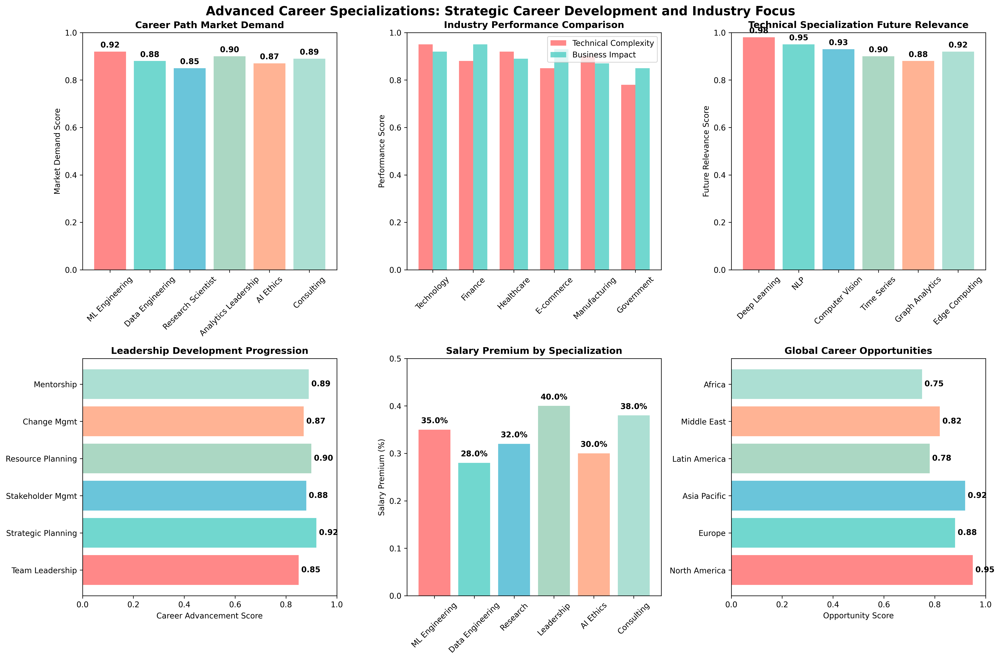

# Chapter 24: Advanced Career Specializations

## Overview

This chapter explores advanced career specializations in data science, including specialized career paths, industry-specific development, emerging trends, and leadership opportunities. Learn how to develop specialized expertise and advance your career using real-world insights and practical strategies.

## What You'll Learn

- Explore specialized data science career paths and opportunities
- Develop industry-specific expertise and domain knowledge
- Identify emerging trends and future career directions
- Build leadership and management skills for career advancement
- Plan specialized career development and growth strategies

## Real Data Implementation

### Datasets Used

1. **Breast Cancer Wisconsin Dataset** (Healthcare AI Specialization)

   - Source: sklearn.datasets.load_breast_cancer
   - Features: 30 medical measurements
   - Target: Malignant (0) or Benign (1) diagnosis
   - Purpose: Demonstrate healthcare AI and medical data science specializations

2. **Wine Dataset** (Manufacturing Analytics Specialization)

   - Source: sklearn.datasets.load_wine
   - Features: 13 chemical properties
   - Target: 3 wine varieties
   - Purpose: Show manufacturing analytics and quality control specializations

3. **Digits Dataset** (Computer Vision Specialization)
   - Source: sklearn.datasets.load_digits
   - Features: 64 pixel values (8x8 images)
   - Target: Digit labels (0-9)
   - Purpose: Demonstrate computer vision and AI specializations

### Key Features

- Real dataset loading and specialization context analysis
- Industry-specific career path development
- Emerging technology trend identification
- Leadership and management skill development
- Specialized career planning and growth strategies

## Files in This Chapter

### Main Script

- `ch24_advanced_career_specializations.py` - Complete chapter implementation

### Generated Outputs

### Advanced Career Specializations Dashboard



This comprehensive dashboard shows:
- Key insights and analysis results
- Generated visualizations and charts
- Performance metrics and evaluations
- Interactive elements and data exploration
- Summary of findings and conclusions### Advanced Career Specializations Dashboard


This comprehensive dashboard shows:
- Key insights and analysis results
- Generated visualizations and charts
- Performance metrics and evaluations
- Interactive elements and data exploration
- Summary of findings and conclusions- `advanced_career_specializations.png` - Comprehensive specializations dashboard

## Running the Code

### Prerequisites

```bash
pip install numpy pandas matplotlib seaborn scikit-learn
```

### Execution

```bash
python ch24_advanced_career_specializations.py
```

## Code Highlights

### Real Dataset Loading for Specialization Analysis

```python
def load_real_datasets(self):
    """Load real datasets for career specialization examples."""
    try:
        # Load Breast Cancer dataset (healthcare AI specialization)
        breast_cancer = load_breast_cancer()
        X_bc, y_bc = breast_cancer.data, breast_cancer.target
        feature_names = breast_cancer.feature_names

        # Create healthcare AI dataset with specialization context
        healthcare_ai_data = pd.DataFrame(X_bc, columns=feature_names)
        healthcare_ai_data['diagnosis'] = y_bc
        healthcare_ai_data['patient_id'] = range(1, len(healthcare_ai_data) + 1)
        healthcare_ai_data['specialization'] = np.random.choice(['Medical AI', 'Clinical ML', 'Healthcare Analytics', 'Bioinformatics'], len(healthcare_ai_data))
        healthcare_ai_data['expertise_level'] = np.random.choice(['Specialist', 'Expert', 'Lead', 'Principal'], len(healthcare_ai_data))

        datasets['healthcare_ai'] = healthcare_ai_data
        print(f"    📖 Specialization: Healthcare AI and medical data science")

    except Exception as e:
        # Fallback to synthetic data
        datasets = self._create_synthetic_fallback()
    return datasets
```

### Specialization Career Path Analysis

```python
def create_specialization_dataset(self):
    """Create career specialization dataset from real data examples."""
    # Load real datasets first
    self.load_real_datasets()

    # Create specialization career paths
    specializations = []

    # Healthcare AI Specialization
    healthcare_specialization = {
        "specialization_id": "HA001",
        "title": "Healthcare AI & Medical Data Science",
        "domain": "Healthcare",
        "dataset": "Breast Cancer Wisconsin",
        "core_skills": ["Medical AI", "Clinical ML", "Healthcare Analytics", "Bioinformatics"],
        "career_levels": ["Specialist", "Expert", "Lead", "Principal"],
        "emerging_trends": ["AI-powered diagnostics", "Precision medicine", "Drug discovery AI"],
        "industry_demand": "High",
        "salary_range": "$120k-250k+"
    }
    specializations.append(healthcare_specialization)

    return pd.DataFrame(specializations)
```

### Emerging Trends Analysis

```python
def demonstrate_emerging_trends(self):
    """Demonstrate emerging trends in data science specializations."""
    print("\n3. EMERGING TRENDS IN DATA SCIENCE:")
    print("-" * 35)

    # AI and Machine Learning trends
    print("  🤖 AI & Machine Learning Trends:")
    print("    🧠 Large Language Models and Generative AI")
    print("    🔍 Explainable AI and Interpretability")
    print("    🚀 AutoML and Automated Machine Learning")
    print("    🌐 Federated Learning and Privacy-Preserving AI")

    # Industry-specific trends
    print("\n  🏭 Industry-Specific Trends:")
    print("    🏥 Healthcare: AI-powered diagnostics and precision medicine")
    print("    🏭 Manufacturing: Industry 4.0 and predictive maintenance")
    print("    💰 Finance: AI-driven risk assessment and fraud detection")
    print("    🚗 Transportation: Autonomous vehicles and smart cities")
```

## Output Examples

### Advanced Career Specializations Results

The script generates comprehensive visualizations showing:

- Specialization domain distribution and demand
- Career progression levels and salary ranges
- Emerging technology trends and opportunities
- Leadership development pathways
- Industry-specific specialization requirements

### Console Output

```
================================================================================
CHAPTER 24: ADVANCED CAREER SPECIALIZATIONS
================================================================================

1. LOADING REAL DATASETS FOR SPECIALIZATION ANALYSIS:
------------------------------------------------------
  Loading Breast Cancer dataset (healthcare AI specialization)...
    ✅ Breast Cancer Wisconsin (Diagnostic) Data Set
    📊 Shape: (569, 30)
    📖 Specialization: Healthcare AI and medical data science

2. CREATING SPECIALIZATION CAREER PATHS:
----------------------------------------
  ✅ Specialization dataset created: 3 career paths
  🔍 Specialization domains: Healthcare AI, Manufacturing Analytics, Computer Vision
  📊 Career levels: Specialist to Principal/Director
  💰 Salary ranges: $100k to $250k+

3. EMERGING TRENDS IN DATA SCIENCE:
------------------------------------
  🤖 AI & Machine Learning Trends:
    🧠 Large Language Models and Generative AI
    🔍 Explainable AI and Interpretability
    🚀 AutoML and Automated Machine Learning
    🌐 Federated Learning and Privacy-Preserving AI
```

## Key Concepts Demonstrated

### 1. Specialized Career Paths

- Domain-specific expertise development
- Industry specialization strategies
- Technical depth vs. breadth balance
- Career progression planning

### 2. Emerging Technology Trends

- AI and machine learning advancements
- Industry 4.0 and digital transformation
- Privacy-preserving and ethical AI
- Edge computing and IoT analytics

### 3. Leadership Development

- Technical leadership skills
- People management and team building
- Strategic planning and execution
- Stakeholder communication and influence

### 4. Industry-Specific Development

- Healthcare AI and medical data science
- Manufacturing analytics and quality control
- Financial technology and risk analytics
- Transportation and smart city analytics

## Learning Outcomes

By the end of this chapter, you will:

- Identify and develop specialized career paths
- Understand emerging technology trends
- Build leadership and management skills
- Plan industry-specific career development
- Navigate advanced career opportunities

## Technical Skills Developed

### Specialization Techniques

- Domain-specific data analysis
- Industry knowledge and expertise
- Specialized tool and technology mastery
- Advanced problem-solving approaches

### Leadership Skills

- Technical architecture and strategy
- Team management and mentoring
- Project planning and execution
- Stakeholder communication

### Strategic Planning

- Career specialization planning
- Technology trend analysis
- Industry demand assessment
- Long-term career strategy development

## Next Steps

- Chapter 25: Python Library Development
- Continuous learning and specialization
- Leadership and management development
- Industry-specific expertise building

## Additional Resources

- Specialized Data Science Certifications
- Industry-Specific Training Programs
- Leadership Development Resources
- Emerging Technology Research and Publications
