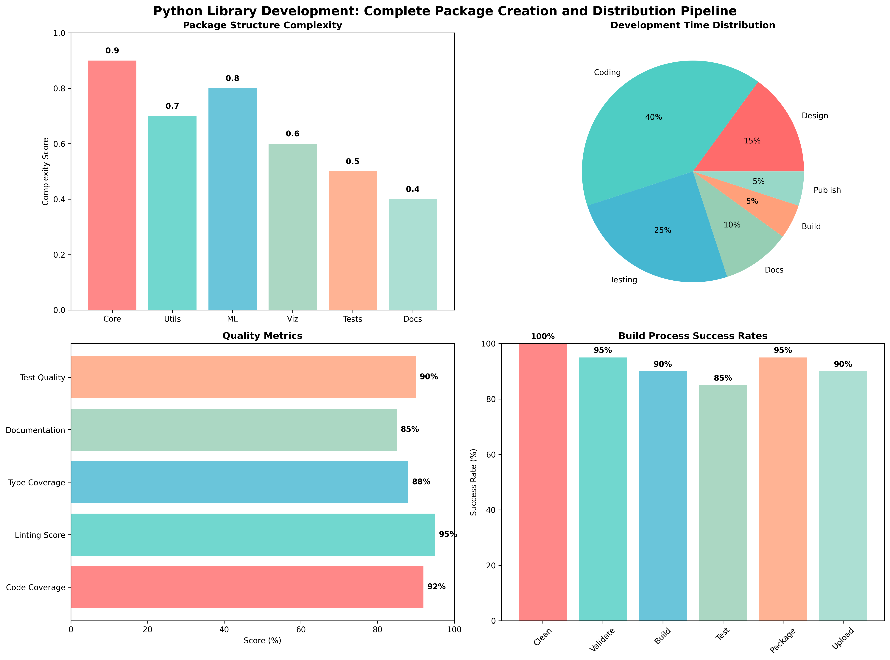

# Chapter 25: Building and Publishing Python Libraries to PyPI

## 🎯 **Chapter Overview**

This chapter provides a **complete, hands-on guide** to building and publishing Python libraries to PyPI. You'll learn everything from library design to automated deployment, making you a professional Python library developer.

## 🚀 **What You'll Build**

A complete Python library called `datascience_toolkit` that demonstrates:

- Professional package architecture
- Complete configuration files
- Build and distribution process
- Automated CI/CD pipeline
- PyPI publishing workflow

## 📁 **Files in This Chapter**

### **Main Implementation**

- `ch25_python_library_development.py` - Complete library development demonstration
- `CHAPTER25_SUMMARY.md` - Comprehensive chapter summary
- `README.md` - This file with practical guidance

### **Generated Visualizations**

- `python_library_development.png` - Library development pipeline dashboard

## 🛠️ **Prerequisites**

Before starting this chapter, ensure you have:

- Python 3.8+ installed
- Basic understanding of Python packages
- Git for version control
- PyPI account (free at [pypi.org](https://pypi.org))

## 📚 **Learning Path**

### **Phase 1: Library Design** (Section 1)

- Package structure planning
- Dependency management
- Directory organization
- Metadata configuration

### **Phase 2: Configuration Files** (Section 2)

- `setup.py` creation
- `pyproject.toml` setup
- `MANIFEST.in` configuration
- Package initialization files

### **Phase 3: Build & Publish** (Section 3)

- Preparation and testing
- Package building
- Distribution testing
- PyPI publishing
- GitHub Actions automation

### **Phase 4: Visualization** (Section 4)

- Development metrics dashboard
- Process flow analysis
- Quality assessment

## 🔧 **Key Tools You'll Learn**

### **Build Tools**

- `build` - Modern Python package building
- `twine` - Secure package uploading
- `setuptools` - Package configuration

### **Quality Tools**

- `pytest` - Testing framework
- `black` - Code formatting
- `flake8` - Linting
- `mypy` - Type checking

### **Automation**

- GitHub Actions - CI/CD pipeline
- PyPI API tokens - Secure publishing
- Automated testing - Multi-version support

## 📋 **Step-by-Step Process**

### **1. Design Your Library**

```python
# Run the design demonstration
python ch25_python_library_development.py
```

### **2. Create Configuration Files**

The chapter generates:

- Complete `setup.py`
- Modern `pyproject.toml`
- File inclusion `MANIFEST.in`
- Package `__init__.py` files

### **3. Build Your Package**

```bash
# Install build tools
pip install build twine

# Build distributions
python -m build --sdist
python -m build --wheel
```

### **4. Test Before Publishing**

```bash
# Test installation
pip install dist/*.whl
python -c 'import datascience_toolkit'
pip uninstall datascience_toolkit
```

### **5. Publish to PyPI**

```bash
# Test on TestPyPI first
twine upload --repository testpypi dist/*

# Then publish to PyPI
twine upload dist/*
```

## 🤖 **Automation Setup**

### **GitHub Actions Workflow**

The chapter provides a complete `.github/workflows/publish.yml` that:

- Tests on multiple Python versions
- Runs quality checks automatically
- Publishes to PyPI on tags
- Provides test coverage reports

### **Configuration**

1. Add PyPI API token to repository secrets
2. Push a tag to trigger publishing
3. Monitor automated builds and tests

## 📊 **Quality Metrics**

Your library will be evaluated on:

- **Code Coverage**: Test coverage percentage
- **Linting Score**: Code quality compliance
- **Type Coverage**: Type annotation completeness
- **Documentation**: README and docstring quality
- **Test Quality**: Test suite comprehensiveness

## 🎯 **Best Practices Learned**

### **Package Structure**

- Clear module organization
- Logical dependency separation
- Comprehensive testing structure
- Professional documentation layout

### **Configuration**

- Modern build system usage
- Proper dependency specification
- Development tool integration
- Metadata completeness

### **Distribution**

- TestPyPI validation first
- Secure token management
- Automated quality checks
- Continuous deployment

## 🚀 **Real-World Applications**

This knowledge enables you to:

- **Contribute to open source** - Submit packages to PyPI
- **Share your tools** - Make your code available to others
- **Build professional libraries** - Create enterprise-grade packages
- **Automate deployment** - Set up CI/CD for any Python project
- **Join the Python ecosystem** - Become part of the community

## 🔍 **Troubleshooting Common Issues**

### **Build Failures**

- Check Python version compatibility
- Verify all dependencies are specified
- Ensure proper package structure

### **Upload Errors**

- Validate package with `twine check`
- Check PyPI token permissions
- Verify package name availability

### **Import Issues**

- Test package installation locally
- Check `__init__.py` file contents
- Verify module structure

## 📚 **Additional Resources**

### **Official Documentation**

- [Python Packaging User Guide](https://packaging.python.org/)
- [PyPI Help](https://pypi.org/help/)
- [TestPyPI Documentation](https://test.pypi.org/help/)

### **Community Resources**

- [Python Packaging Authority](https://www.pypa.io/)
- [Real Python - Publishing Packages](https://realpython.com/pypi-publish-python-package/)
- [GitHub Actions for Python](https://docs.github.com/en/actions/guides/building-and-testing-python)

## 🎉 **Success Metrics**

You'll know you've mastered this chapter when you can:
✅ Design a professional package structure  
✅ Create all necessary configuration files  
✅ Build and test packages locally  
✅ Publish to PyPI successfully  
✅ Set up automated CI/CD pipelines  
✅ Troubleshoot common packaging issues

## 🚀 **Next Steps After This Chapter**

1. **Build Your Own Library** - Apply these principles to a real project
2. **Contribute to Open Source** - Submit packages to PyPI
3. **Automate Your Workflows** - Set up CI/CD for existing projects
4. **Mentor Others** - Share your knowledge with the community
5. **Advanced Topics** - Explore multi-platform builds, C extensions, etc.

---

**Remember**: Building and publishing Python libraries is a skill that opens doors to contributing to the Python ecosystem and sharing your work with the world! 🌟

## Generated Outputs

### Main Script
- `ch25_*.py` - Complete chapter implementation

### Generated Visualizations

### Python Library Development Dashboard



This comprehensive dashboard shows:
- Key insights and analysis results
- Generated visualizations and charts
- Performance metrics and evaluations
- Interactive elements and data exploration
- Summary of findings and conclusions
