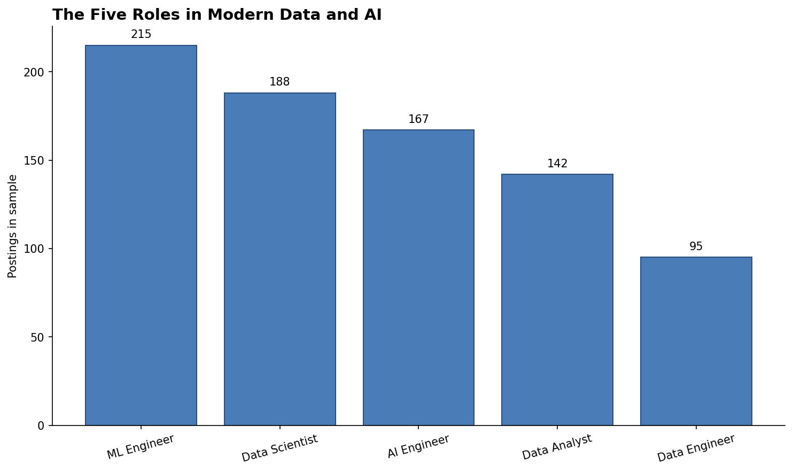

# Chapter 1: The Data Science Landscape

> **TalentLens milestone:** Understand the problem we're solving: why keyword search fails at job matching, what a data-science-powered platform looks like instead, and where each of the next 23 chapters sits in building one.

---

## The problem we're solving

You open LinkedIn on a Monday morning. The job search bar is right there. You type "AI engineer Bangalore" and get 1,247 results. You add "remote": 312. You add "₹40L+": 4 results, two of which are from the same company and one of which is for a Director role.

You search again with "ML engineer" instead of "AI engineer" and get 891 results. Different jobs. Many of them are the same companies, but the postings don't overlap because the title was different.

You try "Machine Learning Engineer" with the full spelling: 600 more results. Different again. Different listings. Same companies in many cases.

This is the failure of keyword search. The roles are similar enough that they should rank together when a candidate searches. The titles are different enough that they don't. And no human is going to type every variation: "ML Engineer," "Machine Learning Engineer," "Senior ML Engineer," "ML/AI Engineer," "AI/ML Engineer," "Data Scientist (ML)," "MLOps Engineer," "Applied ML Engineer." The companies aren't consistent and the candidates can't be exhaustive.

There's a second failure underneath the first. Even when the search matches, the *content* is opaque. A posting that says "5+ years Python, exposure to ML, looking for full-stack engineer" might pay ₹35L. A posting that says "Senior ML Engineer, ML fundamentals, production experience" might pay ₹14L. The titles tell you nothing. The descriptions tell you something. Nobody reads 1,247 descriptions.

**This is what TalentLens fixes.** A job market intelligence platform that reads every posting, classifies the role based on what the job actually involves (not what it's labelled), extracts the skills demanded, ranks postings by similarity to your CV, and surfaces the salary range distribution for the role-and-skill profile you're targeting. By the end of this book we will have built it end to end.

That's the running thread. Every chapter advances it. Chapter 4 picks the data sources. Chapter 5 scrapes them. Chapter 9 builds the role classifier. Chapter 13 extracts the skills. Chapter 16 powers the semantic search. Chapter 19 serves it as an API. Chapter 22 publishes the reusable core as a PyPI package. Chapter 24 uses the data the platform produces to answer the career questions you opened the chapter with.

That's the book. Let's start by understanding the field we're entering.

---

## Why now, and why this chapter

You are starting a career, or pivoting one, into a field that has changed more in the last three years than it did in the previous ten. The job titles that pay best in 2026 didn't exist in 2022. The tools that anchor modern AI engineering (vector databases, LLM frameworks, agent infrastructure) barely existed five years ago. Most data science curricula are still teaching CRISP-DM and the difference between supervised and unsupervised learning, which is fine, but the gap between "completed a data science course" and "can get hired as an AI engineer" is now wider than it has ever been.

This chapter exists to close part of that gap by giving you a map.

**What this chapter is:** the taxonomy of the field as it actually exists in mid-2026: the five roles that employers hire for, what each one does day to day, what each one pays, and where the trajectory is heading. The 24-chapter arc that follows, mapped to which roles each chapter prepares you for.

**What this chapter is not:** a definition of data science. There are 200 books that open with that. The Wikipedia page is fine. Skip it.

**When this chapter falls short:** if you've been working as a senior ML or AI engineer for five years, the taxonomy here is too coarse; you already know the field. Skim it and start at Chapter 2. The audience this chapter is calibrated for is engineers and students who can read a Pandas tutorial but don't yet have a clear picture of how the roles differ in pay, work, and trajectory.

---

## The methods

This chapter doesn't have methods in the algorithmic sense. What it has is a taxonomy, a structured way of slicing the field that the rest of the book builds on. Treat each role definition the way you'd treat a method definition: read what it does, what it costs (in salary terms), when to "use" it (which is to say, when to target it as your career path).

*Salary bands below are indicative early-2026 India ranges from the author's market read, not TalentLens-measured medians.*

### Role 1: Data Analyst

**What they do:** Take questions from a business stakeholder ("why did revenue drop last quarter?"), pull the relevant data from a warehouse or BI tool, produce a chart or dashboard that answers the question, present it. Most of the work is SQL and a BI tool (Tableau, Power BI, Metabase, Looker). Some Python or R for ad-hoc analysis. Rarely deploys anything.

**Primary tools:** SQL (always), Tableau or Power BI (common), Excel (still), Python or R (sometimes).

**Primary question they answer:** *"What happened?"* Past tense, descriptive.

**Salary band (India, 2026):** ₹5–18L for 0–5 years. ₹18–28L senior. Top of this band caps lower than the technical roles below.

**When this is the right path for you:** you like talking to humans, framing questions, communicating findings. You're patient. You enjoy stakeholder management. You'd rather influence a decision than build a system.

**Red flag, a mislabelled role:** A "Data Analyst" job at a service company that asks for "data science" skills usually means "we want you to do analyst work but the title makes us look more sophisticated to clients." Same job, lower pay than calling it what it is.

---

### Role 2: Data Scientist

**What they do:** Take a less-defined problem ("can we predict which customers will churn?"), explore the data, design and run experiments, build statistical models, communicate results. Strong in stats, hypothesis testing, A/B testing, experimental design. Builds models that may or may not be productionised. The boundary with ML Engineer is fuzzy and depends on the company.

**Primary tools:** Python (pandas, scikit-learn, statsmodels), Jupyter notebooks, occasionally R. SQL for data extraction. Some product analytics tools (Amplitude, Mixpanel).

**Primary question they answer:** *"Why did it happen?"* Causal, inferential.

**Salary band (India, 2026):** ₹8–25L for 0–5 years. ₹25–45L senior. The variance is high because the title means different things at different companies.

**When this is the right path for you:** you like maths and statistics for their own sake, not as a means to ML. You enjoy designing experiments. You're comfortable explaining a p-value to a product manager.

**Red flag, a mislabelled role:** A "Data Scientist" job that doesn't mention any statistics in the JD and asks for Spark, Airflow, and Kubernetes is actually a Data Engineer role with marketing.

---

### Role 3: Data Engineer

**What they do:** Build and maintain the infrastructure that gets data from where it lives (databases, APIs, event streams, third-party tools) to where analysts and scientists can use it. Pipelines, warehouses, schemas. Strong in distributed systems, SQL at scale, orchestration.

**Primary tools:** Spark, dbt, Airflow or Dagster, Kafka, Snowflake or BigQuery, SQL (heavy), Python.

**Primary question they answer:** *"How do we get the data?"* Infrastructure, plumbing.

**Salary band (India, 2026):** ₹10–22L for 0–5 years. ₹22–45L senior. Higher floor than analyst because the skills transfer to software engineering generally.

**When this is the right path for you:** you like systems. You're comfortable with the dirty parts of data: schema drift, late-arriving records, broken upstream APIs. You'd rather build pipelines that run for a year than dashboards that change weekly.

**Red flag, a mislabelled role:** At smaller companies, "Data Engineer" sometimes means "the only person who knows SQL." If the JD doesn't mention any pipeline tooling (Airflow, dbt, Spark) and the company has fewer than 50 engineers, you're likely being hired as a database administrator under a more fashionable title.

---

### Role 4: Machine Learning Engineer

**What they do:** Take ML models (from data scientists, from open-source releases, or from their own training work) and put them into production. Train, evaluate, deploy, monitor. Strong in the software engineering side of ML (packaging, serving, observability) and usually decent at the modelling side too.

**Primary tools:** Python (scikit-learn, PyTorch or TensorFlow, MLflow), Docker, Kubernetes, FastAPI or similar, cloud ML platforms (Vertex AI, SageMaker, Azure ML).

**Primary question they answer:** *"Can we predict it?"* And then: "Can we serve that prediction reliably at scale?"

**Salary band (India, 2026):** ₹12–28L for 0–5 years. ₹28–55L senior. Equity at product companies adds substantially.

**When this is the right path for you:** you're a software engineer at heart who likes ML. You want to ship things, not just train them. You're patient with infrastructure work.

**Red flag, a mislabelled role:** "ML Engineer" at a company with no production ML usually means "we want to do ML but haven't yet." You'll spend the first six months building infrastructure that should already exist.

---

### Role 5: AI Engineer

**What they do:** Build systems that use foundation models (LLMs, vision models, audio models) to solve product problems. RAG over documents. Agentic workflows. Voice assistants. Multi-step reasoning. Less training, more orchestration and prompting and integration. The newest of the five roles, and the one with the most rapid evolution.

**Primary tools:** Python, LLM clients (OpenAI, Anthropic, Groq), LangChain or DSPy or raw HTTP, vector databases (pgvector, Pinecone, Weaviate, Qdrant), FastAPI for serving, increasingly agent frameworks.

**Primary question they answer:** *"Can we generate it?"* Or build a system that decides and acts on its own.

**Salary band (India, 2026):** ₹15–35L for 0–5 years. ₹35–75L senior. The remote contract band is higher again: $4–12k/month is common for experienced AI engineers working with US startups.

**When this is the right path for you:** you're comfortable with rapid change. You can read a research paper from last week and apply something from it next week. You're comfortable that the "right" architecture is going to change every six months for the foreseeable future.

**Red flag, a mislabelled role:** "AI Engineer" at a company that just discovered ChatGPT in 2025 often means "wrap GPT-4 in a Streamlit app." Real AI engineering involves retrieval, evaluation, cost management, latency, fallback behaviour, and increasingly agents. If the JD mentions only "prompt engineering" and the role pays under ₹20L, the company isn't doing AI engineering yet.

---

### The three eras of the field

The five roles above are the *snapshot*. The trajectory matters too. The field has gone through three roughly distinguishable eras in the last decade:

**Pre-2018: Classical ML era.** Logistic regression, random forests, gradient boosting. Feature engineering was the differentiator. Most production "ML" was scikit-learn on tabular data. Data Scientist was the dominant role.

**2018–2022: Deep learning era.** ResNet, BERT, the rise of PyTorch. Transformers everywhere. CV and NLP became distinct sub-fields, each producing dedicated specialists. ML Engineer emerged as a distinct role from Data Scientist as the gap between training and serving widened.

**2022–present: LLM era.** Foundation models become available via APIs. The barrier to building useful AI products drops from "PhD and a GPU cluster" to "API key and a credit card." AI Engineer emerges as a role distinct from ML Engineer because the work (orchestration, prompting, retrieval, evaluation, agents) is different from training models. The pace of change accelerates.

We're three years into the LLM era. The roles are still settling. The work TalentLens does, semantic search over job postings, LLM-based skill extraction and CV matching with retrieval-augmented generation, wouldn't have been feasible in 2018 and wouldn't have been a product idea worth pursuing in 2022. In 2026 it's a weekend project for a competent AI engineer.

That's the world this book is teaching you to operate in.

---

## The code

The first chapter doesn't compute anything heavy. What it does is **make sure your environment is ready** for the next 23 chapters. The companion file does three things:

1. Checks your Python version (the book targets 3.11; 3.12 also works)
2. Checks which book dependencies are installed and which are missing
3. Generates one chart: the distribution of the five roles in a small sample dataset, so you can verify matplotlib and pandas are working

Run it from the repository root:

```bash
python book/ch01/ch01_data_science_landscape.py
```

If everything is set up, you'll see a "ready" banner and a saved chart at [`book/ch01/reports/figures/ch01_role_distribution.png`](https://github.com/irfanalidv/Book-Data_Voyage/blob/main/book/ch01/reports/figures/ch01_role_distribution.png). If something is missing, the script tells you what to install. See [`book/ch01/ch01_data_science_landscape.py`](https://github.com/irfanalidv/Book-Data_Voyage/blob/main/book/ch01/ch01_data_science_landscape.py) for the implementation.

Three code decisions worth explaining:

*Why we check the environment in Chapter 1 rather than assuming it's set up:* Half the failures in technical books are environment failures. The reader runs the chapter code, gets a `ModuleNotFoundError`, and assumes the book is broken. By making Chapter 1's job to verify the environment, we catch those failures early and tell the reader exactly what to do.

*Why we don't yet load real TalentLens data:* Real data comes from Chapter 5's collectors. Chapter 1 uses a small synthetic sample (five role names, plausible salary distributions, a few hundred rows) because the point of the chart is to verify matplotlib works, not to do real analysis. Real analysis starts in Chapter 7.

*Why the chart is the simplest possible bar chart:* Chapter 7 introduces the book's visualisation standards in detail. Chapter 1 just needs a chart that proves the toolchain is functioning. We will not start with anything fancy.

---

## Interpreting the output

When you run `python book/ch01/ch01_data_science_landscape.py`, the output looks like this:

```
============================================================
Data Voyage — Chapter 1 environment check
============================================================

  Python version:          3.11.0  ok

  matplotlib:              3.9.4  ok
  pandas:                  2.3.3  ok
  numpy:                   2.1.3  ok
  scikit-learn:            1.5.2  ok
  sentence_transformers:   5.1.2  ok
  fastapi:                 0.136.1  ok
  pydantic:                2.13.3  ok
  openai:                  1.55.3  ok

You are ready for Chapter 2.

Chart saved: book/ch01/reports/figures/ch01_role_distribution.png
```

**What "you are ready" means.** It means the core data stack works and every package the book pins is importable. If a line shows `not installed` instead of a tick, the script names the chapter that first needs it. `sentence_transformers`, for example, is not needed until Chapter 13.

**What the chart shows.** A simple bar chart of five role counts in the synthetic sample. It exists to confirm that matplotlib renders, that file output works (so figures get saved to the right place), and that pandas can compute a basic `value_counts()`. If the chart doesn't appear, your visualisation toolchain is broken and Chapter 7 will fail; fix it now.



**What "not installed" doesn't mean.** It doesn't mean the package is broken; it means your environment is missing it. The lockfile install (`make install`) pulls in the whole book stack, about 1.5 GB including PyTorch, so every chapter runs without further installs. If you are on a slow connection, you can start with `pip install pandas numpy matplotlib scikit-learn` (about 200 MB), work through Chapters 1–12, and install the lockfile before Chapter 13.

---

## Common mistakes I've seen (and made)

**Mistake: Choosing a role based on the salary band without checking what the role does**

What happens: you see AI Engineer at ₹35L+ and decide that's the target. You spend three months getting comfortable with LLMs and vector databases. You land an AI Engineer interview. The interviewer asks you to design a recommendation system using collaborative filtering. You realise the role is actually an ML Engineer role at a company that has rebranded its postings to attract LLM-era candidates. You weren't prepared.

How to catch it: read the job description, not the title. If the JD mentions training models, evaluation, hyperparameter tuning, and "ML system design," it's an ML Engineer role regardless of what they called it. If it mentions retrieval, prompt engineering, agents, and "LLM evaluation," it's an AI Engineer role. The title is marketing; the JD is the spec.

Fix: build your skills against the *role you want to do*, not the title that sounds impressive. The book is structured so that completing the full 24 chapters gives you AI Engineer-shaped skills. If you want to be an ML Engineer instead, that's also fine: you can stop after Chapter 22, and the resulting skill profile maps cleanly to ML Engineer roles.

---

**Mistake: Treating the five roles as a strict hierarchy**

What happens: you assume Data Analyst → Data Scientist → ML Engineer → AI Engineer is a career progression where each role is "better" than the last. You jump roles every 18 months chasing the next title. You end up four years in with shallow experience in everything and deep experience in nothing.

How to catch it: look at the senior people you respect. The senior Data Analyst at a product company who has been there for six years is often paid more, has more influence, and does more interesting work than the AI Engineer who has been at three companies in the same period.

Fix: the five roles are *different*, not hierarchical. Salary bands overlap. Trajectories overlap. The right role for you depends on what you find interesting, not what's currently fashionable. Pick one and get deep before you switch.

---

**Mistake: Believing the LLM era will replace all the others**

What happens: you skip the chapters on classical ML and statistics because "GPT-4 can do all that now." You go to an interview for an AI Engineer role. The interviewer asks you to debug why a sentence-transformer is returning high similarity for opposite-meaning sentences. You don't know what cosine similarity is doing. You don't know what an embedding actually represents. You can't reason about it. (We define both properly in Chapter 16; for now: an **embedding** is a numeric vector that encodes meaning, and **cosine similarity** measures how close two meanings are in that space.)

How to catch it: the interview is the catch. The job will be the catch. Foundations always matter.

Fix: every era builds on the previous one. Modern AI Engineers who can't reason about a confusion matrix are limited. Modern Data Scientists who can't use an LLM API are limited. The book covers all three eras for a reason; don't skip the parts that feel "old."

---

## Interview questions

**Q1: What's the difference between a Data Scientist and an ML Engineer?**

Template answer: "The distinction varies by company, but the cleanest way to think about it is along the production axis. A Data Scientist explores data, designs experiments, builds and evaluates models, and communicates findings. They might productionise their models, but usually someone else does. An ML Engineer takes models, their own or someone else's, and puts them into production, including the serving infrastructure, monitoring, evaluation pipelines, and reliability work. At small companies the same person does both. At large companies the roles are distinct. If you ask in an interview whether the company expects this role to ship models to production with end-to-end ownership, the answer tells you which kind of role it actually is."

**Q2: Why has 'AI Engineer' emerged as a role distinct from 'ML Engineer' in the last few years?**

Template answer: "The work is different. ML Engineering is about training, evaluating, and serving models. AI Engineering, in the LLM era, is mostly about orchestrating foundation models: retrieval-augmented generation, prompt engineering, agent design, evaluation of generated content, cost and latency management, fallback handling. You can be a strong AI Engineer without having trained a model in two years; you can be a strong ML Engineer without having ever called an OpenAI API. The skill overlap exists but the day-to-day work and the depth of expertise required are different enough that companies now hire for them separately."

**Q3: Walk me through how you'd choose between the five roles if you were starting today.**

Template answer: "I'd look at three things. First, what kind of work I find interesting. Talking to humans and framing questions favours analyst; designing experiments favours scientist; building infrastructure favours data engineer; shipping production systems favours ML or AI engineer. Second, what the market is paying for the trajectory I want. AI Engineer has the strongest current pay growth but also the most uncertainty about what the role will look like in three years. Third, where my existing strengths actually compound. Someone with five years of backend Python and a math degree compounds faster into ML Engineer than into Data Analyst, even if Data Analyst feels lower-risk on day one. Career choice should be a long compounding bet, not a salary maximisation in year one."

**Q4: What's the most overhyped role in the current market?**

Template answer: "Probably 'Prompt Engineer' as a standalone title. Companies hired for it in 2023; most of those roles have either been absorbed into broader AI Engineer roles or eliminated entirely. The skill of designing effective prompts and evaluating outputs is real and valuable, but as a full-time job it didn't survive contact with production. The lesson is broader: chasing a single hot title is fragile. Building a portfolio of skills that map to a role's *underlying work* is more durable than betting on which title happens to be in fashion."

**Q5: What's the most undervalued skill across all five roles?**

Template answer: "Communication. The data analyst who can frame findings for an executive, the data scientist who can explain why their model isn't ready to ship, the ML engineer who can write a clear post-mortem after an incident, the AI engineer who can document a system another engineer will inherit: these are the people who get promoted regardless of role. Technical skill at the median level for the role is enough to get hired; communication is what separates the people who plateau at senior from the people who become staff and beyond. Every interview process I've seen tests for this, even when the interviewers don't realise they're testing for it."

---

## What's next

In Chapter 2, we set up the working environment properly. Not Python syntax basics, but the project structure, dependency management, type hints, logging, and configuration patterns that every chapter from here on assumes. By the end of Chapter 2 you have a real project scaffold that the rest of the book builds on, including a [`pyproject.toml`](https://github.com/irfanalidv/Book-Data_Voyage/blob/main/pyproject.toml), a [`Makefile`](https://github.com/irfanalidv/Book-Data_Voyage/blob/main/Makefile) for common tasks, and the directory layout TalentLens grows into.

The road is long, but it's mapped. You now know the field. The next 23 chapters teach you to operate in it, building one real platform end to end. The first concrete code you write, outside of the environment check, happens in Chapter 5, when we start collecting real job postings. Everything between here and there is preparation.

Start Chapter 2.

---

## TalentLens checkpoint

At the end of this chapter, your environment should have:

- [ ] Python 3.11 or 3.12 installed and active
- [ ] A virtual environment created at `.venv` in the repository root
- [ ] Dependencies installed from the lockfile: `make install` (or `pip install -r requirements-lock.txt` then `pip install -e .`)
- [ ] [`book/ch01/ch01_data_science_landscape.py`](https://github.com/irfanalidv/Book-Data_Voyage/blob/main/book/ch01/ch01_data_science_landscape.py) runs without errors
- [ ] One chart saved to [`book/ch01/reports/figures/ch01_role_distribution.png`](https://github.com/irfanalidv/Book-Data_Voyage/blob/main/book/ch01/reports/figures/ch01_role_distribution.png)
- [ ] You can articulate, in your own words, which of the five roles you're targeting

**Concepts you own:**

- The five roles are different career paths, not a strict hierarchy; salary bands overlap and trajectories compound
- Title inflation vs job description reality: read the JD, not the marketing label
- Three eras of the field (classical ML → deep learning → GenAI orchestration) and which chapters map to which era

Reproduce locally from the repository root:

```bash
python -m venv .venv
source .venv/bin/activate          # Windows: .venv\Scripts\activate
make install                       # lockfile + editable talentlens + spaCy model
python book/ch01/ch01_data_science_landscape.py
```

If the environment check passes, you're ready for Chapter 2.
