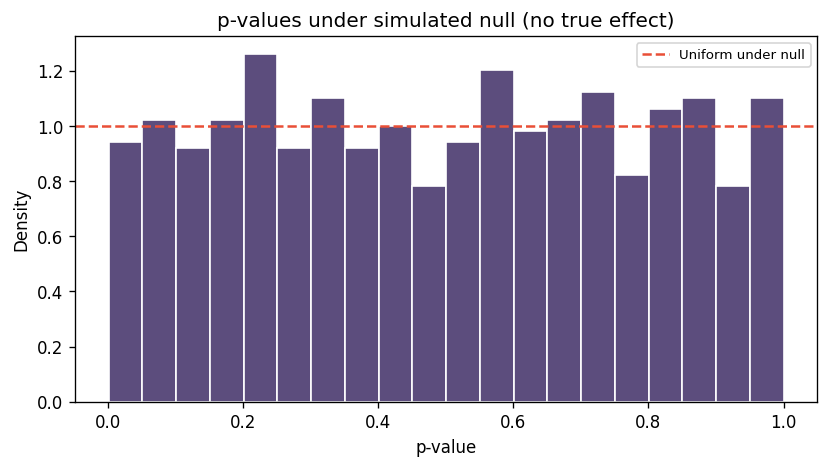
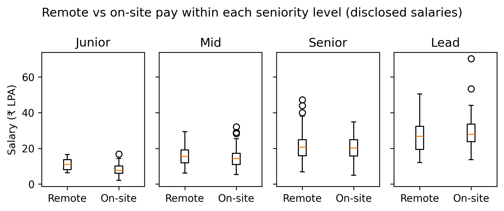

# Chapter 8: Statistical Inference — Testing What You Noticed

> **TalentLens milestone:** Answer whether the Chapter 7 remote pay gap is statistically supported after accounting for seniority: four tests in `ch08_inference.py`, plus figures under [`book/ch08/reports/figures/`](https://github.com/irfanalidv/Book-Data_Voyage/tree/main/book/ch08/reports/figures).

---

## The problem we're solving

Thursday stand-up. Your co-founder has the Chapter 7 slide open: the remote median salary is **about ₹5L higher** than on-site in the cleaned TalentLens corpus. They ask the only question that matters for a pitch deck:

*"Is that real, or did we just compare senior remote engineers to junior office roles?"*

EDA showed a pattern. It did not prove a causal claim. Chapter 8 moves from **"we noticed"** to **"under this null hypothesis, how surprising is our data?"**, with explicit confounder checks, effect sizes in rupees, and the humility to fail to reject when the data does not support the story.

**This chapter delivers:** Mann-Whitney tests on salaries, a chi-squared test on disclosure vs remote, stratified tests within each seniority level read from the job title, a simulation showing p-values under the null, and two figures you can drop next to the Chapter 7 chart.

Run `python book/ch08/ch08_inference.py`.

The co-founder question is deliberately uncomfortable: Chapter 7 made the gap **visible**; this chapter decides whether it survives **scrutiny**. Bring the EDA slide to the terminal when you run the script. You are checking your own story.

---

## Why inference now, and why these tests

Chapter 3 introduced means, medians, and confidence intervals on skewed pay. Chapter 6 built `salary_band` and disclosure flags. Chapter 7 plotted remote vs on-site and role medians. Chapter 8 is the bridge to Chapter 9's predictive models: if a feature is not associated with the target in a simple test, do not expect a classifier to rescue a spurious EDA line.

**What we are not doing:**

- **Claiming causation**: "remote causes higher pay" requires design we do not have; we test association under stated nulls.
- **Parametric t-tests on raw salary**: Indian job pay is right-skewed; we use **Mann-Whitney U** on medians-oriented comparisons.
- **P-hacking**: we run a small, pre-declared battery and discuss Bonferroni/FDR when you scale up.

**What Chapter 23 will reuse:** case-study narratives in Chapter 23 cite the same discipline: report effect size (₹ lakhs difference), sample size per group, and whether stratification removed the gap.

---

## The methods

### Hypothesis framing

Every test prints:

1. **Null hypothesis**: what we assume if there is no interesting effect.
2. **Test statistic** and **p-value**: how extreme the data are under that null.
3. **Interpretation** at **α = 0.05**: reject or fail to reject (not "accept" the null).

Example null for Test 1: *remote median salary ≤ on-site median salary* (one-sided Mann-Whitney, `alternative="greater"`).

### Mann-Whitney U (Tests 1, 1b, 2)

**What it does:** Non-parametric comparison of two independent groups on a continuous outcome (`salary_min` in INR).

**When to use:** Skewed pay, unequal variances, median-focused questions.

**Key outputs in `ch08_inference.py`:**

> **Reference: Mann-Whitney output fields**

| Field | Meaning |
|-------|---------|
| `effect_median_diff_lpa` | Remote median minus on-site median, in ₹ lakhs |
| `n_remote`, `n_onsite` | Sample sizes — small n → unstable p-values |
| `p_value` | Probability of seeing this gap if null were true |

**Test 1b (confounding centrepiece):** `remote_vs_onsite_by_seniority` repeats the comparison inside each seniority level (`junior`, `mid`, `senior`, `lead`), read from the job title by `title_seniority()`. If the overall gap vanishes inside the levels, seniority was a confounder: remote was a proxy for senior roles, not a pay premium by itself.

**Why not stratify on `salary_band`?** It's tempting, since Chapter 6 already built it, and it's wrong. `salary_band` is computed *from salary*. Comparing salaries within salary bands squeezes every group into the same narrow range, so the gap shrinks whether or not seniority explains it. That is conditioning on the outcome, and it will "explain away" any effect you test. A control variable has to be fixed before the outcome is known; the title is written before anyone sets the pay.

**Why disclosed salaries only?** Chapter 6 filled hidden salaries with group medians. Tests on those guesses measure the imputation, not the market, so the script sets them aside: 463 of 576 postings enter the salary tests.

### Chi-squared (Test 3)

**What it does:** Tests independence between two categorical variables, here `is_remote` and `salary_disclosed`.

**Null:** remote status and whether salary was disclosed are independent.

**Why it matters:** If remote postings disclose salary more often, naïve salary comparisons use unequal information; Chapter 6's `salary_disclosed` flag exists partly for this check.

### p-value: four common misreadings

> **Reference: p-value misreadings**

| Misreading | Reality |
|------------|---------|
| "p = 0.04 means 4% chance the null is true" | p is P(data this extreme \| null true), not P(null true) |
| "p > 0.05 proves no effect" | Absence of evidence is not evidence of absence — check power and n |
| "significant = important" | A ₹0.5L gap can be significant with huge n and meaningless in hiring terms |
| "one failed test kills the story" | Pre-register primary test; treat others as sensitivity analysis |

The script's **`simulate_null_p_values`** draws two equal lognormal salary groups thousands of times, runs Mann-Whitney each time, and histograms p-values. They should look **uniform** under the null. Roughly **5%** below 0.05 by construction. If your real data always give p ≈ 0.001, ask whether you are repeating the same comparison many ways without correction.

### Confidence intervals (brief)

A confidence interval is the companion to a p-value: a sentence like *"remote roles pay ₹1.5–₹3.5L more at the median (95% bootstrap CI)"* beats *"p < 0.05"* in executive conversation. This chapter prints median differences; add bootstrap CIs in your notebook when the deck needs a range.

### Statistical power (one paragraph)

Power is the probability of detecting an effect of a given size if it exists. Low `n_remote` or `n_onsite` in a seniority bin means wide uncertainty; `ch08_inference.py` skips bins with fewer than **8** per arm. Before pitching "no remote premium," check whether the study was ever powered to see a ₹1L difference. Underpowered tests litter false negatives in HR analytics.

### Multiple comparisons: Bonferroni and FDR

Running Tests 1, 1b (four levels), 2, and 3 without adjustment inflates false positives. **Bonferroni:** use α/m for m tests (conservative). **Benjamini–Hochberg FDR:** control expected fraction of false discoveries among rejected nulls. Better when exploring many role pairs in Chapter 23-style studies. For TalentLens we report all tests but label **one primary** (remote vs on-site, stratified) and treat the rest as supporting.

### Confounders: the centrepiece

A confounder correlates with both treatment (remote) and outcome (salary). **Seniority** is the textbook case: if seniors are more likely remote and paid more, pooling mixes policy with level. **Disclosure** is another: if remote jobs list salaries more, medians compare different underlying populations. **Role mix** is a third, and as the results below show, it can hide inside a stratum you thought was controlled. The seniority-controlled boxplot (`ch08_remote_vs_onsite_with_seniority_controls.png`) is the visual anchor: four panels, same y-axis, remote vs on-site within each level.

**Company tier** (product vs services) and **city** (Bangalore vs Remote-as-city) are confounders Chapter 7 EDA may surface but this script does not fully stratify. Note them as limitations when presenting to leadership. Chapter 9's model can absorb them as categorical features if labels exist in `jobs_clean.csv`.

### Mapping Chapter 3 vocabulary to this script

> **Reference: Chapter 3 → Chapter 8 vocabulary map**

| Chapter 3 idea | Chapter 8 implementation |
|----------------|---------------------------|
| Median vs mean on skewed pay | `effect_median_diff_lpa` from medians |
| "Is the gap real?" | Mann-Whitney p-value + stratification |
| Sampling noise | `n_remote`, `n_onsite` per test |
| CI around a statistic | Add a bootstrap in a notebook; the script does not print one |

---

## The code

Implementation: [`book/ch08/ch08_inference.py`](https://github.com/irfanalidv/Book-Data_Voyage/blob/main/book/ch08/ch08_inference.py). Data loads from Chapter 6 output when available:

```python
from talentlens.paths import DATA_DIR, BOOK_DIR, REPO_ROOT
clean_path = DATA_DIR / "clean" / "jobs_clean.csv"
```

**Three tests in `main()`:**

| Test | Function | Null (summary) |
|------|----------|----------------|
| 1 | `remote_vs_onsite_test` | Remote median ≤ on-site |
| 1b | `remote_vs_onsite_by_seniority` | Within-level equality (two-sided) |
| 2 | `ai_vs_ml_engineer_test` | AI vs ML medians equal |
| 3 | `salary_disclosure_chi_squared` | Remote ⊥ disclosure |

Plus: `simulate_null_p_values(1000)` and plots to [`book/ch08/reports/figures/`](https://github.com/irfanalidv/Book-Data_Voyage/tree/main/book/ch08/reports/figures).

```bash
python book/ch08/ch08_inference.py
make test-ch08
```

Synthetic fallback (`_generate_synthetic_jobs`) encodes a deliberate confound (remote work more common at senior levels, with no premium of its own), so Test 1 rejects while Test 1b mostly does not. It runs when `jobs_clean.csv` is missing or thin on salaries.

---

## Interpreting the output

**Test 1 (unadjusted):**

```
=== Test 1 — Remote vs on-site (unadjusted) ===
Null: Remote median salary ≤ on-site median salary
  statistic: 32639.00
  p_value: 3.76e-07
  effect_median_diff_lpa: 4.35
  n_remote: 184
  n_onsite: 279
  Interpretation: reject null at α=0.05 — pattern unlikely if null were true.
```

A ₹4.35L median gap on 463 disclosed salaries, with p = 4 × 10⁻⁷. (The test uses `salary_min`, so the gap differs from Chapter 7's midpoint-based ₹5L; always say which column you tested.) If the story stopped here, the slide would say "remote pays more, and it's highly significant". Test 1 does not control seniority. Your co-founder's slide should not stop here.

**Test 1b (within each title-seniority level):**

```
=== Test 1b — Within each title-seniority level (confounding check) ===
  [junior] p=0.0041, Δ median ₹3.4L, n=13 remote / 72 on-site
  [mid] p=0.2646, Δ median ₹1.0L, n=53 remote / 94 on-site
  [senior] p=0.6899, Δ median ₹0.5L, n=84 remote / 86 on-site
  [lead] p=0.2574, Δ median ₹-1.1L, n=34 remote / 27 on-site
```

Look at the counts first. Remote postings are 15% of junior roles, 36% of mid, 49% of senior, and 56% of lead. Seniority drives who works remotely, and seniority drives pay. Compare like with like and the gap mostly disappears: ₹1.0L at mid, ₹0.5L at senior, and *negative* at lead, none of them significant. The headline gap was **composition**.

Then there is the junior row: a ₹3.4L gap, p = 0.004. Should the slide now say "remote pays more for juniors"?

This is where a synthetic corpus earns its keep: we know the truth. Chapter 5's generator gives remote work **no premium at all**; salary depends only on role and seniority. So the junior result is false, and it's worth knowing why:

- **Only 13 junior postings are remote.** A median of 13 numbers moves a lot with one or two draws.
- **Role mix.** All seven junior Data Analyst postings in the sample (the lowest-paid role, median ₹3.9L) are on-site, and so are the junior "Other" roles. The on-site junior group is pulled down by roles the remote group doesn't contain. Stratifying on seniority removed one confounder and left another standing.
- **Multiple comparisons.** Test 1b runs four tests. With four chances, one small-sample stratum crossing 0.05 is not surprising, though this one would also survive a Bonferroni threshold of 0.0125, which is why the role-mix explanation matters.

The fix is the same move one level down: compare within seniority **and** role, and demand enough rows per cell to say anything. The broader lesson is the most common mistake in HR analytics: a real, highly significant difference that says nothing about the variable on the slide, and a control that fixes one confounder while you assume it fixed all of them.

**Test 2 (AI vs ML Engineer):**

```
=== Test 2 — AI Engineer vs ML Engineer ===
  p_value: 0.7594
  effect_median_diff_lpa: 0.00
  n_ai: 81
  n_ml: 102
  Interpretation: do not reject null at α=0.05 — not enough evidence for a gap.
```

Chapter 7 showed the two medians tied at ₹23.4L; the test agrees there is no evidence of a gap. "Fail to reject" is not "proven equal". With about 100 postings per group, a gap of a lakh or two could hide in the noise.

**Test 3 (disclosure vs remote):**

```
=== Test 3 — Salary disclosure vs remote ===
  chi2: 3.20
  p_value: 0.0737
  Interpretation: do not reject null at α=0.05 — not enough evidence for a gap.
```

p = 0.07: close, but no. There is weak evidence that remote and on-site postings disclose pay at different rates; not enough to act on, enough to keep watching as the corpus grows. Always pair salary charts with disclosure rates.

**Null simulation:**

```
Null simulation: 4.6% of p-values < 0.05 (expect ~5%)
```

When the null is true by construction, about 5% of tests reject. That is what α = 0.05 means. If your real analyses reject 40% of nulls on random splits, your procedure is broken before you touch TalentLens data.

**Null simulation histogram:** `ch08_p_value_distribution_under_null.png`: p-values under a true null should look roughly uniform; a pile-up near zero means your test battery or data prep is biased before you interpret TalentLens results.



**Reading the seniority boxplot:** `ch08_remote_vs_onsite_with_seniority_controls.png` has one panel per seniority level. In each, compare the median line between Remote and On-site. Overlapping boxes with similar medians support "no premium at this level". The junior panel's remote box sits on 13 points. A wide, jumpy box on few points is a reason to collect more data, not a finding.



**Workflow with Chapter 7 questions:**

| Chapter 7 question | Chapter 8 tool |
|--------------------|----------------|
| Is remote pay higher overall? | Test 1 |
| Is it just senior people going remote? | Test 1b |
| Is AI Engineer pay above ML? | Test 2 |
| Do remote jobs list salary more? | Test 3 |

Document answers in the same slide deck as the EDA figures. Inference is a footnote to the charts, not a replacement.

**Reproducibility:** `RNG = np.random.default_rng(8)` fixes synthetic data. Real `jobs_clean.csv` runs depend on collection date; record `git rev` and row count in the appendix when stakeholders ask to reproduce.

---

## Common mistakes I've seen (and made)

**Mistake: Reporting only the unadjusted remote vs on-site test**

What happens: Chapter 7 chart and Chapter 8 Test 1 agree; stratified Test 1b fails; the deck still says "remote pays more."

How to catch it: Always print Test 1b before the executive summary.

Fix: Lead with stratified medians; use unadjusted as motivation for why stratification matters.

---

**Mistake: Using a t-test because "everyone uses it"**

What happens: Outliers from ₹50L+ roles violate normality; p-values are unreliable.

How to catch it: Histogram `salary_min`; skew > 1 → non-parametric or log transform.

Fix: Mann-Whitney on INR salaries as in `ch08_inference.py`, or test on log scale with clear labelling.

---

**Mistake: Treating p < 0.05 as proof the effect matters**

What happens: With 40,000 rows, a ₹0.4L gap is "significant" but irrelevant to offer negotiation.

How to catch it: Report `effect_median_diff_lpa` alongside p.

Fix: Set a minimum practical effect (e.g. ₹1.5L) before calling a result actionable.

---

**Mistake: Ignoring multiple comparisons across twelve role pairs**

What happens: You run twelve Mann-Whitney tests and celebrate the one with p = 0.03.

How to catch it: Expect ~0.6 false positives at α=0.05 by chance alone.

Fix: Bonferroni (α/12) or FDR; pre-register the primary comparison.

---

**Mistake: Comparing imputed salaries without checking disclosure**

What happens: Imputed fills from group medians shrink variance and invent ties; chi-squared on disclosure is ignored.

How to catch it: Run Test 3; filter to `salary_disclosed == True` for a sensitivity analysis.

Fix: Mirror Chapter 6 flags: primary analysis on disclosed, sensitivity on all with footnote.

---

## Interview questions

**Q1: Explain p-values to a non-technical stakeholder in one sentence.**

Template answer: "If remote and on-site pay were actually the same, a gap at least as large as the one we measured would show up by chance only this rarely. That's the p-value. It does not tell us the probability that remote pay is higher in general, only how unusual this dataset is under the 'no difference' assumption."

**Q2: What is a confounder, and how did you handle it for remote pay?**

Template answer: "A confounder affects both whether a job is remote and what it pays; seniority is the main one. I stratify by seniority taken from the job title, not by salary band, because a band built from salary would remove the gap by construction. If the gap disappears within levels, the overall gap was composition. Then I check what's left: role mix and disclosure can still differ inside a level, and small cells produce false positives."

**Q3: Mann-Whitney vs two-sample t-test: when do you pick each?**

Template answer: "Mann-Whitney compares distributions without assuming normality, the default for salary. t-test is for roughly normal outcomes or large samples where CLT applies and you care about means. For skewed INR pay with outliers, Mann-Whitney on medians is the safer default; report median difference, not only p."

**Q4: How do Bonferroni and FDR differ?**

Template answer: "Bonferroni divides alpha by the number of tests: strong control of family-wise error, fewer rejections. FDR (Benjamini–Hochberg) bounds the expected fraction of false positives among rejections, with more power when exploring many hypotheses. Use Bonferroni for a small set of confirmatory tests; FDR when screening many role or city comparisons."

**Q5: Your stratified test is not significant but EDA showed a big gap. What do you say?**

Template answer: "The overall gap was likely driven by mixing seniority levels or disclosure patterns. After stratification we do not have sufficient evidence for a remote premium at α=0.05. I would check sample size per bin and whether power was too low for a substantively interesting ₹1–2L effect. I'd update the narrative to seniority and role mix, not remote policy alone, and point to Chapter 9 for predictive separation if any signal remains."

---

## What's next

Chapter 9 trains a role classifier on posting text and skills. Carry this chapter's habit into it: a model that finds a strong pattern still has to survive the question "what else could explain this?"

Chapter 23 case studies apply the same template: state null, show effect size, stratify on the confounder everyone names in the room, adjust for multiple tests when comparing markets.

---

## TalentLens checkpoint

You should have:

- [ ] `python book/ch08/ch08_inference.py` exiting 0
- [ ] Printed results for Tests 1, 1b, 2, 3 and null simulation summary
- [ ] [`book/ch08/reports/figures/ch08_remote_vs_onsite_with_seniority_controls.png`](https://github.com/irfanalidv/Book-Data_Voyage/blob/main/book/ch08/reports/figures/ch08_remote_vs_onsite_with_seniority_controls.png)
- [ ] [`book/ch08/reports/figures/ch08_p_value_distribution_under_null.png`](https://github.com/irfanalidv/Book-Data_Voyage/blob/main/book/ch08/reports/figures/ch08_p_value_distribution_under_null.png)
- [ ] `make test-ch08` passing
- [ ] No dependency on deleted `ch08_statistical_inference_hypothesis_testing.py`

```bash
python book/ch08/ch08_inference.py
make test-ch08
```

If [`data/clean/jobs_clean.csv`](https://github.com/irfanalidv/Book-Data_Voyage/blob/main/data/clean/jobs_clean.csv) is missing, the script uses synthetic confounded data. Note that in your report so readers know which run they reproduced.

**Concepts you own:**

- Association under a stated null: we test whether a gap is surprising, not whether remote work causes higher pay
- Confounding and stratification: seniority and disclosure can explain headline gaps that EDA made visible
- Effect size alongside p-values: ₹ lakhs of median difference and sample size per bin matter as much as significance

**Cross-chapter confidence check:** after inference, open Chapter 7's remote vs on-site chart and the seniority boxplot side by side. If the chart shows a large gap but every stratified p-value is above 0.05, your narrative for investors should emphasise composition, not remote policy.
