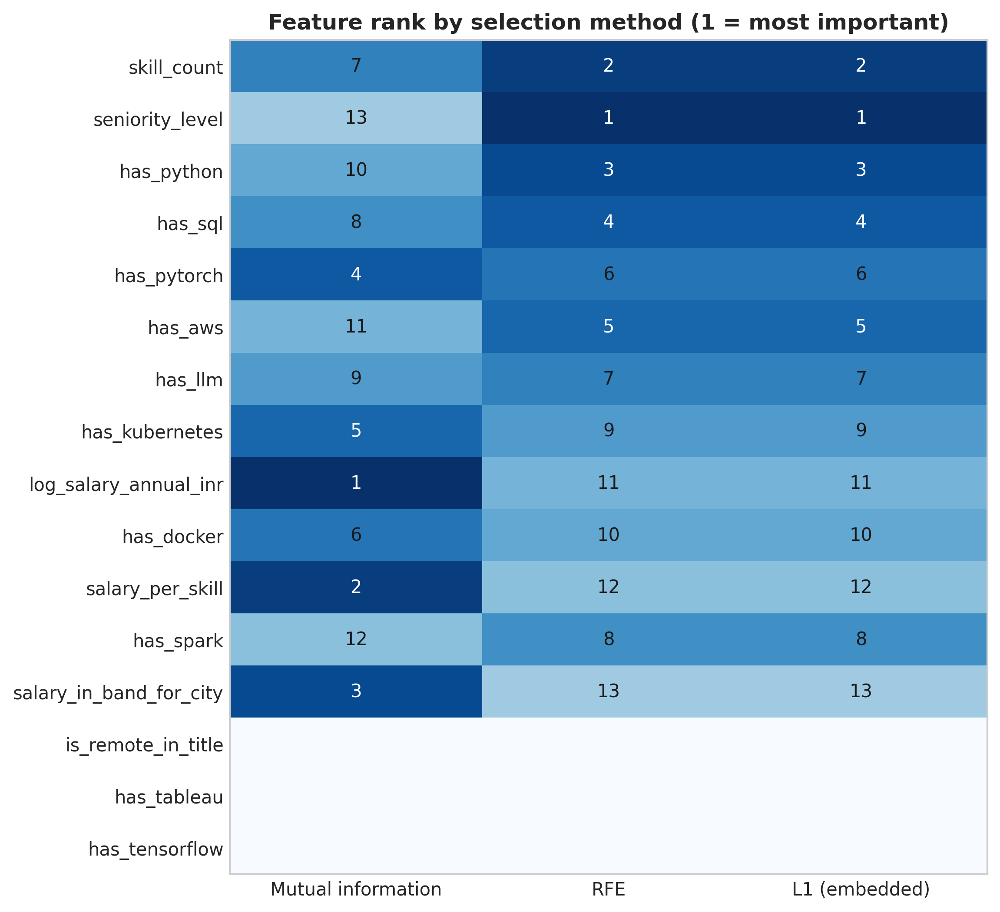
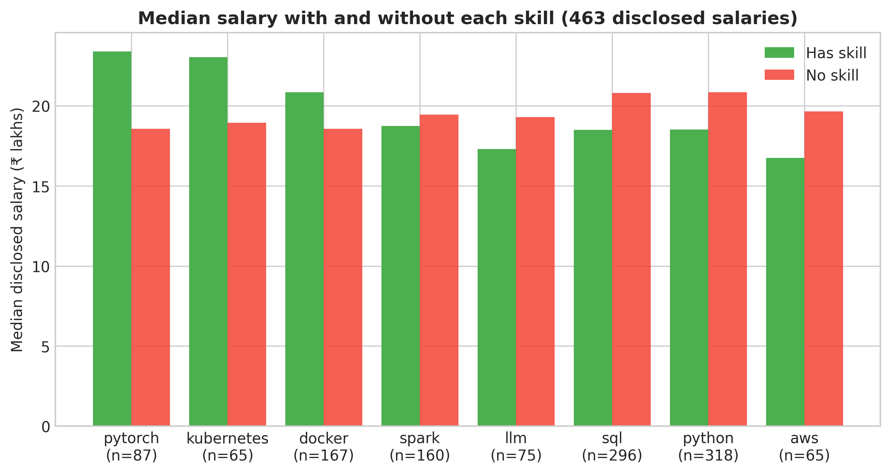

# Chapter 10: Feature Engineering and Selection

> **TalentLens milestone:** Engineer structured features that
> make the role classifier production-grade: measurably better
> than Chapter 9's TF-IDF baseline, reusable across Chapters
> 11/16/19, and clear about which features earn their place
> and which don't.

---

## The problem we're solving

Chapter 9 built a role classifier on top of TF-IDF features over
description plus skills text. Cross-validated macro F1 landed at
0.87 on the bundled dataset. That's a serviceable model, and the
chapter ended on a plain measurement: the classifier had to
learn from body text only, with title held out and role-name
phrases scrubbed.

This chapter asks: can we do better by engineering structured
features from the same data? Specifically, can we engineer a
handful of numeric features (seniority level extracted from
title, log-transformed salary, binary skill indicators) that
add information the bag-of-words representation misses?

The measured answer is the most useful kind: **no, and one
apparent yes that turns out to be leakage.** On the bundled
corpus, none of the thirteen engineered features beats the text
baseline. On 1,190 real postings from The Adzuna API, salary features
appear to add twenty points of F1, and then collapse to chance
once you look at where those salaries came from. This chapter is
about how to tell those outcomes apart before you ship.

---

## Why feature engineering, and why now

Feature engineering sits between the first classifier (Chapter 9)
and every downstream model that consumes TalentLens rows (Chapters
11, 16, 19, 22) for a reason.

In Chapter 9, the model saw text: TF-IDF over scrubbed description
and skills. That captures vocabulary but misses structure: seniority
in the title, salary scale, whether the posting mentions Python as
a hard requirement versus a nice-to-have. Those signals often live
outside the bag-of-words view, or appear so rarely in token form
that TF-IDF underweights them.

**What feature engineering adds here:** Columns you design on
purpose (ordinals, logs, binary skill flags), merged with the same
text pipeline Chapter 9 used, then measured one feature at a time
so you know what actually moved F1.

**What raw text alone is not:** A substitute for domain judgment.
Automated tools can suggest transforms; they cannot tell you that
a salary column is mostly imputed, or that the imputation used the
very label you are predicting.

**Alternatives and why we're not leading with them:**

- *More TF-IDF dimensions or character n-grams*: sometimes enough
  for tabular-ish text. On job postings, seniority and compensation
  structure are often explicit fields or title patterns TF-IDF learns
  indirectly and noisily.
- *End-to-end embeddings only (Chapter 11+)*: powerful, but opaque.
  This chapter keeps interpretable columns so the API can say
  "senior-level posting" even when the lift is within CV noise.

**What this unlocks downstream:** A reusable `talentlens.features`
module, a v2 classifier artefact ([`models/role_classifier_v2.joblib`](https://github.com/irfanalidv/Book-Data_Voyage/blob/main/models/role_classifier_v2.joblib)),
and a feature-selection comparison you can point to in design
reviews. Chapter 12 compares against a neural network; Chapter 18's
agent loads whichever classifier `role_classifier_path()` returns.

By the end of this chapter you'll have:

- A reusable `talentlens.features` module with `engineer_features()`
  and `select_features()`, used by Chapters 11, 16, 19, and 22.
- A v2 classifier ([`models/role_classifier_v2.joblib`](https://github.com/irfanalidv/Book-Data_Voyage/blob/main/models/role_classifier_v2.joblib)) trained on
  the text representation Chapter 9 used plus **only** the
  engineered features whose measured lift beats noise. If none
  do, v2 is the text-only model, so v2 can never be worse than v1
  by construction. `role_classifier_path()` prefers v2 when
  present, falling back to Chapter 9's model otherwise.
- A complete hypothesis-result table for each feature you engineer,
  with the result of every hypothesis filled in by measurement,
  not assertion.
- Three families of feature selection methods (mutual information,
  RFE, L1 regularisation) compared on the same data, with the
  same target, producing different rankings. The disagreement is
  the lesson.

---

## The methods

Each group is built by a private function in [`talentlens/features.py`](https://github.com/irfanalidv/Book-Data_Voyage/blob/main/talentlens/features.py);
the public API is `engineer_features()` which calls all three builders
in order. Adding a fifth group later means a new private builder plus
one entry in `FEATURE_GROUPS`, with no change to the public function
signatures.

### Title features

**What it does in plain English:** Maps job title text to an ordinal
seniority level (intern through director) and a binary remote-in-title
flag.

**When to use it:** Whenever title is available and you need
interpretable seniority for ranking, filtering, or API responses,
even when the lift on role classification is within cross-validation
noise.

**Key outputs:**
- `seniority_level`: integer 0–6 from keyword tables in
  `SENIORITY_KEYWORDS` (longer phrases matched first).
- `is_remote_in_title`: 1 if "remote" appears in the title string.

**What the output tells you:** A posting tagged level 5 ("staff")
versus level 4 ("senior") reflects match order in the keyword list,
not HR taxonomy perfection. The seniority extraction is
order-sensitive: "senior staff" matches "staff" (5), not "senior"
(4), because longer phrases are checked first. This is a tiny but
real detail of keyword-based feature extraction: if the order had
been wrong, everyone tagged "Senior Staff Engineer" would have
collapsed to seniority=4, and we'd never know without tests.

**Red flags:** If every row gets the same seniority or remote flag,
the feature is constant. Ablation will show ~0.000 lift and you
need `_check_features_have_signal`, not a new algorithm.

### Skill features

**What it does in plain English:** Counts how many canonical skills
appear in the skills field, plus ten binary indicators for skills
chosen for high mutual information with `role_category` on the bundled
dataset.

**When to use it:** When skills are structured or extractable as a
list and you want sparse, interpretable indicators without a 200-column
one-hot explosion.

**Key outputs:**
- `skill_count`: integer count of matched canonical skills.
- `has_python`, `has_sql`, … `has_tensorflow`: ten binaries from
  `HIGH_SIGNAL_SKILLS`.

**What the output tells you:** The choice of *which* ten was an
upfront design decision. On the bundled corpus seven of the ten
vary; `has_tableau` and `has_tensorflow` are constant because
neither appears in any posting, which the variance check reports
rather than hides. An indicator matches either spelling of a
skill (`has_aws` fires on `aws` or `Cloud (AWS)`), so a naming
mismatch between collectors cannot silently turn a feature into
a constant.

**Red flags:** Choosing the ten skills once and never revisiting
when the market shifts; the list is a design decision, not gospel.

### Salary features

**What it does in plain English:** Log-transforms annual INR salary,
builds a specialisation proxy (`salary_per_skill`), and z-scores
salary within city (`salary_in_band_for_city`).

**When to use it:** When compensation columns are populated and you
have a hypothesis about pay structure, but only after checking
whether salary is entangled with the label (see Common mistakes).

**Key outputs:**
- `log_salary_annual_inr`: `log1p` of the derived annual INR
  midpoint from Chapter 6.
- `salary_per_skill`: salary divided by skill count (with guard
  for zero skills).
- `salary_in_band_for_city`: z-score within city; NaN when a city
  has no within-city variance.

**What the output tells you:** All three test specific hypotheses
about how salary structure relates to role. Large ablation lifts
on demo data often reflect generator structure, not universal truth
about real markets.

**Red flags:** A large F1 lift from salary on data where missing
salaries were imputed per role. The imputed value *is* a function
of the label: leakage one hop removed from Chapter 9's title leak.
Mistake 3 below measures exactly this.

> **Deeper: target encoding and leakage**: Binary skill flags are not the only high-cardinality encoding. Target encoding (replace a category with the mean target for that category) is a common Kaggle pattern that leaks just as easily: fit it on the full dataset and every row's feature contains its own label. The fix is out-of-fold encoding: compute each row's value only from the other folds. [`book/ch10/sidebars/target_encoding_leakage.md`](https://github.com/irfanalidv/Book-Data_Voyage/blob/main/book/ch10/sidebars/target_encoding_leakage.md) in the companion repository walks through it.

A fourth group (text features beyond bag-of-words, such as
description length or sentence embeddings) would slot into the
same `FEATURE_GROUPS` registry: one private builder, one dict
entry. It is a good exercise.

### Mutual information (filter selection)

**What it does in plain English:** Scores each feature alone by how
much information it shares with the target. Fast, model-agnostic,
univariate.

**When to use it:** Early screening, many candidate columns, need
a ranking before paying for wrapper cost.

**Key parameters:**
- `random_state=42`: reproducible MI estimates.
- `_MI_NOISE_THRESHOLD` (0.01): drop scores at or below estimator
  noise on constant inputs.
- Variance gate: only columns with `nunique > 1` enter MI at all.

**Implementation:** `sklearn.feature_selection.mutual_info_classif`
via `select_features(..., method="mutual_info")`.

**Red flags:** Returning every feature with `score > 0` without the
variance gate and epsilon threshold, constant columns get ~0.04 MI
on bundled data and look "selected."

### Recursive feature elimination (wrapper selection)

**What it does in plain English:** Trains logistic regression on
all features, drops the weakest, retrains, and repeats until
cross-validation says stop.

**When to use it:** When feature interactions matter and you can
afford repeated fits.

**Key parameters:**
- `cv=3`: fold count inside `RFECV`.
- `step=1`: drop one feature per iteration.
- `scoring="f1_macro"`: aligned with Chapter 9's metric.

**Implementation:** `sklearn.feature_selection.RFECV`.

**Red flags:** Trusting a smaller feature set from RFE without
comparing to filter rankings; wrappers optimize for the base model,
not "truth."

### L1-penalised logistic regression (embedded selection)

**What it does in plain English:** Sweeps regularisation strength;
features with non-zero coefficients at the chosen sparsity are
"selected."

**When to use it:** When you already train L1 logistic models and
want selection tied to that objective.

**Key parameters:**
- `penalty="l1"`, `solver="liblinear"`: required pair for L1.
- `C` swept from strong to weak until roughly `k` non-zero coefficients.

**Red flags:** Treating L1 ranks as identical to MI ranks. They
optimize different objectives.

---

## The code

The chapter executable is [`book/ch10/ch10_feature_engineering_selection.py`](https://github.com/irfanalidv/Book-Data_Voyage/blob/main/book/ch10/ch10_feature_engineering_selection.py).
It loads [`data/clean/jobs_clean.csv`](https://github.com/irfanalidv/Book-Data_Voyage/blob/main/data/clean/jobs_clean.csv) via `jobs_clean_path()`, calls
`engineer_features()`, runs per-feature ablations with the same
TF-IDF + logistic pipeline Chapter 9 used, compares three selection
methods, trains v2, and writes [`book/ch10/reports/feature_engineering_report.md`](https://github.com/irfanalidv/Book-Data_Voyage/blob/main/book/ch10/reports/feature_engineering_report.md).

**The `FEATURE_GROUPS` registry pattern** is the architectural decision
worth copying elsewhere. [`talentlens/features.py`](https://github.com/irfanalidv/Book-Data_Voyage/blob/main/talentlens/features.py) keeps a single dict
mapping group names to column lists: `title`, `skills`, `salary`.
`engineer_features()` runs private builders in dependency order;
`select_features()` and the chapter ablation iterate the same dict so
you never hand-maintain two column lists that drift apart. Adding a
group is one builder function plus one dict entry, not a refactor
across the chapter script.

**Shared `scrub_role_phrases_from_text()`** lives in the same module
because Chapter 10's first ablation imported Chapter 9's text builder
without the scrub and hit F1 = 1.000. Centralising the scrub next to
`FEATURE_GROUPS` means Chapters 9 and 10 cannot diverge on leakage
prevention.

**`_check_features_have_signal` in the chapter script** runs before
each ablation row is trusted: all-NaN columns and constant-after-imputation
columns get flagged instead of reporting a misleading 0.000 lift.

Run from the repository root:

```bash
python book/ch10/ch10_feature_engineering_selection.py
```

The script writes its measurements to
[`book/ch10/reports/feature_engineering_report.md`](https://github.com/irfanalidv/Book-Data_Voyage/blob/main/book/ch10/reports/feature_engineering_report.md). Open that file
alongside this README. The report is the chapter's running result
sheet, and the sections below explain what to make of it.

---

## Interpreting the output

Open [`reports/feature_engineering_report.md`](https://github.com/irfanalidv/Book-Data_Voyage/blob/main/book/ch10/reports/feature_engineering_report.md) and read the
per-feature and cumulative ablations. On the bundled corpus the
text-only baseline scores **0.873 ± 0.026** macro F1 (the same
model shape as Chapter 9, evaluated with this chapter's splits).
Adding each engineered feature on its own:

| Feature | Macro F1 | Lift | Decision |
|---|---|---|---|
| `seniority_level` | 0.869 ± 0.032 | −0.004 | Keep for interpretability |
| `skill_count` | 0.856 ± 0.018 | −0.017 | Drop |
| `has_python` … `has_docker` (7 varying flags) | 0.857–0.870 | −0.016 to −0.003 | No lift |
| `log_salary_annual_inr` | 0.857 ± 0.018 | −0.016 | Drop |
| `salary_per_skill` | 0.862 ± 0.012 | −0.011 | Drop |
| `salary_in_band_for_city` | 0.862 ± 0.025 | −0.011 | Drop |

And cumulatively: + title 0.869, + skills 0.810, + salary 0.823.

**Nothing helps.** Every lift is negative, and most sit inside the
fold-to-fold noise. Adding all the skill flags at once costs six
points, because a dozen dense 0/1 columns crowd a model that was
doing well on thousands of sparse text features. The decision rule
in the script is mechanical: a feature earns a place in v2 only if
its individual lift exceeds 0.01. None does, so **v2 is the
text-only model, at 0.873**: exactly the baseline, never worse.

This is a good outcome. The features were reasonable hypotheses,
the measurement was honest, and the answer was no. Shipping them
anyway because "more features can't hurt" would have cost accuracy
and added code to maintain.

**Why salary does not help here:** pay overlaps across roles once
seniority varies: a Lead Data Analyst can out-earn a Junior ML
Engineer. The description text already says what the job is;
salary adds a noisy number that points in several directions.

`seniority_level` is kept despite its −0.004, because that is
inside noise and the value is useful in API responses ("this is a
senior-level posting") even when it doesn't move accuracy.

### Reading the feature-selection scores

The chapter compares three feature selection methods:

**Mutual information** (filter method). Fast, model-agnostic,
univariate. Ranks each feature by its mutual information with
the target, scored in isolation. Implementation:
`sklearn.feature_selection.mutual_info_classif`.

**Recursive feature elimination** (wrapper method). Trains a
model on all features, drops the least important, retrains.
Uses 3-fold cross-validation to find the optimal feature count
automatically. Implementation: `sklearn.feature_selection.RFECV`.

**L1-penalised logistic regression** (embedded method). Sweeps
the regularisation strength `C` from strong to weak; the smallest
C that produces at least k non-zero coefficients picks the feature
set. Implementation: `LogisticRegression(penalty="l1",
solver="liblinear")`.

On the bundled dataset the methods disagree sharply. Mutual
information ranks the three salary features first (each one,
alone, does carry information about role), while RFE and L1 both
put `seniority_level` and `skill_count` at the top and salary
near the bottom. Meanwhile the ablation says none of them helps
the actual model. Three methods, three rankings, and a fourth
answer from the measurement that matters. The disagreement is the
lesson: feature selection scores are hypotheses about usefulness,
and the ablation is the test. Read the
Feature selection comparison table in the report: there is no
single correct ranking, and choosing a selection method is a
design decision, not an algorithm.

**Feature importance chart:** `ch10_feature_importance.png` shows each engineered feature's rank under mutual information, RFE, and L1, with 1 as the most important. Blank rows are the features that are constant on the bundled corpus. The disagreement between the columns is the lesson: mutual information puts the three salary features on top, while RFE and L1 put them near the bottom.



**Skill–salary premium chart:** `ch10_skill_salary_premium.png` compares the median disclosed salary of postings with and without each skill flag. It uses the 463 employer-disclosed salaries only, because imputed salaries are role medians and would show the role rather than the skill. Differences of a few lakhs on samples this size are associations, not premiums you can bank on; read it beside the salary ablation rows and Mistake 3.



---

## Common mistakes I've seen (and made)

The chapter's writing process surfaced four specific mistakes
that the running text didn't anticipate. They're listed here as
Common Mistakes because they're the mistakes most likely to come
back the next time you build a feature pipeline. They're also
in roughly the order they were found, which matches how a real
feature-engineering project goes.

**Mistake 1: training on the same field the labels came from
(second shape).** Chapter 9 named this in the first person:
labels derived from title plus features built from title equals
F1 = 1.000. In Chapter 10 the same pattern returned in a slightly
different shape: ch10's ablation pipeline imported Chapter 9's
feature-text builder, but the import didn't include the role-name
scrub. The first run produced a baseline of 1.000 ± 0.000.
Diagnosing it took ten minutes; the fix was moving the scrub
function into `talentlens.features` where both chapters import
it from. Lesson: shared logic that prevents a bug should live
in a shared place, not be reimplemented per chapter. The same
leak in a different surface is still the same leak.

**Mistake 2: a feature that's all-NaN looks the same as one that
didn't help.** The chapter's first salary feature was
`log_salary_min`, computed as `log1p(salary_min)`. On the version
of the corpus I was working with at the time, `salary_min` was
empty after cleaning; the populated column was
`salary_annual_inr`. `log_salary_min` was therefore all-NaN, and
after median imputation it became a constant. A constant feature
carries zero information, so the ablation reported a 0.000 lift
for the +salary row. From the outside, that looked like "salary
features didn't help", but the salary features had never run.
The fix was naming the right column. The systematic fix was
adding `_check_features_have_signal` to the ablation, which
refuses to evaluate when a feature is all-NaN and warns when it's
constant-but-populated.

**Mistake 3: believing a big lift from salary on real data.**
While writing this chapter I collected 1,190 real postings from
The Adzuna API (Jobs by Adzuna, India) with the same script you can
run, `make collect-dataset`. Run this chapter on real data and the
picture flips. The text baseline drops to **0.639** (real descriptions
are messier than the demo's), and `log_salary_annual_inr` alone
lifts F1 by **+0.200**, to 0.839. The script keeps all three
salary features, and v2 scores 0.826. It is tempting to write the
story that suggests itself: Indian postings have tight,
role-defined pay bands, so salary is a strong signal.

It is wrong. Chapter 6 fills missing salaries with the median for
the posting's source **and role**. On that dataset **87% of
salaries are imputed**, so for most rows the salary *is* the role's
median, a number computed from the label. A quick check makes it
concrete: predicting role from salary alone scores macro F1 0.677
across all rows, but **0.236** (barely above the 0.20 you'd get by
guessing among five roles) on the 155 rows where the employer
actually disclosed pay. The +0.200 was leakage, one hop removed
from Chapter 9's title leak, and it is precisely the "imputation
blindness" row in Chapter 6's leakage table.

The fixes, in order of preference: exclude imputed salaries from
features (use `salary_disclosed` to mask them); or impute without
using the label (a global or city-level median); or pass
`salary_imputed` as its own feature so the model can see which
numbers are guesses. And the general rule: **before celebrating a
lift, ask how the feature was built, and whether the label was
anywhere in that recipe.**

**Mistake 4: sklearn's MI estimator produces nonzero scores on
constant features.** The first version of `select_features(...,
method="mutual_info")` used `score > 0` as the threshold for
returning a feature. On the bundled data this returned 15
features for k=15 even though only 5 features had any variance,
because `mutual_info_classif` produced reproducible noise around
0.04 on truly constant inputs (we confirmed this by computing
MI on the constant features in isolation: all four returned
exactly the same score, 0.043427). The fix has two parts: a
**variance gate** that drops any column with `nunique <= 1`
before MI runs, and an **epsilon threshold**
(`_MI_NOISE_THRESHOLD = 0.01`) on scores that survive the gate.
The lesson generalises: numerical estimators on degenerate inputs
don't error. They return numbers, and the numbers look real.

The pattern across all four mistakes: **the ablation table cannot
tell you why a number is what it is.** A broken feature and a
useless one both show 0.000; a leaked feature and a genuinely
predictive one both show a big lift. Build the diagnostics
(variance checks, masks for imputed values, a look at how each
column was constructed), and only then trust the numbers.

---

## Interview questions

**Q1: What's the difference between filter, wrapper, and embedded feature selection? When would you reach for each?**

Template answer: "Filter methods score each feature on its own against the target: mutual information, correlation, chi-squared. They're fast and model-agnostic, so I use them to screen hundreds of candidates. Wrapper methods like recursive feature elimination train the actual model repeatedly and keep the subset that scores best; they capture interactions but cost many fits and can overfit to one model. Embedded methods select during training; L1 regularisation zeroes out weak coefficients. In practice I screen with a filter, confirm with an ablation on the real pipeline, and treat disagreements between methods as questions, not errors."

**Q2: Your model's F1 went from 0.64 to 0.84 after you added a new feature. What would you check before celebrating?**

Template answer: "Three things. First, how the feature was built: does its recipe touch the label anywhere? Imputing salaries by role and then using salary to predict role is the classic case. Second, whether the lift survives on a clean subset. For an imputed column, rerun on the rows with real values only. Third, whether the feature exists at prediction time in the same form; a column that's filled differently in training and serving will look great offline and fail in production. A twenty-point jump from one column is a leakage alarm until proven otherwise."

**Q3: Mutual information of feature X with the target is 0.04, and the next-best feature has MI 0.95. What can you say about X, and what can't you?**

Template answer: "X carries little information about the target on its own. I can't conclude it's useless: MI is univariate, so X could matter in combination with other features, and scikit-learn's estimator returns small non-zero values even for constant inputs, so 0.04 might be pure estimator noise. I'd check X's variance, then measure its lift in the actual model before dropping it. And I'd look hard at the 0.95 feature; that's high enough to suspect leakage."

**Q4: A feature is constant on your training set. The pipeline doesn't error. What happens, and what's the failure mode?**

Template answer: "The model learns nothing from it (a constant has no variance), so it's harmless to accuracy but dangerous to your understanding. The ablation reports zero lift, and you conclude the feature doesn't help when in fact it was never computed correctly: a wrong column name, an all-null source, a naming mismatch between pipelines. The fix is a variance check before evaluation that flags constant and all-null columns explicitly, so 'broken' and 'unhelpful' look different."

**Q5: You added seniority, salary, and skill flags to a TF-IDF classifier and none of them helped. How do you explain that, and what do you ship?**

Template answer: "The text already contained most of that information. A posting that says 'build dashboards in Tableau' is an analyst role whether or not I add a has_sql flag, and dense numeric columns can crowd a model that's working well on sparse text. Salary overlaps across roles once seniority varies, so it adds noise. I ship the text-only model and keep the engineered features that are useful for other reasons, like seniority for the API response. A negative result from an honest ablation is a good outcome: it saves maintenance and accuracy."

---

## What's next

Chapter 11 steps outside supervised learning: what does the corpus
look like if you cluster it instead of labelling it? Chapter 12
then asks the question this chapter set up: if hand-built
features don't beat bag-of-words, does a neural network?

If you run `make collect-dataset` and repeat this chapter on your
own Adzuna collection (expect a similar picture wherever most
salaries are imputed), change Chapter 6's imputation to exclude the role
from the grouping (or mask imputed salaries here) and rerun. Then
compare the salary lift to the 0.200 above. That single
experiment is worth more than the rest of the chapter.

---

## TalentLens checkpoint

At the end of this chapter, your project should have (paths relative
to [`book/ch10/`](https://github.com/irfanalidv/Book-Data_Voyage/tree/main/book/ch10) unless noted):

- [ ] [`talentlens/features.py`](https://github.com/irfanalidv/Book-Data_Voyage/blob/main/talentlens/features.py): `engineer_features()`, `select_features()`,
  `FEATURE_GROUPS`, `scrub_role_phrases_from_text()`
- [ ] [`models/role_classifier_v2.joblib`](https://github.com/irfanalidv/Book-Data_Voyage/blob/main/models/role_classifier_v2.joblib): v2 classifier (repo root;
  `role_classifier_path()` prefers it over v1)
- [ ] [`reports/feature_engineering_report.md`](https://github.com/irfanalidv/Book-Data_Voyage/blob/main/book/ch10/reports/feature_engineering_report.md): hypothesis-result table
  and feature-selection comparison
- [ ] Tests passing from repo root: `pytest tests/test_features.py
  tests/test_ch10_scaffolding.py -v`

Reproduce everything from the repository root:

```bash
python book/ch10/ch10_feature_engineering_selection.py
pytest tests/test_features.py tests/test_ch10_scaffolding.py -v
```

The chapter reads [`data/clean/jobs_clean.csv`](https://github.com/irfanalidv/Book-Data_Voyage/blob/main/data/clean/jobs_clean.csv) via `jobs_clean_path()`,
which prefers `data/clean/jobs_clean.large.csv` when you have
fetched the published Adzuna dataset. Mistake 3 above is what you
will see if you do.

**Concepts you own:**

- Filter, wrapper, and embedded selection as different questions; rankings disagree by design, not by bug
- Ablation before assertion: measure each feature group's lift on the same pipeline, not in isolation
- Leakage in engineered features: salary and title signals can inflate F1 the same way Chapter 9's label leak did, one hop removed
