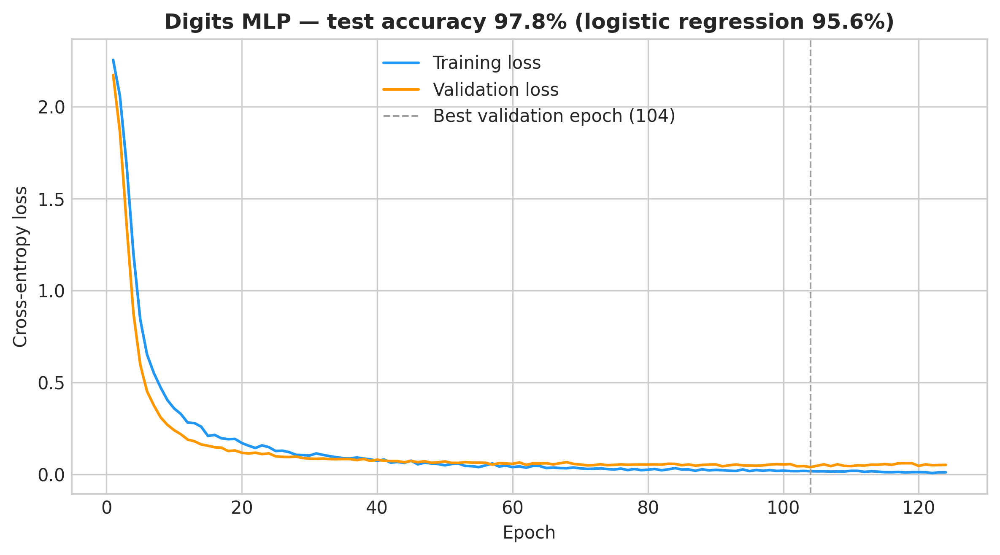
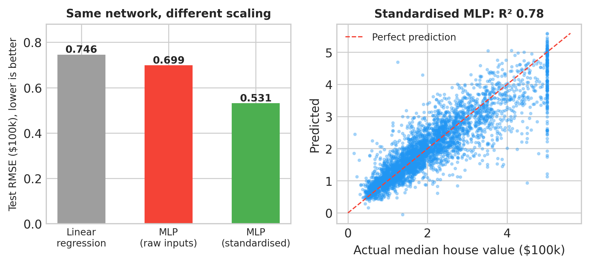
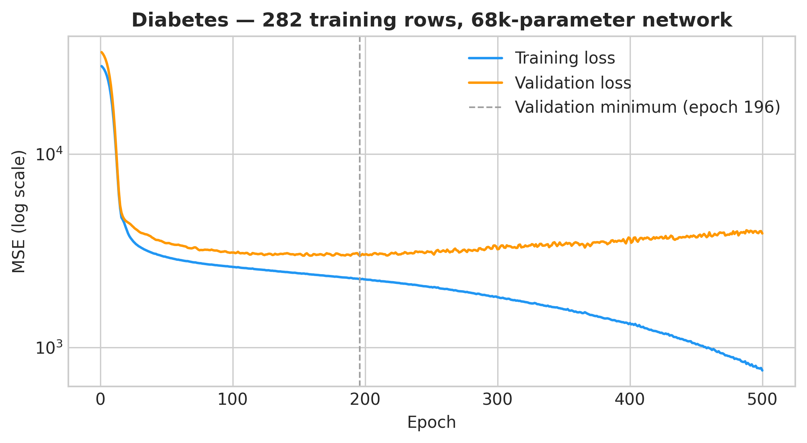

# Chapter 12: Neural Networks — When Depth Pays for Itself

> **TalentLens milestone:** Chapters 9–11 stayed with linear models and clustering. This chapter builds feedforward neural networks in PyTorch and measures, on four datasets, when they beat a linear baseline and when they don't, ending with the TalentLens role classifier itself.

---

## The problem we're solving

Your PM has read the same headlines you have. *"Our classifier is logistic regression? Shouldn't we be using deep learning?"*

It's a fair question, and "it depends" is not an answer. This chapter gives you a measured one. We train the same kind of network on four problems chosen to show four different outcomes:

1. **Handwritten digits**: images, where networks are known to shine.
2. **California house prices**: tabular regression, where a small network can win *if* you prepare the inputs properly.
3. **Diabetes progression**: 442 patients, where a network has more parameters than the data can support.
4. **TalentLens roles**: our own corpus, the question the PM actually asked.

By the end you'll know what a network buys, what it costs, and how to recognise when it's overfitting, which you'll need the moment you move from these teaching datasets to real ones.

---

## Why neural networks, and why now

Linear models draw straight decision boundaries in their feature space. That is often enough (Chapter 9's logistic regression on TF-IDF is hard to beat), but some relationships aren't linear: a pixel matters only in combination with its neighbours; a house's price depends on income *and* location together. A feedforward network stacks linear layers with non-linear activations between them, which lets it learn those interactions without you engineering them by hand.

The price is paid in three currencies: **data** (more parameters need more examples), **tuning** (learning rates, layer sizes, when to stop), and **interpretability** (you can read a logistic regression's coefficients; you can't read 68,000 network weights). This chapter comes after the linear models on purpose: you need a baseline to know whether the network earned its cost.

**What we are not doing:** convolutional networks, transformers, GPUs, or fine-tuning pretrained models. Those are the same idea scaled up; the habits you build here (baselines, validation curves, early stopping) are what keep them honest too.

**Why PyTorch:** it's the framework most AI engineering jobs expect, it's already installed for Chapter 13's sentence-transformers, and writing the training loop yourself, instead of calling `.fit()`, shows you exactly where overfitting enters.

---

## The methods

### The feedforward network (`build_mlp`)

**What it does in plain English:** Each layer multiplies its inputs by a weight matrix, adds a bias, and passes the result through ReLU (which zeroes negative values). The last layer has no activation; it produces raw scores for each class, or a single number for regression.

```python
def build_mlp(n_inputs, n_outputs, hidden=(64, 32), dropout=0.0):
    layers = []
    width_in = n_inputs
    for width in hidden:
        layers += [nn.Linear(width_in, width), nn.ReLU()]
        if dropout > 0:
            layers.append(nn.Dropout(dropout))
        width_in = width
    layers.append(nn.Linear(width_in, n_outputs))
    return nn.Sequential(*layers)
```

**Key parameters:**

- `hidden`: the width of each hidden layer. `(128, 64)` means two layers of 128 and 64 units. More width and depth means more capacity, and more ways to memorise.
- `dropout`: during training, randomly zero this fraction of activations. It stops the network from relying on any single unit and acts as a regulariser. It is switched off automatically at prediction time (`model.eval()`).

### Loss functions

- **Cross-entropy** (`nn.CrossEntropyLoss`) for classification. It takes the raw scores and the true class, and penalises confident wrong answers heavily.
- **Mean squared error** (`nn.MSELoss`) for regression. It squares each error, so large misses dominate.

### The training loop (`train_network`)

**What it does:** splits the training rows into mini-batches of 64, and for each batch computes the loss, backpropagates gradients, and lets the Adam optimiser nudge every weight. One pass over all batches is an **epoch**. After each epoch it measures loss on a **validation set** the network never trains on.

**Key parameters:**

- `learning_rate=1e-3`: how big each step is. Adam's default; too high and training oscillates, too low and it crawls.
- `batch_size=64`: examples per gradient step.
- `max_epochs` and `patience=20`: **early stopping**: if validation loss hasn't improved for 20 epochs, stop, and restore the weights from the best epoch. The model you get back is the best one seen, not the last one trained.
- `weight_decay`: an L2 penalty on the weights, the network version of the regularisation you used in logistic regression.

### Input scaling

Networks start with small random weights and take small steps. If one input ranges from 0 to 10 and another from 0 to 35,000, the large one dominates the first layer and the optimiser zig-zags. `StandardScaler` rescales every feature to mean 0 and standard deviation 1. **Fit it on the training rows only**, then apply it to validation and test. Otherwise test-set statistics leak into training.

### Reproducibility (`seed_everything`)

Networks start from random weights and shuffle batches randomly, so two runs differ. The script fixes NumPy and PyTorch seeds and uses a single CPU thread, so the report is identical every time you run it on the same library versions.

---

## The code

Run from the repository root (about a minute on a laptop CPU):

```bash
python book/ch12/ch12_deep_learning_fundamentals.py
```

Digits and Diabetes ship inside scikit-learn. California Housing is downloaded once (about 400 KB) and cached; without network access the script skips that experiment and says so in the report.

Outputs in [`book/ch12/reports/`](https://github.com/irfanalidv/Book-Data_Voyage/tree/main/book/ch12/reports):

- `neural_network_report.md`: every number quoted below
- [`figures/ch12_digits_training_curves.png`](https://github.com/irfanalidv/Book-Data_Voyage/blob/main/book/ch12/reports/figures/ch12_digits_training_curves.png)
- [`figures/ch12_housing_scaling.png`](https://github.com/irfanalidv/Book-Data_Voyage/blob/main/book/ch12/reports/figures/ch12_housing_scaling.png)
- [`figures/ch12_diabetes_overfitting.png`](https://github.com/irfanalidv/Book-Data_Voyage/blob/main/book/ch12/reports/figures/ch12_diabetes_overfitting.png)

**Three code decisions worth explaining:**

*Why every experiment has a linear baseline:* a network's score means nothing on its own. "97.8% accuracy" sounds impressive until you learn logistic regression gets 95.6%. The baseline tells you what the extra complexity bought.

*Why three splits, not two:* the network uses the validation set to decide when to stop, so the validation score is no longer an honest estimate. The test set is touched exactly once, at the end.

*Why the training loop is written out:* `sklearn.neural_network.MLPClassifier` would do all of this in one line. Writing the loop shows you where validation loss is measured, where early stopping decides, and where weights get restored: the places where real training goes wrong.

---

## Interpreting the output

### 1. Digits: the network earns its keep

| Model | Test accuracy |
|---|---|
| Logistic regression | 0.956 |
| MLP 64→128→64→10, dropout 0.2 | 0.978 |

The network halves the error rate: from 4.4% of digits wrong to 2.2%. On 8 × 8 images, whether a pixel matters depends on the pixels around it, and the hidden layers learn those combinations. Early stopping chose epoch 104 of 124 run; the network has 17,226 parameters trained on about 1,150 images.

**`ch12_digits_training_curves.png`**: training and validation loss fall together and then the validation curve flattens; the dashed line marks the epoch early stopping kept. Healthy training looks like this: no widening gap between the curves.



### 2. California Housing: the same network, prepared differently

| Model | Test RMSE ($100k) | Test R² |
|---|---|---|
| Linear regression | 0.746 | 0.576 |
| MLP, raw inputs | 0.699 | 0.628 |
| MLP, standardised inputs | 0.531 | 0.785 |

Same architecture, same epochs, same seed; the only difference between the last two rows is `StandardScaler`. Scaling takes the network from barely beating linear regression to cutting its error by almost 30% (R² 0.576 → 0.785). House prices depend on interactions (income matters differently in different places), and the network can learn them, but only once every input speaks on the same scale.

**`ch12_housing_scaling.png`**: left, the three RMSE bars. Right: predicted against actual for the scaled network. Note the vertical column of points at an actual value of 5.0: the dataset caps house values at $500,000, so every expensive district is recorded as 5.0 whatever it is really worth, and the model's predictions for those districts scatter from 1 to 5.6. Some of the remaining error is in the labels, not the model.



### 3. Diabetes: too little data for the model

| Model | Test RMSE | Test R² |
|---|---|---|
| Linear regression | 53.9 | 0.453 |
| MLP 256→256, 500 epochs, no regularisation | 56.3 | 0.401 |
| Same MLP, early stopping + dropout + weight decay | 53.0 | 0.469 |

282 training rows, 10 features, and a network with about 68,000 parameters. Trained for a fixed 500 epochs with no regularisation, it memorises: training MSE falls to 762 while validation MSE, which bottomed at 2,979 around epoch 196, climbs back to 3,888. The test score ends up *worse than linear regression*.

With early stopping, dropout, and weight decay, the same architecture stops at epoch 124 and scores 53.0, a whisker better than linear regression's 53.9. That sums up small tabular data: regularisation rescues the network from disaster, and the best it can do is tie a model with 11 parameters.

**`ch12_diabetes_overfitting.png`**: the textbook picture of overfitting, on a log scale: training loss keeps falling, validation loss turns around after its minimum and rises. The dashed line is where you should have stopped.



### 4. TalentLens: back to the PM's question

| Model | Test macro F1 |
|---|---|
| Logistic regression (Chapter 9 baseline) | 1.000 |
| MLP, one hidden layer of 64, dropout 0.3 | 1.000 |

479 postings from the five canonical roles, 375 TF-IDF features, one stratified 80/20 split. Both models classify all 96 test postings correctly.

Read that carefully before you quote it. Chapter 9's cross-validated score was 0.867 ± 0.05; one lucky split of 96 postings can land at 1.000, and this one did. (It also drops the `Other` class, which removes some of Chapter 9's hardest confusions.) The comparison that matters is *between the two rows on the same split*: the network does not beat logistic regression. It can only tie. On a few hundred postings of bag-of-words text, there is nothing left for the extra layers to find.

So the answer to the PM: **not yet.** A network would earn its place with tens of thousands of real postings, or with inputs where word order and context matter, which is what the sentence embeddings in Chapters 13 and 16 provide.

---

## Common mistakes I've seen (and made)

**Mistake: Reaching for deep learning because it's fashionable**

What happens: you replace a logistic regression that trains in two seconds with a network that trains in two minutes, can't explain its predictions, and scores the same.

How to catch it: always train the linear baseline first, on the same split.

Fix: make the network beat the baseline by more than the run-to-run noise before you ship it. Experiment 4 is what "didn't earn it" looks like.

---

**Mistake: Forgetting to scale inputs**

What happens: the network trains, the loss goes down, and the results are mediocre, so you conclude networks don't suit your data. Experiment 2's unscaled row is that trap: R² 0.628, when the same network scaled gets 0.785.

How to catch it: print `X.describe()`; if feature ranges differ by orders of magnitude, you need scaling.

Fix: `StandardScaler`, fitted on training rows only.

---

**Mistake: Keeping the last epoch instead of the best one**

What happens: you train for a fixed number of epochs and save the final weights. On small data, the final weights are the overfit ones: Experiment 3's 500-epoch row.

How to catch it: plot validation loss per epoch. If it has a minimum well before the end, you trained too long.

Fix: early stopping with weight restoration, as `train_network` does.

---

**Mistake: Quoting a single split as the model's score**

What happens: a network hits 1.000 on one 96-row test split and the number goes into a slide.

How to catch it: ask for the cross-validated mean and spread; compare to a baseline on the same split.

Fix: small test sets need cross-validation or repeated splits; report the spread, not the best run.

---

**Mistake: Letting the validation set leak into the final score**

What happens: you tune epochs and architecture on the validation set and report its accuracy as your result. You have fitted to it; it's optimistic.

Fix: three splits. Tune on validation, report on a test set you touch once.

---

## Interview questions

**Q1: Your team's classifier gets 0.87 F1 with logistic regression. The PM wants you to "try deep learning." What's your response?**

Template answer: "I'd run the experiment, but on the same splits against the same baseline, and I'd set expectations first. On a few thousand rows of bag-of-words text, a network usually ties logistic regression; I've measured exactly that. It pays off with much more data, or with inputs where context matters, like sentence embeddings. So the better path is usually more data, then embeddings, then a network if the gap is still there. And I'd only ship it if it beats the baseline by more than the run-to-run variance."

**Q2: Validation loss starts rising after epoch 12 while training loss keeps falling. What's happening, and what do you do?**

Template answer: "Overfitting: the network is memorising the training set. I'd keep the weights from the best validation epoch (early stopping with weight restoration) and then reduce the capacity to memorise: fewer or narrower layers, dropout, weight decay. If it's still happening early, the real fix is more data."

**Q3: Why do neural networks need input scaling when tree models don't?**

Template answer: "Trees split on thresholds, so a feature's scale doesn't matter. Networks multiply inputs by weights and follow gradients; a feature measured in tens of thousands swamps one measured in fractions, the loss surface gets badly shaped, and the optimiser zig-zags. Standardising puts every feature on the same footing. In one experiment, scaling alone took a network from R² 0.63 to 0.79."

**Q4: What does dropout do, and why is it off at prediction time?**

Template answer: "During training it randomly zeroes a fraction of activations each step, so no unit can rely on any particular other unit. It's like training many thinned networks and averaging them, which regularises. At prediction time you want the full, deterministic network, so it's switched off; PyTorch does this when you call `model.eval()`, and forgetting that call is a classic bug."

**Q5: When would you choose a neural network over gradient-boosted trees for tabular data?**

Template answer: "Usually I wouldn't start there. On typical tabular data, boosted trees are strong, fast, and need little preprocessing. I'd reach for a network when the data is large, when features have structure trees handle poorly (text, images, sequences, embeddings), or when I need to combine several modalities in one model. Either way I'd benchmark against a linear model and trees on the same splits."

---

## What's next

Chapter 13 moves from classifying postings to extracting what's inside them, the skills, and pits rules against sentence-transformer embeddings on a labelled eval set. It's the same question this chapter asked, in a new form: does the heavier model earn its cost?

---

## TalentLens checkpoint

At the end of this chapter, your project should have:

- [ ] [`book/ch12/reports/neural_network_report.md`](https://github.com/irfanalidv/Book-Data_Voyage/blob/main/book/ch12/reports/neural_network_report.md) with all four experiments
- [ ] [`book/ch12/reports/figures/ch12_digits_training_curves.png`](https://github.com/irfanalidv/Book-Data_Voyage/blob/main/book/ch12/reports/figures/ch12_digits_training_curves.png), `ch12_housing_scaling.png`, `ch12_diabetes_overfitting.png`
- [ ] `pytest tests/test_ch12.py -v` passing
- [ ] An answer, with numbers, to "should TalentLens use deep learning yet?"

```bash
python book/ch12/ch12_deep_learning_fundamentals.py
pytest tests/test_ch12.py -v
```

**Concepts you own:**

- Baseline first: a network's score only means something next to a linear model on the same split
- Validation curves and early stopping: the gap between training and validation loss is how overfitting shows itself
- Scaling and regularisation as part of the model: the same architecture can go from mediocre to best, or from overfit to competitive, on preparation alone
