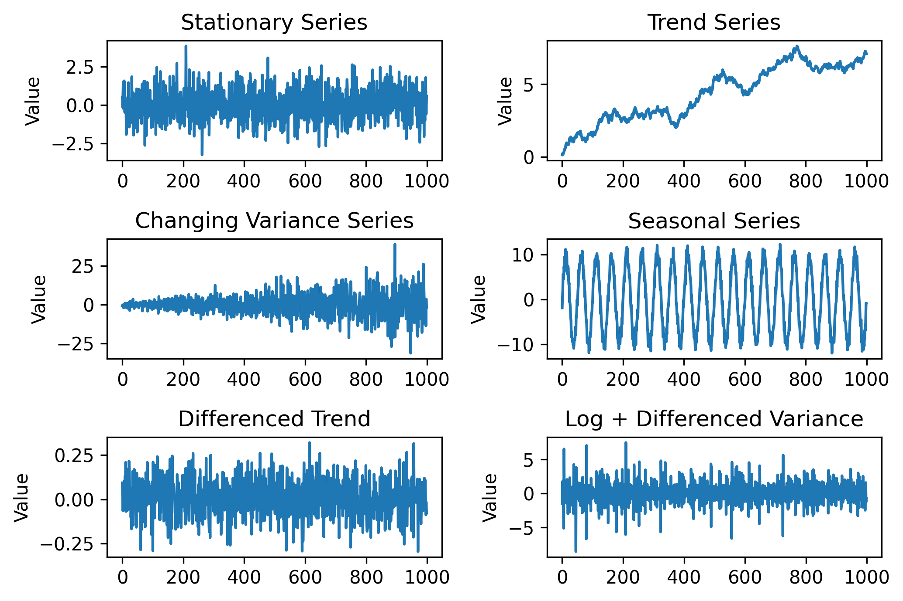
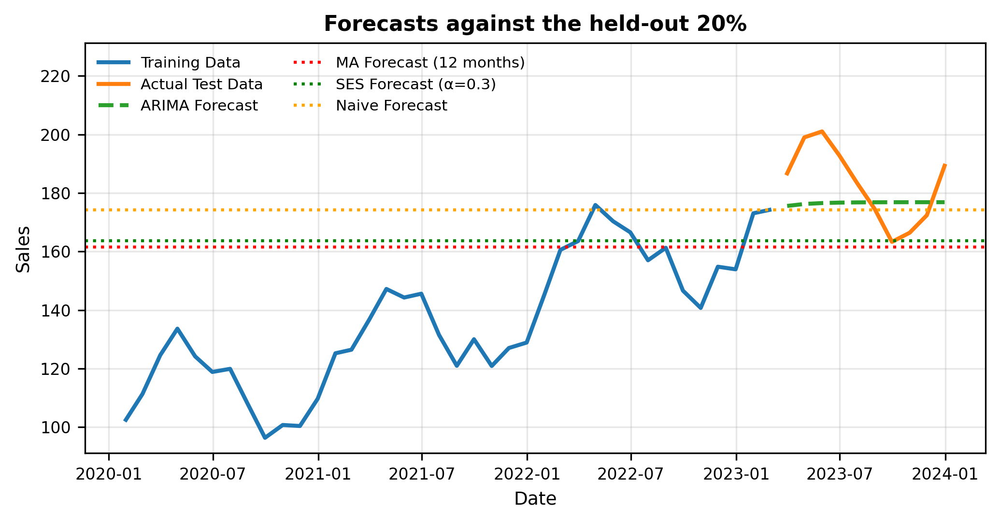
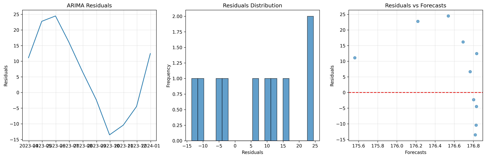
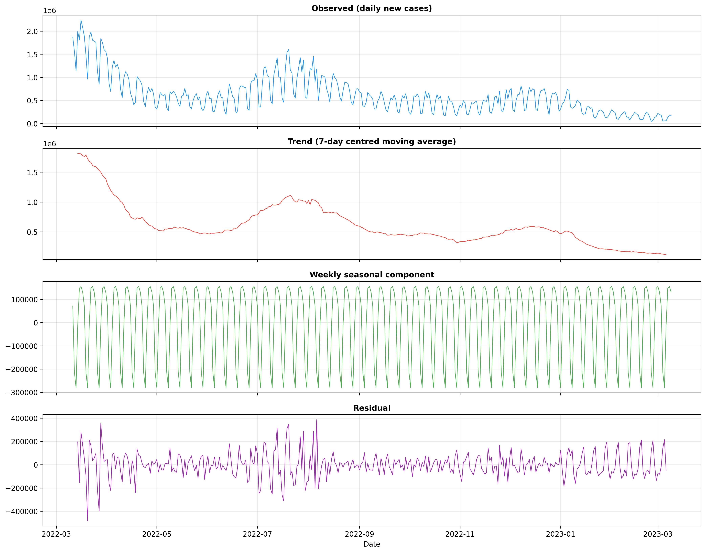
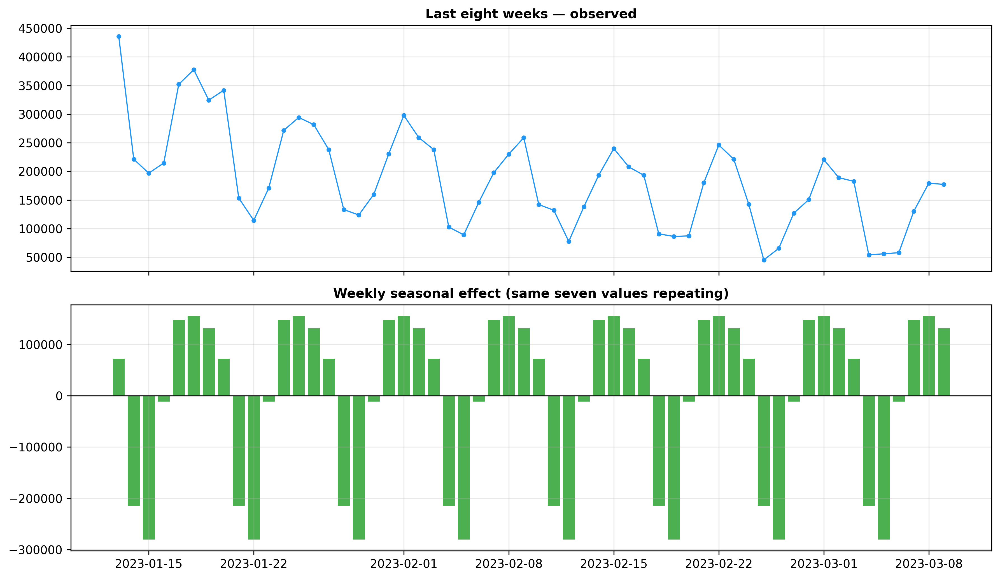

# Chapter 14: Time Series — Skill Trends (Methods First)

> **TalentLens milestone (deferred):** Skill-trend analysis requires dated postings, ideally a year or more of scrape history. The bundled dataset has no `posted_date` column with meaningful variation. This chapter teaches time-series *methods* on COVID and synthetic data; wiring those methods to TalentLens skill trends waits on real scraped data. See the "What's deferred" section below.

---

## The problem we're solving

Your PM opens the roadmap doc: *"Python mentions in ML Engineer postings: are they still growing, or plateauing? Should we invest in a PyTorch upskilling track this quarter?"*

That is a time-series question. Not "what is the average salary today?" but "how does a signal move over time, what repeats on a calendar, and what happens if we extrapolate three months forward?"

TalentLens will answer this once Chapter 5's collector has accumulated months of dated postings. Today the bundled corpus does not have enough temporal depth for reliable skill-trend charts. So this chapter teaches the methods on **COVID case data** (real, public, strongly seasonal) and **synthetic sales/temperature series** where we control length and noise. The code path is the same you will run on `posted_date` and per-skill counts later; only the CSV changes.

---

## Why time series, and why now

Time series sits after NLP (Chapter 13) and before scaling (Chapter 15) because TalentLens eventually needs **trend** signals, not just snapshots. EDA (Chapter 7) told you what the market looks like *now*; time series tells you whether a skill or salary band is *moving*.

**What time series adds:** decomposition (trend vs seasonality vs noise), stationarity tests (can we forecast?), and held-out evaluation (MAE/RMSE on future data).

**Alternatives and why we are not leading with them here:**

- *Cross-sectional EDA only*: fine for "remote pays more today" (Chapter 7–8) but silent on "is remote share increasing?"
- *Prophet / neural forecasters out of the box*: powerful defaults, but they hide the assumptions ARIMA forces you to check (residuals, differencing, regime breaks).
- *LLM "trend summaries"*: good for narrative after you have verified numbers; dangerous as the only analysis.

**What this unlocks downstream:** When dated TalentLens data exists, the same pipeline produces `skill_mentions_per_month` series, seasonal hiring patterns (Q1 ramp, summer slowdown), and defensible "growing vs dying skill" claims for Chapter 24's career narrative.

---

## The methods

### Time-series fundamentals and decomposition

**What it does in plain English:** Splits a series into **trend** (long-term direction), **seasonal** (fixed-period repetition), and **residual** (everything else).

**Key parameters:**
- `model='additive'` vs `'multiplicative'`: additive when seasonal swings are roughly constant in level; multiplicative when swings grow with the trend (common in sales/count data).
- `period=`: **must** match the data's seasonality (7 for weekly, 12 for monthly). Wrong period → garbage components.

**Red flags:** Interpreting decomposition on a series shorter than **two full seasonal cycles**. `seasonal_decompose` refuses outright, and with barely enough history the seasonal estimate is mostly noise.

### Stationarity testing (ADF and KPSS)

**What it does:** Tests whether the series (or its differences) has stable mean/variance, a prerequisite for many forecasters.

**ADF:** Null = unit root (non-stationary). Low p-value → reject null → more stationary.

**KPSS:** Null = trend-stationary. High p-value → fail to reject → treat as stationary.

**Why both:** They are asymmetric. Using only one test invites false confidence.

**Typical fix:** First difference `y.diff()` or log-transform then difference for growth series.

### ARIMA forecasting

**What it does:** Models the next value as a function of past values and past forecast errors.

**ARIMA(p, d, q):**
- `p`: autoregressive order (how many past *levels* matter)
- `d`: differencing count (how many times you subtract previous row to stabilize mean)
- `q`: moving-average order (how many past *errors* matter)

**Workflow:** Fit → inspect **residuals** (no autocorrelation left) → adjust order → refit. In-sample R² alone is misleading for time series.

### Held-out evaluation (MAE, RMSE, MAPE)

**What it does:** Trains on an early window, forecasts a later window you hid, compares to truth.

**MAE:** average absolute error in original units (₹, cases, counts).

**RMSE:** penalizes large misses more, so it is sensitive to outliers.

**MAPE:** percentage error. Breaks when actuals are near zero; use with care on sparse skill counts.

---

## The code

From the repository root:

```bash
python book/ch14/ch14_time_series_analysis.py
```

The script fetches the last year of global COVID-19 case data from the free `disease.sh` API (the underlying Johns Hopkins series ends in March 2023, so the year is March 2022 to March 2023), with a seeded synthetic fallback if the API is unreachable. It also builds synthetic temperature and economic series, and writes five figures under [`book/ch14/reports/figures/`](https://github.com/irfanalidv/Book-Data_Voyage/tree/main/book/ch14/reports/figures). No TalentLens imports; the chapter is intentionally self-contained.

---

## Interpreting the output

**Stationarity analysis:** `stationarity_analysis.png` shows ADF/KPSS before vs after differencing. If only the differenced series passes, forecast on differenced data or use `d ≥ 1` in ARIMA.



**Forecast vs held-out actuals:** `time_series_forecasting.png` shows the forecast line vs truth on the hidden window; confidence bands widening into the future mean honest uncertainty, not a plotting bug.



**Forecast residuals:** `forecast_residuals.png`: residuals should look like white noise. Visible waves or clusters mean the model still misses structure (seasonality, regime change).



**Decomposition:** the API returns *cumulative* totals, so the script first takes daily differences to get new cases per day, then runs `seasonal_decompose(series, model="additive", period=7)`. The period is 7 because of domain knowledge: case reports dip every weekend and catch up early in the week.



**`time_series_components.png`**: four panels: observed daily cases, the trend (a centred 7-day moving average), the weekly seasonal component, and what's left. The trend carries the waves of infection; the seasonal panel is a rigid seven-day pattern repeated all year.



**`seasonal_decomposition.png`**: the last eight weeks zoomed in. The top panel shows the saw-tooth; the bottom shows the seven seasonal values the model estimated, repeating. Two days sit far below zero (the weekend reporting dip) and mid-week days sit above. The console reports a peak-to-trough weekly swing of about 436,000 cases against a residual standard deviation of about 110,000: the weekly cycle is the single biggest pattern in the series after the trend. Model it, or any forecast will be wrong on every Monday.

An earlier version of this script decomposed a weekly-sampled slice with `period=12`, which gave it too few points to decompose at all. The fix (daily data, the right period) is the whole lesson of this section.

---

## Common mistakes I've seen (and made)

**Confusing autocorrelation with causation.** Two series can move together because a third factor drives both (e.g. hiring season and salary disclosure). Correlation in time ≠ "skill X causes higher pay."

**Forecasting through a regime change.** ARIMA extrapolates the past process. COVID waves, funding winters, and policy shocks break that assumption. After a regime change, refit or switch model; do not extend pre-shock coefficients.

**Treating R² as the only metric for time series.** High in-sample fit with autocorrelated residuals is an overfitting alarm. Use held-out MAE/RMSE and residual diagnostics.

**Fitting ARIMA without checking residuals.** Lag-7 autocorrelation in residuals on daily data often means weekly seasonality you did not model. Consider SARIMA or explicit seasonal features.

**Trusting decomposition defaults on real data.** Always set `period` from domain knowledge (payroll cycles, weekly job boards, quarterly planning). Guessing 12 because "months exist" when your data is weekly will lie convincingly.

---

## Interview questions

**Q1: Your client says daily sales forecasts are off by 40% every quarter-end. What's the most likely cause?**

Template answer: "Quarter-end effects are often **not smooth seasonality**: promotions, sales pushes, or accounting cutoffs create spikes ARIMA treats as noise. I'd plot residuals by calendar week, add a quarter-end indicator or separate model for those weeks, and measure held-out error with and without that feature."

**Q2: You fit ARIMA(1,1,1) and residuals show significant autocorrelation at lag 7. What do you change?**

Template answer: "Add a seasonal component (SARIMA with seasonal period 7) or include weekly dummy features. The lag-7 pattern means weekly structure is still in the errors."

**Q3: When should you NOT use ARIMA?**

Template answer: "Regime changes, exogenous shocks, very short series, or when the next value depends on factors not in history (policy change, new product launch). ARIMA forecasts **pattern**, not **cause**."

**Q4: Differentiate trend, seasonality, and cycles.**

Template answer: "Trend = long-term direction. Seasonality = fixed-period repetition (weekly, yearly). Cycles = longer oscillations without fixed period (business cycles). Decomposition finds seasonality well; cycles need different tools or external regressors."

**Q5: Training MAE is 50 and test MAE is 200. What's wrong?**

Template answer: "Overfitting or train/test split that crosses a regime boundary. I'd check residual plots on the test window, reduce ARIMA order, and verify the holdout period is comparable to training, not a post-shock era the model never saw."

---

## What's next

Chapter 15 asks what happens when your dated TalentLens table grows to millions of rows: chunked pandas, polars, and when Spark is actually worth the operational cost. Chapter 16 returns to the product path with semantic search over postings. When you have 6+ months of scrape history, revisit this chapter's script with `skill_mentions_per_month` from your clean table. The methods stay the same; only the input CSV changes.

---

## TalentLens checkpoint

At the end of this chapter you should have:

- [ ] Run `python book/ch14/ch14_time_series_analysis.py` without errors (API or fallback path)
- [ ] [`book/ch14/reports/figures/`](https://github.com/irfanalidv/Book-Data_Voyage/tree/main/book/ch14/reports/figures) has all five figures, including `time_series_components.png` and `seasonal_decomposition.png`
- [ ] Read ADF/KPSS output and explain whether differencing was required
- [ ] Named one reason ARIMA would fail on "PyTorch mentions per month" after a major model release (regime change)

**Concepts you own:**

- Trend, seasonality, and residual as separate stories; decomposition only works when history is long enough
- Stationarity as a gate: differencing and ADF/KPSS before you trust ARIMA coefficients
- Held-out forecast error beats in-sample R²: MAE/RMSE on future rows is the metric that counts

---

## What's deferred

The chapter's TalentLens hook waits on dated postings:

- **Skill-trend analysis on real TalentLens data.** Once Chapter 5's scraper has 6+ months of dated postings, rerun the same methods on per-skill posting volume.
- **A generated markdown report.** The chapter writes figures and console output; a report file matching other chapters' pattern is a straightforward exercise.
