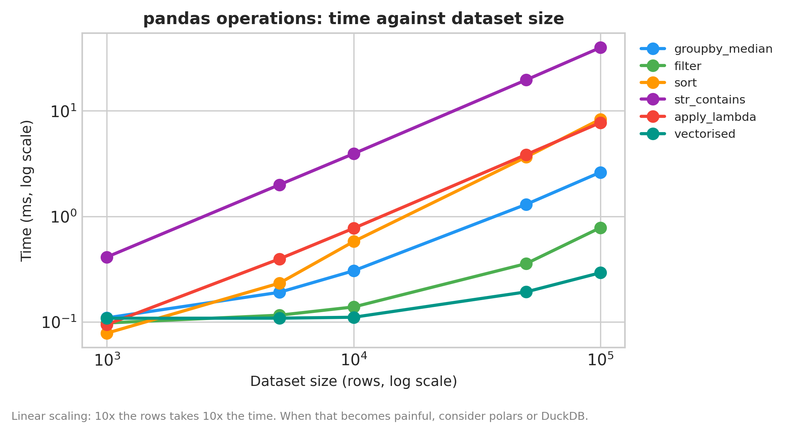
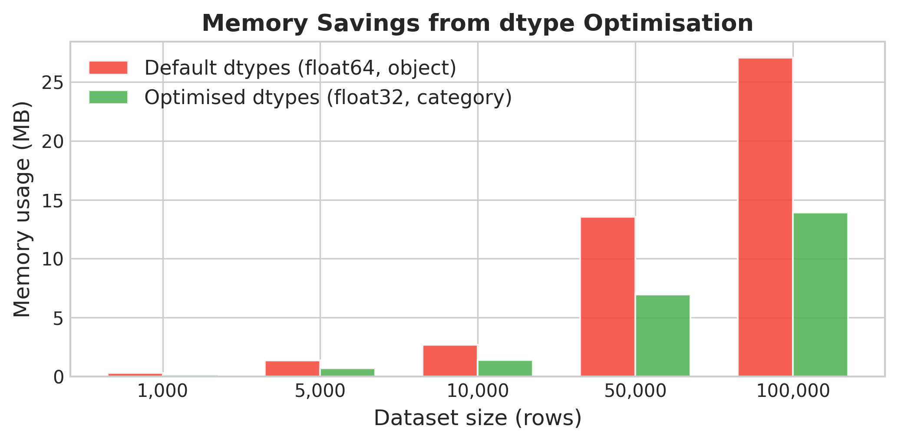

# Chapter 15: Scaling Python — When You Outgrow Pandas

> **TalentLens milestone:** The bundled jobs corpus is 576 rows; a real scrape grows to tens or hundreds of thousands. This chapter teaches a sensible scaling path: start with pandas, optimise hard, graduate to polars / dask / Spark only when you have to. The chapter's main work: measuring what pandas optimisations actually buy you, with numbers, on the same kind of data TalentLens uses.

## The problem we're solving

The earliest chapters of this book used pandas for everything: cleaning, joining, feature engineering, EDA. That works up to roughly a million rows on a typical laptop. Beyond that, you start hitting walls: a `groupby` that runs for two minutes, a `read_csv` that consumes 8GB of memory before failing, an apply call that's slower than the model training.

The internet's answer to this is usually "use Spark" or "use Dask." That answer is wrong more often than it's right. Most pandas performance problems are solved by changing how you use pandas: chunked reads, dtype optimisation, vectorised string operations, dropping unused columns. The chapter teaches these first because they're what most readers need.

Then, for the cases where pandas runs out of room, the chapter provides a decision table: when polars buys you real speed, when dask buys you parallelism on one machine, and when (rarely) Spark is the right answer.

Run the chapter's benchmarks to see the actual numbers:

```bash
python book/ch15/ch15_scaling_python.py
```

Outputs [`reports/scaling_report.md`](https://github.com/irfanalidv/Book-Data_Voyage/blob/main/book/ch15/reports/scaling_report.md) with measured benchmark results plus the decision table, and two figures comparing operation speed and memory usage across dataset sizes.

---

## Why scaling Python, and why now

Chapter 6–10 stayed inside pandas on a laptop-sized corpus. Chapter 15 is the off-ramp: optimise pandas first, then polars, then dask, then Spark, in that order, with measurements, not LinkedIn advice.

**Why not start with Spark:** Operational cost and team skill rarely justify it below ~100M rows on one machine. Most TalentLens readers will live in the first two rows of the decision table for years.

**Alternatives:** DuckDB for SQL-over-files without loading full CSVs; Ray for distributed Python when you outgrow dask. Both are named in deferred work, not required for the bundled dataset.

---

## The code

```bash
python book/ch15/ch15_scaling_python.py
```

Regenerates [`book/ch15/reports/scaling_report.md`](https://github.com/irfanalidv/Book-Data_Voyage/blob/main/book/ch15/reports/scaling_report.md) and figures under [`book/ch15/reports/figures/`](https://github.com/irfanalidv/Book-Data_Voyage/tree/main/book/ch15/reports/figures).

---

## The methods

### What the chapter measures

Six operations timed at dataset sizes from 1,000 to 100,000 rows (synthetic data with the TalentLens schema and a unique description per row):

- **`groupby` median**: group by title, median salary
- **boolean filter**: remote postings above ₹20L
- **`sort_values`**: sort by salary
- **`str.contains`**: case-insensitive substring match across descriptions
- **`apply` with a lambda**: a salary adjustment computed row by row in Python
- **vectorised equivalent**: the same adjustment with `Series.where`

Plus a chunked `read_csv` of the bundled file.

Plus a dtype-optimisation experiment: take a DataFrame, convert object columns to category where appropriate, downcast numeric columns, measure the memory before and after.

The numbers in [`reports/scaling_report.md`](https://github.com/irfanalidv/Book-Data_Voyage/blob/main/book/ch15/reports/scaling_report.md) are regenerated every run; treat the markdown as the source of truth.

## The scaling table

The chapter's most useful output is a decision table for when to leave pandas behind. The script generates this dynamically; a representative version:

| Row count | Recommendation |
|---|---|
| < 1M | Pandas is fine. Optimise dtypes for memory. |
| 1M – 10M | Try polars. 5-10× faster for most operations, drop-in for many pandas patterns. |
| 10M – 100M | Dask for parallelism on one machine. Same pandas API; runs across cores. |
| 100M+ | Spark or DuckDB depending on query patterns. Spark for distributed; DuckDB if your data fits on one beefy machine. |

A reader who follows this table will spend roughly 80% of their career inside the first row and 15% in the second. That is deliberate: the time you'd spend learning Spark is almost always better spent learning to write fast pandas.

## Quick wins before changing tools

Before reaching for polars or dask, four pandas optimisations that solve most performance complaints:

1. **Optimise dtypes.** Object columns are pandas' performance killer. Convert low-cardinality strings to `category`. Downcast `int64` to `int32` or `int16` where the range allows. The chapter's `demonstrate_memory_dtypes()` function measures the difference: on the 100,000-row frame, 27.1 MB becomes 13.9 MB, a 49% saving from two lines of code. Columns with few distinct values (title, company) shrink the most; unique text like descriptions can't be compressed this way.

2. **Chunked reads with `pd.read_csv(chunksize=...)`.** A 5GB CSV won't fit in 8GB of RAM, but you can iterate over it in 100k-row chunks and aggregate. The chapter demonstrates the pattern on the bundled file; the payoff only appears when the file is larger than your memory.

3. **`usecols` and `dtype` at read time.** If your downstream code uses 12 of 40 columns, telling `read_csv` to skip the other 28 saves both memory and parse time. Same for telling it the dtypes up front instead of letting it infer.

4. **Vectorise instead of apply.** `apply` with a Python lambda calls a Python function once per row. The chapter's `benchmark_pandas_operations()` measures both on 100k rows: **about 9 ms for `apply`, 0.3 ms vectorised: roughly 30× faster** (best of five runs). Milliseconds look harmless; the ratio is what matters, because it holds at 100 million rows, where 30× is the difference between a coffee and an afternoon.

Together these usually buy a large speedup, and halve memory, before you touch anything outside pandas. Measure on your own workload; the ratios vary with your data.

## When polars is worth the switch

polars is faster than pandas. Industry rule-of-thumb often cites **5–30×** on many operations (not measured in this chapter; benchmark on your own data before you believe any multiplier), with a saner API (immutable by default, no `SettingWithCopyWarning`). The tradeoffs:

- **API isn't drop-in.** Code written against pandas needs to be rewritten, not just imported differently. Some operations use different names; the lazy API requires explicit `.collect()` calls.
- **Ecosystem is smaller.** scikit-learn, matplotlib, and most ML libraries assume pandas. polars has `.to_pandas()` for compatibility, but the conversion has overhead.
- **Multi-index doesn't exist.** If your pandas code relies on hierarchical indices, polars won't accept that pattern. Usually a sign the indices should have been columns anyway.

Use polars when: (a) your dataset is consistently 1M+ rows, (b) your code is mostly self-contained data transformation (not heavy ML integration), and (c) you're willing to rewrite. For TalentLens-sized projects, this isn't worth it, but for a log-analysis pipeline at scale, it absolutely is.

## When dask is the right answer

dask gives you parallel execution across cores (or machines) while keeping the pandas API. The tradeoffs:

- **The pandas API is mostly there, but with footguns.** Operations that are O(n) in pandas can be O(n²) in dask if they trigger an unintended shuffle.
- **Setup cost.** For datasets under 1GB, dask's coordination overhead can be slower than vanilla pandas.
- **Debugging is harder.** Lazy execution means stack traces point at `.compute()`, not at the operation that actually failed.

Use dask when: (a) your data is too big for memory but fits on disk, (b) you have parallelism to exploit (multi-core or cluster), and (c) you want to keep code mostly compatible with a pandas codebase.

## When Spark is the right answer (rarely)

Spark is the right answer when: (a) your data is distributed (terabytes spread across machines) (b) you have a cluster (or AWS EMR / Databricks budget), and (c) the team has the operational maturity to run a Spark deployment.

For TalentLens, Spark would never be the right answer. For a typical AI-engineering job at a typical Indian or Western startup, it's also rarely the right answer. The exceptions are real (clickstream-scale data warehouses, real-time stream processing) but they're a smaller share of the field than "Spark" in job descriptions would suggest.

If a job description says Spark, ask what they're processing. If the answer is "100GB of CSV files daily," they probably don't need Spark. They need polars and a beefier machine. If the answer is "petabytes across a fleet," they do.

## Interpreting the output

- **`ch15_benchmark_comparison.png`:** time per operation as rows grow from 1,000 to 100,000. Every line grows roughly linearly; the most expensive is `str.contains` (about 40 ms at 100k; string work usually is), while `apply` climbs steeply and its vectorised equivalent stays near the floor. If `apply` dominates your own profile, the bottleneck is Python-loop semantics, not pandas itself.



- **`ch15_memory_usage.png`:** memory before and after dtype optimisation at each size: a steady 47–49% saving. If you see under 10% on your data, you likely already use categories or the frame is mostly unique text.


- **`scaling_report.md`:** Treat the markdown table as authoritative. Numbers change per machine; the *ranking* (vectorised faster than apply, chunked read faster than full read) should hold.

---

## Common mistakes I've seen (and made)

**Mistake 1: jumping to Spark before optimising pandas.** The most common scaling mistake is treating "this is slow" as "I need a different tool." Most slow pandas code is slow because of dtype waste, apply-with-lambda, or unnecessary copies, not because pandas is fundamentally inadequate. Measure first; switch tools only when measurement says so.

**Mistake 2: trusting `df.info()` instead of `df.memory_usage(deep=True)`.** The default `info()` understates memory for object dtypes significantly. `memory_usage(deep=True)` walks the actual Python objects and gives you the real number. The difference can be 5-10×.

**Mistake 3: using `apply` for things that vectorise.** Anything you can express as column arithmetic, string methods on a Series, or boolean masking, do that. `apply` with a Python lambda is roughly the speed of a Python for-loop, which is the speed pandas was built to avoid.

**Mistake 4: loading the whole CSV before filtering.** If you know you only need rows where `city == 'Bangalore'`, don't `read_csv` then filter. Use `chunksize` and filter chunk-by-chunk, or better, query the file directly with DuckDB or polars' lazy API.

## Interview questions

**Q1: Your colleague says they need Spark for a 10GB dataset. What do you ask them first?**

Template answer: "What operations, how often, and on what machine? 10GB of CSV is often 3–5GB in memory once dtypes are optimised (categories for repeated strings, float32 where precision allows), which fits on a normal laptop or a modest cloud VM. I'd ask whether they've tried reading only the needed columns, chunked processing, or polars and DuckDB on one machine. Spark earns its operational cost when data doesn't fit on one machine or the job is already part of a cluster workflow; a 10GB file usually isn't that."

**Q2: What's the fastest way to filter 100 million rows where one column matches a pattern?**

Template answer: "Don't load them into pandas first. Query the file where it lies (DuckDB with `WHERE col LIKE '%…%'`, or polars' lazy API with `scan_parquet(...).filter(pl.col('col').str.contains(...))`) so only matching rows are materialised. If it's CSV, convert to Parquet once; columnar storage means the scan reads one column instead of every row. If the same filter runs repeatedly, precompute a flag column or index rather than rescanning text every time."

**Q3: Why does pandas store strings inefficiently, and what do you do about it?**

Template answer: "An `object` column holds pointers to separate Python string objects, each with its own overhead, so memory is several times the raw text size, and `df.info()` understates it unless you pass `memory_usage='deep'`. For low-cardinality strings like city or role, `category` dtype stores each distinct value once plus small integer codes; in this chapter that plus float32 halved memory. For unique text, pandas' Arrow-backed string dtype helps, and polars stores strings in Arrow natively."

**Q4: You profile a pandas job and 80% of the time is in `apply`. What's your first move?**

Template answer: "Read the function being applied. Almost always it's arithmetic, a condition, or a string operation that pandas can do on the whole column at once: `where`, `np.select`, `.str` methods, `map` with a dictionary. In this chapter the same salary adjustment ran about 30 times faster vectorised than with `apply`. Only if the logic is row-by-row and can't be expressed on columns would I reach for numba, polars expressions, or a different tool."

**Q5: When would you reach for DuckDB over polars?**

Template answer: "DuckDB when the natural language of the problem is SQL (joins and aggregations across files, or analysts who think in SQL) and when I want to query Parquet or CSV in place without writing a pipeline. Polars when I'm already in a Python dataframe workflow and want expression-based transformations with lazy optimisation. Both are fast single-machine engines; the choice is about workflow and team, not raw speed, and they interoperate through Arrow."

## What's next

Chapter 16 adds semantic search, the heaviest single-user operation in TalentLens after scaling discipline is understood. If your embedding rebuild is slow, the fixes are usually dtype + batch size + index choice, not a Spark cluster.

---

## TalentLens checkpoint

- [ ] `python book/ch15/ch15_scaling_python.py` completes and writes [`reports/scaling_report.md`](https://github.com/irfanalidv/Book-Data_Voyage/blob/main/book/ch15/reports/scaling_report.md)
- [ ] You can quote the measured `apply` vs vectorised ratio on your machine (about 30× in the book's run)
- [ ] You can explain when polars beats pandas for *this* project size (usually: not yet on 576 rows)

**Concepts you own:**

- Measure before switching tools: dtype, vectorisation, and chunked reads buy most of the speed you need
- Row-count tiers as a decision ladder: pandas first, polars at millions, dask when memory-bound, Spark only when data is truly distributed
- Apply as a smell: Python-loop semantics in pandas are the usual bottleneck, not the library itself

---

## What's deferred

Two extensions are worth building:

- **Live polars and dask benchmarks** alongside the pandas ones. The chapter measures pandas optimisations directly and discusses polars/dask via the decision table; running the same benchmarks against them is a good exercise: install both and add a column to the report.
- **DuckDB as a fourth option.** DuckDB has become increasingly competitive for one-machine analytics; worth benchmarking against the same operations.

## Files in this chapter

| Path | What it is |
|---|---|
| [`book/ch15/README.md`](https://github.com/irfanalidv/Book-Data_Voyage/blob/main/book/ch15/README.md) | This file |
| [`book/ch15/ch15_scaling_python.py`](https://github.com/irfanalidv/Book-Data_Voyage/blob/main/book/ch15/ch15_scaling_python.py) | Chapter executable; runs all benchmarks, writes figures and report |
| [`book/ch15/reports/scaling_report.md`](https://github.com/irfanalidv/Book-Data_Voyage/blob/main/book/ch15/reports/scaling_report.md) | Generated: measured benchmark results + decision table |
| [`book/ch15/reports/figures/ch15_benchmark_comparison.png`](https://github.com/irfanalidv/Book-Data_Voyage/blob/main/book/ch15/reports/figures/ch15_benchmark_comparison.png) | Per-operation speed at varying dataset sizes |
| [`book/ch15/reports/figures/ch15_memory_usage.png`](https://github.com/irfanalidv/Book-Data_Voyage/blob/main/book/ch15/reports/figures/ch15_memory_usage.png) | Memory usage before/after dtype optimisation |
