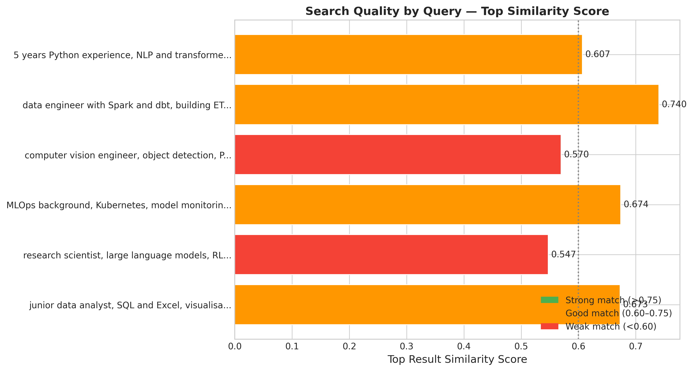
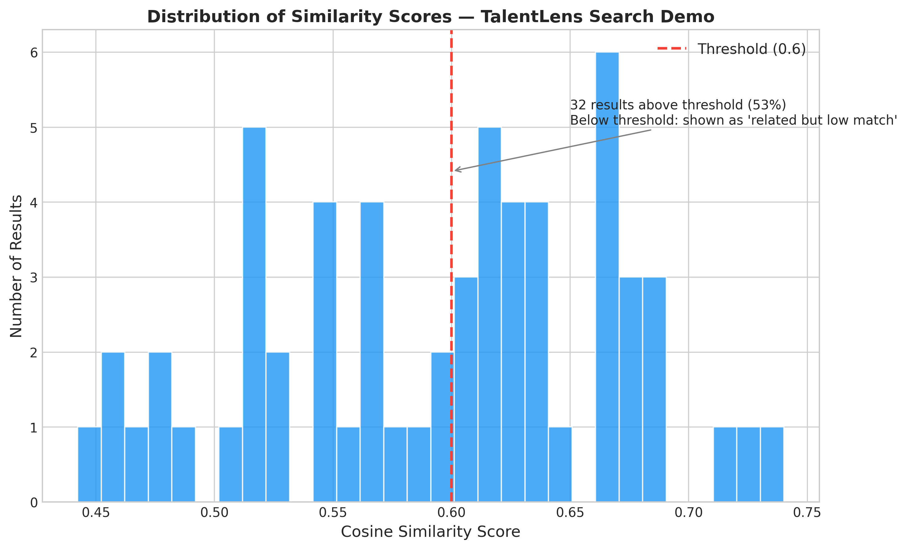
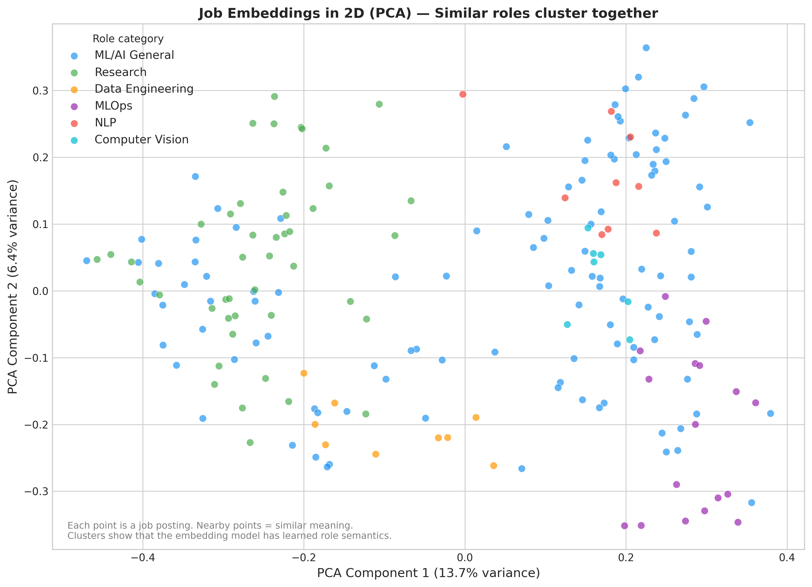

# Chapter 16: RAG and Vector Search — Building Intelligent Search

> **TalentLens milestone:** We add semantic job search. A user can paste their CV or describe their background in plain English ("5 years Python, worked on NLP, want remote") and TalentLens returns the 10 most relevant job postings using semantic similarity, not just keyword matching. This is the feature that makes TalentLens useful.

---

## The problem we're solving

Chapter 9 gave us a role classifier and Chapter 13 gave us canonical skill fields on every posting, but neither answers *which jobs match this candidate's background* when the words don't line up; that's the gap semantic search fills.

Keyword search is broken for job matching.

If a job posting says "LLM experience required" and your CV says "worked on large language models," a keyword search returns nothing. If a posting says "distributed systems" and your background is "Spark and Kafka at scale," same problem. The words don't match, even though the meaning does.

This is the problem RAG and vector databases solve. Not just for job search: this is the same problem that makes traditional search fail for medical records, legal documents, customer support tickets, and research papers. Anywhere humans write about concepts in multiple ways, keyword search breaks and semantic search wins.

By the end of this chapter, TalentLens has a search endpoint that understands meaning. A user describes their background once and gets back jobs ranked by how well they match, not by whether the exact same words appear in both documents.

This is also how you build a chatbot that knows about your own documents, a support system that finds relevant past tickets, or an internal knowledge base that works. RAG is the architecture behind all of it.

---

## Why RAG, and why now

**What RAG stands for:** Retrieval-Augmented Generation. The idea: instead of asking an LLM to answer from memory (which it can't reliably do for your private data), you first retrieve relevant documents, then pass those documents to the LLM as context. The LLM answers based on what you gave it, not what it was trained on.

For TalentLens, we're using the retrieval half. We don't need to generate text, we need to find relevant jobs. But the vector search infrastructure we build here is identical to what a full RAG pipeline uses.

**Why not just use keywords?**

Keywords work when the vocabulary is consistent. Job postings are written by hundreds of different hiring managers with different writing styles. One says "NLP engineering," another says "natural language processing," another says "text AI." They mean the same thing. Vector search handles this naturally: it converts text into numbers that encode meaning, so similar meanings produce similar numbers, regardless of exact wording.

**Where the vectors live (the options, and what this chapter uses):**

- *Pinecone*: managed, excellent, but costs money and has vendor lock-in. Good for production if budget is not a constraint.
- *Qdrant*: open source, Docker-native, excellent performance. Best choice if you want a dedicated vector DB.
- *Chroma*: easiest to get started, good for prototypes, less mature for production.
- *pgvector*: PostgreSQL extension, and the production target this chapter designs for: (1) you probably already have Postgres, (2) no extra infrastructure, (3) transactional guarantees alongside your regular data, (4) vector search and SQL filters in a single query. For datasets under about a million documents it is often the simplest operational choice.

The chapter's code implements the same interface with SQLite for storage and NumPy for exact cosine search, so it runs on any laptop with no database server. The SQL patterns below show what the same operations look like in pgvector when you move to production.

**When RAG is not the right tool:**

- When you have very few documents (<100): just use full-text search
- When exact keyword matching is what users expect (legal citations, stock tickers)
- When query latency needs to be <50ms at scale; dedicated vector DBs outperform pgvector here
- When you need to search structured fields (salary > ₹20L AND city = Bangalore); combine with SQL, don't replace it

---

## The methods

### Text embeddings

**What they do in plain English:** Convert a piece of text into a list of numbers (a vector) that captures its meaning. Similar texts produce similar vectors. Different texts produce different vectors. "machine learning engineer" and "ML engineer" will produce vectors that are close together. "machine learning engineer" and "chef de cuisine" will produce vectors that are far apart.

**How they're trained:** Embedding models are trained on huge amounts of text to learn that words/phrases that appear in similar contexts have similar meanings. `all-MiniLM-L6-v2` (the model we use) was trained on over a billion sentence pairs.

**Key parameters:**
- `model_name = "all-MiniLM-L6-v2"`: a 384-dimensional embedding model from Sentence Transformers. Good balance of quality and speed. Runs on CPU. Free.
- `batch_size = 64`: how many texts to embed in one pass. Larger = faster (up to GPU memory limit or CPU cache). 64 is a safe default for CPU.
- `normalize_embeddings = True`: scales each vector to length 1. Required for cosine similarity. Without this, longer documents would score higher just because their vectors are larger, not because they're more relevant.

**What 384 dimensions means:** Each text is represented as a point in 384-dimensional space. You can't visualise 384 dimensions, but mathematically, "closeness" in this space corresponds to "similarity in meaning." Larger embedding models (1536 dimensions for OpenAI `text-embedding-3-small`) are more accurate but more expensive and slower.

**What the output tells you:** A list of 384 floats between roughly -1 and 1. These numbers mean nothing individually; they only mean something in relation to other vectors. When you compute the cosine similarity between two vectors, you get a number between -1 and 1. In practice, sentence-transformer scores rarely go negative, and what counts as "high" depends on the model and the text length. Calibrate on your own data, as the output section below does.

---

### Cosine similarity

**What it does in plain English:** Measures how similar two vectors are, regardless of their length. Think of it as the angle between two arrows in high-dimensional space: parallel arrows (angle 0°) have similarity 1.0, perpendicular arrows (angle 90°) have similarity 0.0.

**Why cosine, not Euclidean distance:** Euclidean distance is affected by vector magnitude. Two documents about "Python" would have different magnitudes if one is short and one is long, even if they cover identical content. Cosine similarity only cares about direction (meaning), not magnitude (length). That's why we normalise embeddings before computing cosine similarity; it makes the computation equivalent to a dot product, which is fast.

**Formula (you don't need to memorise this, but it's good to see it once):**

```
cosine_similarity(A, B) = (A · B) / (|A| × |B|)
```

With normalised vectors, `|A| = |B| = 1`, so this reduces to just `A · B` (dot product).

**What the output tells you:** A score between -1 and 1. As a rough guide for `all-MiniLM-L6-v2` comparing a short query with a paragraph-length posting:
- above 0.7: a close match
- 0.55–0.7: clearly related
- 0.45–0.55: loosely related
- below 0.45: probably not relevant

These bands are lower than you might expect because a one-line query and a paragraph never look identical in embedding space. The chapter's config sets `similarity_threshold = 0.60`; the demo below prints the top five regardless, so you can see what sits on either side of the line.

---

### pgvector: vector search in PostgreSQL

**What it does in plain English:** Adds a `vector` data type to PostgreSQL and implements approximate nearest-neighbour search. You store your embeddings as vector columns alongside your regular data, and query them with similarity operators.

**Key SQL patterns:**

```sql
-- Store a job embedding
CREATE TABLE jobs (
    id          SERIAL PRIMARY KEY,
    title       TEXT,
    description TEXT,
    salary      INTEGER,
    embedding   vector(384)
);

-- Find the 10 most similar jobs to a query vector
SELECT id, title, 1 - (embedding <=> $1) AS similarity
FROM jobs
ORDER BY embedding <=> $1
LIMIT 10;
```

The `<=>` operator is cosine distance (1 - cosine similarity). Lower distance = more similar. We sort ascending by distance = most similar first. The `1 - (embedding <=> $1)` converts to similarity for human-readable output.

> **Note on scale:** The bundled corpus is 576 postings, so everything here runs in seconds. Where this chapter talks about 50,000 postings, it is extrapolating from the measured embedding rate, to show when each technique starts to matter.

**Index types:**
- `ivfflat`: faster approximate search, best for large datasets (>100k rows). Creates `n_lists` clusters and searches only nearby clusters. `lists = 100` means 100 clusters; search quality trades off with `probes` (how many clusters to search).
- `hnsw`: better accuracy, slower index build, faster query. Preferred for production.
- No index: exact search, always correct, gets slow above ~50k rows.

At TalentLens's current size, exact search is fine; add an `hnsw` index when you pass roughly 100,000 postings.

**What the output tells you:** A ranked list of (job_id, similarity_score) pairs. The scores tell you how relevant each job is to the query. A score of 0.82 means "strongly related." A score of 0.54 means "somewhat related." You decide the cutoff based on what feels useful for your use case.

---

### Hybrid search: combining vector and keyword

**What it does in plain English:** Runs a vector search (semantic) and a keyword score (exact), then blends them. This handles cases where exact terms matter. If someone explicitly asks for "Rust" jobs, you don't want pure semantic search returning Python jobs because both are programming languages.

**The blend this chapter uses (weighted score fusion):**

```
hybrid_score = alpha × cosine_similarity + (1 − alpha) × keyword_score
```

`hybrid_search()` fetches three times as many vector candidates as you asked for, scores each for keyword overlap with the query, and re-ranks by the blend. `alpha = 0.7` (in `Config.hybrid_alpha`) weights meaning over exact words; set it to 1.0 for pure vector search or 0.0 for keyword only.

**The common alternative (Reciprocal Rank Fusion):** `RRF_score = Σ 1 / (60 + rank)` over each result list. RRF uses ranks instead of raw scores, so it doesn't care that cosine similarity and keyword overlap live on different scales. It's the better choice when you fuse results from separate systems (a search engine plus a vector database); weighted fusion is simpler when, as here, both scores are computed on the same candidates.

**When to use pure vector vs hybrid:**
- Pure vector: open-ended queries, "find something like my background"
- Hybrid: queries with specific technical terms, product names, exact requirements

The chapter exposes both: `VectorStore.search()` for pure vector, `hybrid_search()` for the blend.

---

## The code

The full implementation is in `ch16_rag_vector_search.py`. It builds:
1. An embedding pipeline over every posting in the corpus
2. A `VectorStore` backed by SQLite, with exact cosine search in NumPy, the same interface you'd put in front of pgvector
3. A search function that takes plain English and returns ranked jobs
4. A hybrid search variant combining vector + keyword

Run:

```bash
python book/ch16/ch16_rag_vector_search.py
```

**Three key code decisions worth explaining:**

*Why we chunk long job descriptions before embedding:* `all-MiniLM-L6-v2` reads at most 256 word-pieces and silently ignores the rest. Real job descriptions are often longer. `chunk_text()` splits text into windows of 200 words with a 50-word overlap, embeds each chunk, and stores them separately; at query time the job scores as its best chunk. (The bundled descriptions are short, so each posting is one chunk, 576 in total. Chunking starts to matter on real postings.) Word-based windows are a simple approximation; for production, split on the tokenizer's own tokens.

*Why SQLite and NumPy, not PostgreSQL with pgvector:* pgvector needs a running PostgreSQL server with the extension installed. For learning, the `VectorStore` class stores vectors in SQLite and does exact cosine search in NumPy, with the same results as pgvector without an index. Its methods (`connect`, `add`, `search`) are the interface a pgvector-backed class would expose, so moving to production means writing that one class, not changing the callers.

*Why we store embeddings instead of recomputing them:* the chapter's run embedded 576 chunks in 6.4 seconds on a laptop CPU, about 90 per second. At that rate, 50,000 postings take about nine minutes. The vectors are written to [`data/talentlens_vectors.db`](https://github.com/irfanalidv/Book-Data_Voyage/blob/main/book/ch16/data/talentlens_vectors.db), so a service can load them at startup instead of re-embedding. This is a critical production pattern: you don't recompute embeddings unless the data changes.

---

## Interpreting the output

Run `python book/ch16/ch16_rag_vector_search.py` and read the figures alongside the console output.



**`ch16_search_quality.png`**: the top similarity score for each of the six demo queries. The spread is the point: well-represented queries (data engineering, MLOps) top out around 0.67–0.74; the research-scientist query, which the corpus barely covers, tops out at 0.55.



**`ch16_similarity_distribution.png`**: where returned scores cluster. Most sit between 0.45 and 0.75, which is why the bands in the Methods section are lower than textbook ones. A spike near 1.0 on non-duplicate queries would suggest leakage or copy-pasted descriptions.



**`ch16_vector_space_2d.png`**: every posting's 384-dimensional vector projected onto two dimensions. Roles form overlapping regions rather than islands, the same continuum Chapter 11's clusters found.

Here is the top of [`reports/search_demo_results.md`](https://github.com/irfanalidv/Book-Data_Voyage/blob/main/book/ch16/reports/search_demo_results.md) for two of the six demo queries:

```
Query: "data engineer with Spark and dbt, building ETL pipelines, Bangalore"

Rank 1: Data Engineer (Global ML Team)          similarity 0.740  ₹18L–₹24L  on-site
Rank 2: Senior ETL Developer (Anchor Lending)   similarity 0.721  ₹17L–₹23L  on-site
Rank 3: ETL Developer (Series B Fintech)        similarity 0.711  ₹32L–₹43L  on-site
Rank 4: Senior Data Engineer (Kestrel Commerce) similarity 0.690  ₹17L–₹22L  on-site
Rank 5: Junior Data Engineer (Coral Edtech)     similarity 0.686  ₹9L–₹13L   on-site

Query: "5 years Python experience, NLP and transformer models, want remote role"

Rank 1: Lead NLP Engineer (Remote AI Startup)   similarity 0.607  ₹28L–₹37L  remote
Rank 2: Lead Backend Engineer (Peacock Media)   similarity 0.606  ₹38L–₹52L  remote
Rank 3: NLP Engineer (Remote AI Startup)        similarity 0.594  ₹16L–₹21L  on-site
Rank 4: NLP Engineer (Remote AI Startup)        similarity 0.593  ₹12L–₹17L  on-site
Rank 5: Lead NLP Engineer (Vindhya Energy)      similarity 0.584  ₹16L–₹22L  on-site
```

**Reading the first query:** every result is a data-engineering role, and two of the top three are titled "ETL Developer", a phrase the query never used. The query said "ETL pipelines"; the model connected it to the title. That is semantic search doing its job. Scores above 0.68 across the board say the corpus covers this query well.

**Reading the second query:** the top results are NLP roles, as they should be, but ranks 3–5 are **on-site** although the query said "want remote". An embedding encodes what a text is about, not the constraints it states. "Want remote" nudges the vector slightly; it does not filter anything. Hard requirements (remote, city, salary floor) belong in a structured filter (`WHERE is_remote = true` in pgvector) applied alongside the vector search, not in the query text. Notice also that ranks 2–5 sit within 0.02 of each other: at that spread, the ordering is close to arbitrary.

**What it tells you about your data:** if your top results all score below about 0.5, either the corpus doesn't contain what was asked (the research-scientist query is close to this), the descriptions are too thin to embed well, or the query is too specific. If rank 1 scores 0.99, check for leakage; you may be returning the document the query was copied from.

**The semantic vs keyword gap:**

Run the same query through a keyword search (grep for "NLP", "Python", "remote"). Compare results. The vector search will surface jobs that say "natural language processing," "text ML," "language model work", none of which contain the exact word "NLP." This is the value add.

---

## Common mistakes I've seen (and made)

**Mistake: Embedding whole job descriptions without chunking**

What happens: The model truncates at 256 word-pieces. A 1,000-word job description gets embedded based only on its first ~180 words, usually the company overview boilerplate, not the technical requirements. Your embeddings represent "we are a fast-growing startup" not "requires PyTorch and RAG experience."

How to catch it: Check average embedding quality: embed a known-good match pair (CV and a job you know is relevant), compute their similarity. If it's below 0.5, your embeddings are probably noise.

Fix: Chunk (this chapter uses 200-word windows with 50-word overlap), embed all chunks, search all chunks, deduplicate by job_id.

---

**Mistake: Not normalising embeddings before cosine similarity**

What happens: Dot product on unnormalised vectors returns higher scores for longer documents, regardless of relevance. Senior roles with 1,000-word descriptions will outrank junior roles with 200-word descriptions even when the junior role is more relevant.

How to catch it: `np.allclose(np.linalg.norm(embedding), 1.0)` should return True for every embedding vector. If it doesn't, you're not normalising.

Fix: `embedding = embedding / np.linalg.norm(embedding)` after each embed call, or pass `normalize_embeddings=True` to Sentence Transformers.

---

**Mistake: Using the wrong similarity cutoff**

What happens: You return all results above 0.3 similarity. Users see 500 "matches" for every query, most of which are garbage. Or you set the cutoff at 0.85 and return nothing for reasonable queries.

How to catch it: Manually evaluate 20 query/result pairs. Note which similarity scores correspond to "this is a good match" and "this is not relevant." Build a distribution.

Fix: For TalentLens with `all-MiniLM-L6-v2`, 0.6 is a reasonable starting point. But build a feedback mechanism: let users mark results as relevant or not, log the similarity scores for those, and tune the cutoff based on real usage.

---

**Mistake: Not caching embeddings**

What happens: Every time you start the service, you re-embed every posting. At about 90 postings per second on CPU, 50,000 postings means nine minutes before the service is ready.

How to catch it: You'll notice: health checks fail while the service is still embedding.

Fix: Save embeddings to `.npy` on first run, load from disk on subsequent runs. Check freshness by comparing the hash of your documents CSV against a stored hash. If documents haven't changed, skip re-embedding.

---

**Mistake: Using pgvector without an index on large datasets**

What happens: Exact nearest-neighbour search is O(n): every query scans all 50k rows. At 50k this is fast (milliseconds). At 5M rows it's seconds. At 50M rows it's minutes.

How to catch it: Run `EXPLAIN ANALYZE` on your similarity query. If it shows `Seq Scan` instead of `Index Scan`, you're doing exact search.

Fix: `CREATE INDEX ON jobs USING hnsw (embedding vector_cosine_ops)` adds an approximate nearest-neighbour index. At 50k rows, no index is fine. Above 100k rows, add hnsw.

---

## Interview questions

**Q1: Explain RAG in one minute to a non-technical product manager.**

Template answer: "Imagine you gave a very smart assistant a massive library of documents but no way to search it. They'd have to read every document to answer a question. RAG is like adding a smart search step first: before the assistant answers, they search the library for the most relevant documents, pull out the top 5, then answer based only on those. For TalentLens, instead of asking an AI to 'know' all job postings from memory, we first find the 10 most relevant postings, then answer questions about them. The answer is always grounded in real data, not hallucinated."

**Q2: What's the difference between vector search and traditional full-text search?**

Template answer: "Full-text search matches exact words or stems, and works well when vocabulary is consistent. Vector search converts text to numbers that represent meaning, then finds the closest meanings to your query, so it works when the same concept is expressed in different words. For job search: 'senior NLP engineer' and 'principal natural language processing scientist' would return no results for each other in keyword search but would be strong matches in vector search. In practice, hybrid search (combining both) often outperforms either alone: keywords handle exact terms like company names and technologies, vector handles conceptual similarity."

**Q3: How do you evaluate whether your RAG system is working?**

Template answer: "Three levels. First, component evaluation: are the retrieved documents actually relevant to the query? For this, I build a small test set of (query, expected_documents) pairs, either manually or from user clicks, and measure recall@k (what fraction of relevant documents appear in the top-k results). Second, end-to-end evaluation: for a full RAG pipeline, is the generated answer correct given the retrieved context? Use LLM-as-judge or human evaluation on a test set. Third, business metrics: if it's a job search, are users clicking on the results? Are they completing applications? Product metrics are the ground truth. Everything else is a proxy."

**Q4: When would you choose Pinecone over pgvector?**

Template answer: "pgvector wins when: you already have PostgreSQL in your stack, your dataset is under 1M documents, and you want to combine vector search with SQL queries in a single round trip. Pinecone wins when: you need managed scaling without infrastructure management, you're doing 1M+ queries per day, or you need multi-tenancy with per-tenant indexes baked in. The architectural decision is also about team skillset. If your team knows PostgreSQL deeply, pgvector is much easier to operate. If they don't want to run any databases, Pinecone is worth the cost."

**Q5: What is the "lost in the middle" problem and how do you handle it?**

Template answer: "LLMs pay more attention to content at the beginning and end of their context window than in the middle. If you retrieve 10 documents and put them all in the prompt, the documents in positions 3–7 get relatively less attention. This can cause the LLM to ignore relevant information even when it's been retrieved. Mitigations: retrieve fewer, higher-quality chunks (quality > quantity), rerank retrieved chunks by relevance before passing to the LLM (use a cross-encoder reranker), or use a LLM with a larger context window where this effect is less pronounced. In TalentLens, since we're returning results directly rather than generating text, this problem doesn't apply, but it's critical to understand for any generative RAG application."

---

## What's next

In Chapter 17, we add the generation half. We take the retrieved jobs from this chapter and pass them to an LLM (via Groq or OpenAI API) to generate a personalised summary: "Based on your background, here are the 3 jobs that match best, and here's why each one fits." We also add the CV matching feature: paste your CV text, get back a ranked list with match explanations.

The vector search infrastructure we built here is reused directly. Chapter 16 is the retrieval; Chapter 17 is the generation.

---

## TalentLens checkpoint

At the end of this chapter, your project should have (paths relative to [`book/ch16/`](https://github.com/irfanalidv/Book-Data_Voyage/tree/main/book/ch16) unless noted):

- [ ] `ch16_rag_vector_search.py`: `EmbeddingModel`, `VectorStore`, chunking, indexing, `hybrid_search`, plots, demo queries
- [ ] [`data/talentlens_vectors.db`](https://github.com/irfanalidv/Book-Data_Voyage/blob/main/book/ch16/data/talentlens_vectors.db): SQLite vector store (created on run; safe to delete to re-index)
- [ ] [`reports/search_demo_results.md`](https://github.com/irfanalidv/Book-Data_Voyage/blob/main/book/ch16/reports/search_demo_results.md): ranked hits for the demo query set
- [ ] [`reports/figures/ch16_similarity_distribution.png`](https://github.com/irfanalidv/Book-Data_Voyage/blob/main/book/ch16/reports/figures/ch16_similarity_distribution.png), `ch16_search_quality.png`, `ch16_vector_space_2d.png`
- [ ] Tests passing from repo root: `pytest tests/test_ch16.py -v`

Run:

```bash
python book/ch16/ch16_rag_vector_search.py
```

For production you can split the same classes into `talentlens/rag/` modules; the book keeps one module so every reader can run a single file.

**Concepts you own:**

- Text embeddings as meaning coordinates: similar skills and roles map close in vector space regardless of exact wording
- Cosine similarity on normalised vectors: direction (meaning), not document length, drives the score
- RAG's retrieval half: find relevant documents first; generation (Chapter 17) comes later
