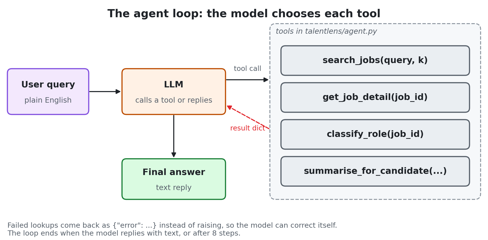
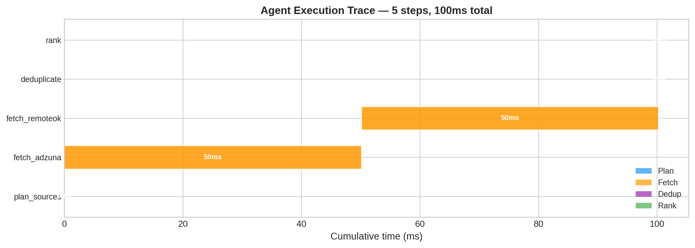
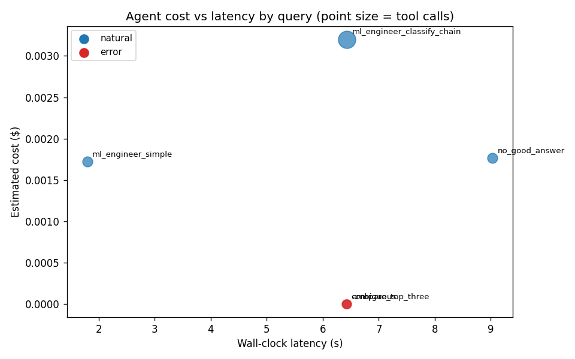

# Chapter 18: Agentic AI — Letting the Model Choose Its Tools

> **TalentLens milestone:** A multi-step agent that discovers job
> postings autonomously (search the corpus, classify candidates,
> summarise for a user), with the agent's failure modes named
> explicitly. Built from scratch in ~120 lines, no framework.

## The problem we're solving

Chapters 16 and 17 built the substrate: hybrid retrieval over the
job corpus (ch16) and LLM-backed text generation (ch17). Both are
callable functions. Chapter 18 asks: can we wire them together
behind an LLM that decides which tool to call when, given a user's
natural-language query?

The short answer is yes, with caveats this chapter teaches you
to expect. In the recorded run this chapter analyses, the agent
chained tools successfully for the easy cases (a one-call lookup)
and failed in five distinct ways that we documented and named. The failures are the chapter's most valuable content;
they're the things you can't get from reading abstractions about
"what is an agent."

---

## Why agentic AI, and why now

Chapters 16–17 gave you retrieval and generation as **functions you call**. Chapter 18 asks whether an LLM can **choose** which function to call, in what order, given a messy user request.

**Why not a fixed chain:** Chains are debuggable and cheap. Agents trade that for flexibility, and for failure modes (wrong tool, placeholder literals, markup instead of structured calls) this chapter measures explicitly.

**Alternatives:** LangChain / LlamaIndex / vendor agent SDKs: fine after you understand the ~120-line loop here. Frameworks hide the trace; traces are how you ship agents safely.

---

## The code

```bash
# Replay the recorded run (free, offline, no API key)
python book/ch18/ch18_agentic_ai.py

# Record a new run (real LLM calls, about a cent in total)
export GROQ_API_KEY=gsk_...
python book/ch18/ch18_agentic_ai.py --live
```

Outputs: [`reports/agent_report.md`](https://github.com/irfanalidv/Book-Data_Voyage/blob/main/book/ch18/reports/agent_report.md), [`reports/traces/live/`](https://github.com/irfanalidv/Book-Data_Voyage/tree/main/book/ch18/reports/traces/live), [`reports/figures/cost_latency.png`](https://github.com/irfanalidv/Book-Data_Voyage/blob/main/book/ch18/reports/figures/cost_latency.png).

**About the recorded run.** The traces analysed below were recorded in May 2026 with Llama 3.3 70B on Groq, against an earlier, more templated version of the bundled corpus. The agent caches each run's full result (every tool call, argument, and response) in [`reports/traces/cache/`](https://github.com/irfanalidv/Book-Data_Voyage/tree/main/book/ch18/reports/traces/cache), which is committed, so the default command replays that run exactly on any machine. Groq has since retired that model; `--live` uses `openai/gpt-oss-120b` by default (override with `TALENTLENS_AGENT_MODEL`) and records a fresh run against today's corpus. Expect different numbers and, very likely, a different mix of failures. Comparing your run with the recorded one is the best exercise in this chapter.

---

## The methods

### The four tools

Each tool lives in [`talentlens/agent.py`](https://github.com/irfanalidv/Book-Data_Voyage/blob/main/talentlens/agent.py). The same function is
callable from Python and described to the LLM via JSON Schema in
`TOOL_SPECS`.

- **`search_jobs(query, k)`**: keyword scoring over title,
  description, and skills fields. Returns up to k posting dicts
  with job_id, title, salary, excerpt, and a relevance score.
- **`get_job_detail(job_id)`**: fetches the full record for one
  posting. Returns structured error envelope (`{"error": "not_found"}`)
  when the job_id is unknown, rather than raising.
- **`classify_role(job_id)`**: wraps the Chapter 10 v2 classifier.
  Returns the predicted role plus a confidence score, or a
  structured error if the model is unavailable.
- **`summarise_for_candidate(job_id, candidate_skills)`**:   deterministic skill-overlap report. Notable: this tool does
  NOT call an LLM. The agent's outer loop is already calling the
  LLM; nesting LLM calls inside tools creates compounding
  latency. The chapter argues this is a default worth keeping
  even when the surrounding LLM could otherwise summarise.

## The agent loop (the chapter's centrepiece)

The agent loop is ~120 lines of explicit Python. No LangChain,
no LlamaIndex, no AutoGen. The chapter argues that you should
write this yourself once before reaching for a framework, because
the loop is simple enough that the framework's abstractions add
more confusion than safety:

```python
# talentlens/agent.py — simplified
for step in range(self.max_steps):
    response = client.chat.completions.create(
        model=self.model, messages=messages,
        tools=TOOL_SPECS, tool_choice="auto",
    )
    msg = response.choices[0].message
    messages.append({"role": "assistant", ...})

    if not msg.tool_calls:
        # Natural exit — the LLM produced a text response
        break

    for tc in msg.tool_calls:
        result, error = self._dispatch_tool(tc.function.name, ...)
        messages.append({"role": "tool", ...})
```

That's the entire structural insight an agent gives you: a while
loop that lets the LLM choose what to call next. Everything else
(caching, error handling, parallel tool calls, cost tracking) is
bookkeeping around that loop. The bookkeeping matters; the loop
is the lesson.

## Interpreting the output



**`ch18_agent_architecture.png`**: The control flow we ship: one LLM decides which tool to call; tools return dicts, not exceptions. Frameworks hide this diagram; we draw it because debugging starts here.



**`ch18_agent_run_trace.png`**: A representative trace, not the final answer. Wasted calls (placeholder `job_id` literals, markup instead of structured tool calls) show up only in the trace, which is the reason to read traces, not just outputs.



**`cost_latency.png`**: Cost is stable (token counts × rate); latency is not (retries, rate limits). We report both because a cheap run can still be too slow for a user-facing flow.

Open [`reports/agent_report.md`](https://github.com/irfanalidv/Book-Data_Voyage/blob/main/book/ch18/reports/agent_report.md) for the full per-query table.
The headline numbers from the recorded run:

- **Total cost for five queries:** $0.00669 (well under the
  $0.10 hypothesis)
- **Total tool calls:** 13: 11 of them in one query, of which
  5 were wasted on placeholder IDs like
  `"job_id_from_search_results_1"` (see Mistake 2).
- **Two queries errored** with Groq's `tool_use_failed`
  response: the LLM emitted XML-style `<function=...>` markup
  instead of the structured tool-call format. Both errors were
  caught by `Agent.run()` and recorded in traces.
- **Latency variance is large.** The same query
  (`no_good_answer`) took 9s on one run and 23s on another:
  same agent behaviour, very different wall-clock due to
  rate-limit retries. Cost was identical across runs.

The chapter's voice asks you to read these numbers as
*honest measurements of one agent on one dataset on one
provider*, not as general claims about agents. Different
LLM, different data, different prompt: different numbers.

## Common mistakes I've seen (and made: most of them while writing this chapter)

The chapter's writing surfaced five real failure modes, each
documented in [`reports/agent_report.md`](https://github.com/irfanalidv/Book-Data_Voyage/blob/main/book/ch18/reports/agent_report.md) with citations to
specific trace files. Briefly:

**Mistake 1: the LLM emits markup instead of structured tool
calls.** Llama 3.3 70B via Groq sometimes produces
`<function=search_jobs {"query": "..."}>` instead of the
OpenAI-compatible structured format Groq's API requires. The
request errors with `tool_use_failed`. The model knew which
tool to call; it just used the wrong serialisation. Catch the
exception, capture the response body, record it in the trace.
Don't crash the agent on the first tool-call malformation.

**Mistake 2: assuming a correct final response means the agent
worked.** The classify-chain query produced a correct final
response, but only after 5 wasted tool calls where the LLM
used placeholder strings (`"job_id_from_search_results_1"`)
instead of actual IDs. The final response paper-over the cost
accrued underneath. **Always read the trace, not just the
response.** Agent evaluation that only looks at outputs misses
where the budget goes.

**Mistake 3: writing tools that raise on bad input.** Tools
that raise force the agent loop to handle exceptions or crash.
Tools that return structured error envelopes
(`{"error": "not_found", "job_id": ...}`) give the LLM
something concrete to read in the next round and adjust
against. The chapter's recovery from the placeholder-literal
failure happened because the tools returned dicts, not raised
exceptions. This is load-bearing.

**Mistake 4: nesting LLM calls inside tools.** When the agent's
outer loop is already calling the LLM, having a tool also call
the LLM creates compounding latency (and, more subtly, makes
the agent's trace harder to read because the inner LLM's tokens
are billed somewhere the outer agent can't see). The chapter's
`summarise_for_candidate` tool is deliberately deterministic
for this reason. The surrounding LLM can summarise if it
wants, but the tool itself just returns skill overlap.

**Mistake 5: confusing cost stability with latency
predictability.** Cost is deterministic on tool-calling APIs:
token counts in, token counts out, multiply by the rate.
Latency is not. Rate-limit retries, network variability,
provider load: all of these affect wall-clock time without
affecting cost. A chapter that reports only one of these
misleads. Report both, name the difference.

## What you'll learn that doesn't transfer

Some things are specific to this chapter's setup and won't
generalise:

- **Groq's `tool_use_failed` quirk** is specific to Llama
  models through Groq's API. OpenAI's function-calling and
  Anthropic's tool use have different (and generally better)
  reliability on structured tool calls. The mitigation
  pattern (catching the error, capturing the body)
  generalises; the specific failure shape doesn't.
- **Llama 3.3 70B's placeholder-literal pattern** likewise
  varies by model. GPT-4 and Claude are more reliable at
  extracting structured field values from previous tool
  responses. The lesson, structured error envelopes for
  recovery, generalises.
- **The recording corpus's templated descriptions** made
  every ML Engineer posting look like every other one. The
  agent's "find ML Engineer postings" success was genuine, but
  unimpressive: there was no per-posting differentiation to
  surface. The current bundled corpus varies far more, so a
  `--live` run will produce more interesting traces.

## Interview questions

**Q1: What's the difference between an agent and a chain?**

Template answer: "A chain runs a fixed sequence of steps I wrote: retrieve, then summarise, then format. An agent gives the model a set of tools and a loop: at each step the model decides which tool to call with which arguments, or decides it's done. The loop is simple; the difference is who controls the order of calls. Chains are cheaper, easier to test, and easier to debug, so I use an agent only when the sequence depends on intermediate results."

**Q2: An agent produces correct final answers, but a large share of its tool calls fail. Is that a problem?**

Template answer: "Yes. Every failed call costs tokens, latency, and rate-limit budget, and it signals a fragile interaction between the model and the tool schema. The next prompt or model change might turn recoverable failures into wrong answers. In one recorded run, a query that finished correctly spent 5 of its 11 tool calls on placeholder IDs the model invented. I evaluate agents on their traces, not just their final outputs: calls per query, wasted-call rate, and error types."

**Q3: How do you trade off a model's tool-calling reliability against its price?**

Template answer: "By total cost per successful task, not price per token. A cheap model that malforms tool calls or needs retries can cost more in the end: extra calls, longer latency, more guardrails and monitoring. I'd run the same query set on two or three candidates, measure success rate, calls per success, latency, and cost, and pick on those. My recorded run cost under a cent for five queries but failed on two of them; a pricier model that succeeds first time may be cheaper overall."

**Q4: How should a tool written for an agent report errors?**

Template answer: "As structured results the model can read, something like `{\"error\": \"not_found\", \"job_id\": \"…\"}`, not as exceptions. An exception either crashes the loop or reaches the model as an unhelpful traceback; a structured error tells it what went wrong and lets it correct itself on the next step. The agent in my recorded run recovered from invented job IDs precisely because the lookup tool returned `not_found` instead of raising."

**Q5: An agent takes 2 seconds in development and 60 seconds in production. What are the likely causes, in order?**

Template answer: "First, rate limiting at the model provider: retries with backoff add tens of seconds, especially on free or shared tiers. Second, the agent taking more steps on real inputs than on my test queries, with longer traces and more tool calls. Third, slow downstream tools or network latency to the provider. I'd read the traces: they show per-call timing and retry counts, which separates these immediately. In my recorded run the same query took 9 seconds once and 23 seconds another time, purely from rate-limit retries."

## What's next

Chapter 19 exposes the same capabilities over HTTP: search and classify without running the agent loop in-process. The agent's tools could call that API instead of monorepo imports once both are deployed.

Several extensions are deliberately out of scope here:

- **Multi-agent / agent-to-agent patterns**: different
  chapter; one agent + four tools is this chapter's scope.
- **Cost / latency optimisation** (caching, streaming,
  batching): important production concerns, named here,
  not implemented.
- **Async tool execution**: sequential code is easier to
  reason about for a first agent loop; concurrent dispatch
  is a real win once the basics are understood.
- **Persistent agent memory across sessions**: within-run
  conversation memory only here; persistent memory adds a
  storage layer that's a separate concern.
- **Provider benchmarks**: the loop uses Groq's
  OpenAI-compatible API. Running the same five queries on
  other providers and models, against the same tools, is an
  excellent exercise.

---

## TalentLens checkpoint

- [ ] `python book/ch18/ch18_agentic_ai.py` replays the recorded run and regenerates [`reports/agent_report.md`](https://github.com/irfanalidv/Book-Data_Voyage/blob/main/book/ch18/reports/agent_report.md)
- [ ] You read one trace under [`reports/traces/live/`](https://github.com/irfanalidv/Book-Data_Voyage/tree/main/book/ch18/reports/traces/live) and named one wasted tool call
- [ ] `pytest tests/test_agent.py -v` passes from repo root

**Concepts you own:**

- Agent vs chain: the LLM chooses tools at runtime; the loop is a while-loop with tool dispatch, not a fixed DAG
- Structured error envelopes in tools: the model can recover from bad arguments; raised exceptions cannot
- Trace-first evaluation: correct final answers can hide wasted tool calls and budget leaks

---

## Files in this chapter

| Path | What it is |
|---|---|
| [`book/ch18/README.md`](https://github.com/irfanalidv/Book-Data_Voyage/blob/main/book/ch18/README.md) | This file |
| [`book/ch18/ch18_agentic_ai.py`](https://github.com/irfanalidv/Book-Data_Voyage/blob/main/book/ch18/ch18_agentic_ai.py) | Chapter executable; runs the five test queries, captures traces, updates the report |
| [`book/ch18/reports/agent_report.md`](https://github.com/irfanalidv/Book-Data_Voyage/blob/main/book/ch18/reports/agent_report.md) | Generated: hypothesis-result table, per-query measurements, failure-mode catalogue |
| [`book/ch18/reports/traces/live/`](https://github.com/irfanalidv/Book-Data_Voyage/tree/main/book/ch18/reports/traces/live) | Full agent traces per query (committed) |
| [`book/ch18/reports/traces/cache/`](https://github.com/irfanalidv/Book-Data_Voyage/tree/main/book/ch18/reports/traces/cache) | Cached full agent runs, keyed by query and model (committed, so replay works offline) |
| [`book/ch18/reports/figures/cost_latency.png`](https://github.com/irfanalidv/Book-Data_Voyage/blob/main/book/ch18/reports/figures/cost_latency.png) | Cost vs latency visualisation |
| [`book/ch18/data/query_viability.txt`](https://github.com/irfanalidv/Book-Data_Voyage/blob/main/book/ch18/data/query_viability.txt) | Pre-run audit of which queries the bundled data can answer |
| [`talentlens/agent.py`](https://github.com/irfanalidv/Book-Data_Voyage/blob/main/talentlens/agent.py) | The Agent class, the four tools, TOOL_SPECS |
| [`tests/test_agent.py`](https://github.com/irfanalidv/Book-Data_Voyage/blob/main/tests/test_agent.py) | Tests for the agent module |
| [`scripts/audit_query_viability.py`](https://github.com/irfanalidv/Book-Data_Voyage/blob/main/scripts/audit_query_viability.py) | The audit script (re-run when the data changes) |
| [`scripts/plot_agent_cost_latency.py`](https://github.com/irfanalidv/Book-Data_Voyage/blob/main/scripts/plot_agent_cost_latency.py) | Figure generation script |
