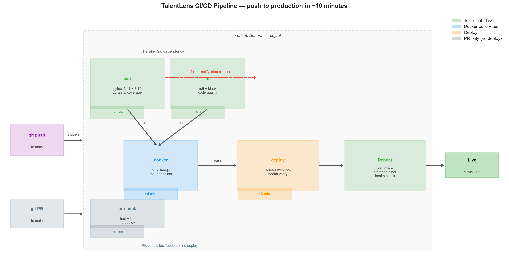
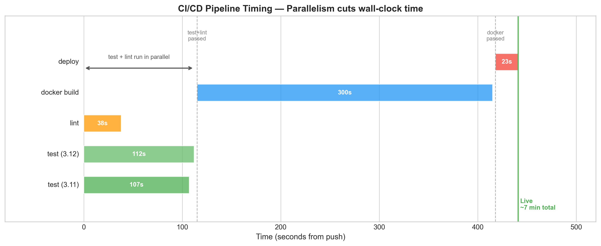

# Chapter 21: CI/CD — Automating Tests, Quality, and Deployment

> **TalentLens milestone:** Every push to `main` automatically runs the test suite, checks code quality, builds the Docker image, tests the live container, and deploys to Render, without you touching a single button. A broken push gets caught before it reaches production. A clean push reaches production in under 10 minutes.

---

## The problem we're solving

Right now, deploying TalentLens is manual. You push code. You remember to run the tests. You hope nothing broke. You go to Render and click Deploy. You wait. You check if the health endpoint still works.

This process has two problems. First, it depends on you remembering to do things in the right order, and humans forget steps, especially under deadline pressure. Second, it doesn't scale. One developer can manage a manual deploy. A team of three cannot.

CI/CD (Continuous Integration and Continuous Deployment) replaces the manual checklist with an automated pipeline. Every push to `main` triggers: run tests → check code quality → build Docker image → start container → verify endpoints → deploy to Render. If any step fails, the pipeline stops and you get notified. Nothing broken reaches production.

This chapter covers two tools: **GitHub Actions** for the pipeline, and **Make** for the local interface. Make is the missing piece most data scientists skip: a single command interface that works the same on your laptop and in CI, so "it works in CI but not locally" stops being a thing.

---

## Why CI/CD, and why now

The best time to add CI/CD is before your project has users. The second best time is now.

Without CI/CD, every deployment carries unknown risk. Tests that passed locally might not pass on a clean environment. The Docker build might have an undiscovered dependency. The production health check might fail in a way that's invisible until a user hits a 503.

With CI/CD, every one of these failure modes gets caught automatically, on a clean, isolated environment that's reproducible. You see the failure in the pipeline, not from a user report.

**Why GitHub Actions over Jenkins, CircleCI, or others:**

GitHub Actions is the default choice in 2026 for projects on GitHub for three reasons. It's free for public repos and has a generous free tier for private repos (2,000 minutes/month). It's configured as YAML files in your repo, with no external service to manage, no separate login. And the marketplace has pre-built actions for almost every task (Docker build, deployment, notifications), so you're writing minimal custom code.

**Why Make:**

Make is a 50-year-old build tool that remains the best answer to "how do I give my project a consistent command interface." The alternative is a `README.md` full of commands people copy-paste incorrectly. With Make, `make test` always runs the right test command, `make deploy-check` always runs the right pre-deploy sequence, and new team members are productive in minutes not hours.

---

## The methods

> **Skip ahead if…** you already run GitHub Actions on every push, skim to the Makefile targets and the pipeline figures in Interpreting; this chapter's value for us is Make ↔ CI parity, not YAML syntax.

> **Reference: GitHub Actions YAML catalog**

The subsections through **Secrets and environments** below are field-by-field lookup. Use them when editing `.github/workflows/`, not when deciding whether we need CI.

### GitHub Actions workflow structure

**What it does in plain English:** A YAML file that defines when a pipeline runs and what it does. GitHub reads `.github/workflows/*.yml` automatically; no registration required.

**Key fields:**

```yaml
on:
  push:
    branches: [main]
  pull_request:
    branches: [main]
```

`on`: what triggers the workflow. `push` to `main` runs the full pipeline. `pull_request` to `main` runs tests and lint only, so you get feedback without deploying.

```yaml
concurrency:
  group: ${{ github.workflow }}-${{ github.ref }}
  cancel-in-progress: true
```

`concurrency`: if two pushes happen quickly, cancel the first run when the second starts. Without this, two deploys run simultaneously and the slower one might overwrite the faster one's result. Always include this.

```yaml
jobs:
  test:
    needs: []       # runs immediately
  docker:
    needs: [test]   # only runs if test passes
  deploy:
    needs: [test, lint, docker]  # only runs if all three pass
```

`needs`: defines the dependency graph between jobs. `docker` won't run if `test` fails; there's no point building an image for broken code. `deploy` won't run unless everything passes. This is the critical safety layer.

---

### Job steps and caching

**What they do in plain English:** Each job is a sequence of steps. Steps share a filesystem but not the environment: each step starts fresh. Caching lets you persist slow operations (pip installs, Docker layers) between runs.

```yaml
- name: Set up Python
  uses: actions/setup-python@v5
  with:
    python-version: "3.11"
    cache: pip
```

`cache: pip` tells GitHub Actions to cache the pip download directory. On the first run, pip downloads everything fresh. On later runs with unchanged requirement files, it restores the downloaded wheels from cache, which skips the download but not the install, so expect minutes, not seconds, for an ML stack. The cache key is a hash of the requirements files; changing them invalidates it automatically.

One more line matters for ML projects on Linux runners: `--extra-index-url https://download.pytorch.org/whl/cpu`. Without it, pip installs PyTorch's CUDA build, several GB of GPU libraries. This book's pipeline once failed with `No space left on device` for exactly that reason. The book never needs a GPU, so CI installs the CPU build.

```yaml
- uses: docker/build-push-action@v5
  with:
    cache-from: type=gha
    cache-to: type=gha,mode=max
```

`type=gha`: GitHub Actions cache for Docker layers. The first Docker build takes 5–10 minutes. Subsequent builds with unchanged `requirements.txt` restore the pip install layer from cache and complete in under 1 minute.

---

### Matrix builds

**What they do in plain English:** Run the same job across multiple configurations in parallel.

```yaml
strategy:
  matrix:
    python-version: ["3.11", "3.12"]
  fail-fast: false
```

`matrix` runs the test job twice simultaneously: once with Python 3.11, once with Python 3.12. If your code works on 3.11 but breaks on 3.12 (a NumPy API change, a Pydantic v2 behaviour difference), you catch it here before it reaches a user.

`fail-fast: false`: if 3.11 tests fail, 3.12 still runs. You see all failures at once instead of having to fix and re-run iteratively.

---

### Secrets and environments

**What they do in plain English:** Encrypted values injected into the workflow at runtime. Never stored in your YAML file. Set in GitHub Settings → Secrets.

```yaml
- name: Trigger Render deploy
  env:
    RENDER_DEPLOY_HOOK_URL: ${{ secrets.RENDER_DEPLOY_HOOK_URL }}
  run: curl -sf -X POST "$RENDER_DEPLOY_HOOK_URL"
```

`secrets.RENDER_DEPLOY_HOOK_URL` is the deploy hook URL from your Render service. Available in the workflow at runtime, never visible in logs (GitHub masks values that match known secrets).

**GitHub Environments**: a layer above secrets that adds protection rules. The `production` environment can require a manual approval before deploying, restrict deployment to specific branches, and have its own set of secrets separate from the repository secrets. For TalentLens, we use a `production` environment so only pushes to `main` can deploy.

---

> **Reference: Makefile patterns**

The targets below are our local command surface. Each `make` target should mirror what CI runs so "green locally, red in Actions" stops being mysterious.

### Makefile targets

**What they do in plain English:** Named commands that wrap the actual shell commands. `make test` is more memorable and less error-prone than `pytest tests/ -v --tb=short --cov=book --cov-report=term-missing`.

**Key patterns:**

`.PHONY` declaration:
```makefile
.PHONY: test lint docker-build
```
Tells Make these aren't file targets; they're always commands to run. Without this, if a file named `test` exists in your directory, `make test` does nothing.

Dependencies between targets:
```makefile
deploy-check: lint test-fast docker-build
```
`make deploy-check` runs `lint`, then `test-fast`, then `docker-build`, in that order, stopping if any fails. This mirrors what CI does, letting you catch failures locally before pushing.

Automatic help:
```makefile
help:
  @grep -E '^[a-zA-Z_-]+:.*##' $(MAKEFILE_LIST) | \
    awk 'BEGIN {FS = ":.*##"}; {printf "  %-20s %s\n", $$1, $$2}'
```
The `##` comment after each target becomes the help text when you run `make help`. Self-documenting Makefile, no separate documentation to maintain.

### Local lint: CI gate vs full ruleset

**`make lint` is the must-pass gate: the same ruff scope CI enforces.** It runs:

```bash
ruff check book/ tests/ talentlens/ --select=E,F,W,I --ignore=E501
black book/ tests/ --line-length 100 --check   # warning only locally (Makefile uses `-` so it does not fail the target)
```

That matches the `lint` job in `.github/workflows/ci.yml`: syntax and import errors block merge; line length (E501) is ignored because chapter scripts prioritise readability over width; black is advisory in CI (`continue-on-error: true`) and locally (the `-` prefix on the black line means a formatting diff prints but `make lint` still exits 0).

**`make lint-all` is deliberately not the gate.** It runs the full `[tool.ruff.lint]` select from `pyproject.toml` on the same three directories. On this repo it currently reports hundreds of violations, mostly style opinions that fight ML idioms: **N806** flags universal names like `X`, `y`, and `ax`; **B905** wants `strict=` on every `zip()`. Renaming `X` to satisfy the linter would make chapter code *less* readable to the audience this book serves. Production teams often split lint this way: a **fast CI gate** (errors that break builds) and a **stricter local ruleset** you opt into when tightening style. We document `lint-all` as that exploratory tier, not something CI or readers must pass today.

When you extend TalentLens, run **`make lint` before every push**. Treat **`make lint-all`** as a discovery tool if you are revisiting ruff config, not as "CI but stricter."

---

## The code

Three files (the Makefile and two GitHub Actions workflows) handle the full pipeline.

**What happens on `git push origin main`:**

1. GitHub detects the push, reads `.github/workflows/ci.yml`
2. `test` job starts on Python 3.11 and 3.12 simultaneously
3. `lint` job starts simultaneously with `test`
4. If both pass → `docker` job starts: builds image, starts container, tests endpoints
5. If Docker passes → `deploy` job: hits Render deploy hook
6. Render pulls the new image, starts the container, checks health
7. If health passes → deploy is live
8. Total time: 6–10 minutes from push to production

**What happens on a pull request:**

1. `pr-check.yml` triggers
2. Tests run on 3.11 only (faster feedback)
3. Ruff lint runs
4. PR gets a green or red check: reviewers see the status before merging
5. Total time: about five minutes: most of it installing the ML stack

**Setting up the deploy hook (one-time, takes 2 minutes):**

```bash
# 1. Get the deploy hook URL from Render
# Dashboard → your service → Settings → Deploy Hook → Copy URL

# 2. Add to GitHub Secrets
# GitHub repo → Settings → Secrets and variables → Actions → New secret
# Name: RENDER_DEPLOY_HOOK_URL
# Value: https://api.render.com/deploy/srv-xxx?key=yyy

# 3. Add your production URL (for health verification after deploy)
# Name: TALENTLENS_PRODUCTION_URL
# Value: https://talentlens-api.onrender.com
```

---

## Interpreting the output



**`ch21_pipeline_architecture.png`**: Test, lint, docker, and deploy jobs and their `needs` edges. Broken `needs` wiring is how broken code still reaches production.



**`ch21_pipeline_timing.png`**: Wall-clock per stage on a typical run. Docker build dominates until layer caching kicks in, the same lesson as Chapter 20's COPY order, applied in CI.

**A green pipeline run has this shape** (test counts are this repository's suite; timings are typical, and yours will vary with runner load and cache hits):

```
OK Test (3.11)    ~5 min    420 passed, 5 skipped
OK Test (3.12)    ~5 min    420 passed, 5 skipped
OK Code Quality   <1 min    ruff: no issues, black: advisory
OK Docker Build   ~2 min    image: 462MB, health + search + classify probes passed
OK Deploy         <1 min    production health: ok
```

The test jobs dominate, mostly installing the full ML stack; `cache: pip` is what keeps later runs near the bottom of that range.

**A failing pipeline looks like:**

```
OK Test (3.11)    passed
FAIL Test (3.12)    1 failed (test_salary_stats_handles_nulls)
OK Code Quality   passed
Docker Build  skipped  (test job failed)
Deploy        skipped  (docker job skipped)
```

The failure prevented a broken deploy. The `test_salary_stats_handles_nulls` failure tells you exactly where to look: probably a NumPy 2.0 API change between Python 3.11 and 3.12 environments.

**GitHub Step Summary (visible in the Actions tab):**

```
## Docker Build Summary
| Item | Value |
|------|-------|
| Image | talentlens:a1b2c3d |
| Size | 462MB |
| Health check | Passed |
| Endpoints tested | GET /health, POST /api/v1/search, POST /api/v1/classify |
```

This is written by the workflow itself and visible without reading log lines. Useful for non-engineers who need to know if a deploy succeeded.

---

## Common mistakes I've seen (and made)

**Mistake: Not setting `concurrency`: two deploys racing**

What happens: You push twice in 30 seconds. Both runs start. The first finishes and deploys version A. The second finishes and deploys version B. But if the second finishes first (flaky test slowed the first), version A overwrites version B in production. You deployed the wrong commit.

Fix: `concurrency: group: ${{ github.workflow }}-${{ github.ref }}, cancel-in-progress: true`. Always include this in every workflow.

---

**Mistake: Running the Docker build job on every push including failing tests**

```yaml
# WRONG — docker builds even when tests fail
docker:
  needs: []  # no dependency
```

What happens: Tests fail. Docker build runs anyway (wasting 5 minutes of CI time). Deploy triggers anyway (sometimes). Broken code reaches production.

Fix: `needs: [test, lint]`. The Docker job only starts when both test and lint pass. No exceptions.

---

**Mistake: Hard-coding secrets in the workflow YAML**

```yaml
# WRONG — secret visible in git history forever
- run: curl -X POST "https://api.render.com/deploy/srv-xxx?key=actual-secret-key"
```

What happens: The secret is committed to your repository. Anyone with read access to the repo (past, present, future) can see it. GitHub's secret scanning will flag it, but the damage is done the moment it's committed.

Fix: `${{ secrets.RENDER_DEPLOY_HOOK_URL }}`. Always. Never inline secrets in YAML.

---

**Mistake: Health check that's too slow or has side effects**

```python
# WRONG — health check queries the database
@app.get("/health")
async def health():
    count = await db.execute("SELECT COUNT(*) FROM jobs")  # slow
    return {"status": "ok", "jobs": count}
```

What happens: CI pings `/health` every second waiting for startup. Each ping runs a database query. Under load, this can saturate the database connection pool before the app is ready. The health check itself causes the startup failure it's meant to detect.

Fix: Health endpoint returns immediately with no I/O. If you want to verify the database, add a separate `/health/ready` endpoint and call it less frequently.

---

**Mistake: The CI environment has different packages than production**

```yaml
# CI installs everything including dev tools
- run: pip install -r requirements.txt -r requirements-dev.txt
```

What happens: Tests pass in CI because a dev package fills in for a missing production package. The production Docker image (which only installs `requirements.txt`) fails at runtime.

Fix: Run tests in CI using exactly the same `requirements.txt` as production. Dev tools (`pytest`, `black`, `ruff`) should be installed separately, not mixed into production requirements.

---

## Interview questions

**Q1: What is CI/CD and why do ML teams need it?**

Template answer: "CI (Continuous Integration) means every code change is automatically tested on a clean environment, ensuring the main branch always works. CD (Continuous Deployment) means passing changes are automatically deployed to production. ML teams need this more than most: ML code has more ways to fail silently: a data type change can break a pipeline without a Python error, a dependency update can change model outputs, a Docker build can succeed locally but fail on the server's architecture. CI/CD catches these failures automatically, on every change, before they reach users. Teams without CI/CD rely on manual discipline, which degrades under deadline pressure."

**Q2: Walk me through what happens when you push a commit to main in your pipeline.**

Template answer: "GitHub Actions detects the push and reads `.github/workflows/ci.yml`. The test job starts on Python 3.11 and 3.12 in parallel, and pytest runs all tests with coverage. The lint job starts simultaneously: ruff checks for errors, black verifies formatting. If both pass, the Docker job starts: it builds the **462MB slim image** from Chapter 20 (`requirements-api.txt`), starts a container, and hits `GET /health`, `POST /api/v1/search`, and `POST /api/v1/classify` with real HTTP requests, the same endpoints Chapter 19 exposes. If the container tests pass, the deploy job triggers Render via a webhook URL stored in GitHub Secrets. Render pulls the new image, starts a container, runs its own health checks, and when those pass, it cuts over traffic. Total time is typically under ten minutes from push to production."

**Q3: How do you handle secrets in GitHub Actions?**

Template answer: "Secrets are stored in GitHub Settings → Secrets and Variables → Actions. They're encrypted at rest and injected into workflows as environment variables at runtime. In the YAML, you reference them as `${{ secrets.SECRET_NAME }}`, and GitHub automatically masks these values in logs so they never appear in plain text. The critical rule: never hardcode secrets in YAML files, never echo them in run steps, never put them in environment variables that get logged. For production, I use GitHub Environments on top of Secrets: the production environment can require manual approval before deployment runs, which adds a human gate for sensitive deployments."

**Q4: Your CI pipeline takes 15 minutes. How do you speed it up?**

Template answer: "I look at where the time is going first; GitHub Actions shows timing per step. The most common culprits: pip install without caching (fix: `cache: pip` in setup-python action, or cache the virtualenv), Docker build without layer caching (fix: `cache-from: type=gha` in the build-push-action), sequential jobs that could be parallel (fix: remove unnecessary `needs` dependencies so jobs run concurrently), and running slow tests in every job (fix: separate a fast smoke-test suite that runs in PRs from the full suite that runs on main). With these changes, a 15-minute pipeline typically comes down to 4–6 minutes."

**Q5: A deployment passed CI but broke production. How do you diagnose it?**

Template answer: "First, check what's different between the CI environment and production. The most common causes: environment variables that exist in CI but not in production (or vice versa), a dependency that behaves differently between the CI Python version and the production container's Python version, or a data issue: the CI tests use synthetic data but production has edge cases the tests don't cover. My diagnostic sequence: check the Render logs immediately after the deploy (not after the alert), compare the production and CI environment variables, run the Docker container locally with the production env vars to reproduce the failure, then add a test that would have caught it. For the immediate fix: Render has a one-click rollback to the previous deploy: use it first, diagnose second."

---

## What's next

Chapter 22 takes the deployable application we built across Chapters 19–21 and extracts its reusable core into a published PyPI library, `talentlens-core`. The CI/CD pipeline we built here covers the application; Chapter 22 covers the library. After that, Chapter 23's case studies show what happens once code is in production: how Reflecta and RAGNav handled model drift, observability, and the things that broke at 3 AM that no CI pipeline catches.

The foundation is in place. The code gets to production automatically. Now we watch what happens when it gets there.

---

## TalentLens checkpoint

At the end of this chapter, your project should have:

- [ ] `Makefile` in repo root: `make help` shows all commands
- [ ] `.github/workflows/ci.yml`: full pipeline committed
- [ ] `.github/workflows/pr-check.yml`: PR fast-check committed
- [ ] `RENDER_DEPLOY_HOOK_URL` added to GitHub Secrets
- [ ] `TALENTLENS_PRODUCTION_URL` added to GitHub Secrets
- [ ] First green pipeline run visible in GitHub → Actions tab
- [ ] `pytest tests/ -v` passes locally (same command as CI)

Verify locally before pushing:
```bash
make test-fast    # same tests CI runs
make lint         # CI lint gate: ruff E,F,W,I on book/tests/talentlens (ignores E501); black --check warns only
make docker-build # same image CI builds
# optional: make lint-all — full pyproject ruff rules; exploratory, not a must-pass gate
# if all green:
git push origin main  # pipeline runs automatically
```

**Concepts you own:**

- CI as a reproducible gate: every push runs on a clean environment, not your laptop's venv
- Job dependency graph: `needs` prevents building and deploying broken commits
- Make as the local CI mirror: `make test` and `make docker-build` should match what Actions runs
