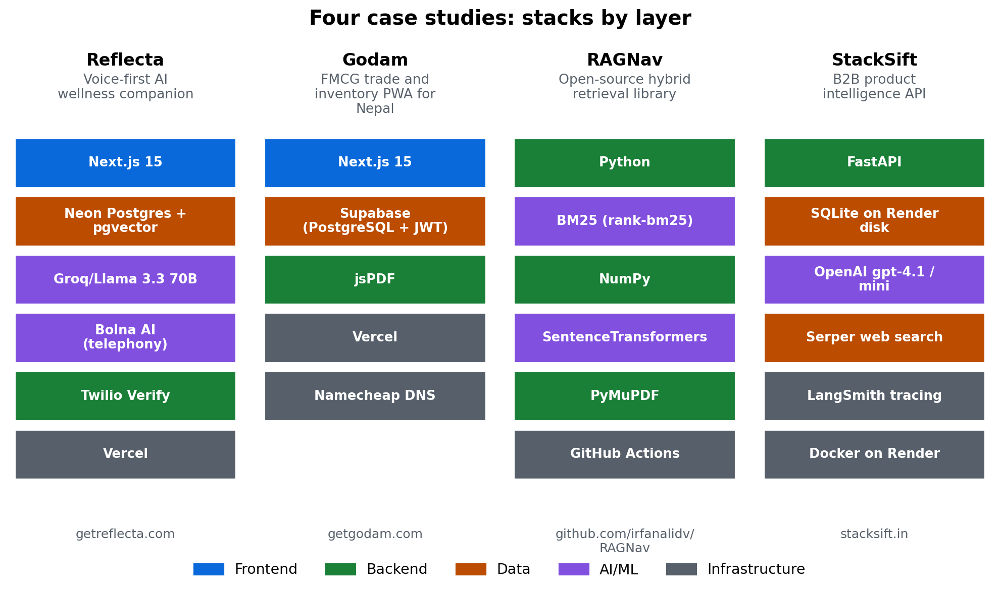
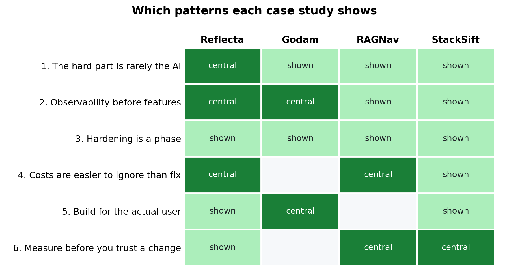

# Chapter 23: Real-World Case Studies

> **Stepping outside TalentLens:** Four production AI systems I've built and shipped: Reflecta, Godam, RAGNav, and StackSift. What worked, what broke, and what carries over, told so that "I built this once" becomes "you should do this every time."

## The problem we're solving

The previous twenty-two chapters built TalentLens: one system, deeply, end-to-end. That's how a textbook teaches. But real engineering happens across systems, and the patterns that transfer aren't the ones that show up in any single project's architecture diagram.

This chapter steps back. Four systems I've shipped to real users: a voice AI wellness companion, an FMCG inventory PWA for the Nepal market, an open-source Python library on PyPI, and a paid B2B data API built on LLMs. Different stacks, different problem domains, different failure modes. The lessons that surface when you compare them are the ones worth carrying into the next thing you build.

Run the chapter's script to generate the comparison figures and the summary:

```bash
python book/ch23/ch23_case_studies.py
```

Outputs the system-architecture comparison figure, the lessons-matrix figure, and the summary markdown under [`book/ch23/reports/`](https://github.com/irfanalidv/Book-Data_Voyage/tree/main/book/ch23/reports).

---

## Why case studies, and why now

TalentLens is one architecture. Production is a distribution of architectures. This chapter compares four shipped systems so patterns (observability-first, RLS before features, CI regression gates) transfer when the stack changes.

**Why not only TalentLens:** Readers need proof the book's shipping chapters generalise beyond job search. Voice latency, offline PWAs, and library CI gates are different failure surfaces.

---

## The code

```bash
python book/ch23/ch23_case_studies.py
```

---

## The methods

### Patterns that transfer across systems

Five patterns appeared in the first three systems regardless of stack, and StackSift, the fourth, adds a sixth:

1. **The hard part is rarely the AI.** Across all three systems, the model was the easiest part. The hard parts were authentication, rate limiting, webhook signature verification, RLS policies, and observability: the kind of work that doesn't show up in tutorials.

2. **Observability before features.** Every system shipped a real production incident that would have been caught earlier with logs. Reflecta's "Call me now" endpoint silently failed for 3 days. Godam's RLS policies leaked data for 6 hours. RAGNav's 0.3.0 release shipped an access-control bug that 0.4.0 fixed, in the same release that added CI. The pattern is the same: build the alarm, then build the feature.

3. **Production hardening is a phase, not a checklist.** Each system went through a 1-2 week "production hardening" sprint after the first usable version. Rate limits, webhook secrets, admin auth, error budgets. These aren't features you add; they're a stage of the project's life. Plan for it.

4. **Costs are easier to ignore than to fix later.** RAGNav was designed from day one to run with zero paid API calls. Reflecta's wasn't, and the resulting LLM bills shaped product decisions in ways that should have been engineering decisions instead.

5. **Build for the actual user, not the ideal one.** Godam was the clearest example: Nepal traders run on intermittent connectivity, low-end Android, mixed Hindi/Nepali/English, and a cash-first workflow. Building "for India" would have built the wrong product. The lesson generalises: every production system has assumed users who don't exist, and discovering this in week one is the difference between shipping and re-shipping.

6. **Measure before you trust an improvement.** StackSift's automatic prompt optimiser looked like progress and lowered macro F1 from 0.919 to 0.859. Without a labelled evaluation set and a known run-to-run noise level, that regression would have shipped.

## Case study 1: Reflecta (voice AI, B2C)

**What it is:** Voice-first AI wellness companion. Users call a phone number, talk to the AI, get back a transcribed dashboard with mood tracking. [getreflecta.com](https://www.getreflecta.com/).

**Stack:** Next.js 15, Neon Postgres + pgvector, Groq/Llama 3.3 70B, Bolna AI (telephony), Twilio Verify, Vercel.

**What worked:**
- Voice latency stayed under 800ms because Groq's inference speed (200-400ms) is what made this viable. A different LLM provider would have killed the product.
- Outsourcing telephony to Bolna instead of building on raw Twilio Voice. Bolna handles audio quality, retries, and voice activity detection, three problems we didn't have to solve.
- pgvector for conversation history retrieval scaled to ~100k records before needing thought about migration.

**What broke:**
- The "Call me now" backend endpoint silently failed for 3 days. Vercel logs existed but nobody was watching them.
- LLM hallucinations in a wellness context. The model occasionally "remembered" things the user never said. Groundedness checks became mandatory.
- Webhook signature verification was a 1-day implementation that should have been there from the first commit.

**Transferable lesson:** When latency is part of the product (voice, real-time, anything user-facing in seconds), the LLM provider choice is a product decision, not an engineering one. Pick on latency first, capability second.

## Case study 2: Godam (FMCG PWA, B2B SaaS for Nepal)

**What it is:** Inventory management for Nepal-based FMCG distributors. Three roles: admin, manager, field agent. Godown management, cheque tracking with photo uploads, daily sales reports as PDFs, costing sheet generation. Offline-first PWA. [getgodam.com](https://www.getgodam.com/).

**Stack:** Next.js 15, Supabase (PostgreSQL + JWT + Storage), jsPDF, Vercel, Namecheap DNS.

**What worked:**
- PWA offline-first via IndexedDB + Supabase sync. Field agents in areas with intermittent 3G can record sales offline; sync happens on reconnect.
- jsPDF for business reports. Don't reach for a PDF microservice when the requirement is "print a daily report."
- Single monthly subscription (NPR 16,000/month) instead of per-feature pricing. Friction kills SaaS at this segment.
- Nepali fiscal year (Bikram Sambat) and number formatting were built in from day one. The product feels native, not localised.

**What broke:**
- Supabase RLS policies were misconfigured at launch. Field agents could see each other's data for 6 hours before a manager noticed. Always test RLS with a non-admin user before go-live.
- Photo uploads hit file size limits we hadn't tested on real mobile networks. Client-side compression became table stakes.

**Transferable lesson:** "Building for [market]" is a planning fiction. You're building for *the user in front of you*: their device, their network, their workflow, their fiscal calendar. Generic SaaS assumes a generic user who doesn't exist in regional B2B markets.

## Case study 3: RAGNav and ragfallback (open-source RAG libraries)

Two MIT-licensed libraries that solve two halves of one problem: finding the right passage, and noticing when a RAG pipeline quietly gets worse. Both repositories are public, so the excerpts below are their real code, lightly trimmed (type hints and docstrings removed). Read the rest on GitHub.

### RAGNav: hybrid retrieval that runs offline

**What it is:** a retrieval library that combines BM25 keyword search with sentence-transformer embeddings and can expand results along a document's structure: section headers, neighbouring blocks, and references such as "see Table 2". It runs fully offline with no API key. [github.com/irfanalidv/RAGNav](https://github.com/irfanalidv/RAGNav) · [pypi.org/project/ragnav](https://pypi.org/project/ragnav/).

**Stack:** Python 3.9 to 3.12, NumPy, rank-bm25, sentence-transformers (optional), PyMuPDF for PDFs (optional), GitHub Actions.

**The measured result:** on 500 SQuAD questions (seed 42, `all-MiniLM-L6-v2`, results committed under `benchmarks/results/`), recall@3 is 0.932 for BM25 alone, 0.906 for embeddings alone, and 0.956 for the hybrid. Reproduce it with `python benchmarks/squad_benchmark.py`.

**How the fusion works:** BM25 scores and cosine similarities live on different scales, so RAGNav combines the two rankings instead of the raw scores, using Reciprocal Rank Fusion (the same idea Chapter 16 introduced):

```python
def _rrf_fuse(ranked_lists, *, k=60):
    scores = {}
    for ranked in ranked_lists:
        for rank, (block_id, _) in enumerate(ranked, 1):
            scores[block_id] = scores.get(block_id, 0.0) + 1.0 / (k + rank)
    return sorted(scores.items(), key=lambda x: x[1], reverse=True)
```

Each result also carries a confidence label, based on how far the best match stands above the runner-up:

```python
def _score_confidence(top_score, second_score):
    if top_score < 0.60:
        return ConfidenceLevel.LOW
    gap = top_score - second_score
    if top_score > 0.85 and gap > 0.15:
        return ConfidenceLevel.HIGH
    return ConfidenceLevel.MEDIUM
```

**What broke, and what it still cannot do:**
- Release 0.3.0 combined document-level and block-level access rules with OR, so a document's permissions could widen access to a block that was meant to be restricted. Release 0.4.0 changed this to AND, in the same release that added CI and raised test coverage to about 72%.
- Legal contracts are hard for it. On CUAD, block-level recall@3 is 0.047 for the hybrid against 0.040 for BM25. The README reports this under "Limitations" instead of leaving it out.

### ragfallback: catching silent RAG failures

**What it is:** a reliability layer for LangChain-compatible RAG pipelines. It checks chunks and embeddings before indexing, falls back to a second retrieval path when the first returns nothing, scores answers, and turns those scores into a CI gate. [github.com/irfanalidv/ragfallback](https://github.com/irfanalidv/ragfallback) · [pypi.org/project/ragfallback](https://pypi.org/project/ragfallback/).

**Stack:** Python 3.8+, LangChain, Pydantic, NumPy, with optional extras for FAISS, Chroma, Qdrant, sentence-transformers, RAGAS, and MLflow; GitHub Actions.

**The CI gate:** on every push to `main`, a golden dataset built from SQuAD runs through the pipeline, and `BaselineRegistry.compare_or_fail` fails the build if any metric falls more than a set fraction below its stored baseline. The check, applied to faithfulness, answer relevance, context precision and recall, and recall@3 and @5:

```python
def check_score(name, new_val, old_val):
    old_f = float(old_val)
    if new_val < old_f * (1.0 - threshold):
        lines.append(f"  {name}: {old_f:.4f} -> {new_val:.4f}")
```

**What broke:**
- Its own metric over-counted. `recall_at_k` could report more than 100% when duplicate documents filled the top-k slots; it now counts distinct relevant documents.
- One threshold for everything made the gate flaky. Latency on shared CI runners is noisy, so quality metrics now use a strict 5% gate and p95 latency a looser 12%.
- LangChain deprecated `get_relevant_documents()`; the library moved to `invoke()` to stay compatible with LangChain 0.2 and later.

**Transferable lesson:** publish the numbers you can reproduce, including the bad ones, and test your evaluation code as hard as your product code. A metric that can exceed 100% will happily tell you everything is fine.

## Case study 4: StackSift (B2B product intelligence API)

**What it is:** Give it a company's domain and it returns the software products that company actually sells, each with evidence URLs, as JSON. The hard part is the line between a product and a feature, a pricing tier, an add-on, or a marketing label. It ships as a REST API, an MCP server for AI assistants, and a live demo. [stacksift.in](https://stacksift.in/).

**Stack:** Python 3.12, FastAPI, SQLite on a Render persistent disk, OpenAI `gpt-4.1-mini` and `gpt-4.1`, Serper web search, DSPy, LangSmith tracing, an MCP server, Docker on Render.

**How it works:** five stages per domain. Nine search queries and a homepage fetch gather intelligence. A crawler reads the homepage and the subpages most likely to describe products. A first LLM pass (`gpt-4.1-mini`) extracts every candidate, and a second pass merges duplicates. Then, for each candidate, the pipeline collects review-site and on-site evidence, and a final pass (`gpt-4.1`) gives the verdict.

**What worked:**
- Treating the two kinds of error differently. A feature recorded as a product corrupts a customer's database; a missed product only lands in a review queue. So any result with low confidence, an "uncertain" verdict, or signs of a shutdown goes to `review.csv` instead of `confirmed.csv`.
- Running the final verdict pass sequentially, on purpose. Each verdict sees the products already confirmed for that domain, which lets the model reject the same product extracted under two names. Parallelism happens across domains instead.
- A labelled evaluation set before any tuning: 21 verified domains, scored for precision, recall, and F1. Macro F1 holds at 0.91 to 0.93, and repeated runs move by about ±0.03, so any difference smaller than that is noise.
- Cost per domain reported in every result: a few cents, between $0.018 and $0.115 per domain in the examples from a recorded evaluation run.

**What broke:**
- An automatic prompt optimiser made the system worse. DSPy's MIPROv2 compiled a new verdict prompt from the labelled data, and macro F1 fell from 0.919 to 0.859. The compiled prompt was reverted, and the causes were written down before trying again: the optimisation metric penalised false positives too lightly, and the training examples pointed at evidence URLs instead of containing the evidence text.
- Login broke in production behind Render's proxy. The app could not tell that requests had arrived over HTTPS, so secure session cookies failed. The fix read the `X-Forwarded-Proto` header and added logging around sessions.
- A billing change wrote placeholder payment data onto existing accounts and had to be fixed.
- Early outreach emails promised 30-second analyses; real runs take one to two minutes. The copy was corrected to match what the product does.

**Transferable lesson:** an optimiser is a hypothesis, not an upgrade. Keep a labelled evaluation set, know your run-to-run noise, and let the numbers decide whether a clever change ships. It is the same discipline as Chapter 13: a gap smaller than the noise is not a result.

## Comparison: where the four systems differ

| Dimension | Reflecta | Godam | RAGNav | StackSift |
|---|---|---|---|---|
| Domain | Consumer voice AI | B2B SaaS (regional) | Developer infrastructure | B2B data API |
| Latency budget | <800ms | seconds OK | offline | 1–2 min per domain |
| Failure cost | User trust | Customer data leak | Build break | Wrong products in a customer's database |
| Primary risk | Hallucination | RLS / data isolation | Regression | False positives |
| Monetisation | Pre-revenue (beta) | NPR 16k/mo subscription | Open source | Free tier + usage packs |
| Real users | Beta | Production | PyPI downloads | Live API + MCP server |

The comparison figure ([`book/ch23/reports/figures/ch23_system_architectures.png`](https://github.com/irfanalidv/Book-Data_Voyage/blob/main/book/ch23/reports/figures/ch23_system_architectures.png)) lays the four stacks side by side. The lessons matrix ([`book/ch23/reports/figures/ch23_lessons_matrix.png`](https://github.com/irfanalidv/Book-Data_Voyage/blob/main/book/ch23/reports/figures/ch23_lessons_matrix.png)) maps the six patterns to the systems that show them. Both are generated from the case-study data in [`book/ch23/ch23_case_studies.py`](https://github.com/irfanalidv/Book-Data_Voyage/blob/main/book/ch23/ch23_case_studies.py).

---

## Interpreting the output: what do these figures show?



**`ch23_system_architectures.png`**: The four stacks, coloured by layer. Use it to see *where* each system's complexity lives (telephony for Reflecta, data access for Godam, retrieval for RAGNav, LLM passes and web search for StackSift), not to memorise tool names.



**`ch23_lessons_matrix.png`**: Rows are the six patterns, columns the four systems. "Central" marks one of that system's main lessons; "shown" means the case study demonstrates it; a blank cell means the case study does not bear on it. Patterns 1 to 3 show up in every system, which is why the shipping chapters treat them as defaults rather than options.

---

## Common mistakes I made (more than once)

Four patterns that repeated across the first three systems. Each one cost real time; each one was avoidable in hindsight.

**Mistake 1: shipping the feature before the alarm.** Every system had a production incident that observability would have caught earlier. Reflecta: silent endpoint failure. Godam: RLS leak. RAGNav: an access-control bug that shipped before CI existed. The fix is uniform: Sentry or an equivalent in the first PR, not the tenth.

**Mistake 2: assuming "MVP" excuses production hygiene.** Webhook signature verification, rate limiting, admin auth, audit logs: none of these are MVP features in the product sense, but all of them are MVP features in the security sense. Skipping them in v0.1 means rewriting them in v0.3 under customer pressure.

**Mistake 3: assuming the AI is the bottleneck.** It almost never is. The bottleneck is database design, RLS policies, auth flow, deployment pipeline. Time spent prompt-engineering while RLS is broken is time spent in the wrong place.

**Mistake 4: building for a hypothetical user.** Three different systems, three different failure modes of the same shape, assuming users have something they don't have. Bandwidth, a recent phone, fluent English, a specific workflow. Building for the actual user is a separate engineering activity from building the feature, and skipping it is not a shortcut.

## Interview questions

**Q1: You've shipped several production AI systems. What was the same across them?**

Template answer: "The model was never the hard part. Across a voice product, a B2B inventory app, and an open-source library, the problems that cost real time were observability, access control, rate limiting, and release discipline. So I now put logging and alerts in the first pull request, treat a short hardening phase as part of every plan, and watch cost from day one instead of after the first surprising bill."

**Q2: Tell me about a production incident you caused.**

Template answer: "Pick one you understand end to end and tell it in four beats: what happened, how it was found, what you changed, and what you do differently now. For example: a 'call me now' endpoint on a voice product failed silently for three days. Logs existed; nobody watched them. We found out from a user. The fix was trivial; the lasting change was alerting on error rates for every user-facing endpoint before launch, not after."

**Q3: Why outsource telephony to a vendor instead of building on raw Twilio Voice?**

Template answer: "Buy what isn't your product. Our product was the conversation, not audio transport; the vendor already handled audio quality, retries, and voice-activity detection, three problems we'd otherwise have spent months on. The trade-offs are cost per minute and dependency on their roadmap, so I kept our logic behind our own interface to make switching possible."

**Q4: What's the difference between an MVP and a v0.1 product?**

Template answer: "An MVP limits *features*; it doesn't limit *hygiene*. A v0.1 can have one workflow, but it still needs authentication, access control, rate limits, and basic observability. Those aren't features; they're what makes it safe to have users at all. Skipping them is how teams end up rewriting the system in month four under customer pressure."

**Q5: Why release a library as open source rather than build a paid service around it?**

Template answer: "It depended on where the value was. A retrieval library is infrastructure other engineers embed; open source lowers the barrier to adoption, and the credibility and consulting work it generates is worth more than a subscription at that stage. A hosted service would have meant running infrastructure before there was demand to pay for it. Open source plus paid support is a model you can move to later."

---

## What's next

The four case studies inform every chapter that came before. Specifically:

- **Chapter 18 (Agents)** uses the same observability pattern Reflecta should have had from day one: every tool call is traced, every error is captured in a trace file.
- **Chapter 19-20 (FastAPI + Docker)** show the production hardening sequence Reflecta and Godam both went through, systematised.
- **Chapter 22 (PyPI Package)** shows the library-shipping discipline that RAGNav and ragfallback demanded, down to tokenless Trusted Publishing.
- **Chapters 13 and 17 (NLP, LLM generation)** teach the evaluation discipline StackSift depends on: a labelled set, a known noise level, and structured JSON output that is checked before it is trusted.

Each case study has a public URL or repository. The chapter's code ([`book/ch23/ch23_case_studies.py`](https://github.com/irfanalidv/Book-Data_Voyage/blob/main/book/ch23/ch23_case_studies.py)) generates both figures and the summary from one structured dataset, so the text, figures, and report cannot drift apart.

**Chapter 24** turns from systems to the person building them: how to present this kind of work, which roles to target in the Indian AI and ML market, and how to negotiate. The case studies here are the raw material for that portfolio.

---

## TalentLens checkpoint

- [ ] `python book/ch23/ch23_case_studies.py` regenerates both figures
- [ ] You can name one incident from the chapter that observability would have caught on day one
- [ ] You linked one lesson to a TalentLens chapter (e.g. ragfallback's CI regression gate → Chapter 21)

**Concepts you own:**

- Observability before features: every case study shipped an incident that logs would have caught earlier
- Production hardening as a phase: rate limits, RLS, and webhook verification are not optional "later"
- Pattern transfer across stacks: the lesson generalises even when the framework does not

---

## Files in this chapter

| Path | What it is |
|---|---|
| [`book/ch23/README.md`](https://github.com/irfanalidv/Book-Data_Voyage/blob/main/book/ch23/README.md) | This file |
| [`book/ch23/ch23_case_studies.py`](https://github.com/irfanalidv/Book-Data_Voyage/blob/main/book/ch23/ch23_case_studies.py) | Chapter executable; generates figures and summary |
| [`book/ch23/reports/case_studies_summary.md`](https://github.com/irfanalidv/Book-Data_Voyage/blob/main/book/ch23/reports/case_studies_summary.md) | Long-form summary of the four case studies |
| [`book/ch23/reports/figures/ch23_system_architectures.png`](https://github.com/irfanalidv/Book-Data_Voyage/blob/main/book/ch23/reports/figures/ch23_system_architectures.png) | Architecture comparison figure |
| [`book/ch23/reports/figures/ch23_lessons_matrix.png`](https://github.com/irfanalidv/Book-Data_Voyage/blob/main/book/ch23/reports/figures/ch23_lessons_matrix.png) | Lessons-by-system matrix figure |
